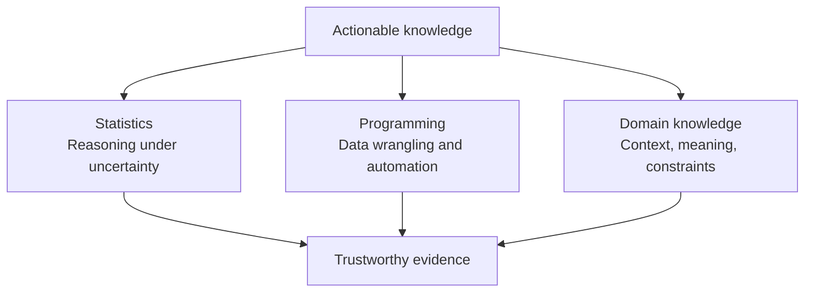
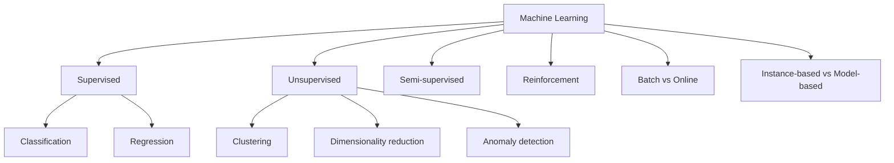
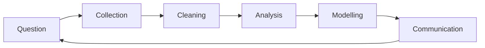
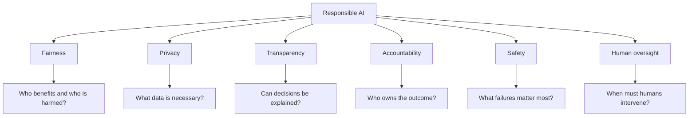
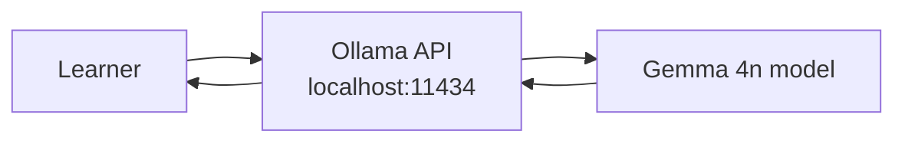

# M1 — Instructor Guide: Course Orientation & Intro to Data Science
> 90-minute lesson | Dataset: `sales_monthly.csv` | All levels

---

## Learning Objectives

By end of session, students can:
1. Define data science and distinguish it from statistics and software engineering
2. Map the data-to-insight pipeline (Question → Collection → Cleaning → Analysis → Modeling → Communication)
3. Explain the difference between correlation and causation with an example
4. State three ethical responsibilities of a data scientist
5. Describe what reproducibility means and why it matters from day 1, and set up a working Ollama + Gemma 4n local AI environment and run a structured first prompt

---

## Lesson Outline

| Time | Activity | Notes |
|------|----------|-------|
| 0:00–0:10 | Welcome, course overview, AI policy explanation | Show the CRISP-DM diagram briefly |
| 0:10–0:25 | **L1.2** — The ML landscape: supervised / unsupervised / reinforcement | Use the spam filter + housing price examples |
| 0:25–0:40 | **L1.3** — The data-to-insight pipeline walkthrough with `sales_monthly.csv` | Live demo: load, look, question |
| 0:40–0:50 | **L1.5** [AI-OFF] — Correlation vs causation discussion | Ice cream / drowning example; students propose 2 more |
| 0:50–1:05 | **L1.6** — Data ethics primer: bias, privacy, fairness | Show the COMPAS recidivism case briefly |
| 1:05–1:15 | **L1.4** — Reproducibility: what it is, why it matters | Demo: run a notebook with no seed; run again; results differ |
| 1:15–1:30 | **L1.7** — Your local AI workspace (Ollama + Gemma 4n setup) | New capstone activity |

---

## Key Concepts (with Lesson IDs)

### L1.1 — Data Science is about extracting actionable knowledge `[McKinney Ch1 p.1–10]`
#### Why actionable knowledge is the real output
Data science earns its value when it changes what someone can confidently do next. A spreadsheet full of numbers, a dashboard full of filters, or a model with impressive accuracy does not matter on its own. The work becomes meaningful when it sharpens a decision, reduces uncertainty, or reveals a pattern that affects timing, cost, risk, or strategy.

That is why the phrase *actionable knowledge* is more useful than *interesting finding*. Many observations are interesting for a moment and useless a minute later. Actionable knowledge is different: it links evidence to a plausible response. A store manager may reorder stock, a hospital may redesign triage, or a teacher may adjust support for a struggling group. The analysis matters because the next move becomes clearer.

#### The three pillars that make data science work
Data science sits at the intersection of three durable pillars: statistical reasoning, computational skill, and domain understanding. Statistics helps us separate signal from noise, express uncertainty, and avoid being tricked by random variation. Computing lets us clean, combine, transform, and scale data in ways that would be impossible by hand. Domain knowledge tells us what a variable actually means and which patterns are meaningful rather than merely convenient.

If any pillar is weak, the whole structure becomes unstable. Strong code with weak reasoning can automate bad judgments. Strong mathematics with no domain context can produce elegant answers to the wrong question. Strong domain instincts with no computational support can miss patterns hidden in large, messy datasets. The practical lesson is that data science is not a single superpower; it is a coordinated craft.



The diagram is a reminder that insight is rarely born from one tool alone. Students often enter the field through coding, through mathematics, or through a subject area they care about. The long-term goal is to grow the other two legs until the work is balanced enough to support real decisions.

#### Raw data is not yet an answer
A dataset is a record of events, measurements, and labels, not a conclusion. Transaction tables do not tell a retailer what to stock next month. Attendance logs do not tell a school why engagement dropped. Sensor readings do not tell an engineer which component is failing. The analyst must convert records into summaries, comparisons, and explanations that fit a human decision.

A useful mental model is to think of data as material rather than message. Clay is not yet a bowl, and lumber is not yet a bridge. In the same way, rows are not yet knowledge. They become knowledge when we choose a question, test the reliability of the evidence, and shape the results into a form that someone else can use. This is why asking “What decision could this support?” is often more important than asking “What chart can I make?”

#### Better questions produce better analysis
The quality of the work usually depends on the quality of the question asked at the beginning. A vague prompt like “Find something interesting in sales” encourages random exploration and cherry-picked stories. A sharper prompt like “Which product category lost repeat buyers after the shipping fee change?” immediately clarifies what data matters, what comparison period matters, and what kind of result would be useful.

Good questions are narrow enough to guide the work but open enough to allow surprise. They identify an outcome, a population, a time frame, and a decision context. They also leave room for uncertainty, because real data rarely answers a question in one perfect pass. Instructors can emphasise that strong analysts spend time refining the question because a precise question saves far more time than it costs.

#### Evidence still needs scepticism
Students sometimes hear “data-driven” and imagine that the data speaks for itself. It does not. Data is created by human systems, collected with imperfect instruments, and shaped by definitions that may hide important exclusions. A chart can be beautifully designed and still reflect biased sampling, broken measurement, or a misleading denominator.

Scepticism is not negativity; it is disciplined caution. Useful habits include asking what is missing, what changed in the measurement process, which alternative explanations still fit the pattern, and whether the observed relationship is large enough to matter in practice. Data science becomes more trustworthy when curiosity is paired with doubt.

#### Code walkthrough: turning records into a decision-ready summary
A short program can show how raw records become something a manager can act on. The important step is not the syntax itself; it is the sequence of choices: define the grain of analysis, aggregate consistently, compare periods, and state what the summary can and cannot tell us.

```python
import pandas as pd

# Build a tiny transaction table that looks like raw operational data.
sales = pd.DataFrame(
    {
        "month": ["Jan", "Jan", "Feb", "Feb", "Mar", "Mar"],
        "channel": ["web", "store", "web", "store", "web", "store"],
        "revenue": [1200, 900, 1500, 950, 1600, 870],
        "orders": [40, 30, 45, 28, 47, 24],
    }
)

# Summarise to the monthly level because that is the level of the business question.
monthly = (
    sales.groupby("month", as_index=False)[["revenue", "orders"]]
    .sum()  # combine channels so each row represents one month
)

# Add change metrics so the table points toward action instead of just description.
monthly["revenue_growth"] = monthly["revenue"].pct_change()  # month-over-month revenue change
monthly["avg_order_value"] = monthly["revenue"] / monthly["orders"]  # useful business ratio

print(monthly)
```

This code is simple, but the thinking inside it is the real lesson. We decide that month is the right unit, that both revenue and order count matter, and that growth plus average order value gives a better operational story than raw totals alone. A stakeholder can now ask whether growth is being driven by more orders, larger baskets, or one channel masking weakness in another.

#### Worked example: from sales rows to an operational recommendation
Imagine a small retailer notices that total revenue rose in March, yet managers still feel uneasy. A student who looks only at the headline might report success and stop there. A stronger analysis would separate channels, compare order counts, and ask whether the gain came from healthy growth or from raising prices while volume weakened.

Suppose the summary shows that web revenue rose because average order value increased, but store orders fell for a second month in a row. That result is actionable because it points to a specific operational response: investigate in-store conversion, staffing, or product availability rather than celebrating the overall total. The example shows how actionable knowledge often lives one step below the first impressive number.

#### Common mistakes when defining data science
One common mistake is to equate data science with modelling alone. This narrows the field to algorithm choice and ignores framing, measurement, cleaning, interpretation, and communication. Students who adopt this view often rush toward predictive tools before they know whether prediction is even the right goal.

Another mistake is to assume that more data automatically means better answers. More rows can magnify noise, bias, and duplication if the collection process is weak. It is also easy to confuse statistical significance with practical importance. A tiny effect discovered in a huge dataset may still be too small to change any meaningful decision.

#### Connections to the rest of the module
This lesson anchors the rest of M1 because every later idea extends it. The machine-learning landscape in L1.2 is easier to understand once students know that algorithms are means rather than ends. The pipeline in L1.3 shows how questions, collection, cleaning, and communication turn raw material into usable evidence.

The link also runs forward into reproducibility, causation, and ethics. Reproducibility protects the trustworthiness of the workflow, correlation-versus-causation protects the trustworthiness of interpretation, and ethics protects the trustworthiness of deployment. In other words, actionable knowledge is not merely informative; it must also be dependable and responsible.

#### Practice questions
Ask students to name a decision-maker in a familiar setting—a café owner, coach, librarian, nurse, or club organiser—and then describe one question that data could help that person answer. Push them to make the question specific enough that a dataset, a comparison, and a possible action are all visible.

A second useful prompt is to present a result such as “sales increased 12%” and ask what else they would need before calling it actionable knowledge. Strong answers should mention context, comparison periods, segment differences, measurement quality, and the decision that the result is supposed to support.
### L1.2 — The ML landscape map `[Géron Ch1 p.3–35]`
#### Why beginners need a map before they need preferences
Machine learning can feel overwhelming because the vocabulary arrives all at once: regression, classification, clustering, neural networks, reinforcement learning, anomaly detection, online learning, and more. Without a map, students treat the field like a bag of unrelated algorithms. A map restores order by showing that techniques differ because the problems, feedback signals, and deployment conditions differ.

The practical payoff is that problem framing comes before algorithm shopping. Instead of asking which library function looks impressive, students learn to ask what is being predicted, whether labels exist, how quickly data changes, and how costly errors are. Once those questions are answered, the landscape becomes much less intimidating.

#### A taxonomy of learning settings
A helpful first split is based on the kind of supervision available. Some tasks come with historical answers, some do not, and some involve feedback that arrives over time through interaction. Other distinctions describe how training is updated or how a model generalises from examples.



This taxonomy should not be memorised as a decorative chart. It is a decision aid. When students can point to the branch that matches the available data and business goal, they are already doing more professional thinking than someone who jumps straight to a favourite model family.

#### Supervised learning: learning from labelled examples
In supervised learning, each training example includes an input and a known target. We can write that idea as pairs $$(x_i, y_i)$$, where $$x_i$$ contains the features and $$y_i$$ is the answer we want the system to learn. The model seeks a function $$\hat{y} = f_{\theta}(x)$$ that predicts well on new cases by choosing parameters $$\theta$$ that reduce some loss.

A compact way to describe the training goal is $$\min_{\theta} \sum_{i=1}^{n} \ell\left(f_{\theta}(x_i), y_i\right),$$ where $$\ell$$ measures how wrong a prediction is. If the target is a category such as spam or not spam, the task is classification. If the target is a number such as weekly demand or apartment price, the task is regression. The same mathematical skeleton supports both, but the meaning of success changes with the question.

#### Unsupervised and semi-supervised learning: finding structure without full answers
Unsupervised learning begins when the answer column is missing or untrusted. The goal shifts from imitation to discovery. Clustering groups similar cases, dimensionality reduction compresses many variables into a smaller descriptive space, and anomaly detection highlights rare or suspicious records that deserve attention.

Semi-supervised learning lives between the fully labelled and fully unlabelled worlds. This matters in practice because labels are often expensive while raw records are abundant. A company may have millions of customer interactions but only a few thousand carefully reviewed outcomes. In such settings, even a partial set of labels can be valuable when combined with the broader structure in the unlabelled data.

#### Reinforcement, batch, and online learning describe the training environment
Reinforcement learning is useful when learning unfolds through sequential action. An agent observes a state, chooses an action, receives a reward, and updates its behaviour to improve future return. The key challenge is delayed consequence: the best action now may not pay off until much later, so the learner must balance exploration with exploitation.

Batch and online learning answer a different question: when and how often the model updates. Batch learning trains on a relatively fixed snapshot. Online learning adjusts as new data arrives. This distinction matters for fraud detection, recommendation systems, and streaming platforms because yesterday's pattern may already be stale today. A method that is mathematically elegant but operationally mismatched can fail in production.

#### Instance-based and model-based learning offer different styles of generalisation
Some methods generalise by remembering examples and comparing new cases to what they have seen before. That is the spirit of instance-based learning. Other methods compress experience into a smaller rule, boundary, or function, which is the spirit of model-based learning. Neither style is inherently superior; they trade off memory, flexibility, interpretability, and sensitivity to noise.

```python
import numpy as np

# Toy housing data: floor area in square metres and historical sale price.
sizes = np.array([55, 70, 82, 95, 110], dtype=float)
prices = np.array([165, 210, 245, 285, 320], dtype=float)
new_home = 88.0

# Instance-based idea: borrow from the most similar known example.
nearest_idx = np.abs(sizes - new_home).argmin()  # locate the closest remembered case
instance_based_price = prices[nearest_idx]

# Model-based idea: learn a compact rule from all examples.
slope, intercept = np.polyfit(sizes, prices, deg=1)  # fit one straight-line relationship
model_based_price = slope * new_home + intercept

print({
    "nearest_example_price": float(instance_based_price),
    "line_based_price": round(float(model_based_price), 2),
})
```

The code illustrates a conceptual split more than a production recipe. One approach leans on similarity to a stored example, while the other learns a reusable pattern from the whole dataset. Instructors can use this to show that “learning” is not one single mechanism; it is a family of strategies for turning past data into future judgments.

#### Worked example: mapping a retailer's problems onto the landscape
Imagine a retailer brings three questions to an analytics team. First: “Will this order be returned?” That is supervised classification because historical examples exist and the answer is categorical. Second: “Can we group our customers into shopping styles?” That is unsupervised clustering because there is no answer column to mimic. Third: “How should a discount engine choose offers over time?” That starts to look like reinforcement learning because actions change the future environment.

The worked example helps students see that the data may belong to one organisation while the learning settings still differ sharply. The right approach depends less on industry label and more on feedback structure. A single business can need several parts of the map at once, which is why broad conceptual literacy matters.

#### Common mistakes when reading the ML map
A frequent mistake is to assume that the most complex method is automatically the most appropriate one. Students may reach for deep learning terminology before checking whether the dataset is tiny, the labels are noisy, or the business needs an interpretable baseline. Sophistication should solve a real problem, not simply impress an audience.

Another mistake is to confuse task type with quality level. Unsupervised learning is not “weaker” than supervised learning; it answers different questions. Online learning is not “more advanced” than batch learning; it responds to a different operational setting. The map is descriptive, not hierarchical.

#### Connections to later lessons
L1.3 will place these learning settings inside a larger workflow so that students see where data collection, cleaning, and communication fit before and after modelling. L1.4 then adds reproducibility, which matters no matter which branch of the map is chosen. Even a brilliant learning setup becomes fragile if the run cannot be repeated.

L1.5 and L1.6 add two further guardrails. A high-performing model can still be causally misleading if we confuse prediction with explanation, and it can still be socially harmful if we ignore bias, privacy, or fairness. The ML landscape is therefore a map of technical options, not a license to deploy blindly.

#### Practice questions
Give students short scenarios and ask them to classify the learning setting before naming any algorithm. For example: detecting spam, grouping songs by style, adapting a game-playing agent, or updating a recommendation feed each hour. The goal is to make problem structure the first reflex.

A second prompt is to ask which branch of the map they would avoid for a given problem and why. Strong answers reveal that students understand not only what fits, but also what would mismatch the available labels, feedback loop, or operational constraints.
### L1.3 — The data-to-insight pipeline `[Expert]`
#### Why the pipeline begins with a question
A strong project begins with a question clear enough to rule things in and rule things out. “Explore our sales data” is not really a question; it is an invitation to wander. “Did the April delivery change reduce repeat purchases among first-time customers?” is better because it identifies an outcome, a population, and a decision context.

When the question is sharp, every later stage becomes more disciplined. Collection becomes targeted, cleaning becomes purposeful, analysis becomes easier to interpret, and communication becomes easier to tailor. The pipeline is therefore not a bureaucratic checklist. It is a way to protect attention from being wasted.

#### A visual map of the workflow
The data-to-insight pipeline is often summarised as question, collection, cleaning, analysis, modelling, and communication. The stages are presented in order, but in practice they also loop. A strange result in analysis may force a return to cleaning, and a stakeholder question during communication may force a refinement of the original framing.



The circular arrow matters because real projects are iterative. Students should not imagine failure when they revisit an earlier stage. Returning to the question or the data is usually evidence that the analyst is thinking carefully rather than treating the workflow as a one-way tunnel.

#### Collection is about data generation, not just data access
Once the question is defined, the next issue is whether the available data was generated in a way that can answer it. A table may exist and still be unfit for purpose. Sampling may exclude important groups, logging may have changed halfway through the time period, and outcome labels may be delayed or inconsistently defined.

Collection should therefore be taught as an investigation into provenance. Where did the records come from? What process created them? Who or what was left out? These questions matter because biased collection cannot be repaired merely by clever plotting. If the wrong cases never entered the dataset, later stages inherit that absence.

#### Cleaning creates conditions for trust
Cleaning is often dismissed as repetitive labour, yet it is where much of the credibility of a project is won or lost. Dates need consistent parsing, duplicates need rules, categories need standard names, units need alignment, and missing values need interpretation rather than blind deletion. Every cleaning choice is also a modelling choice because it shapes the evidence that survives.

A useful classroom message is that cleaning should be documented as reasoning, not hidden as housekeeping. Students should be able to explain why a row was removed, why a value was imputed, and what uncertainty that choice introduced. When transformations are visible, later readers can judge whether the evidence still matches the question.

#### Analysis and modelling sharpen the story
Exploratory analysis is where analysts learn the personality of the dataset. They look at distributions, compare segments, inspect outliers, and search for time patterns, sudden jumps, or suspicious gaps. This stage often reveals that the original question needs refinement because the real signal is narrower, broader, or more segmented than expected.

It is also where analysts distinguish description from explanation. A chart may show that two lines move together, but analysis alone does not prove why. This matters because premature causal language creates overconfidence. Good exploratory work generates hypotheses, caveats, and candidate explanations that can later be tested more carefully.

Modelling is the stage most students expect, yet not every question needs it. Sometimes a clear summary table or before-and-after comparison already answers the operational question. In other cases, forecasting, classification, ranking, or segmentation genuinely adds value because the decision depends on unseen or future outcomes.

When modelling is appropriate, it should still be introduced as one stage inside a broader workflow. A model consumes the output of collection and cleaning, and its usefulness depends on the quality of the question and the clarity of the final communication. The model is not the project; it is one instrument inside the project.

#### Code walkthrough: a pipeline checklist that keeps the work honest
One way to teach process discipline is to encode the stages as an explicit checklist. A short script cannot guarantee good judgment, but it can make omissions visible. The goal is to show that a project can be organised so that its reasoning is inspectable by another reader.

```python
pipeline_notes = {
    "question": {
        "prompt": "Did the April delivery policy reduce repeat purchases?",
        "decision": "Decide whether to keep, revise, or reverse the policy.",
    },
    "collection": {
        "tables": ["orders", "delivery_events", "customer_history"],
        "risk": "Delivery logs were introduced mid-quarter; early rows may be missing.",
    },
    "cleaning": {
        "steps": ["standardise dates", "remove duplicate order IDs", "flag missing delivery timestamps"],
        "note": "Keep a copy of dropped rows for audit review.",
    },
    "analysis": {
        "checks": ["plot weekly repeat rate", "compare new vs returning customers", "inspect region differences"],
        "warning": "Do not describe patterns as causal without stronger evidence.",
    },
    "modelling": {
        "candidate": "baseline logistic regression for repeat purchase likelihood",
        "reason": "Use only if descriptive analysis leaves uncertainty about likely future impact.",
    },
    "communication": {
        "audience": "operations manager",
        "deliverable": "one-page summary with chart, caveats, and recommendation",
    },
}

for stage, details in pipeline_notes.items():
    print(stage.upper())
    for key, value in details.items():
        print(f"  - {key}: {value}")  # print each choice so omissions become obvious
```

The inline comments and text fields make the code read almost like a project brief. That is the point. A readable workflow lowers the chance that important assumptions remain trapped in one person's memory or in a notebook cell title that no one notices.

#### Worked example: tracing one business question through the pipeline
Consider the question, “Why did repeat purchases fall after a website redesign?” Collection would likely require transaction logs, customer IDs, change dates, traffic source data, and perhaps support tickets. Cleaning would include deduplicating orders, aligning date ranges, and checking whether the redesign also changed how repeat visits were tracked.

Analysis might reveal that the drop is concentrated among mobile users, while modelling may or may not be needed depending on the strength of the descriptive evidence. Communication would then turn those findings into a decision-ready narrative: the redesign coincided with a mobile checkout friction point, the affected segment is clear, the confidence level is moderate, and the next action is to test a checkout fix before redesigning the whole site again.

#### Common mistakes across the pipeline
A common mistake is to treat the pipeline as a sequence of technical chores rather than linked reasoning steps. Students may collect data without a precise question, clean data without documenting assumptions, or build models before checking whether the labels are trustworthy. The result is often polished output with weak foundations.

Another mistake is to stop at analysis and assume the work is finished once an interesting chart appears. In most settings, the work is incomplete until the audience understands what was asked, what was found, how reliable it is, and what should happen next. Communication is not decoration added after the real work; it is part of the real work.

#### Connections to other lessons
L1.1 explains why the pipeline exists at all: we are trying to turn raw records into actionable knowledge. L1.2 fits inside the modelling stage by showing that different problem types call for different learning settings. The pipeline provides the larger frame that keeps algorithm choice from dominating the whole conversation.

L1.4, L1.5, and L1.6 each strengthen a different stage of the pipeline. Reproducibility protects the integrity of the workflow, causal thinking protects the interpretation of patterns, and ethics protects the legitimacy of collection, modelling, and deployment choices. Together they move students from “doing steps” toward “doing reliable analysis.”

#### Practice questions
Ask students to take a vague prompt such as “Look at student attendance” and rewrite it into a pipeline-ready question. A strong revision should specify an outcome, a group, and a decision context. Then ask which tables or fields they would need before any analysis begins.

A second prompt is to give students a flawed mini-project and ask where the pipeline broke down. For example, perhaps the sample excluded weekend users, or the analyst skipped communication and handed over only code. This helps students see the stages as points of possible failure as well as points of progress.
### L1.4 — Reproducibility from day one `[Expert]`
#### Why reproducibility belongs at the start, not the end
Reproducibility means that the same workflow, run again on the same inputs, gives the same result. That sounds obvious, yet many beginner projects are held together by memory, hidden notebook state, or whatever package versions happened to be installed that afternoon. A result produced under those conditions may be impressive, but it is fragile.

Starting early matters because habits are easier to build than to retrofit. Once file names drift, seeds are forgotten, and environment details are lost, reconstructing the process becomes slow and unreliable. Reproducibility is therefore not paperwork added after analysis. It is part of analysis quality from the first cell and the first script.

#### What must stay controlled across runs
A helpful mental model is that an analytical result depends on several inputs at once: $$\text{result} = f(\text{data}, \text{code}, \text{environment}, \text{seed}).$$ If any part changes silently, the output may change too. A different CSV version, a modified cleaning rule, an updated dependency, or an unseeded random split can all create drift.

This formula is simple, but it changes how students think about “rerunning the notebook.” They are not merely rerunning code. They are attempting to recreate a full computational situation. Reproducibility improves when those ingredients are named explicitly rather than assumed to be stable.

#### Randomness needs deliberate control
Randomness enters many ordinary tasks: sampling, train-test splitting, cross-validation shuffling, parameter initialisation, and some optimisation procedures. If those steps are left uncontrolled, two runs of the same notebook may yield slightly different outputs, and students may not know whether the difference reflects real evidence or accidental variation.

Setting a seed does not make a project scientifically true, but it does make it inspectable. When a student writes down the seed and reuses it consistently, they convert invisible drift into a controllable choice. That is especially important in teaching because classmates and instructors need to distinguish reasoning mistakes from run-to-run randomness.

#### Project structure reduces hidden state
Notebook order is another source of accidental failure. A notebook may appear correct only because a stale variable remains in memory from an earlier run. This is why clean reruns from top to bottom are so valuable: they expose whether the document actually contains the full recipe or whether success depends on invisible leftovers.

Simple structural habits help a great deal. Keep imports at the top, declare constants in one place, load data from explicit paths, define seeds before any stochastic operation, and separate exploratory scratch work from the notebook or script that others are expected to trust. These habits reduce the gap between what the analyst remembers and what the file actually records.

#### Record the identity of the data
Students often think of data as a stable object, but datasets change. Columns are corrected, rows are appended, missing values are backfilled, and files are renamed. Without recording which version was used, a project can become impossible to verify even if the code itself is still available.

A practical answer is to store file paths, timestamps, and hashes alongside the run. A hash is especially useful because it gives a compact fingerprint of the exact bytes used in the analysis. If two people claim to be using the same file but their hashes differ, they are not truly reproducing the same workflow.

#### Code walkthrough: a reproducible notebook header
A reproducibility header makes the hidden assumptions visible before any analysis begins. It sets seeds, records environment details, and fingerprints the input data. The code is short, but it teaches that trustworthy work starts by naming the conditions under which the result will be generated.

```python
from pathlib import Path
import hashlib
import platform
import random

import numpy as np

SEED = 42
random.seed(SEED)          # control Python's built-in randomness
np.random.seed(SEED)       # control NumPy-based stochastic steps

DATA_PATH = Path("data/sales_monthly.csv")
DATA_HASH = (
    hashlib.sha256(DATA_PATH.read_bytes()).hexdigest()
    if DATA_PATH.exists()
    else "missing-file"
)

RUN_METADATA = {
    "python_version": platform.python_version(),   # record interpreter details for later reruns
    "seed": SEED,
    "data_file": str(DATA_PATH),
    "data_sha256": DATA_HASH,                     # fingerprint the exact file contents
}

print(RUN_METADATA)
# If you train a scikit-learn model later, also pass random_state=SEED where supported.
```

The point is not to worship a template. The point is to make uncertainty visible and manageable. When another reader opens the notebook, they can see the assumptions immediately instead of guessing why their output differs.

#### Worked example: the same notebook, two different outcomes
Imagine two students run the same housing-price notebook and get slightly different validation scores. At first they assume one of them made a mistake. After checking more closely, they discover that one student did not fix the train-test split seed and the other updated a package that changed a default behaviour. The code looked nearly identical, but the computational situation was not the same.

This example is powerful because it shows how easy it is to confuse hidden variation with analytical disagreement. Once the seed, package versions, and data hash are recorded, the conversation changes. Instead of debating whose machine is “acting weird,” the students can identify the exact source of the divergence and repair it.

#### Common mistakes that break reproducibility
One common mistake is to rely on notebook memory rather than notebook order. Cells may be executed out of sequence, intermediate objects may linger in memory, and the final output may depend on an invisible setup that is no longer present in the file. This creates a false sense of completion because the notebook works for the author and fails for everyone else.

Another mistake is to record only code while ignoring environment and data identity. A repository can contain perfect scripts and still be hard to rerun if no one knows which data snapshot was used or whether package updates changed behaviour. Reproducibility requires attention to the full workflow, not only the logic in the final script.

#### Connections to the rest of the course
Reproducibility protects every other lesson in M1. L1.1 emphasises actionable knowledge, but action should not rest on a result that cannot be regenerated. L1.3 describes the pipeline, and reproducibility acts like connective tissue across its stages by preserving the choices made during collection, cleaning, and modelling.

It also supports later modules on evaluation and experimentation. If students cannot reproduce a baseline, they cannot fairly compare improvements. If they cannot record the conditions of a run, they cannot tell whether performance changed because of a better idea or because of silent variation in data or environment.

#### Practice questions
Ask students to imagine they are sending a notebook to a teammate who has never seen the project before. What information must be included so that the teammate can rerun it tomorrow without a video call? Strong answers should mention file paths, seeds, environment details, package versions, and execution order.

A second prompt is to present two slightly different outputs from the “same” notebook and ask students to list the hidden factors that might explain the discrepancy. This helps them think of reproducibility as a systems problem rather than as a vague virtue word.
### L1.5 — Correlation vs causation `[Expert]`
#### Association is a pattern, not a mechanism
Correlation describes how two variables move together. If larger values of one variable tend to appear alongside larger values of another, the correlation is positive. If larger values of one tend to appear with smaller values of the other, the correlation is negative. That makes correlation useful for description, screening, and early hypothesis generation.

What correlation does *not* provide is a mechanism. It does not tell us why the variables move together, whether one influences the other, or whether the observed pattern would survive a change in conditions. Treating association as explanation is one of the most common reasoning errors in beginner analytics.

#### Pearson correlation in symbols and in plain language
The most familiar correlation measure in introductory data science is the Pearson correlation coefficient. For variables $$X$$ and $$Y$$ measured across $$n$$ observations, the sample Pearson correlation is

$$
r = \frac{\sum_{i=1}^{n}(x_i-\bar{x})(y_i-\bar{y})}{\sqrt{\sum_{i=1}^{n}(x_i-\bar{x})^2}\sqrt{\sum_{i=1}^{n}(y_i-\bar{y})^2}}.
$$

The numerator measures whether deviations from each variable's mean tend to move in the same direction. The denominator rescales that shared movement by the spread of each variable so that $$r$$ stays between $$-1$$ and $$1$$. Another way to write the same idea is $$r = \frac{\operatorname{cov}(X,Y)}{s_X s_Y},$$ which makes clear that Pearson correlation is standardised covariance.

#### How to interpret sign and magnitude carefully
A positive value of $$r$$ suggests that larger values of $$X$$ tend to appear with larger values of $$Y$$, while a negative value suggests the opposite direction of movement. Values closer to zero indicate weak *linear* association. The word linear matters because a curved relationship can be very strong and still produce a Pearson correlation near zero.

Magnitude also depends on context. In a noisy social setting, a correlation of $$0.25$$ may still be substantively important. In a tightly controlled industrial process, the same number might be disappointingly weak. Students should therefore avoid treating any single cutoff as a universal rule. Interpretation belongs to the domain as well as to the formula.

#### Why correlation cannot reveal causal direction
Suppose study time and exam score are positively correlated. One possible story is that studying more improves scores. Another is that confident, well-prepared students are both more likely to study and more likely to perform well. A third possibility is that a hidden factor, such as access to tutoring, influences both. The coefficient $$r$$ cannot choose among these stories.

This is the central limit of correlation for causal reasoning. The same observed association can arise from multiple data-generating processes. Without stronger design, temporal evidence, or identification assumptions, the number itself remains silent about direction.

#### ASCII causal-path visuals for common traps
ASCII sketches are a simple way to show why identical correlations can hide different causal structures.

Direct cause:

X ----> Y

Reverse cause:

X <---- Y

Confounding:

C ----> X
      ----> Y

Mediation:

X ----> M ----> Y

Selection bias:

X ----> S <---- Y

These path diagrams matter because they teach students to imagine alternative explanations before they speak causally. A correlation between exercise and mood, income and health, or app usage and retention may be real in every case. The unresolved question is which path generated it.

#### Confounding creates persuasive but misleading stories
A confounder is a third variable that influences both the supposed cause and the supposed effect. The classic classroom example is ice cream sales and drowning deaths. Both rise in warmer months, not because buying ice cream causes drowning, but because temperature changes behaviour in ways that affect both variables.

Confounding is dangerous because the pattern being measured is usually real. The mistake lies in the story attached to it. A business team may see a correlation between faster shipping and higher retention, but if higher-value customers also receive premium service, customer value may be confounding the relationship. The numbers are not fabricated; the interpretation is misassigned.

#### Worked example: study hours and grades
Imagine a school finds that students who report more study hours also earn higher grades. A superficial reading might conclude that any intervention increasing reported study time will improve performance. A more careful reading asks whether prior preparation, parental support, access to quiet space, or teacher quality also differ across students.

The same observed correlation could therefore support very different actions. If the true lever is access to structured tutoring, urging students to “study more” may not solve much. The worked example helps students see why decision-making requires more than a tidy scatterplot and a single summary coefficient.

#### Common mistakes in causal interpretation
One common mistake is to treat temporal order casually. If two variables are measured at the same time, students often write as though the preferred causal direction were obvious. Yet without clear timing, reverse causation remains plausible. The fact that a story feels intuitive does not make it identified.

Another mistake is to forget that no correlation does not mean “no relationship.” Pearson correlation only measures linear association. Variables can be related through thresholds, curves, or interacting mechanisms that Pearson's $$r$$ will not summarise well. Analysts should match the tool to the shape of the question rather than overgeneralising from one coefficient.

#### Connections to later analytical work
This lesson supports responsible modelling because prediction and causation answer different questions. A model can predict who is likely to churn without telling us which intervention will reduce churn. That distinction becomes crucial in experiments, policy evaluation, and product decisions where teams want to change outcomes rather than merely forecast them.

It also connects directly to ethics. Overstating causation can lead institutions to punish the wrong behaviour, reward the wrong intervention, or justify unfair policies with weak evidence. Causal humility is therefore both a methodological strength and an ethical safeguard.

#### Practice questions
Ask students to generate two different causal stories that could explain the same positive correlation between social media use and anxiety. Then ask what additional evidence would help distinguish among the stories. Strong answers should mention timing, confounders, and possible experiments or natural experiments.

A second prompt is to present an observed correlation from everyday life and ask whether Pearson correlation is even the right summary. This encourages students to think about linearity, hidden variables, and the difference between association and intervention before they jump to conclusions.
### L1.6 — Responsible AI and data ethics `[Expert]`
#### Ethics begins with the purpose of the system
Responsible AI starts before a model is trained and before a dashboard is shared. It begins when a team decides what problem is worth solving and what success should mean. A system designed to maximise a harmful objective can be technically polished and still produce bad outcomes. If the goal is careless, the optimisation will be careless at scale.

This is why ethical reflection is part of problem framing rather than a final compliance check. Analysts should ask who benefits, who might be burdened, what kind of error is most harmful, and whether the task should be automated at all. In many settings, the first ethical question is not “Can we build it?” but “Should we build this version of it?”

#### A principles map for data ethics
A compact way to organise the topic is to think in terms of principles that must be balanced rather than maximised one at a time. Fairness, privacy, transparency, accountability, safety, and human oversight often reinforce one another, but they can also pull in different directions. Ethical practice is therefore a design activity, not a slogan.



The diagram works well in class because it shifts the conversation away from a single buzzword. Students can see that responsible AI is not only about bias, not only about privacy, and not only about legal compliance. It is about designing a system that remains legitimate when exposed to real users, real stakes, and real failure modes.

#### Bias enters through the whole pipeline
Bias does not suddenly appear when an algorithm starts training. It can enter through historical data, selective measurement, proxy variables, label choices, threshold settings, and deployment feedback loops. A model can therefore inherit past inequalities even when the code is logically consistent and the evaluation score looks respectable.

This pipeline view matters because it prevents false reassurance. If the data underrepresents a community, or if the target variable reflects earlier human prejudice, then downstream optimisation may simply scale that pattern. Responsible practice requires asking where bias could have entered and how it might be amplified at each stage.

#### Privacy, consent, and data minimisation
Ethical data work also requires restraint about what is collected and retained. Just because a field can be captured does not mean it should be. Data minimisation asks analysts to collect only what is needed for the task, while purpose limitation asks them not to quietly repurpose data for unrelated objectives later on.

Students should also learn that removing names is not the same as guaranteeing anonymity. Location traces, timestamps, rare combinations of attributes, and external datasets can allow re-identification even after obvious identifiers are stripped away. Privacy is therefore not a checkbox achieved by superficial masking; it is a risk that must be assessed in context.

#### Fairness is about outcomes, not just averages
A system can appear strong in aggregate and still perform poorly for a subgroup that matters. This is why fairness analysis often compares error patterns, access patterns, or benefit allocation across groups rather than looking only at one global score. A model that is accurate on average may still be unacceptable if its mistakes are concentrated on already vulnerable people.

Fairness also involves contested definitions. Equalising false positive rates, equalising selection rates, and calibrating probabilities can point in different directions. Students do not need to solve every fairness theorem in M1, but they should understand that fairness is a design choice requiring explicit trade-offs, not a decorative adjective added after deployment.

#### Code walkthrough: a simple ethical review checklist in practice
One practical teaching move is to show that ethics can be operationalised into review questions and subgroup checks. The code below is intentionally simple, but it demonstrates how a team might inspect basic group outcomes before declaring a system ready.

```python
import pandas as pd

results = pd.DataFrame(
    {
        "group": ["A", "A", "A", "B", "B", "B"],
        "predicted_positive": [1, 0, 1, 1, 1, 0],
        "actual_positive": [1, 0, 0, 1, 0, 0],
    }
)

summary = (
    results.groupby("group", as_index=False)
    .agg(
        selection_rate=("predicted_positive", "mean"),  # how often each group receives a positive outcome
        base_rate=("actual_positive", "mean"),          # underlying observed outcome rate in the sample
    )
)

summary["review_flag"] = summary["selection_rate"].gt(0.20)  # simple rule to trigger human review
print(summary)
```

The important lesson is not the specific threshold. It is that ethics becomes more actionable when questions are turned into explicit checks: Which groups are affected? How are decisions distributed? What would trigger a pause for human review? Inline comments help students see the connection between code and responsibility.

#### Worked example: a scholarship screening model
Imagine a university wants a model to screen scholarship applications. Historical data may reflect unequal access to advanced courses, recommendation networks, or extracurricular opportunities. If those past patterns are used uncritically as labels or features, the model may reward privilege while appearing objective.

A responsible response would examine which variables are acting as proxies, whether the target should be redefined, what human review is required, and whether the model's role should be assistive rather than decisive. The example shows that ethics is not a final speech appended to a technical build. It shapes the build itself.

#### Common mistakes in responsible AI discussions
A common mistake is to assume that ethical issues are solved once sensitive attributes are removed. In many datasets, other variables can still stand in as proxies, and feedback loops can recreate disparities over time. Hiding the obvious column is not the same as removing the structural pattern.

Another mistake is to believe that high accuracy settles the ethical question. Accuracy is only one performance measure, and it says little about consent, dignity, contestability, transparency, or unequal harm. Systems deployed in high-stakes settings need a broader standard than “the average score looks good.”

#### Connections to the rest of the module
This lesson ties together every earlier concept in M1. L1.1 asks what makes knowledge actionable; ethics asks whether the action is legitimate. L1.3 frames the pipeline; ethics asks where harm can enter that pipeline. L1.4 asks whether a result can be rerun; ethics adds that a reproducible harm is still harm.

The lesson also prepares students for later modelling work by establishing that technical performance is only one part of professional judgment. A capable data scientist does not stop at “the code works.” They also ask whether the objective is defensible, the data use is justified, and the affected people have been taken seriously.

#### Practice questions
Ask students to choose a familiar domain—hiring, lending, education, health, or content recommendation—and identify one ethical risk at each stage of the data pipeline. This helps them see that ethical reflection is continuous rather than reserved for deployment day.

A second prompt is to ask what evidence they would want before trusting an AI system used in a high-stakes setting. Strong answers should mention subgroup performance, privacy safeguards, human oversight, clear objectives, and a process for contesting harmful decisions.

### L1.7 — Your local AI workspace `[M1 new]`

#### Why offline LLMs change the learning dynamic
Offline LLMs change the emotional texture of practice because they remove the fear of “spending” every question. When the model is running locally, the marginal cost of experimentation is effectively zero. Students can retry prompts, compare wording, and test ideas without feeling that curiosity must be rationed.

The privacy shift matters just as much. A learner can inspect code, draft ideas, and ask beginner questions without sending their working context to a cloud service. That is especially valuable in an educational environment where unfinished thinking, messy notes, and exploratory notebooks are part of the learning process rather than something to hide.

There is also a practical reliability advantage: local models keep working when the internet is weak, the lab network is congested, or the learner is literally on a plane. That makes AI support feel like part of the workspace rather than a remote dependency. In DataPath, the goal is to make AI assistance available as a durable study tool while still teaching students when not to use it.

#### The local AI stack
The local AI stack in this course is intentionally simple: the learner writes a prompt, Ollama exposes a local HTTP API on `localhost:11434`, and Gemma 4n generates the response. That architecture matters because students are not using a mysterious black box; they are interacting with a local service they can inspect, test, and call from both the command line and Python.



#### Setting up Ollama
Start by installing Ollama from the official site. Go to [ollama.ai](https://ollama.ai), download the installer for your operating system, and complete the normal installation steps. On macOS this usually means dragging the app into Applications; on Linux it may mean running the install script; on Windows it means using the installer package.

Once installation finishes, open a terminal and verify that the command-line tool is available. If `ollama` is on your path, the following commands should run successfully:

```bash
ollama --version
ollama list
```

`ollama list` is the most important first check because it proves the local service is reachable and shows which models are already present on your machine. On a fresh install, you may see an empty list at first. That is normal; it simply means you have not pulled a model yet.

#### Pulling Gemma 4n
Next, download the course model:

```bash
ollama pull gemma4n
```

This command tells Ollama to fetch the Gemma 4n model weights and register them locally so future prompts can run without another download. The first pull can take a while because you are downloading the full model artifact; later calls are fast because inference happens from the local copy.

After the pull completes, run `ollama list` again and confirm that `gemma4n` appears in the output. That verification step matters because many first-run issues are simply “the service is installed, but the model has not been pulled yet.”

#### Your first structured prompt
For the first interaction, use a structured template instead of an improvised question. The M1 EXPLAIN template gives the model a clear task, your level, and the exact source of confusion, which usually produces a more useful answer than a one-line prompt.

```text
EXPLAIN: what is overfitting?
My level: Beginner
Context: I am in M1 of the DataPath course and testing my local AI workspace.
What I already know: Models learn from examples.
What is confusing me: Why does doing better on training data sometimes mean doing worse in the real world?
```

You can send that prompt directly to Ollama's local chat endpoint:

```bash
curl http://localhost:11434/api/chat \
  -H "Content-Type: application/json" \
  -d '{
    "model": "gemma4n",
    "messages": [
      {
        "role": "user",
        "content": "EXPLAIN: what is overfitting?\nMy level: Beginner\nContext: I am in M1 of the DataPath course and testing my local AI workspace.\nWhat I already know: Models learn from examples.\nWhat is confusing me: Why does doing better on training data sometimes mean doing worse in the real world?"
      }
    ],
    "stream": false
  }'
```

A cleaner version is often easier to read if you build the JSON from Python, but the key point is simple: you are sending a normal HTTP request to `localhost:11434/api/chat`, and the response comes from your own machine.

#### Calling Ollama from Python
Python access matters because later modules will treat the local model as part of a real analytical workflow rather than a separate chat window. The example below is intentionally minimal: one function, one POST request, one returned string.

```python
import requests, json

def ask_gemma(prompt: str, model: str = "gemma4n", stream: bool = False) -> str:
    """Send a prompt to the local Gemma model via Ollama API."""
    r = requests.post(
        "http://localhost:11434/api/chat",
        json={
            "model": model,
            "messages": [{"role": "user", "content": prompt}],
            "stream": stream
        },
        timeout=120
    )
    r.raise_for_status()
    return r.json()["message"]["content"]

# Test it
response = ask_gemma("Explain overfitting in 2 sentences for a beginner.")
print(response)
```

The workflow is straightforward: `requests.post()` sends the payload, `raise_for_status()` surfaces connection or API errors immediately, and the final line extracts the assistant message from the JSON response. Students should notice that the model call is just another local API interaction, which makes it easier to debug and reuse.

#### The AI-OFF contract
DataPath includes AI-OFF cells because learning is not the same thing as generating output. Some tasks are designed to reveal whether the student can reason independently, make a judgment call, or explain a concept in their own words. If AI is allowed everywhere, it becomes too easy to mistake borrowed fluency for genuine understanding.

The contract is therefore constructive rather than punitive. AI is available for setup help, explanation, scaffolding, and debugging within approved boundaries, but some cells intentionally block it so the learner builds the right internal habits from day 1. Those boundaries make the later oral checkpoints more meaningful because the student can separate what they did with assistance from what they can do alone.

Students should treat AI-OFF as part of the pedagogy, not as a technical inconvenience. The goal is to become the kind of analyst who can use strong tools responsibly, disclose that use honestly, and still demonstrate independent competence when the task requires it.

---

## New Lessons Integrated (from lesson library)

| ID | Lesson | Type |
|----|--------|------|
| L1.4 | Reproducibility as first-class concern | Expert addition |
| L1.5 | Correlation vs causation — anchor early | Expert addition |
| L1.6 | Responsible AI & data ethics primer | Expert addition |
| L1.7 | Local AI workspace with Ollama + Gemma 4n | New capstone activity |

---

## Common Misconceptions to Flag

- "Data science = machine learning" → DS is broader: includes statistics, data engineering, communication
- "More data = better results" → Biased data at scale produces biased results at scale
- "The AI will do the analysis for me" → Clarify the role of Gemma 4n and the [AI-OFF] policy

---

## AI Integration (M1)

**Allowed prompts from `prompts.md`:**
- `EXPLAIN: [concept]` — for landscape concepts
- `MISCONCEPTION-CHECK: [statement]` — great for the ethics discussion

**No [AI-OFF] cells in M1 lab** — this module focuses on orientation. The first [AI-OFF] cell appears in M3.

---

## Lab Notes (`lab.ipynb`)

### Cell 1 — Load and inspect (AI allowed)
```python
import pandas as pd
df = pd.read_csv('data/sales_monthly.csv')
print(df.shape)
df.head()
```

### Cell 2 — Data pipeline questions (AI allowed for discussion)
Prompt students to answer in a markdown cell:
1. What question does this dataset help us answer?
2. What cleaning steps might be needed (guess before looking)?
3. What would a useful insight look like?

### Cell 3 — Reproducibility setup (AI allowed)
```python
import numpy as np, random
np.random.seed(42)
random.seed(42)
# Students copy this to every future notebook
```

---

## Assessment Notes

- No graded deliverable in M1 beyond the `AI_USE.md` setup
- Check that all students have their conda environment running and JupyterLab accessible
- Verify `environment.yml` exported before end of session
