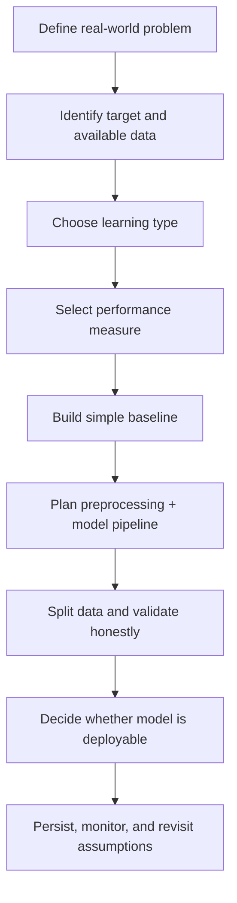
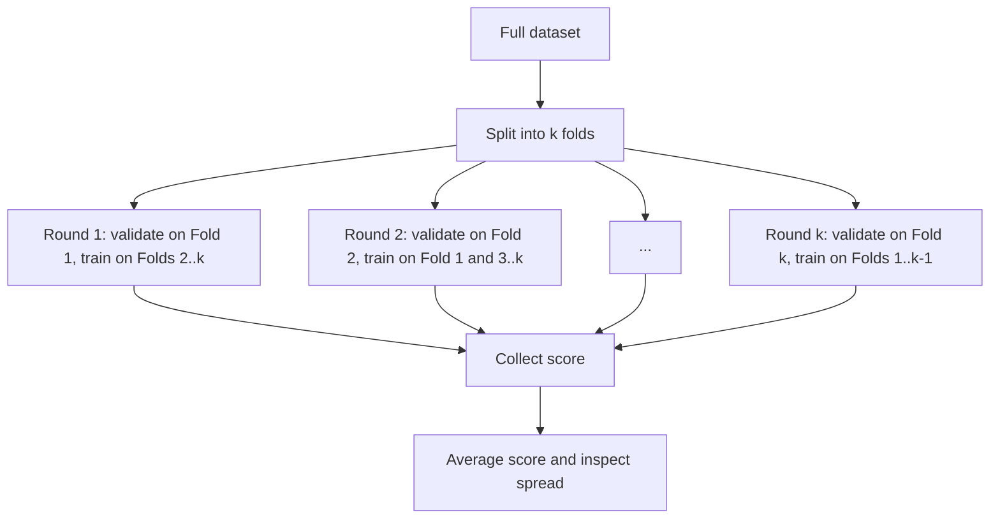

# M10 — Instructor Guide: ML Bridge (Pipelines, CV, Tuning)
> 90-minute session | Dataset: housing_prices.csv | **Optional extension** (not required for M9 capstone)
> **Oral checkpoint at end of M10** — focused on data leakage and pipeline integrity

---

## Learning Objectives

By end of session, students can:
1. Frame an end-to-end ML problem (success metric, baseline, loss function) `[Géron Ch2 p.40–55]`
2. Perform a stratified train/test split that respects the target distribution `[Géron Ch2 p.55–65]`
3. Assemble a `Pipeline` + `ColumnTransformer` for parallel numeric and categorical paths `[Géron Ch2 p.85–95]`
4. Choose between StandardScaler / MinMaxScaler / RobustScaler with rationale `[Géron Ch2 p.83–88]`
5. Run `cross_val_score` and `GridSearchCV`/`RandomizedSearchCV` without overfitting the validation set `[Géron Ch2 p.95–110]`
6. Persist a fitted pipeline with `joblib` and reload-and-predict reproducibly `[Géron Ch2 p.110–115]`
7. Identify the three most common forms of data leakage and where they occur in their own code

---

## Session Structure

| Time | Activity | Lesson IDs |
|------|----------|------------|
| 0:00–0:10 | M9 debrief; framing M10 as the bridge from analysis to modelling | — |
| 0:10–0:25 | **L10.1 + L10.2** — End-to-end framing; stratified split on `housing_prices.csv` median income buckets | L10.1, L10.2 |
| 0:25–0:40 | **L10.3** — Feature scaling: when each scaler fits, why scaling must follow the split | L10.3 |
| 0:40–1:05 | **L10.4 + L10.5** — Pipeline + ColumnTransformer assembly (live coded); custom transformer demo | L10.4, L10.5 |
| 1:05–1:20 | **L10.6 + L10.7** — Cross-validation; `GridSearchCV` walkthrough; nested-CV warning | L10.6, L10.7 |
| 1:20–1:30 | **L10.8** — `joblib` save/load; reproducibility check; oral checkpoint preview | L10.8 |

---

## Key Concepts (with Lesson IDs)

### L10.1 — End-to-end framing `[Géron Ch2 p.40–55]`
#### See the whole project before touching code
A strong machine learning lesson begins by slowing students down. Before anyone opens a notebook, the class should be able to answer three plain-language questions: what decision are we trying to improve, what prediction will the model output, and what action will someone take because of that prediction. This framing keeps the lesson anchored in use rather than novelty.

Instructors can emphasise that an end-to-end project is not "pick a model and hope." It is a chain of commitments: understand the objective, inspect the available data, define success, protect evaluation, build a repeatable pipeline, and decide whether the result is actually useful. If one link is weak, the final score can look impressive while the project remains operationally fragile.

Students often feel pressure to rush toward algorithms because modelling looks like the exciting part. It helps to tell them that professional ML work is usually won or lost before the estimator is chosen. Clear framing, trustworthy data, and honest evaluation routinely matter more than swapping one regressor for another.

#### Walk through the ML project checklist
A practical checklist gives students a sequence they can reuse on later assignments. One effective order is: frame the problem, define the target, inspect the data source, choose the learning type, pick the performance measure, establish a baseline, design the preprocessing-and-model pipeline, validate the workflow, and only then discuss deployment or persistence.

That checklist is valuable because it prevents hidden jumps. For example, a team that has not yet defined the target variable should not be debating whether random forests or linear models are better. Likewise, a team that has not protected the test set is not ready to celebrate a high score.

The checklist also provides a language for classroom critique. Instead of saying "this notebook feels messy," the instructor can point to the missing step: perhaps there is no baseline, no explicit metric, or no statement of why ML is preferable to a rule. That kind of feedback is teachable and repeatable.



#### Name the learning type precisely
Students should practice naming the learning setup with more precision than "we are doing AI." If labels are present and the task is to predict them, the problem is supervised learning. If the goal is to discover structure without labels, such as grouping similar records, the problem is unsupervised learning.

Within supervised learning, the next distinction is usually regression versus classification. Predicting a numeric sale price is regression because the output lies on a continuum. Predicting whether a loan will default is classification because the target is a category, even if the model eventually emits a probability.

It is also worth mentioning batch versus online learning. Batch systems retrain on a stored dataset at intervals, while online systems update as new data arrives. Even if the course mostly uses batch workflows, that vocabulary helps students see that the same framing questions extend beyond the notebook.

#### Pick the performance measure before training
The performance measure must match the cost of being wrong. In a housing setting, root mean squared error is common because larger misses should hurt more than smaller misses. Written inline, the idea is that RMSE grows with the squared error, while MAE grows linearly with the absolute error.

A concise mathematical comparison helps students see the difference instead of memorising names. For predictions $\hat{y}_i$ and targets $y_i$, the two common regression summaries are:

$$
\mathrm{RMSE} = \sqrt{\frac{1}{n}\sum_{i=1}^{n}(y_i-\hat{y}_i)^2}
\qquad
\mathrm{MAE} = \frac{1}{n}\sum_{i=1}^{n}|y_i-\hat{y}_i|
$$

From an instructional point of view, this is a decision about stakes, not notation. If rare but huge misses are especially damaging, RMSE is often appropriate. If the class wants a metric that is easier to interpret and less dominated by outliers, MAE may communicate performance more honestly.

#### Build a baseline and keep a pipeline mindset
A baseline is the simplest credible approach that the model must beat. In regression, the baseline might predict the median target value for every row. In classification, it might always predict the majority class or use a very small rule set. Without a baseline, students cannot tell whether their "good" score is actually useful.

The pipeline mindset enters immediately after that. Every step applied during training must also be applied during validation, testing, and later prediction in the same order. This is why modern workflows wrap preprocessing and modelling together rather than scattering transformations across notebook cells.

An ASCII sketch can make that ordering feel concrete:

```text
raw data
   |
   v
split -> fit preprocessing on train only -> fit model -> validate
   |                                         |
   +------ transform test/validation with same fitted steps ----+
```

#### Work an example from question to score
Suppose the class is predicting house sale price from tabular features. Step 1 is to define the target, for example `sale_price`. Step 2 is to name the task: supervised regression trained in batch mode on historical transactions.

Step 3 is to choose the score. If very large mistakes are costly, the lesson can justify RMSE. Step 4 is to define a baseline, such as predicting the median sale price from the training set for every future row.

Step 5 is to plan the workflow: split the data, scale or encode only where needed, fit a pipeline, run cross-validation, compare the model to the baseline, and save the pipeline only if the evaluation remains honest. Students should be able to narrate these steps aloud before they implement them.

#### Decide when ML is not the answer
One of the most mature habits students can learn is to reject ML when the problem does not need it. If a business rule is stable, transparent, cheap to maintain, and already accurate enough, a handcrafted rule-based system may be the better engineering choice.

ML is also a poor fit when the labels are too noisy, the data volume is tiny, the feature collection process is unreliable, or the decision needs full legal transparency that the proposed model cannot provide. In those cases, forcing ML into the pipeline adds operational burden without adding dependable value.

That discussion is not anti-ML. It is pro-judgment. A useful classroom mantra is: use ML when the mapping is too complex for straightforward rules, the data is trustworthy enough to learn from, and the benefits of adaptation exceed the costs of complexity.

#### Common Mistakes
Students often make the framing stage look shorter than it really is. Remind them that most downstream confusion comes from weak problem statements, vague metrics, or skipped baselines rather than from a missing library import.

The following mistakes are especially common in early projects:

- Starting with model selection before writing down the target, user action, and success measure.
- Calling a task "classification" or "regression" without checking what kind of output is actually required.
- Choosing a metric after seeing the model score instead of before training.
- Treating preprocessing as a side note instead of part of the model pipeline.
- Assuming ML is automatically better than a well-specified rule-based solution.

A good correction routine is to ask students to point to each checklist step in their notebook. If they cannot show where the metric, baseline, and workflow are defined, the project is not yet end-to-end.

#### Practice Questions
A short debrief at the end of the lesson helps students connect abstract framing decisions to concrete modelling choices. Encourage them to answer in full sentences before they write code.

Ask students to justify each answer with the language of target, metric, baseline, and pipeline. That habit prepares them for oral checkpoints as well as written notebooks.

1. A team wants to predict next month's rent price from apartment features. Is the task supervised or unsupervised, and is it classification or regression?
2. Give one case where MAE may be preferred to RMSE and explain why.
3. Describe a simple baseline for a house-price regression problem.
4. Why is preprocessing part of the pipeline rather than a separate convenience step?
5. Name one realistic situation where ML is not the right answer.

### L10.2 — Stratified train/test split `[Géron Ch2 p.55–65]`
#### See why random splitting can fail
A random split sounds fair because every row has the same chance of landing in train or test. The problem is that fairness at the row level does not guarantee representativeness at the distribution level. When classes are imbalanced, a random split can accidentally under-sample the minority class in the test set or even make it nearly disappear.

That failure matters because evaluation becomes noisy. A model can look excellent simply because the rare, difficult cases barely appear in the held-out sample. Students then optimise a model against an unrealistically easy test set and develop false confidence.

This lesson is especially important because random splitting failure is subtle. Nothing crashes, the code looks clean, and the notebook still prints a score. The warning sign is not an error message; it is a mismatch between the real-world class balance and the split that will supposedly represent it.

#### Preserve class balance with stratification
Stratification means splitting the data so that the train and test sets keep approximately the same class proportions as the full dataset. In a binary classification problem with 90% class 0 and 10% class 1, both subsets should remain close to that 90/10 balance.

This matters most when one class is rare or more important, such as fraud, churn, disease detection, or safety incidents. If the class balance shifts too much, students may think a model generalises well when it is merely being evaluated on a distorted sample.

The same idea can help with continuous targets when an instructor first bins an important numeric variable into categories. Géron uses this trick for median income buckets in the housing dataset so the split respects an important structure in the data-generating process.

#### Use `stratify=y` in the common classification pattern
In `scikit-learn`, the standard pattern is simple: pass the target array as the `stratify` argument to `train_test_split`. That single parameter tells the splitter to preserve target proportions while still randomising row assignment within each class.

The code below also compares the class distribution before and after splitting. In class, this is worth running live because students can see that the stratified split stays close to the full distribution while a purely random split may drift.

```python
import pandas as pd
from sklearn.model_selection import train_test_split

# y contains class labels such as 0/1 for non-default/default
full_dist = pd.Series(y).value_counts(normalize=True).sort_index()

# Plain random split: proportions may drift
X_train_r, X_test_r, y_train_r, y_test_r = train_test_split(
    X, y, test_size=0.2, random_state=42
)

# Stratified split: proportions are preserved much more closely
X_train_s, X_test_s, y_train_s, y_test_s = train_test_split(
    X, y, test_size=0.2, random_state=42, stratify=y
)

random_test_dist = pd.Series(y_test_r).value_counts(normalize=True).sort_index()
strat_test_dist = pd.Series(y_test_s).value_counts(normalize=True).sort_index()

comparison = pd.DataFrame({
    'full': full_dist,
    'random_test': random_test_dist,
    'stratified_test': strat_test_dist,
}).fillna(0)

print(comparison)
```

#### Work through a failure example step by step
Imagine a dataset of 1,000 rows with only 50 positive labels. If the test set is 20%, the ideal test set would contain roughly 10 positives. A random split might produce 6 positives one time and 14 positives another time, which already changes how trustworthy the score feels.

Now suppose the model struggles exactly on that minority class. In the 6-positive test set, the model might miss most important failures but still appear strong overall because the majority class dominates the metric. In the 14-positive test set, the same model may suddenly look much worse.

Stratified splitting stabilises this first layer of evaluation. It does not solve every validation problem, but it prevents students from building a course project on a fragile sample that misrepresents the task they are claiming to solve.

#### Know when stratification matters most
Stratification is most useful when the target distribution is uneven and the dataset is not huge. In a perfectly balanced and very large dataset, random splitting will usually be close enough. In a smaller or more imbalanced dataset, the difference can be meaningful.

It also matters when the class proportions themselves carry practical meaning. If only 3% of cases are fraudulent in production, the evaluation split should not casually drift to 10% just because a random seed happened to make it so.

That said, stratification is not a magic rule for every problem. It is a way to preserve a known structure during splitting. Students still need to respect domain constraints such as time order, grouped observations, or entity boundaries.

#### Treat the test set as sacred
Once the test set has been created, it should be set aside and left untouched until the final evaluation. The point of the test set is to simulate genuinely unseen data. If students keep peeking at it, tuning against it, or re-splitting until they like the result, the test score stops being an honest estimate.

A helpful classroom phrase is that the test set is sacred. It is not there to guide feature engineering, hyperparameter selection, or preprocessing experiments. Those choices belong inside the training data, often through cross-validation.

In practice, this means students should create the split early, save it if needed, and resist the temptation to repeatedly consult test performance while iterating. The cleaner the boundary, the more meaningful the final score becomes.

#### Know when random splitting is the wrong tool entirely
Some datasets should not be randomly split at all. If the rows have a temporal order, future examples must not leak into the past, so chronological splitting is the correct design. If many rows belong to the same customer, patient, or house, a group-aware split may be necessary to prevent near-duplicates from appearing on both sides.

Stratification does not override those realities. It preserves proportions within the splitting method you choose, but it cannot repair a split that violates the way data is generated or consumed. This is why split strategy is part of problem framing, not a tiny implementation detail.

Students benefit from hearing the hierarchy clearly: first respect time or grouping, then preserve important distributions where possible, then protect the untouched test set. That mental order prevents a lot of accidental leakage.

#### Common Mistakes
Beginners usually learn the syntax for `train_test_split` faster than they learn the reasoning behind it. The result is code that runs correctly but evaluates the wrong thing.

Watch for these recurring mistakes:

- Using a plain random split on a noticeably imbalanced target without checking class proportions afterward.
- Applying `stratify=y` only after the model performs badly, as if stratification were a rescue trick instead of a default design choice.
- Inspecting the test set repeatedly during feature engineering or hyperparameter tuning.
- Using random splitting for time-series or grouped data where the rows are not exchangeable.
- Forgetting to compare the full, train, and test distributions to confirm that the split behaved as expected.

A strong correction is to require students to print the class proportions before and after splitting. When they can see the numbers, the reason for stratification becomes concrete.

#### Practice Questions
End the lesson by asking students to explain the split design rather than merely copying a code snippet. The goal is for them to defend why a particular split is trustworthy.

Encourage answers that mention representativeness, leakage prevention, and the role of the sacred test set.

1. Why can a random split give an overly optimistic result on an imbalanced classification task?
2. What does `stratify=y` do in `train_test_split`?
3. Describe one scenario where stratification matters a lot and one where it matters less.
4. Why should the test set remain untouched until the end?
5. Name a problem type where random row-wise splitting should be replaced by another strategy.

### L10.3 — Feature scaling `[Géron Ch2 p.83–88]`
#### Start with why scaling changes model behaviour
Feature scaling matters whenever the learning algorithm depends on magnitudes, distances, or gradient updates. If one feature ranges from 0 to 1 and another ranges from 0 to 100,000, the larger-scale feature can dominate the geometry of the optimisation problem even when it is not more informative.

This is why methods such as k-nearest neighbours, support vector machines, regularised linear models, logistic regression, and neural networks often benefit from scaling. Their behaviour is tied to distance calculations or iterative optimisation, so the numerical scale of each input feature shapes the training path.

Tree-based models are different. A decision tree can split on thresholds without caring much whether a feature is measured in dollars or thousands of dollars. That contrast helps students learn that preprocessing choices should follow model mechanics, not habit.

#### Understand `StandardScaler` mathematically
`StandardScaler` recentres each feature and rescales it by its standard deviation. For a value $x$, feature mean $\mu$, and feature standard deviation $\sigma$, the transformed value is written inline as $z = \frac{x-\mu}{\sigma}$.

The block form is useful because students can point to what is learned from the training data:

$$
z = \frac{x - \mu}{\sigma}
$$

After this transformation, a feature has mean near 0 and standard deviation near 1 on the training data. This often helps gradient-based models converge more reliably because each feature contributes on a comparable numeric scale.

#### Understand `MinMaxScaler` mathematically
`MinMaxScaler` maps values into a fixed interval, often $[0,1]$. If the minimum and maximum from the training data are $x_{\min}$ and $x_{\max}$, then the transformed value is:

$$
x' = \frac{x - x_{\min}}{x_{\max} - x_{\min}}
$$

This is useful when an algorithm or downstream system expects bounded inputs. It can also make plots and feature ranges easier to interpret, although it is more sensitive to extreme outliers because the min and max anchor the entire transformation.

#### Choose the scaler that matches the situation
A helpful teaching rule is that `StandardScaler` is the safer general default for many linear and gradient-based models. It preserves the rough shape of the distribution while making scales comparable. If students are unsure and the algorithm is scale-sensitive, this is often the first option to try.

`MinMaxScaler` is attractive when the model or data interface benefits from a bounded range, such as certain neural-network settings or features that naturally live within interpretable limits. It is also useful when preserving relative ordering inside a fixed interval is more important than centring around zero.

The key is not to turn this into superstition. Students should justify the choice by the algorithm and the data, not by memorising a blanket statement that one scaler is always better.

#### Fit on the training set only
The non-negotiable rule is that the scaler must be fit on the training data only. The mean, standard deviation, minimum, and maximum are all learned quantities. If students compute them using the full dataset, the test set has already influenced the transformation and evaluation is no longer honest.

The safe workflow is: split first, fit the scaler on `X_train`, transform `X_train`, and then transform `X_test` using the same fitted scaler. In practice, putting the scaler inside a `Pipeline` is even safer because the order is enforced automatically during cross-validation.

This rule is worth repeating because leakage through scaling feels harmless. Students may think, "I only used a mean." But that mean came partly from the test set, so the training procedure has already seen information it should not have had.

#### Use an ASCII picture to explain the effect
A quick visual can help students see what scaling changes and what it does not. The shape of the data can stay similar even while the numeric range changes dramatically.

```text
Original feature (annual income)
0      20k      40k      60k      80k     100k
|-------|---------|---------|---------|--------|
          **** *********** *****

After StandardScaler
-2      -1        0        1        2        3
|--------|--------|--------|--------|--------|
          **** *********** *****

After MinMaxScaler
0.0     0.2      0.4      0.6      0.8      1.0
|--------|--------|--------|--------|--------|
          **** *********** *****
```

The picture shows that scaling mostly changes the coordinate system. It does not automatically make a bad feature useful, but it can make a useful feature visible to algorithms that depend on comparable numeric ranges.

#### Work through a small example step by step
Suppose one row has `income = 80` and the training data for that feature has mean $\mu = 50$ and standard deviation $\sigma = 10$. Under standardisation, the transformed value is $z = (80-50)/10 = 3$. Students can interpret this as the observation being three standard deviations above the training mean.

Now suppose the same feature has training minimum 20 and maximum 100. Under min-max scaling, the transformed value is $(80-20)/(100-20) = 0.75$. That means the value sits three quarters of the way from the training minimum to the training maximum.

This example helps students separate two ideas. Standard scaling expresses relative distance from the mean in standard-deviation units, while min-max scaling expresses relative position inside a bounded interval.

#### Common Mistakes
Scaling is simple enough that students often stop thinking about it right before the important design decisions. Most mistakes are not syntax errors; they are workflow errors.

Watch for these issues in notebooks:

- Scaling the full dataset before the train/test split, which leaks information from the test set.
- Assuming every model needs scaling, including tree-based models where the effect is often minimal.
- Choosing `MinMaxScaler` without noticing that severe outliers stretch the entire range.
- Forgetting that `StandardScaler` learns $\mu$ and $\sigma$ from the training set and must reuse those exact values later.
- Comparing models unfairly by scaling features for one experiment but not applying the same pipeline design to another.

A useful correction is to ask students two questions: what statistics does this scaler learn, and from which rows were those statistics computed? If they cannot answer both, they do not yet control the workflow.

#### Practice Questions
Close the lesson by asking students to connect formulas to modelling consequences. The aim is not memorisation alone but informed preprocessing decisions.

Encourage them to answer with both words and equations where appropriate.

1. Why do KNN and logistic regression often care more about scaling than random forests?
2. Write the formula for `StandardScaler` and explain each symbol.
3. When might `MinMaxScaler` be a better choice than `StandardScaler`?
4. Why must the scaler be fit on training data only?
5. In plain language, what is the difference between a z-score of 3 and a min-max value of 0.75?

### L10.4 — `Pipeline` and `ColumnTransformer` `[Géron Ch2 p.85–95]` ⚠️ [AI-OFF for assembly cell]
#### Define what a `Pipeline` guarantees
A `Pipeline` is a single object that stores an ordered sequence of preprocessing steps followed by a final estimator. The importance is not merely cosmetic. It guarantees that the same sequence is used during fitting, validation, testing, and later prediction.

That guarantee matters because real projects do not fail only through bad models; they fail through inconsistent workflows. If a scaler is fit in one cell, an encoder in another, and the model somewhere else, it becomes easy to apply steps in the wrong order or with the wrong fitted statistics.

Teaching pipelines early helps students move from notebook experimentation to repeatable systems thinking. The model is not just the last line of code; the model is the entire transformation-and-estimation procedure.

#### Explain how pipelines prevent leakage
Leakage often enters through preprocessing rather than through the estimator itself. If a student fits an imputer or scaler on the full dataset before cross-validation, every validation fold has already influenced the preprocessing statistics, even if the model has not explicitly seen the labels.

A pipeline prevents this by nesting the steps inside one estimator-like object. When `fit()` is called during a train split or CV fold, each step learns only from that fold's training portion. The validation slice is transformed using learned values, not used to compute them.

This is why instructors should insist that preprocessing be wrapped, not merely described. Good intentions are not enough; the code structure should enforce the safe workflow automatically.

#### Use `ColumnTransformer` for parallel feature paths
Real tabular data rarely has one uniform preprocessing rule. Numeric columns may need imputation and scaling, while categorical columns may need imputation and one-hot encoding. `ColumnTransformer` solves this by sending different column subsets through different preprocessing branches.

This design is powerful because it makes the data schema explicit. Students can see, in one place, which columns are numeric, which are categorical, and which operations each set will receive. That clarity is pedagogically valuable as well as technically safe.

The `remainder='passthrough'` option matters too. It allows any columns not listed explicitly to flow into the output unchanged, which is useful when only a subset needs special handling. Instructors should explain that passthrough is deliberate, not accidental.

#### Walk through the assembly cell even though it is AI-OFF
The assembly cell is marked AI-OFF, but students still need the conceptual explanation. They should be able to say why each branch exists, what each transformer learns in `fit`, and how the final estimator receives the transformed feature matrix.

This is a good place to emphasise that AI-OFF means students must assemble the code themselves, not that the concepts become mysterious. The instructor can still narrate the structure, label the leakage risks, and show what a correct finished object looks like after the independent attempt.

A useful classroom line is: the point of the cell is not to memorise syntax; it is to prove you understand how the workflow stays honest. That keeps the focus on reasoning instead of rote copying.

#### Build a full preprocessing-and-model pipeline
The example below combines numeric scaling, categorical encoding, passthrough columns, and a final model. The inline comments are worth reading aloud because they connect each line of code to the larger workflow.

```python
import pandas as pd
from sklearn.compose import ColumnTransformer
from sklearn.impute import SimpleImputer
from sklearn.linear_model import LinearRegression
from sklearn.pipeline import Pipeline
from sklearn.preprocessing import OneHotEncoder, StandardScaler

numeric_features = ['median_income', 'total_rooms', 'housing_median_age']
categorical_features = ['ocean_proximity']
# Any other columns not listed above will pass through unchanged.

numeric_pipeline = Pipeline([
    ('imputer', SimpleImputer(strategy='median')),   # Learn medians from training data only.
    ('scaler', StandardScaler()),                    # Standardise numeric columns after imputation.
])

categorical_pipeline = Pipeline([
    ('imputer', SimpleImputer(strategy='most_frequent')),  # Fill missing categories consistently.
    ('encoder', OneHotEncoder(handle_unknown='ignore')),   # Safe for unseen categories at prediction time.
])

preprocessor = ColumnTransformer(
    transformers=[
        ('num', numeric_pipeline, numeric_features),
        ('cat', categorical_pipeline, categorical_features),
    ],
    remainder='passthrough',  # Keep untouched columns in the final design matrix.
)

full_pipeline = Pipeline([
    ('preprocess', preprocessor),
    ('model', LinearRegression()),
])

full_pipeline.fit(train_df, train_labels)
predictions = full_pipeline.predict(test_df)
```

#### Connect pipelines to cross-validation
The moment students understand `Pipeline`, they are ready to see why it belongs inside cross-validation. If `cross_val_score` receives the full pipeline, every fold refits both preprocessing branches and the estimator on that fold's training subset. That keeps the evaluation aligned with real deployment behaviour.

If preprocessing happens outside the pipeline, the folds are no longer isolated. A scaler, encoder, or imputer may quietly absorb information from rows that later act as validation data. The code can look cleaner than it deserves, which is why leakage is so dangerous.

A short workflow summary helps:

```text
Fold 1: fit preprocess on train_1 -> fit model -> score on valid_1
Fold 2: fit preprocess on train_2 -> fit model -> score on valid_2
...
No fold gets preprocessing statistics from its own validation rows.
```

#### Work a practical example from raw columns to prediction
Suppose the housing table contains numeric columns like `median_income` and `total_rooms`, plus a categorical column `ocean_proximity`. Step 1 is to define the column groups. Step 2 is to build one pipeline for numeric columns and another for categorical columns.

Step 3 is to combine them with a `ColumnTransformer`, adding `remainder='passthrough'` if certain columns should flow through untouched. Step 4 is to wrap that preprocessor with the estimator inside a final `Pipeline`.

Step 5 is to fit once on the training data and call `predict` on new rows. Students should understand that they are not manually scaling, encoding, and then predicting; they are asking one object to reproduce the complete workflow consistently.

#### Common Mistakes
Pipeline syntax can feel mechanical, so students sometimes write something that looks similar while breaking the safety guarantees. The errors below are worth checking line by line during lab.

Common problems include:

- Fitting preprocessors outside the pipeline and then evaluating the model as if leakage had not occurred.
- Mixing numeric and categorical columns in one branch without clear handling for missing values and encoding.
- Forgetting `handle_unknown='ignore'` in `OneHotEncoder`, which can break prediction on unseen categories.
- Omitting `remainder='passthrough'` when unchanged columns are still needed downstream.
- Passing already-transformed arrays into a pipeline that is supposed to own preprocessing, creating duplicate or inconsistent transformations.

A useful correction is to ask students: if I hand you one new raw row tomorrow, which object will you call? The correct answer should be the full pipeline, not a sequence of manual helper cells.

#### Practice Questions
Finish by asking students to explain the workflow in operational terms. They should be able to justify why the pipeline object is safer than scattered preprocessing code.

Encourage them to answer with references to step ordering, learned statistics, and fold isolation.

1. What does a `Pipeline` guarantee that a loose sequence of notebook cells does not?
2. Why does preprocessing outside the pipeline create leakage risk during cross-validation?
3. What problem does `ColumnTransformer` solve in mixed-type tabular data?
4. What does `remainder='passthrough'` do?
5. Why is the AI-OFF assembly cell still conceptually important even if students must type it themselves?

### L10.5 — Custom transformers `[Géron Ch2 p.90–95]`
#### Know when a custom transformer is justified
Built-in transformers cover many common needs, but real projects often require feature engineering that is specific to the dataset. A housing dataset might benefit from ratios such as rooms per household, bedrooms per room, or population per household. Those features are meaningful, yet they do not exist as canned preprocessing steps.

A custom transformer is justified when the transformation belongs inside the modelling workflow and should participate in cross-validation like any other preprocessing step. If students compute such features manually in an early notebook cell, they risk inconsistency, leakage, and duplication.

The teaching goal is not to make every transformation custom. It is to show students how to package domain logic in a reusable way that plays nicely with `Pipeline` and the rest of the `scikit-learn` ecosystem.

#### Understand the `BaseEstimator` and `TransformerMixin` pattern
In `scikit-learn`, a custom transformer usually inherits from `BaseEstimator` and `TransformerMixin`. `BaseEstimator` gives the object parameter handling that works cleanly with inspection and model selection tools. `TransformerMixin` supplies conveniences such as `fit_transform` based on your `fit` and `transform` methods.

This pattern matters because the transformer should look and behave like a native library component. Once it follows the expected interface, it can live inside pipelines, column transformers, and search procedures without special-case code.

Students do not need to memorise the inheritance hierarchy deeply, but they should know why it exists: the whole library depends on a shared contract about what `fit` and `transform` mean.

#### Separate `fit` from `transform` clearly
`fit` is where the transformer learns anything that depends on the training data. That might be a threshold, a lookup table, a list of columns, or a summary statistic. If nothing needs to be learned, `fit` may simply return `self`, but that is still a meaningful statement about the contract.

`transform` is where the learned information is applied to incoming data. It should not suddenly peek at labels or recompute statistics from the validation or test rows. That separation is exactly what allows cross-validation to stay honest.

A helpful classroom phrasing is: `fit` observes and stores; `transform` reuses and applies. Once students internalise that sentence, custom transformer design becomes much easier.

#### Build a complete custom transformer example
The example below creates three interpretable ratio features from housing columns. It checks for required columns in `fit`, stores the names for safe reuse, and creates the new columns in `transform`.

```python
import pandas as pd
from sklearn.base import BaseEstimator, TransformerMixin

class HousingRatioFeatures(BaseEstimator, TransformerMixin):
    def __init__(self, add_bedrooms_per_room=True):
        self.add_bedrooms_per_room = add_bedrooms_per_room

    def fit(self, X, y=None):
        # Validate that the expected columns exist on the training data.
        required = ['total_rooms', 'total_bedrooms', 'population', 'households']
        missing = [col for col in required if col not in X.columns]
        if missing:
            raise ValueError(f"Missing required columns: {missing}")

        # Store the validated column names so transform uses the same schema.
        self.required_columns_ = required
        return self

    def transform(self, X):
        # Work on a copy so the original DataFrame is not mutated in place.
        X = X.copy()

        # Use a tiny constant to avoid division-by-zero crashes.
        denom = X['households'].replace(0, 1e-9)
        X['rooms_per_household'] = X['total_rooms'] / denom
        X['population_per_household'] = X['population'] / denom

        if self.add_bedrooms_per_room:
            room_denom = X['total_rooms'].replace(0, 1e-9)
            X['bedrooms_per_room'] = X['total_bedrooms'] / room_denom

        return X
```

#### Walk the example step by step
Step 1 is initialisation. The parameter `add_bedrooms_per_room=True` lets the transformer expose a tunable design choice without hard-coding it forever. Because it is a constructor argument, search tools can also manipulate it later if desired.

Step 2 is `fit`. In this example, `fit` does not compute means or thresholds, but it still validates the schema and stores the required column list. That makes the transformer safer and more informative when students use it inside larger workflows.

Step 3 is `transform`. The method copies the input, creates the engineered columns, and returns the modified DataFrame. Because the logic is wrapped cleanly, the same transformation happens during training, validation folds, and future prediction.

#### Put the transformer inside a pipeline
A custom transformer becomes most valuable when it is inserted directly into a pipeline. That way the engineered features are produced at the right moment and under the same evaluation rules as every other preprocessing step.

For example, the class above could sit before a `ColumnTransformer` or be used inside a dedicated numeric branch. Students then gain the benefit of feature engineering without losing reproducibility.

A minimal integration sketch looks like this:

```python
from sklearn.pipeline import Pipeline
from sklearn.linear_model import LinearRegression

model_pipeline = Pipeline([
    ('ratios', HousingRatioFeatures(add_bedrooms_per_room=True)),
    ('model', LinearRegression()),
])
```

#### Compare this to manual preprocessing
Manual preprocessing often begins with innocent convenience. A student writes one cell to create `rooms_per_household`, another to drop a column, and a third to rerun the feature engineering later on test data. Soon the workflow depends on notebook order and memory rather than on a reliable object.

A custom transformer solves that by centralising the logic. The feature engineering becomes inspectable, reusable, and easy to test. It can also be shared with teammates without requiring them to reverse-engineer notebook history.

Most importantly, it becomes possible to evaluate the entire workflow honestly. Cross-validation no longer treats feature engineering as an invisible precondition; it treats it as part of the model pipeline.

#### Common Mistakes
Custom transformers are powerful, but their mistakes are often structural rather than syntactic. Students can produce a class that runs and still breaks the intended evaluation contract.

Watch for these issues:

- Computing training statistics inside `transform` instead of learning them once in `fit`.
- Mutating the input object in place, which can create hard-to-track notebook side effects.
- Forgetting to return `self` from `fit`, which breaks the estimator interface.
- Writing a transformer that expects columns never validated during `fit`.
- Performing target-dependent logic inside the transformer in a way that leaks label information into preprocessing.

A useful rubric question is: what exactly does this transformer learn in `fit`, and what exactly does it apply in `transform`? If the answer is blurry, the design needs revision.

#### Practice Questions
Close by asking students to explain both the software interface and the modelling reason for custom transformers. The goal is to connect engineering discipline with honest evaluation.

Encourage them to answer using the verbs learn, store, apply, and reuse.

1. When is a custom transformer preferable to a manual notebook cell?
2. What roles do `BaseEstimator` and `TransformerMixin` play?
3. In one sentence each, what should `fit` do and what should `transform` do?
4. Why is it helpful to expose options such as `add_bedrooms_per_room` in `__init__`?
5. What leakage risk appears if `transform` recomputes statistics from validation data?

### L10.6 — Cross-validation `[Géron Ch2 p.95–100]`
#### Start with the problem cross-validation solves
A single train/validation split gives only one estimate of performance. That estimate may be unusually high or unusually low simply because the split happened to be easy or hard. When students draw conclusions from one lucky split, they can mistake sampling noise for genuine model quality.

Cross-validation addresses that instability by repeating the evaluation across multiple validation slices. Instead of asking whether the model looked good once, it asks whether the model behaves consistently across several different partitions of the same dataset.

This makes the performance estimate less fragile. The class can discuss not only the average score but also the spread of scores across folds, which is often just as informative as the mean.

#### Explain k-fold CV step by step
In k-fold cross-validation, the dataset is divided into $k$ roughly equal folds. On each round, the model trains on $k-1$ folds and validates on the remaining fold. The process repeats until every fold has served once as the validation fold.

If $k=5$, there are five rounds. Each row acts as validation data exactly once and as training data four times. The final report usually includes the mean score and often the standard deviation across the five results.

This repeated structure is easy to narrate and easy to diagram, which helps students remember that CV is a procedure, not a magical scoring function.



#### Prefer stratified k-fold for classification
In classification settings, especially imbalanced ones, the validation folds should preserve class proportions as much as possible. That is why `StratifiedKFold` is usually preferred over plain `KFold` for classification tasks.

The reason is parallel to the earlier train/test split lesson. If one fold contains very few minority-class examples while another contains many, the fold scores can fluctuate for reasons that reflect the split more than the model. Stratification reduces that avoidable instability.

For regression, plain `KFold` is common unless there is a domain-specific reason to preserve another structure. The important teaching move is to match the folding strategy to the data and task rather than to treat all CV as identical.

#### Use `cross_val_score` on the full workflow
`cross_val_score` is a convenient interface because it fits the estimator repeatedly across folds and returns one score per fold. When the estimator passed in is a full pipeline, each round includes preprocessing, feature engineering, and modelling in the correct order.

A minimal example is shown below. The comments matter because they highlight that the returned array contains separate fold scores, not one global truth.

```python
import numpy as np
from sklearn.model_selection import cross_val_score, StratifiedKFold

cv = StratifiedKFold(n_splits=5, shuffle=True, random_state=42)

scores = cross_val_score(
    estimator=full_pipeline,   # Pipeline includes preprocessing + model.
    X=X_train,
    y=y_train,
    cv=cv,
    scoring='accuracy',        # Choose a metric that matches the task.
)

print('Fold scores:', scores)
print('Mean score:', np.mean(scores))
print('Std score :', np.std(scores))
```

#### Choose `k` with the bias-variance trade-off in mind
The choice of $k$ is not arbitrary. Smaller $k$ values, such as 3 or 5, are cheaper to compute and often produce a lower-variance estimate because each validation fold is larger. Larger $k$ values, such as 10, train on a larger fraction of the data per round and can reduce bias in the estimate.

There is a trade-off. As $k$ grows, compute time increases because the model is trained more times. Depending on the dataset, the score variability across folds may also become more noticeable because each validation slice is smaller.

In practice, $k=5$ is a strong default for many classroom exercises, while $k=10$ is often used when the dataset is smaller and the extra computation is affordable. The point is to make the choice explicit rather than accidental.

#### Work through a numerical example
Suppose a dataset contains 500 rows and the instructor chooses 5-fold CV. Each round trains on 400 rows and validates on 100 rows. After five rounds, the class might see accuracy scores such as `[0.81, 0.79, 0.84, 0.80, 0.78]`.

The mean score is $0.804$, which gives a better summary than any single round alone. The spread also matters: the model is not performing identically everywhere, so students should not talk about the average as though it were perfectly certain.

This worked example helps students see why CV is more informative than one split. The model is being tested under several slightly different data arrangements, which is much closer to the uncertainty of real deployment.

#### Connect CV to model comparison and leakage prevention
Cross-validation is especially useful when comparing candidate models. If one model beats another by only a tiny amount on one split, that difference may be noise. Repeating the evaluation across folds makes the comparison more credible.

It is also one of the strongest tools against leakage when paired with pipelines. Each fold isolates training and validation operations correctly, so preprocessing statistics do not leak from the validation fold into the fit process.

That is why the recommended workflow is not "preprocess once, then cross-validate the model." It is "cross-validate the full pipeline." Honest evaluation depends on the whole workflow being refit inside each fold.

#### Common Mistakes
Students often adopt cross-validation because it is considered best practice, but they may still use it in ways that weaken the result. The key is to inspect what is being cross-validated, not just whether the function name appears in the notebook.

Watch for these mistakes:

- Reporting only one fold score or only the best fold instead of the full set or its summary.
- Using plain `KFold` for an imbalanced classification problem where `StratifiedKFold` would be more stable.
- Passing preprocessed data into CV after fitting the preprocessor on the entire dataset.
- Treating the mean CV score as exact truth and ignoring the variability across folds.
- Choosing a very large `k` without considering compute cost or the size of each validation fold.

A strong follow-up question is: what exactly is being refit in each fold? If the answer is not "the entire workflow," there may be leakage hiding in the setup.

#### Practice Questions
End by asking students to explain what cross-validation buys them beyond a single split. This helps them treat CV as an answer to a problem rather than as ceremonial complexity.

Encourage answers that mention repeated evaluation, fold variability, and the need to cross-validate the pipeline instead of isolated steps.

1. What weakness of a single train/validation split does cross-validation address?
2. In 5-fold CV, how many times does each row appear in validation?
3. Why is `StratifiedKFold` often preferred for classification?
4. What additional information do you get by reporting the standard deviation of CV scores?
5. Why should `cross_val_score` usually receive the full pipeline rather than a partially preprocessed matrix?

### L10.7 — Hyperparameter tuning `[Géron Ch2 p.100–110]`
#### Distinguish parameters from hyperparameters
Parameters are values learned from data during fitting. In linear regression they include coefficients; in decision trees they include split thresholds and leaf predictions. The algorithm estimates these from the training data once the model structure has been specified.

Hyperparameters are the configuration choices set before fitting begins. Examples include `max_depth` for a tree, `alpha` for regularisation strength, or the number of estimators in a forest. They shape how the model is allowed to learn, but they are not themselves learned directly from the target values in the same way.

Students need this distinction because tuning operates on the outer layer of the modelling process. We are not editing learned weights by hand; we are searching over training configurations that will later produce different learned parameters.

#### Explain grid, random, and halving search
Grid search evaluates every combination in a predefined hyperparameter grid. It is easy to reason about and easy to reproduce, which makes it pedagogically friendly. Its weakness is cost: the number of fits grows quickly as the grid widens.

Random search samples combinations from specified distributions or lists. It often finds a strong region of the search space with fewer evaluations, especially when only a few hyperparameters matter a lot. This makes it practical when the full grid would be too expensive.

Halving search begins with many candidates and allocates more resources only to the stronger ones over successive rounds. It is a resource-aware approach that teaches students an important idea: not every candidate deserves a full evaluation budget from the start.

#### Use search objects that include cross-validation
`GridSearchCV` and `RandomizedSearchCV` combine hyperparameter search with cross-validation. For each candidate setting, the search object performs repeated validation and tracks the mean score across folds. That makes the chosen result more trustworthy than selecting hyperparameters from a single lucky split.

The same principle applies to halving search variants such as `HalvingGridSearchCV` and `HalvingRandomSearchCV`, which require the experimental `enable_halving_search_cv` import in `scikit-learn`. The interface stays familiar even while the resource allocation strategy changes.

The main instructional point is that tuning should evaluate candidates under the same honest validation design we would expect from any model comparison. Search without good validation just automates bad judgement faster.

#### Compare search strategies in code
The example below compares grid, random, and halving search on the same pipeline. Notice that the hyperparameter names use the pipeline step prefix, such as `model__max_depth`, because the search object is tuning the estimator inside the pipeline.

```python
from scipy.stats import randint
from sklearn.experimental import enable_halving_search_cv  # noqa: F401
from sklearn.ensemble import RandomForestRegressor
from sklearn.model_selection import GridSearchCV, RandomizedSearchCV
from sklearn.model_selection import HalvingGridSearchCV
from sklearn.pipeline import Pipeline

search_pipeline = Pipeline([
    ('preprocess', preprocessor),
    ('model', RandomForestRegressor(random_state=42)),
])

grid_search = GridSearchCV(
    estimator=search_pipeline,
    param_grid={
        'model__n_estimators': [100, 200],
        'model__max_depth': [None, 10, 20],
        'model__min_samples_split': [2, 5],
    },
    cv=5,
    scoring='neg_root_mean_squared_error',
    n_jobs=-1,
)

random_search = RandomizedSearchCV(
    estimator=search_pipeline,
    param_distributions={
        'model__n_estimators': randint(80, 301),
        'model__max_depth': [None, 8, 12, 16, 20],
        'model__min_samples_split': randint(2, 11),
    },
    n_iter=12,
    cv=5,
    scoring='neg_root_mean_squared_error',
    random_state=42,
    n_jobs=-1,
)

halving_search = HalvingGridSearchCV(
    estimator=search_pipeline,
    param_grid={
        'model__n_estimators': [50, 100, 200],
        'model__max_depth': [None, 10, 20],
    },
    factor=2,
    cv=5,
    scoring='neg_root_mean_squared_error',
    n_jobs=-1,
)

for name, search in {
    'grid': grid_search,
    'random': random_search,
    'halving': halving_search,
}.items():
    search.fit(X_train, y_train)
    print(name, search.best_score_, search.best_params_)
```

#### Work through a tuning example step by step
Suppose the class wants to tune a random forest regressor. Step 1 is to create a train/test split and leave the test set untouched. Step 2 is to wrap preprocessing and the model in a single pipeline so the search evaluates the full workflow.

Step 3 is to decide which hyperparameters are worth tuning. For a forest, candidates might include the number of trees, maximum depth, and minimum samples required to split. Step 4 is to choose a search strategy based on budget and search-space size.

Step 5 is to fit the search object on the training data only, inspect the best cross-validated settings, refit the best estimator if needed, and evaluate exactly once on the sacred test set. That final step is what protects the integrity of the project.

#### Avoid overfitting to the test set
A search object uses validation folds internally to choose hyperparameters. That is appropriate. The danger appears when students then keep consulting the test set and changing the search space in response. At that point the test set is no longer truly unseen; it is becoming part of the tuning loop.

The clean pattern is simple: split once, tune only within the training data, and touch the test set only for the final report. If the class wants an even more rigorous estimate for heavy tuning, instructors can mention nested cross-validation as the advanced answer.

Students should hear that a search object does not grant permission to tune forever. It automates selection inside a protected process, but the outer boundary of the untouched test set still matters.

#### Choose the search strategy deliberately
Grid search is best when the candidate set is small, interpretable, and worth checking exhaustively. It is a good teaching tool because students can see every combination that was tried. Random search is often preferable when the search space is larger or when compute is limited.

Halving search is useful when the cost of fully evaluating every candidate would be wasteful. It introduces an important real-world lesson: allocate more resources to promising candidates and stop spending equal effort on weak ones.

Rather than presenting one method as universally best, instructors can frame the choice as an optimisation problem of its own. The right search balances transparency, cost, and the size of the space worth exploring.

#### Common Mistakes
Tuning is exciting because it feels like "free performance," which makes it easy for students to push too far without noticing where the evaluation boundary sits. Most of the mistakes below are forms of subtle overfitting.

Common issues include:

- Confusing learned parameters with hyperparameters chosen before fitting.
- Searching hyperparameters on data that has already been influenced by the test set.
- Tuning the bare model while leaving preprocessing outside the search pipeline.
- Using an enormous grid without considering whether random or halving search would be more efficient.
- Interpreting the best validation score as final deployment performance without a separate untouched test evaluation.

A strong correction is to ask, "Which data determined these hyperparameters?" If the answer includes the test set, the workflow needs to be redesigned.

#### Practice Questions
End the lesson by asking students to compare the search methods conceptually, not just by syntax. The aim is for them to defend why a tuning workflow is valid and why the test set stays untouched.

Encourage them to answer with references to search budget, validation design, and pipeline ownership of preprocessing.

1. What is the difference between a model parameter and a hyperparameter?
2. When might random search be a better choice than grid search?
3. What idea makes halving search more efficient than exhaustive search in some settings?
4. Why should hyperparameter search operate on the full pipeline instead of the estimator alone?
5. How can repeated use of the test set during tuning lead to overfitting?

### L10.8 — Persistence `[Géron Ch2 p.110–115]`
#### Define model persistence clearly
Model persistence means saving a fitted artefact so it can be loaded later without retraining from scratch. This matters because training may be slow, stochastic, or tied to a particular data snapshot that should be preserved for reproducibility.

In classroom projects, persistence is also the moment where students discover whether they truly built a deployable workflow. A notebook that only works when every previous cell has run in the correct order is not yet a dependable artefact.

Saving the fitted object forces the workflow into a reusable form. That is why persistence belongs naturally after pipelines, validation, and tuning rather than as an unrelated appendix.

#### Save the full pipeline, not just the estimator
The safest pattern in `scikit-learn` is to save the entire fitted pipeline. If the saved object includes the scaler, encoder, custom transformers, and final estimator together, future predictions will reuse the exact preprocessing steps learned during training.

Saving only the final estimator is risky because it assumes the surrounding preprocessing will be recreated perfectly by hand. In practice, that is where mismatched encodings, forgotten scaling, and missing feature engineering often appear.

This lesson reinforces the broader theme of M10: the model is the whole workflow. Persistence should capture that whole workflow as one artefact.

#### Use `joblib` to dump and load reproducibly
`joblib` is commonly used to persist `scikit-learn` objects efficiently. The basic pattern is straightforward, but students should still understand what each line accomplishes.

```python
import joblib
import sklearn
from pathlib import Path

artifact_path = Path('artifacts/housing_pipeline_v1.joblib')
artifact_path.parent.mkdir(parents=True, exist_ok=True)

# Save the fully fitted pipeline, not just the final estimator.
joblib.dump(full_pipeline, artifact_path)

loaded_pipeline = joblib.load(artifact_path)
print('Loaded object type:', type(loaded_pipeline))
print('Current sklearn version:', sklearn.__version__)
```

A good habit is to reload immediately and perform a prediction sanity check. That turns persistence from an act of faith into a verified workflow step.

#### Add versioning and environment checks
Persisted models should be versioned clearly. A filename such as `housing_pipeline_v1.joblib` is already better than `model.joblib`, and a team may also record a timestamp, git commit, metric summary, or training-data snapshot ID nearby.

Library compatibility matters too. A model saved under one `scikit-learn` version may not load cleanly under a very different version. Even when loading succeeds, subtle behavioural differences are easier to diagnose when the training and serving versions are recorded explicitly.

The following example stores the training version and checks it at load time:

```python
import json
import joblib
import sklearn
from pathlib import Path

artifact_dir = Path('artifacts')
artifact_dir.mkdir(exist_ok=True)
model_path = artifact_dir / 'housing_pipeline_v1.joblib'
meta_path = artifact_dir / 'housing_pipeline_v1.meta.json'

joblib.dump(full_pipeline, model_path)
meta_path.write_text(json.dumps({
    'sklearn_version': sklearn.__version__,
    'artifact_name': model_path.name,
}, indent=2))

loaded_pipeline = joblib.load(model_path)
metadata = json.loads(meta_path.read_text())

if metadata['sklearn_version'] != sklearn.__version__:
    raise RuntimeError(
        f"sklearn version mismatch: trained with {metadata['sklearn_version']} "
        f"but loading with {sklearn.__version__}"
    )
```

#### Work through a save-load example step by step
Step 1 is to finish training and validation before saving anything. Persisting an unverified model just preserves uncertainty. Step 2 is to save the full fitted pipeline to a clearly named artefact path.

Step 3 is to store metadata such as the `scikit-learn` version, the training date, and optionally the dataset or code version. Step 4 is to load the artefact in a fresh object and run a small prediction check on held-out rows or known examples.

Step 5 is to treat the save-load round trip as part of the definition of done. A model is not really ready if it cannot be reloaded and used predictably outside the training notebook.

#### Connect persistence to reproducibility and deployment
Persistence is not only about convenience. It is part of reproducibility because it ties a concrete trained object to a particular code path and dependency environment. If another instructor or teammate cannot identify which pipeline version produced a reported result, the result is difficult to trust.

It also prepares students for deployment thinking. Production systems rarely retrain a model every time they need one prediction. They load an artefact, apply it consistently, and monitor whether the assumptions behind that artefact still hold.

In that sense, persistence closes the loop on the end-to-end framing lesson. The project started with a goal and an evaluation plan; it ends with a reusable object whose provenance is documented.

#### Show a quick prediction check after loading
A short post-load verification is valuable because it confirms the persisted object is usable, not just serialisable. Students should see that loading is followed by actual prediction, ideally on raw inputs in the same schema used during training.

```python
sample_rows = X_test.iloc[:3].copy()
reloaded_preds = loaded_pipeline.predict(sample_rows)
print('Predictions from reloaded pipeline:', reloaded_preds)
```

This tiny check can catch path mistakes, environment mismatches, and schema drift earlier than a last-minute demo. It also reinforces that the saved pipeline owns preprocessing and prediction together.

#### Common Mistakes
Persistence often looks simple, which is why students sometimes treat it as a final copy-paste task. The real pitfalls usually appear when the model is loaded later in a slightly different context.

Watch for these mistakes:

- Saving only the estimator while forgetting the preprocessing pipeline that made the estimator meaningful.
- Using vague artefact names with no version or metadata to connect them to a training run.
- Loading a persisted model under a different `scikit-learn` version without checking compatibility.
- Assuming that successful deserialisation proves the loaded model will behave identically in practice.
- Skipping a post-load prediction check on real-looking input rows.

A strong wrap-up question is: if I gave this artefact to another machine tomorrow, what extra information would that machine need to use it safely? The answer should include versions, schema, and provenance.

#### Practice Questions
Finish by asking students to explain why persistence is the final expression of pipeline integrity. The saved object should represent the same workflow that was validated, not a partial fragment.

Encourage answers that mention the full pipeline, metadata, and the need to verify the load step.

1. Why is saving the full fitted pipeline safer than saving only the final estimator?
2. What does `joblib.dump` / `joblib.load` enable in a `scikit-learn` workflow?
3. Why should artefacts carry version information?
4. What risk appears if the `scikit-learn` version used for loading differs from the one used for saving?
5. Why should you run a small prediction check immediately after loading the saved pipeline?


---

## Local AI Integration

### How Gemma 4n supports M10
ML pipelines are architecturally complex — the order of operations (fit vs transform, train vs test) is where most learners make mistakes. Gemma 4n can generate pipeline skeletons, but it must be told explicitly to flag every preprocessing step as FIT-ON-TRAIN-ONLY or STATELESS. This builds the habit of asking the leakage question before writing the first line of code.

### What to use AI for in M10 (🤖 ai-assisted)
- PIPELINE-DESIGN: get a pipeline skeleton for your feature set — always request leakage annotations
- Ask AI to explain what ColumnTransformer does and why named steps matter
- Ask AI to review your pipeline for potential data leakage

### What NOT to use AI for in M10 (⊘ ai-off)
- L10.4 Pipeline/ColumnTransformer assembly — must be built independently
- The leakage identification exercise — must be reasoned about without AI

### Approved prompt templates
See `prompts.md` for the upgraded PIPELINE-DESIGN template.

---

## Common Misconceptions to Flag

| Lesson | Misconception | Truth |
|--------|---------------|-------|
| L10.3 | "I'll scale everything first, then split" | This leaks test-set statistics into the training distribution. Wrap in a Pipeline |
| L10.4 | "I can fit each transformer separately" | Only safe inside a Pipeline. Otherwise easy to apply train statistics to test silently |
| L10.7 | "More grid points = better model" | Grid search overfits the validation set; use nested CV or hold-out test |
| L10.6 | "I'll just use train/test, no CV" | One split is high-variance; CV averages over folds |

---

## Oral Checkpoint Questions (end of M10, ~10 min)

1. "Show me your `Pipeline` for housing prices. Where would data leakage occur if you removed it?"
2. "Your `GridSearchCV` picked these hyperparameters. How do you know they aren't overfit to the validation set?"
3. "Why did you choose `StandardScaler` (or another) for the numeric features? What changes if I tell you `median_income` has a long right tail?"
4. "Walk me through what happens, step by step, when I call `full_pipeline.predict(X_test)`."

---

## Assessment Notes

M10 lab counts as a 20-pt lab notebook. The `[AI-OFF]` cell (L10.4 pipeline assembly) is worth 5 of those 20 points and is graded on the leakage annotation, not on whether the pipeline runs.

If a student carries M10 work into their M9 capstone, the +5-point pipeline-integrity bonus from Section 6 of the master prompt applies.
