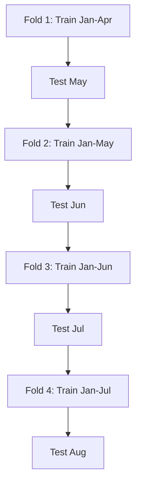

# M11 — Instructor Guide: Time Series Foundations
> 90-minute session | Datasets: air_quality_daily.csv, sales_monthly.csv | **Optional extension**

---

## Learning Objectives

By end of session, students can:
1. Parse datetime columns reliably and avoid common parsing pitfalls `[McKinney Ch11 p.350–360]`
2. Use a `DatetimeIndex` for fast date-range slicing and partial-string indexing `[McKinney Ch11 p.360–370]`
3. Resample a time series to a different frequency (upsample / downsample) and choose between `asfreq` and `resample` `[McKinney Ch11 p.380–395]`
4. Compute rolling and expanding window statistics for trend smoothing `[McKinney Ch11 p.395–410]`
5. Reason about time-zone conversions and daylight-saving traps `[McKinney Ch11 p.370–380]`
6. Split a time series for train/test **chronologically** — never with a random shuffle `[Expert + Géron Ch15 reference]`

---

## Session Structure

| Time | Activity | Lesson IDs |
|------|----------|------------|
| 0:00–0:10 | Why time series breaks every assumption from M4–M10 (independence, exchangeability) | — |
| 0:10–0:25 | **L11.1 + L11.2** — Parsing datetimes; DatetimeIndex slicing live demo | L11.1, L11.2 |
| 0:25–0:45 | **L11.3** — Resample patterns; `asfreq` vs `resample`; aggregation choice | L11.3 |
| 0:45–1:00 | **L11.4** — Rolling vs expanding windows; trend vs noise | L11.4 |
| 1:00–1:15 | **L11.5** — Time-zone reasoning + DST trap demo (`[AI-OFF]` cell) | L11.5 |
| 1:15–1:30 | **L11.6** — Chronological train/test; `TimeSeriesSplit`; look-ahead bias | L11.6 |

---

## Key Concepts (with Lesson IDs)

### L11.1 — Parsing pitfalls `[McKinney Ch11 p.350–360]`

#### Why parsing fails in real files
Datetime parsing goes wrong because real datasets rarely arrive as a single clean standard. A column named `date` may mix slashes and dashes, include timestamps in some rows, leave timezone suffixes in others, and hide blank strings that look harmless until conversion time. The parser is then forced to answer a question the data producer never answered clearly: what exactly does each string mean?

A second problem is that parsing is not only about syntax; it is also about semantics. The string `03/04/2024` is a valid date in more than one convention, so a parser can succeed technically while still producing the wrong calendar day. That kind of mistake is dangerous because it does not throw an error, and the pipeline keeps running with silently corrupted time information.

In practice, datetime work is safer when students treat parsing as a data-quality step rather than a one-line cleanup. The goal is not merely to "make pandas accept the column" but to prove that the resulting timestamps match the meaning of the source system. That is why robust parsing always pairs conversion with validation.

#### The datetime-as-string problem
A string column can look sorted even when its timeline is broken. Lexicographic ordering compares characters left to right, so inconsistent zero-padding or mixed formats can place February after October or mix dates from different years in surprising ways. When students group, slice, or merge on these strings, they are asking text rules to behave like calendar rules.

A quick visual makes the trap obvious. The values below are legitimate strings, but their alphabetical order does not match chronological order because the month and day portions are formatted inconsistently.

```text
String order (alphabetical):
2023-1-15
2023-10-01
2023-2-01

True time order:
2023-01-15
2023-02-01
2023-10-01
```

The broader lesson is that a date-looking value is not yet a datetime value. Until pandas stores it as `datetime64[ns]`, the column cannot fully support time-aware indexing, resampling, rolling windows, or reliable comparisons. Converting early prevents subtle downstream errors from compounding.

#### Prefer explicit parsing with `pd.to_datetime(..., format=...)`
`pd.to_datetime()` is the standard entry point because it converts strings into pandas timestamps efficiently and integrates with missing-value handling. When the source format is known, adding `format=` tells pandas exactly how to read each row, which reduces ambiguity and is often faster than general inference. For a column like `2024-07-16`, the safe instruction is `format='%Y-%m-%d'`, not "please guess."

This matters especially in production pipelines because explicit formats document an assumption in code. Anyone reviewing the notebook can see the intended layout immediately: four-digit year, two-digit month, two-digit day. If the incoming data changes shape, the conversion step surfaces that mismatch instead of quietly inventing an interpretation.

A worked example shows the difference. Suppose a supplier promises `YYYY-MM-DD`; then the parsing step should state that promise directly and inspect failures immediately.

```python
import pandas as pd

raw = pd.DataFrame({
    'order_date': ['2024-01-05', '2024-01-06', '2024-13-01']
})

parsed = pd.to_datetime(
    raw['order_date'],
    format='%Y-%m-%d',   # exact expected layout
    errors='coerce'      # impossible dates become NaT instead of crashing
)

raw['order_date_parsed'] = parsed
print(raw)
```

With this approach, `2024-13-01` becomes `NaT`, which is exactly what we want during cleaning. The bad value is exposed, the valid rows survive, and the team can decide whether to fix, drop, or request a corrected extract. Explicit parsing turns hidden quality problems into visible ones.

#### ISO 8601, ambiguous dates, and `errors=` modes
ISO 8601 is the friendliest format for data systems because it sorts well, reads well, and usually avoids regional ambiguity. Strings such as `2024-09-03` or `2024-09-03T14:30:00Z` encode the year first, then month, then day, which makes both humans and software less likely to confuse fields. Whenever a team controls an export format, ISO 8601 is usually the best default choice.

Ambiguous formats need extra caution. The value `01/02/2024` could mean January 2 or February 1, and neither interpretation is obviously wrong just from the string alone. Students should either specify the matching `format=` or, when the file is consistently day-first, use an explicit convention such as `dayfirst=True` and explain that decision in comments.

The `errors=` parameter controls how pandas behaves when parsing fails. `errors='raise'` stops immediately and is useful when failure should abort the pipeline; `errors='coerce'` converts bad rows to `NaT` so they can be audited; `errors='ignore'` preserves the original values but usually postpones trouble rather than solving it. A good classroom heuristic is simple: use `raise` for strict ingestion tests and `coerce` for exploratory cleaning.

#### Epoch timestamps need a declared unit
Unix or epoch timestamps are numeric counts measured from `1970-01-01 00:00:00 UTC`. They are not self-describing because the raw number might represent seconds, milliseconds, microseconds, or nanoseconds. If students forget the unit, pandas may still parse the column, but the result can land decades away from the intended time period.

The safest pattern is to verify the magnitude, choose the unit explicitly, and then check a few known rows. A value around `1_700_000_000` is plausible in seconds for recent years, while `1_700_000_000_000` suggests milliseconds. That rough scale check is often enough to catch a unit mistake before it contaminates an analysis.

Here is a short step-by-step example. The code declares `unit='s'`, then validates the resulting year range so the conversion is not trusted blindly.

```python
events = pd.DataFrame({
    'event_ts': [1704067200, 1704153600, 999999999999]
})

events['event_time'] = pd.to_datetime(
    events['event_ts'],
    unit='s',          # these integers are seconds since the Unix epoch
    errors='coerce',   # absurd values become NaT
    utc=True           # keep the reference frame explicit
)

print(events[['event_ts', 'event_time']])
print(events['event_time'].dt.year)
```

If the years look wildly unrealistic, the first question should be whether the unit was wrong. Students should learn to debug timestamp scale before they start debugging models built on top of those timestamps.

#### `NaT` detection, filling, and a robust parsing pipeline
`NaT` means "Not a Time" and plays the same role for datetimes that `NaN` plays for numbers. Once parsing uses `errors='coerce'`, every invalid or missing datetime lands in a form that pandas can count, filter, and fill systematically. That makes bad rows measurable instead of anecdotal.

A simple validation metric is the bad-date rate, which should be checked before any downstream analysis. Inline math keeps the idea concrete: $\text{bad\_rate} = \frac{\#\text{NaT rows}}{\#\text{all rows}}$. When the rate is non-trivial, students should inspect patterns in the failures rather than immediately filling them.

$$
\text{bad\_rate} = \frac{\sum_i \mathbf{1}(\text{parsed}_i = \text{NaT})}{n}
$$

A robust pipeline often has four explicit steps: normalize raw strings, parse with an explicit rule, audit `NaT` rows, and only then decide whether to fill or drop them. Filling can be reasonable when the dataset contains known placeholders that should inherit context, but it is a business decision, not a parser decision.

```python
import pandas as pd

raw = pd.DataFrame({
    'raw_date': ['2024-01-01', '2024-01-02', '01/03/2024', '', None, '2024-01-05'],
    'event_ts': [1704067200, 1704153600, 1704240000, 1704326400, None, 1704499200]
})

# 1) Normalize obvious placeholders before parsing.
raw['raw_date'] = raw['raw_date'].replace({'': pd.NA, 'NA': pd.NA, 'null': pd.NA})

# 2) Parse the primary string column with an explicit expected format.
raw['parsed_date'] = pd.to_datetime(
    raw['raw_date'],
    format='%Y-%m-%d',
    errors='coerce'
)

# 3) Parse the epoch fallback using a declared unit.
raw['parsed_from_epoch'] = pd.to_datetime(
    raw['event_ts'],
    unit='s',
    errors='coerce',
    utc=True
).dt.tz_convert(None)   # drop timezone only if the analysis truly wants naive UTC labels

# 4) Fill missing primary dates from the validated fallback source.
raw['final_date'] = raw['parsed_date'].fillna(raw['parsed_from_epoch'])

# 5) Validate the result before trusting it.
bad_mask = raw['final_date'].isna()
out_of_range = raw['final_date'].lt('2020-01-01') | raw['final_date'].gt('2030-12-31')

summary = {
    'rows': len(raw),
    'nat_after_fill': int(bad_mask.sum()),
    'out_of_range_rows': int(out_of_range.fillna(False).sum())
}

print(raw)
print(summary)
print(raw.loc[bad_mask | out_of_range.fillna(False), ['raw_date', 'event_ts', 'final_date']])
```

That pipeline is robust because it never assumes success silently. It produces a final parsed column, preserves evidence about where values came from, and reports rows that still need human attention. In time-series work, the best parsing code is not the shortest code; it is the code that makes wrong dates hard to miss.

#### Common Mistakes
Students often think parsing is finished as soon as pandas returns something that looks like a date. In reality, most parsing bugs come from unverified assumptions rather than syntax errors. The checklist below helps catch the most common failures before they spread into indexing, resampling, or modeling.

Another useful habit is to separate "what the parser did" from "what the data meant." A column can contain valid timestamps and still be semantically wrong because the wrong locale, wrong unit, or wrong timezone rule was applied. That is why each mistake below pairs a symptom with a hidden assumption.

Use these bullets as a review list after every first pass through a new file:
- Leaving the column as `object` or `string` and assuming it will behave like time.
- Trusting automatic inference on ambiguous values such as `01/02/2024`.
- Forgetting `unit='s'` or confusing seconds with milliseconds for epoch timestamps.
- Using `errors='ignore'` and accidentally carrying raw strings deeper into the pipeline.
- Filling `NaT` immediately without first counting, filtering, and explaining the failures.
- Skipping range checks, so impossible years survive unnoticed.

If students can explain why each mistake is dangerous, they usually understand parsing at a level deeper than memorizing a single pandas function call.

#### Practice Questions
Parsing skills improve when students justify their assumptions, not when they only memorize parameters. The questions below are designed to force explanation: what format is expected, what ambiguity remains, and what validation would prove the conversion worked? Encourage students to answer in plain language before writing code.

A strong answer should mention both the conversion rule and the audit rule. In other words, students should say how they will parse the data and how they will verify that the parsed values are believable. That habit mirrors how robust data engineering is done in practice.

Try these prompts:
1. You receive a column containing `2024-01-05`, `2024-01-06`, and `2024-15-01`. Which `pd.to_datetime` arguments would you use, and what should happen to the invalid row?
2. Why is ISO 8601 usually safer than `MM/DD/YYYY` when files move between teams in different countries?
3. A numeric timestamp column contains values near `1_700_000_000_000`. What unit do you suspect, and how would you validate that suspicion?
4. When is `errors='raise'` a better choice than `errors='coerce'`?
5. Suppose 8% of rows became `NaT` after parsing. What would you inspect before deciding whether to drop or fill those rows?

### L11.2 — DatetimeIndex `[McKinney Ch11 p.360–370]`

#### Why `DatetimeIndex` is special
A `DatetimeIndex` is not just a prettier row label; it is pandas' way of teaching the DataFrame what "time order" means. Once the index is datetime-aware, pandas unlocks partial string slicing, calendar-based grouping, rolling windows, resampling, and many convenience attributes. The index becomes part of the analytical language, not just a storage location.

This matters because many time-series operations are defined relative to the axis itself. A rolling window over row numbers answers a different question from a rolling window over days, and a slice like `df.loc['2024-03']` only makes sense when the index knows how to interpret calendar strings. A plain `RangeIndex` cannot provide that behavior, even if one of the columns happens to contain dates.

Students should therefore see `DatetimeIndex` as a structural choice. Moving the datetime column into the index says, "time is the primary coordinate of this table." Once that coordinate is in place, the rest of pandas becomes much more expressive.

#### Building the index with `set_index` or `pd.DatetimeIndex`
The most common construction pattern is straightforward: parse the date column first, then call `set_index('date')`. This is readable, chainable, and keeps the original column name as the index name, which helps later when plots, merges, or resets are involved. If the column is already parsed, this is usually the cleanest approach.

A second pattern builds the index explicitly with `pd.DatetimeIndex(df['date'])`. That style is useful when students want to preserve the original column temporarily or when the source column needs to be transformed before assignment. The important part is not the syntax difference; it is that the resulting index must truly contain datetime values, not strings.

After either approach, the next command should usually be `sort_index()`. Many time-based operations assume chronological order, and a shuffled `DatetimeIndex` can make slices appear incomplete or produce confusing results. Time-aware code is most trustworthy when the table announces its temporal order explicitly.

```python
import pandas as pd

sales = pd.DataFrame({
    'date': ['2024-01-03', '2024-01-01', '2024-01-02'],
    'revenue': [140, 100, 120]
})

sales['date'] = pd.to_datetime(sales['date'], format='%Y-%m-%d')

# Option 1: promote the parsed column into the index.
by_set_index = sales.set_index('date').sort_index()

# Option 2: build a DatetimeIndex directly.
by_constructor = sales.copy()
by_constructor.index = pd.DatetimeIndex(by_constructor['date'])
by_constructor = by_constructor.drop(columns='date').sort_index()

print(by_set_index)
print(by_constructor)
```

The two results are functionally similar, and both are vastly more useful than leaving the dates in an unsorted text column. The lesson is to choose one idiom, apply it consistently, and always verify that the index dtype really is datetime.

#### Partial string indexing changes how slicing feels
One of the best reasons to use `DatetimeIndex` is partial string indexing. With a sorted datetime index, pandas interprets strings like `2024`, `2024-03`, or `2024-03-15` as calendar selections rather than literal labels. That makes code read almost like plain English: "give me March 2024" or "give me everything in 2024."

This feature is especially valuable in exploratory analysis because it shortens common time queries dramatically. Instead of building boolean masks with separate year and month conditions, students can ask for a year, month, or day directly on the index. The code is shorter, but more importantly, the intent is clearer.

There is a precondition, though: partial string indexing is safest on a chronologically sorted `DatetimeIndex`. If the index is unsorted, pandas may return warnings, partial results, or slower execution depending on the operation. The convenience comes from teaching pandas the right temporal structure first.

```python
inventory = pd.DataFrame({
    'date': pd.date_range('2024-01-01', periods=120, freq='D'),
    'stock': range(120)
}).set_index('date').sort_index()

print(inventory.loc['2024'])                    # all rows in 2024
print(inventory.loc['2024-02'])                 # all rows in February 2024
print(inventory.loc['2024-02-10':'2024-02-15']) # date range slice
```

Students usually feel the power of `DatetimeIndex` the first time they realize that the strings in `.loc[...]` are not fragile text matches. They are time-aware selectors, and that changes how naturally one can navigate a series.

#### Calendar attributes become instant features
A `DatetimeIndex` exposes calendar pieces directly through the `.index` accessors, which is helpful both for explanation and for feature engineering. Students can extract `.year`, `.month`, `.day`, `.dayofweek`, `.quarter`, and `.is_month_end` without writing custom parsing logic. Those attributes often reveal weekly, monthly, or quarterly patterns that would remain hidden in raw timestamps.

This is especially useful when models need calendar context. Retail demand may spike at month end, call volumes may differ by weekday, and quarterly reporting periods may shape operational behavior. By deriving features from the index, students keep the time logic centralized instead of scattering duplicate parsing code across the notebook.

Feature extraction should still be deliberate rather than automatic. The fact that an attribute exists does not guarantee it is analytically meaningful, and some calendar signals can leak future knowledge if used carelessly in forecasting workflows. Good feature engineering begins with a domain reason, not just an available accessor.

```python
calendar = inventory.copy()
calendar['year'] = calendar.index.year
calendar['month'] = calendar.index.month
calendar['day'] = calendar.index.day
calendar['dayofweek'] = calendar.index.dayofweek   # Monday=0, Sunday=6
calendar['quarter'] = calendar.index.quarter
calendar['is_month_end'] = calendar.index.is_month_end

print(calendar.head())
```

Once students see these columns beside the original measurements, many seasonal ideas become easier to test. The index stops being invisible infrastructure and starts acting like a source of interpretable features.

#### Worked example: from date column to rich time slicing
Consider a small daily traffic dataset that arrives with the date still in a column. The first job is to parse the column, set it as the index, and sort it. Only after those steps is the table ready for fast and readable time-based selection.

Now imagine the analyst wants three views: the full year, one month, and a narrow date range around a maintenance event. With a `DatetimeIndex`, those three questions differ only in the string passed to `.loc[...]`. That consistency is why experienced pandas users almost always promote the time column into the index for time-series work.

The example below shows the full workflow step by step. Read the comments closely: they explain not only what the code does but why the order of operations matters.

```python
traffic = pd.DataFrame({
    'date': [
        '2024-03-29', '2024-03-30', '2024-03-31',
        '2024-04-01', '2024-04-02', '2024-04-03'
    ],
    'visits': [820, 790, 910, 870, 860, 845]
})

# Parse the date strings before touching the index.
traffic['date'] = pd.to_datetime(traffic['date'], format='%Y-%m-%d')

# Promote the parsed column to the index and sort chronologically.
traffic = traffic.set_index('date').sort_index()

# Partial string indexing works because the index is datetime-aware.
all_2024 = traffic.loc['2024']
april_only = traffic.loc['2024-04']
maintenance_window = traffic.loc['2024-03-30':'2024-04-02']

print(all_2024)
print(april_only)
print(maintenance_window)
```

A useful teaching move is to ask students how they would write the same query without a `DatetimeIndex`. The contrast makes the value of the structure obvious: fewer manual masks, less room for off-by-one errors, and code that reads like a calendar question rather than a string puzzle.

#### Periods and timestamps answer different questions
A `Timestamp` represents a specific moment such as `2024-03-31 00:00:00`. A `Period`, by contrast, represents a span such as the whole month `2024-03` or the whole quarter `2024Q1`. The distinction matters because some analyses care about an instant, while others care about the bucket itself.

Students often meet this distinction when monthly data is stored with a day like the first or last day of the month. That timestamp is convenient, but the business meaning may really be "March as a month" rather than "March 31 at midnight." `PeriodIndex` makes that span-based meaning explicit.

A good rule is simple: use `Timestamp` when exact instants and precise ordering matter; use `Period` when the dataset is inherently monthly, quarterly, or yearly and the unit of analysis is the period itself. Converting between the two is possible, but the analyst should be clear about which meaning is primary.

```python
monthly = pd.DataFrame({
    'month': ['2024-01', '2024-02', '2024-03'],
    'sales': [1000, 1100, 980]
})

monthly['period'] = pd.PeriodIndex(monthly['month'], freq='M')
monthly['timestamp_start'] = monthly['period'].dt.to_timestamp(how='start')
monthly['timestamp_end'] = monthly['period'].dt.to_timestamp(how='end')

print(monthly)
```

Seeing both representations side by side helps students ask a better question: am I modeling a point in time or a reporting period? That conceptual distinction prevents many downstream mismatches.

#### Common Mistakes
Most `DatetimeIndex` mistakes are structural, not syntactic. Students often write code that technically runs while the table still behaves like a generic DataFrame because the index was never truly prepared for time-aware operations. The review below focuses on those structural slips.

Another pattern is forgetting that convenience methods depend on ordering and type. A datetime-looking label is not enough; pandas needs an actual sorted `DatetimeIndex` to deliver the best slicing and resampling behavior. If students remember that dependency, most errors become easier to diagnose.

Watch for these common problems:
- Setting the index before parsing, leaving string labels instead of datetime labels.
- Forgetting to call `sort_index()` after building the `DatetimeIndex`.
- Using partial string indexing on an unsorted index and trusting the result blindly.
- Extracting calendar attributes from a plain column while ignoring the index structure.
- Treating monthly observations as exact timestamps when a `PeriodIndex` would better express the data's meaning.

A good quick check is `df.index.dtype` plus a glance at the first few labels. If the index is datetime and sorted, many higher-level pandas features will behave as expected.

#### Practice Questions
Students learn `DatetimeIndex` best when they translate calendar questions into table operations. The questions below are designed to reinforce that the index is a coordinate system, not just a display choice. Encourage answers that mention both the required setup and the final slice or feature.

A strong response should explain why the index needs to be parsed and sorted before the later operations become trustworthy. That explanation matters more than memorizing the exact method order, because it transfers to new datasets and larger projects.

Try these prompts:
1. Why is `df.loc['2024-06']` only meaningful after the DataFrame has a sorted `DatetimeIndex`?
2. Show two ways to create a `DatetimeIndex` from a parsed `date` column and explain why both are valid.
3. Which index attributes would you extract to study weekday effects and month-end behavior?
4. When would a `PeriodIndex` be a better fit than a `DatetimeIndex`?
5. A student says, "I can keep the dates in a column and nothing changes." What pandas capabilities would they lose or make more awkward?

### L11.3 — Resampling `[McKinney Ch11 p.380–395]`

#### Resampling changes the question as well as the frequency
Resampling means asking the same process to speak at a different temporal resolution. When we move from hourly readings to daily summaries, we are no longer describing individual hours; we are describing day-level behavior built from those hours. The transformation is analytical, not merely cosmetic.

That is why resampling always begins with a frequency question: what should one row mean after the change? A daily average temperature, a daily sales total, and a daily closing price are all legitimate day-level summaries, but they are not interchangeable. The correct answer depends on the physical or business meaning of the original measurement.

In pandas, resampling works best once the series has a sorted `DatetimeIndex`. The index tells pandas where each observation sits on the calendar so it can construct new bins cleanly. Without that temporal structure, frequency conversion becomes much more manual and much easier to misinterpret.

#### Downsampling requires deliberate aggregation
Downsampling combines many observations into fewer, larger periods. The key choice is the aggregation rule because that rule determines what information survives the compression. For a flow variable like sales, `.sum()` often preserves meaning; for a state variable like temperature or utilization, `.mean()` or `.last()` may be more appropriate.

It helps students to tie each aggregation to a sentence. If the sentence is "How many units did we sell this week?" then summing is natural. If the sentence is "What was the average particulate concentration this day?" then averaging is the better summary. Aggregation should follow the semantics of the measurement.

A compact mathematical view makes the distinction explicit. For daily means, one common summary is $\bar{x}_d = \frac{1}{n_d}\sum_{i=1}^{n_d} x_{di}$, while for daily totals the summary is simply $S_d = \sum_{i=1}^{n_d} x_{di}$. Choosing between those formulas is choosing what the resampled row is supposed to represent.

$$
\bar{x}_d = \frac{1}{n_d}\sum_{i=1}^{n_d} x_{di}, \qquad S_d = \sum_{i=1}^{n_d} x_{di}
$$

Pandas supports these choices directly through methods like `.mean()`, `.sum()`, `.first()`, `.last()`, and `.ohlc()`. The syntax is easy; the thinking is the important part.

#### Frequency strings define the new calendar bins
Common frequency strings include `s` for seconds, `min` for minutes, `h` for hours, `D` for calendar days, `W` for weeks, `ME` for month end, `QE` for quarter end, and `YE` for year end. These codes tell pandas how to partition the timeline into new bins before any aggregation occurs. Students should read them as calendar instructions, not just abbreviations.

Different frequencies imply different boundary choices. Weekly bins often end on a particular weekday, while `ME`, `QE`, and `YE` anchor periods at month, quarter, and year ends. If students ignore the bin definition, they may interpret a resampled row correctly at the wrong boundary.

An ASCII sketch helps show what resampling is doing under the hood. The observations do not disappear; pandas groups them into intervals and then summarizes each interval.

```text
Hourly data:  |01|02|03|04|05|06|07|08| ... |24|
Daily bin:    |---------------- Day 1 ----------------|
Monthly bins: |----------- Jan -----------|-- Feb --|
```

Once students picture bins explicitly, it becomes easier to reason about whether a given frequency code matches the reporting question they actually want to answer.

#### Upsampling creates timestamps before it creates information
Upsampling increases frequency, such as going from daily to hourly data. The crucial point is that pandas can create the new timestamps automatically, but it cannot invent the missing intermediate measurements with certainty. The resampled object therefore contains gaps unless the analyst chooses a filling rule.

Different fill strategies encode different assumptions. Forward fill says the last observed value remains in effect until the next observation; backward fill uses the next known value retroactively; interpolation estimates a smooth path between known points. None of these is universally correct, so students should describe the assumption out loud before applying it.

A good worked example starts with a sparse daily series and asks what an hourly version should mean. If the value is a status level that stays constant until updated, forward fill is plausible. If the value is a gradually changing physical measurement, interpolation may be more defensible.

```python
import pandas as pd

power = pd.DataFrame({
    'time': pd.date_range('2024-01-01', periods=4, freq='D'),
    'load': [100, 130, 120, 160]
}).set_index('time')

hourly_grid = power.resample('h').asfreq()             # create hourly timestamps with gaps
hourly_ffill = power.resample('h').ffill()             # carry last known value forward
hourly_interp = power.resample('h').interpolate()      # estimate values between days

print(hourly_grid.head(10))
print(hourly_ffill.head(10))
print(hourly_interp.head(10))
```

Students should compare the outputs line by line and ask which story each method tells about the unseen hours. That question is more important than memorizing the method names.

#### `origin=` controls alignment when bins should start somewhere specific
The `origin` parameter matters when the natural bin boundaries in the data do not line up with the default calendar boundaries pandas would choose. For example, a machine may report every hour starting at 00:30 rather than exactly on the hour, or a custom operational day may begin at 06:00. In those cases, alignment becomes part of the meaning of the resample.

Without explicit alignment, two analysts can compute different summaries from the same raw data simply because their bins start in different places. That kind of mismatch is subtle and easy to miss in group work. Teaching `origin=` helps students see that resampling is partly about where periods begin, not only how long they last.

The practical habit is to check whether the first few bins match the real reporting cycle. If they do not, set the origin deliberately and verify the boundaries. Good resampling code explains its alignment choices rather than leaving them implicit.

```python
sensor = pd.DataFrame({
    'time': pd.to_datetime([
        '2024-01-01 00:30', '2024-01-01 01:30', '2024-01-01 02:30', '2024-01-01 03:30'
    ]),
    'value': [10, 12, 11, 13]
}).set_index('time')

aligned = sensor.resample('2h', origin='start_day').mean()
custom = sensor.resample('2h', origin=pd.Timestamp('2024-01-01 00:30')).mean()

print(aligned)
print(custom)
```

Once students see the two outputs side by side, they understand that bin alignment is not an implementation detail. It changes the summary itself.

#### Worked example: hourly data to daily and monthly summaries
Suppose we start with hourly site metrics containing demand, revenue, and price. The demand variable is additive within a day, revenue is also additive, and price is often more interesting as an average or as an OHLC-style profile over a period. That means one resample can legitimately use multiple aggregations at once.

The daily summary might ask for total demand, total revenue, average price, first price, last price, and full OHLC price behavior. A monthly summary might then roll those daily values up again, perhaps summing totals while averaging the already-daily average price. This layered workflow is common in operational dashboards.

The example below demonstrates the full path from hourly data to daily and monthly outputs. Notice how the code comments tie each aggregation to its meaning rather than treating all columns identically.

```python
import numpy as np
import pandas as pd

hourly = pd.DataFrame({
    'time': pd.date_range('2024-01-01 00:00', periods=24 * 45, freq='h'),
    'demand': np.random.randint(20, 80, size=24 * 45),
    'revenue': np.random.randint(200, 800, size=24 * 45),
    'price': np.random.uniform(8.0, 15.0, size=24 * 45).round(2)
}).set_index('time').sort_index()

# Daily resample: additive measures are summed; price is summarized several ways.
daily = hourly.resample('D').agg({
    'demand': 'sum',        # total demand for the day
    'revenue': 'sum',       # total revenue for the day
    'price': ['mean', 'first', 'last', 'max', 'min']
})

# A separate OHLC summary can be useful for price-like series.
daily_ohlc = hourly['price'].resample('D').ohlc()

# Monthly resample from the original hourly data using month-end bins.
monthly = hourly.resample('ME').agg({
    'demand': 'sum',        # total monthly demand
    'revenue': 'sum',       # total monthly revenue
    'price': 'mean'         # mean hourly price across the month
})

# Quarterly and yearly examples use quarter-end and year-end bins.
quarterly = hourly['revenue'].resample('QE').sum()
yearly = hourly['revenue'].resample('YE').sum()

print(daily.head())
print(daily_ohlc.head())
print(monthly.head())
print(quarterly.head())
print(yearly.head())
```

Students should read the resulting tables with words: "daily demand total," "daily first price," "month-end total revenue," and so on. When they can narrate each column, they usually understand why the aggregation choices make sense.

#### Common Mistakes
Resampling errors usually come from choosing a mathematically valid operation that is semantically wrong for the variable. Because pandas makes resampling concise, students can produce polished but misleading outputs very quickly. The goal of this review section is to slow that process down just enough for reasoning to catch up.

Another recurring issue is forgetting that resampling depends on the index and the bin definition. A correct aggregation on the wrong boundaries is still the wrong answer. Students should therefore check frequency, alignment, and variable meaning together.

Watch for these common mistakes:
- Using `.mean()` by habit even when the variable is a count or total that should be summed.
- Upsampling and forgetting that the new timestamps begin as missing values rather than real observations.
- Applying forward fill or interpolation without explaining the assumption about what happened between observations.
- Ignoring frequency codes such as `ME`, `QE`, and `YE`, then misreading what the resulting periods represent.
- Forgetting that `origin=` can change bin alignment and therefore change the summary.
- Treating OHLC as appropriate for every numeric series rather than for price-like or path-dependent measurements.

If students can defend both the frequency and the aggregation in plain language, they are usually resampling for the right reason rather than because the method was available.

#### Practice Questions
Resampling becomes intuitive when students can translate from a verbal business question to a frequency and aggregation pair. The prompts below are designed to force that translation explicitly. Encourage students to answer first with words and only then with code.

A high-quality answer should name the target frequency, justify the aggregation, and mention whether any alignment or filling decision is needed. That three-part habit makes resampling decisions much more transparent in collaborative work.

Try these prompts:
1. You have hourly rainfall measurements. When resampling to daily data, should you use `sum`, `mean`, `first`, or `last`, and why?
2. What is the difference between `resample('h').asfreq()` and `resample('h').interpolate()` on a daily series?
3. Why might `origin=` matter for data collected on a custom operational cycle rather than on exact calendar boundaries?
4. Give one realistic use for each of these frequency strings: `D`, `W`, `ME`, `QE`, `YE`, `min`, and `s`.
5. When would `.ohlc()` be informative, and when would it be a poor choice?

### L11.4 — Rolling and expanding windows `[McKinney Ch11 p.395–410]`

#### Rolling windows are local summaries of recent history
A rolling window computes a statistic over a fixed-size slice that moves across the series. If the window is 7 days wide, each point summarizes the current day together with the six days immediately before it. This makes rolling methods especially useful for smoothing noise while keeping the focus on local behavior.

The key idea is locality. A rolling average does not care equally about the entire past; it cares about the most recent observations inside the chosen window. That makes it good for detecting short-term trend changes, temporary shocks, and recurring patterns that would be diluted in a full-history average.

Students should read `rolling(window=7).mean()` as a sentence: "for each day, compute the mean of the last seven days." Once that sentence is clear, the rest of the rolling API becomes much easier to reason about.

#### Window size, stride, and start-of-series `NaN`s
Window size determines how much recent history enters each calculation. A small window reacts quickly but remains noisy; a large window is smoother but slower to adapt. Choosing the window therefore reflects an analytical trade-off between responsiveness and stability.

Stride asks how often we keep the rolling result. Many workflows compute a statistic at every timestamp, but some only inspect every 7th point or every month-end point. Even when pandas computes the full rolling series, students can create a strided view afterward with slicing such as `.iloc[::7]` to reduce overlap in the reported outputs.

At the beginning of the series, a full window does not yet exist, so the first values are often missing. That behavior is a feature, not a bug: it marks places where there is not enough history to compute the requested statistic honestly. Students should expect these start-of-series `NaN`s rather than trying to hide them immediately.

```text
Day:      1   2   3   4   5   6   7   8
7-day MA: NaN NaN NaN NaN NaN NaN  m7  m8
```

That simple visual reinforces an important idea: the first complete 7-day average can only appear on day 7. Any earlier value would be a partial window and should be labeled as such.

#### A 7-day moving average answers a different question from a 30-day moving average
A 7-day moving average is often used when daily data contains strong weekday effects or short-term noise. It preserves relatively recent changes while smoothing away some day-to-day volatility. In operational contexts, it often behaves like a "current trend" line.

A 30-day moving average tells a slower story. Because it averages over a much longer window, it responds less dramatically to spikes and dips and is therefore better suited to broad trend assessment. The cost of that smoothness is delay: abrupt changes appear later in the 30-day series than in the 7-day series.

Students should not ask which window is universally better. They should ask which timescale matches the decision they are trying to support. For staffing next week, a short window may be appropriate; for understanding long-run demand drift, a longer window may be more informative.

#### `min_periods` and `win_type` shape how smoothing behaves
`min_periods` controls how many non-missing observations must be present before pandas returns a value. If `min_periods=7` in a 7-day window, the first six results are missing because the window is incomplete. If `min_periods=1`, pandas emits early partial-window means, which may be useful for visualization but should be interpreted carefully.

Weighted windows refine this idea further. With `win_type`, pandas can apply window shapes such as triangular or Gaussian weights, which emphasize some observations more than others. That means a rolling statistic can encode not only how many observations matter, but also how the importance declines across the window.

A helpful conceptual comparison is this: an ordinary moving average gives equal weight to all points in the window, while a weighted window says recent or central observations deserve more influence. The analyst should choose that weighting only when the underlying story supports it.

```python
import pandas as pd

series = pd.Series(
    [12, 13, 11, 14, 16, 18, 17, 19, 21, 20],
    index=pd.date_range('2024-01-01', periods=10, freq='D')
)

equal_weight = series.rolling(window=3, min_periods=3).mean()
# Requires SciPy-backed window support in pandas environments where win_type is enabled.
triangular = series.rolling(window=3, min_periods=3, win_type='triang').mean()

print(equal_weight)
print(triangular)
```

The exact weighting formula matters less than the habit of stating what the weighting implies. Students should be able to say whether they want equal smoothing, central emphasis, or some other pattern and why.

#### Expanding windows accumulate everything seen so far
An expanding window starts at the first observation and grows as new data arrives. Unlike a rolling window, it never forgets the past. This makes it useful for cumulative means, running totals, and any setting where the summary should incorporate all available history.

Because the window keeps expanding, early observations continue to influence the statistic forever, though their relative weight decreases over time. That creates a much more stable line than a short rolling average, but it also makes the series slower to reflect structural changes. Expanding statistics are therefore good for long-run context, not for sharp local detection.

A good mental model is that rolling windows answer "what has happened recently?" while expanding windows answer "what has happened on average up to now?" The two methods complement each other because they look at the same data through different temporal lenses.

```python
running_mean = series.expanding(min_periods=1).mean()
running_sum = series.expanding(min_periods=1).sum()

print(running_mean)
print(running_sum)
```

When students compare an expanding mean to a rolling mean on the same chart, they can usually see immediately which one is local and which one is cumulative.

#### Exponentially weighted means keep memory but favor the recent past
An exponentially weighted mean, or EWM, occupies a middle ground between rolling and expanding approaches. Like an expanding calculation, it can incorporate the full past; like a rolling calculation, it emphasizes recency. The influence of older observations decays rather than disappearing abruptly at a fixed window boundary.

This decay can be described mathematically. One common recursive form is $s_t = \alpha x_t + (1-\alpha)s_{t-1}$, where $0 < \alpha \le 1$ controls how quickly the series reacts. Larger $\alpha$ values respond faster to new information; smaller values produce smoother, slower adjustments.

$$
s_t = \alpha x_t + (1-\alpha)s_{t-1}
$$

The comparison below puts a 7-day moving average, a 30-day moving average, and an EWM in one table. The point is not to crown one winner, but to show how each method encodes a different memory of the past.

```python
import numpy as np
import pandas as pd

np.random.seed(7)
traffic = pd.DataFrame({
    'visitors': np.random.randint(180, 260, size=90)
}, index=pd.date_range('2024-01-01', periods=90, freq='D'))

traffic['ma_7'] = traffic['visitors'].rolling(window=7, min_periods=7).mean()
traffic['ma_30'] = traffic['visitors'].rolling(window=30, min_periods=30).mean()
traffic['ewm_alpha_0_2'] = traffic['visitors'].ewm(alpha=0.2, adjust=False).mean()

# Optional stride for reporting every 7th day after computing the full series.
comparison_every_week = traffic.iloc[::7][['visitors', 'ma_7', 'ma_30', 'ewm_alpha_0_2']]

print(traffic.head(35))
print(comparison_every_week.head())
```

Students should read the first 35 rows and notice three things: the early `NaN`s for full windows, the faster reaction of the 7-day average, and the smoother but always-defined EWM line. That side-by-side view makes the trade-offs tangible.

#### Common Mistakes
Window methods are attractive because they produce clean trend lines, but clean is not the same as correct. Most mistakes arise when students choose a window mechanically without connecting it to the timing of the decision or the structure of the series. This section is meant to slow that reflex down.

Another frequent issue is forgetting that missing early values are informative. Start-of-series `NaN`s and differences between local and cumulative summaries are not nuisances; they are clues about how much history the method requires and remembers. Students should learn to interpret those clues rather than suppress them.

Watch for these common problems:
- Choosing a window size by habit without explaining what timescale it represents.
- Interpreting start-of-series `NaN`s as errors instead of as incomplete-window indicators.
- Using `min_periods=1` and forgetting that the earliest values are partial-window summaries.
- Comparing 7-day and 30-day averages as if they answer the same analytical question.
- Applying `win_type` without understanding the weighting assumption it introduces.
- Treating EWM as "just another moving average" instead of a method with decaying memory.

If students can explain the memory pattern of each method—fixed, cumulative, or exponentially decaying—they usually understand the key conceptual differences.

#### Practice Questions
Rolling, expanding, and exponentially weighted methods become clearer when students map each tool to a decision horizon. The prompts below ask them to justify that mapping explicitly. Encourage answers in words first, then in code.

A strong answer should mention three elements: the statistic being computed, how much past data it uses, and why that memory pattern matches the problem. Those explanations matter more than recalling a parameter name from memory.

Try these prompts:
1. Why does a 7-day moving average usually react faster than a 30-day moving average?
2. What does `min_periods` change at the beginning of a rolling series?
3. When would an expanding mean be more informative than a rolling mean?
4. How is an exponentially weighted mean conceptually different from a fixed rolling window?
5. Suppose you only want to review a rolling statistic once per week. How could you create a strided view after computing the full daily result?

### L11.5 — Time zones and DST `[McKinney Ch11 p.370–380]` ⚠️ [AI-OFF]

#### Naive and aware timestamps answer different location questions
A timezone-naive timestamp records a clock reading without saying where that clock is located. `2024-03-10 01:30` could describe many different real moments depending on whether the clock is in New York, London, or Tokyo. The timestamp looks complete on screen, but it is incomplete as a global point in time.

A timezone-aware timestamp adds the missing context. It knows the zone or offset that anchors the clock reading to a real instant, which means pandas can compare it correctly with other aware timestamps and convert it into other local times without guessing. Awareness is therefore about interpretability as much as technical correctness.

Students should treat naive timestamps as unfinished context, not as universally wrong values. They are often acceptable inside a single local workflow, but the moment data crosses systems, regions, or daylight-saving boundaries, that missing context becomes a major source of confusion.

#### `tz_localize` and `tz_convert` solve different problems
`tz_localize` answers the question, "what timezone should we attach to these currently naive clock labels?" It does not move the hands on the clock; it assigns context to times that were previously context-free. This is appropriate when the clock readings already reflect a known local zone but were stored without zone metadata.

`tz_convert` answers a different question: "how would the same real moments look in another timezone?" Because the underlying instant stays the same, the displayed clock time changes. Converting from UTC to US Eastern, for example, may shift a timestamp from the afternoon to the morning while preserving the actual moment being represented.

Confusing these two operations is one of the fastest ways to corrupt a time series. Localizing when you meant to convert, or converting when you meant to localize, can shift the meaning of every observation by several hours while still leaving the data looking superficially tidy.

#### Daylight Saving Time breaks the simple clock model
Many students picture timezones as fixed offsets from UTC, but Daylight Saving Time makes that model incomplete. In zones that observe DST, the offset changes during the year, so the relationship between local time and UTC is not constant. A timestamp that looks ordinary in winter may need a different offset in summer.

This matters because DST introduces days that are not exactly 24 local hours long. During the spring transition, a local hour disappears; during the fall transition, one local hour occurs twice. Those two phenomena create the classic "non-existent time" and "ambiguous time" problems.

A useful classroom point is that the clock face is not the whole story. Two timestamps can display the same local hour and still refer to different real moments, while another local hour may never occur at all on a transition day. DST forces analysts to think beyond surface labels.

#### Spring forward creates non-existent local times
During the spring-forward transition, clocks jump ahead, often from `01:59:59` to `03:00:00`. That means local times in the skipped hour—such as `02:15` in many DST-observing zones—do not exist. A dataset that contains such a label is not merely inconvenient; it is referring to a local wall-clock time that never occurred.

This is one reason raw local timestamps can be fragile. If a system records user-entered local times without careful validation, the dataset can contain clock labels that cannot be mapped cleanly to real instants. Analysts then face a policy decision: shift the time, mark it missing, or reject the record.

The main lesson is conceptual rather than mechanical. A missing local hour is not a software bug created by pandas; it is a property of the civil-time rules in that region. Good time-zone reasoning begins by accepting that the local calendar sometimes contains holes.

```text
Spring forward timeline
01:00  01:30  01:59  ->  03:00  03:30
           02:xx does not exist
```

When students can explain this picture in words, they are much less likely to treat DST exceptions as mysterious parser failures.

#### Fall back creates the ambiguous hour
During the fall-back transition, clocks repeat an hour, often moving from `01:59:59` back to `01:00:00`. As a result, a local time like `01:30` may occur twice on the same date, once before the offset change and once after it. The wall clock label is the same, but the real instants are different.

This repeated hour is dangerous because the data can appear perfectly valid while hiding two distinct meanings. If students sort or deduplicate purely on naive local labels, they may accidentally collapse separate events into one or mis-order records that occurred an hour apart in real time.

The right mental model is that ambiguity arises when one local label maps to more than one UTC instant. Analysts need extra context—often the timezone plus a DST resolution rule—to decide which occurrence was intended.

```text
Fall back timeline
00:30  01:00  01:30  01:59
               ↓ clocks move back
01:00  01:30  02:00  02:30
```

That repeated `01:30` is why "the timestamp is in local time" is not a complete description during DST transitions.

#### UTC is usually the safest storage and processing reference frame
UTC avoids DST jumps because it does not observe local daylight-saving rules. Storing timestamps in UTC gives the dataset a stable global reference frame, which makes joins, comparisons, and chronological ordering much more reliable. The same real moment always has one UTC representation.

This is why many production systems store in UTC and convert to local time only when presenting results to users. Internally, the pipeline remains stable and unambiguous; externally, the display can still respect the user's regional expectations. That split between storage and presentation is a powerful simplification.

Students should not interpret "store in UTC" as "local time never matters." Local time remains crucial for human interpretation, business rules, and reporting, but it is often safest to derive it from UTC late in the workflow instead of making it the primary storage format.

#### `pytz` versus `zoneinfo`
Historically, many Python workflows used `pytz` for timezone handling, and students will still encounter it in older notebooks and online examples. It provided broad timezone support, but its API patterns are tied to an earlier era of Python's datetime ecosystem. That means some of its idioms feel less natural to newer users.

The standard-library `zoneinfo` module is now the modern default in contemporary Python. It integrates directly with Python's `datetime` tools and avoids some of the conceptual awkwardness that `pytz` users had to learn. In new code, `zoneinfo` is usually the better teaching recommendation because it aligns with the standard library.

The important lesson is not to memorize a library preference in isolation. Students should recognize that timezone logic depends on actual regional rule databases, and those rules evolve. Whatever library they use, the goal is to represent real instants faithfully and to handle DST boundaries explicitly rather than by guesswork.

#### Common Mistakes
Time-zone mistakes are usually reasoning mistakes disguised as technical ones. The code may look small, but the assumptions underneath it are large: what place does this timestamp come from, what rule system does it follow, and does the local clock label uniquely identify a real instant? Students need practice asking those questions before they try to automate conversions.

A second theme is that DST problems are not edge cases in the sense of being ignorable. They are rare on the calendar, but when they occur, they can corrupt ordering, durations, and event counts in ways that are hard to notice afterward. A short checklist helps prevent those silent errors.

Watch for these common problems:
- Mixing timezone-naive and timezone-aware timestamps in the same workflow.
- Using `tz_convert` when the real need was `tz_localize`, or vice versa.
- Assuming every local day contains exactly 24 hours.
- Forgetting that spring-forward times can be non-existent.
- Forgetting that fall-back times can be ambiguous and occur twice.
- Treating `pytz` examples as the only valid modern approach when `zoneinfo` is often preferable in new code.

If students can explain why UTC simplifies storage while local time remains important for display and policy, they usually have the right conceptual foundation.

#### Practice Questions
This lesson is deliberately prose-focused because strong timezone reasoning depends on language as much as on syntax. The questions below are meant to be answered in complete sentences, with careful attention to what a timestamp does and does not tell us. Encourage students to sketch timelines when that helps.

A strong answer should identify the missing context, name the risk introduced by DST when relevant, and explain whether the right action is to localize, convert, or keep the data in UTC. The goal is not just to recall vocabulary, but to reason about real-world clock behavior.

Try these prompts:
1. What information is missing from a timezone-naive timestamp that prevents it from being a globally unambiguous instant?
2. In your own words, how does `tz_localize` differ conceptually from `tz_convert`?
3. Why can a local time during the spring-forward transition be non-existent?
4. Why can the same local clock label appear twice during the fall-back transition?
5. Why do many data systems store timestamps in UTC even when users prefer to read reports in local time?

### L11.6 — Chronological train/test `[Expert + Géron Ch15 reference]`

#### Random splits leak future information in time series
A random split assumes that observations are exchangeable: any row can stand in for any other row because order does not matter. Time series violate that assumption by definition. Yesterday comes before today, and tomorrow is not available at training time.

When a random split mixes past and future, the model can learn patterns using information that would not have existed at the forecast moment. Even if the target column itself is not leaked directly, calendar position, lagged features, smoothed statistics, or seasonal states can still let the training set benefit from future structure. The test score then becomes an overly optimistic story about a model that has effectively peeked ahead.

A simple timeline makes the problem visible. If training rows are scattered across the full date range, then some test rows occur earlier than examples the model already saw during training. That is the opposite of the real deployment situation, where the future is always unseen.

#### Proper train/test splits preserve time order
The baseline fix is to sort chronologically and keep earlier data for training and later data for testing. This structure respects the one-way direction of time and mirrors how a forecasting system is actually used. The model learns on history and is judged on genuinely later observations.

A chronological holdout is not fancy, but it is honest. It answers the practical question, "if we had trained at this point in time, how well would we have predicted what came next?" That makes it much more valuable than a higher score produced by a random split that no real forecasting workflow could reproduce.

The code below shows the standard pattern. The key steps are to sort first, choose a cutoff, and slice in order rather than by random sampling.

```python
import pandas as pd

series = pd.DataFrame({
    'date': pd.date_range('2022-01-01', periods=12, freq='ME'),
    'sales': [100, 104, 108, 111, 115, 118, 121, 125, 130, 134, 137, 141]
}).set_index('date').sort_index()

cutoff = int(len(series) * 0.8)
train = series.iloc[:cutoff].copy()   # earlier observations only
test = series.iloc[cutoff:].copy()    # later observations only

print(train)
print(test)
```

A useful teaching question is to ask what the model would have known on the day of the split. If the answer includes future observations, the split design is wrong.

#### Walk-forward validation uses repeated historical forecasts
A single chronological holdout is helpful, but it only tests one training endpoint. Walk-forward validation is stronger because it repeats the forecast exercise multiple times, each time training on data available up to a certain point and validating on data that comes after that point. This produces a sequence of realistic forecasting trials instead of a single one.

In an expanding-window version of walk-forward validation, the training set grows over time while the validation block moves forward. That design reflects how many real systems work: the model is retrained as more history accumulates. Each fold therefore asks a slightly different question about the value of additional historical context.

The diagram below shows the pattern. Earlier folds train on less history, later folds train on more, and every validation block sits strictly in the future of its corresponding training block.



This structure is valuable because it measures consistency, not just one lucky split. A model that performs well across several forward-moving folds is much easier to trust than one that shines only on a single arbitrary holdout.

#### Forecast horizon changes the validation problem
The forecast horizon $h$ tells us how far ahead the prediction is made. For $h=1$, the model predicts the next step, such as tomorrow's demand or next hour's load. For $h=30$, the model predicts much farther into the future, which usually increases uncertainty and may require different features, targets, and evaluation logic.

These are not small variations of the same problem. A one-step-ahead forecast can often rely heavily on the most recent observations, while a thirty-step-ahead forecast may need stronger seasonal structure, external features, or recursive prediction strategies. As the horizon grows, the model has less recent certainty to lean on.

Students should therefore align validation with the deployment horizon. A model tuned and scored for $h=1$ may look excellent while still being poorly suited to $h=30$. The evaluation design must ask the same forecasting question the real system will face.

#### `TimeSeriesSplit` gives a reusable cross-validation pattern
`TimeSeriesSplit` in scikit-learn automates the walk-forward logic for many modeling workflows. Instead of generating random folds, it creates ordered splits in which each training set precedes its corresponding validation set. That makes it the appropriate cross-validation helper when the data has a meaningful temporal order.

The expanding-window pattern is the most common interpretation: each successive split trains on more observations than the previous one. This allows students to compare performance across several realistic forecast points without writing custom index logic from scratch. The result is cleaner code and more disciplined validation.

The example below prints the date ranges for each fold so students can see that every validation window is strictly later than its training window. That inspection step is worth doing once, because it turns an abstract API into a visible timeline.

```python
from sklearn.model_selection import TimeSeriesSplit

X = series[['sales']].copy()
tscv = TimeSeriesSplit(n_splits=4)

for fold, (train_idx, test_idx) in enumerate(tscv.split(X), start=1):
    train_fold = X.iloc[train_idx]
    test_fold = X.iloc[test_idx]
    print(f'Fold {fold}')
    print('  train:', train_fold.index.min(), '->', train_fold.index.max())
    print('  test :', test_fold.index.min(), '->', test_fold.index.max())
```

Students should still think critically about gap size, validation block length, and feature construction, but `TimeSeriesSplit` provides a strong default pattern that protects against the most common random-split mistake.

#### Evaluation metrics should match forecasting costs
Three common forecast metrics are MAE, RMSE, and MAPE. Mean Absolute Error measures the average absolute miss size and is easy to explain in the original units. Root Mean Squared Error penalizes larger misses more strongly because errors are squared before averaging. Mean Absolute Percentage Error expresses error relative to the actual value, which can be intuitive but becomes unstable when actual values approach zero.

The formulas help clarify those differences. If the forecast errors are $e_i = y_i - \hat{y}_i$, then MAE averages $|e_i|$, RMSE averages $e_i^2$ and then takes a square root, and MAPE averages the percentage size of the absolute error. Each metric answers a slightly different practical question about what kind of miss matters most.

$$
\text{MAE} = \frac{1}{n}\sum_{i=1}^{n} |y_i - \hat{y}_i|,
\qquad
\text{RMSE} = \sqrt{\frac{1}{n}\sum_{i=1}^{n}(y_i - \hat{y}_i)^2},
\qquad
\text{MAPE} = \frac{100}{n}\sum_{i=1}^{n}\left|\frac{y_i - \hat{y}_i}{y_i}\right|
$$

Students should choose a metric by considering the operational cost of error. If large misses are especially painful, RMSE may be informative; if interpretability in original units matters, MAE is often attractive; if percentage error is the business language, MAPE may help—but only when zeros and near-zeros are handled carefully.

#### Worked example: from leakage to honest validation
Imagine a retailer with monthly sales data from 2022 through 2024. A random split would mix early and late months together, so the model might train on late-2024 patterns while being tested on mid-2023 rows. That is not a real forecast; it is a shuffled reconstruction of history.

A better workflow starts by sorting chronologically, holding out the final segment as a realistic future, and then using walk-forward splits inside the training period for model selection. The outer holdout asks, "how well do we predict the future we truly have not touched?" The inner walk-forward process asks, "which model settings work consistently across earlier historical forecast points?"

The code below sketches that two-stage design. It is intentionally verbose because students should be able to read the comments and narrate why each line protects against leakage.

```python
import numpy as np
import pandas as pd
from sklearn.model_selection import TimeSeriesSplit

sales = pd.DataFrame({
    'date': pd.date_range('2022-01-31', periods=36, freq='ME'),
    'y': np.linspace(100, 180, 36) + np.random.normal(0, 4, 36)
}).set_index('date').sort_index()

# 1) Final holdout: reserve the last 6 months as the untouched future.
train_full = sales.iloc[:-6].copy()
test_future = sales.iloc[-6:].copy()

# 2) Internal walk-forward validation on the historical training portion only.
tscv = TimeSeriesSplit(n_splits=4)
for fold, (tr_idx, val_idx) in enumerate(tscv.split(train_full), start=1):
    tr = train_full.iloc[tr_idx]
    val = train_full.iloc[val_idx]
    print(f'Fold {fold}: train {tr.index.min().date()} -> {tr.index.max().date()}')
    print(f'         val   {val.index.min().date()} -> {val.index.max().date()}')

# 3) The untouched future remains unseen until final evaluation.
print('Final holdout:', test_future.index.min().date(), '->', test_future.index.max().date())
```

This example shows the broader principle: honest forecasting evaluation respects chronology at every layer. Once students understand that principle, they can adapt it to more complex pipelines without reverting to random splits.

#### Common Mistakes
Validation mistakes in time series are often subtle because the code still runs and the metrics still look precise. The danger is that the precision describes a problem setup the model will never face in production. A short checklist helps students test whether their evaluation design respects time rather than just syntax.

Another theme is alignment: the split, the horizon, and the metric must all match the deployment task. A model evaluated on the wrong horizon or with a leakage-prone feature pipeline can appear excellent while being operationally unreliable. The bullets below target those mismatches directly.

Watch for these common problems:
- Using a random train/test split on ordered data and leaking future information into training.
- Creating lag or rolling features before splitting, so later values influence earlier rows.
- Evaluating a model designed for $h=1$ as though that score automatically applies to $h=30$.
- Using `TimeSeriesSplit` without inspecting the actual date ranges of the folds.
- Reporting MAPE on series that contain zeros or near-zero actual values without discussion.
- Choosing the metric that looks best rather than the one that matches forecast cost.

If students can defend the split, the horizon, and the metric in one coherent explanation, they are usually evaluating the model honestly.

#### Practice Questions
Time-aware validation becomes easier once students can articulate the deployment story behind the split. The prompts below are designed to make that story explicit: what is known at training time, what remains unknown, and how far ahead the forecast is meant to reach? Encourage answers that mention both timeline logic and metric choice.

A high-quality response should explain why chronology matters, name an appropriate validation pattern, and justify the chosen horizon and metric. The goal is to move students from "I know not to shuffle" to "I can design an evaluation that mirrors the real forecast task."

Try these prompts:
1. Why can a random split produce an overly optimistic score even if the target column itself is not copied directly into the features?
2. What is the difference between a simple chronological holdout and walk-forward expanding-window validation?
3. How does the forecasting problem change when the horizon moves from $h=1$ to $h=30$?
4. When would MAE be more informative than RMSE, and when might MAPE be risky?
5. What should you inspect to confirm that `TimeSeriesSplit` produced valid chronological folds?

---

## Common Misconceptions to Flag

| Lesson | Misconception | Truth |
|--------|---------------|-------|
| L11.1 | "pandas figures out the date format" | It guesses, often wrongly. Always pass `format=` or `dayfirst=` |
| L11.3 | "Always use `.mean()` when resampling" | Use `.sum()` for counts, `.last()` for snapshots, `.mean()` for concentrations |
| L11.4 | "Rolling window with default `min_periods` is fine" | Default lets partial windows through and creates misleading early values |
| L11.6 | "Random `train_test_split` works on dated data" | Trains on the future. Always split chronologically |

---

## Oral Checkpoint Notes (no formal checkpoint for M11; folded into M9)

If a student carries M11 work into their M9 capstone, the M9 oral defense includes:
- "Why can't you use a random train/test split on this dataset?"
- "What aggregation did you pick when you resampled, and why?"
- "Is your `min_periods=` setting on rolling windows defensible?"

---

## Assessment Notes

M11 lab counts as a 20-pt lab notebook. The `[AI-OFF]` cell (L11.5 time-zone reasoning) is worth 5 of those 20 points and is graded on the written reasoning, not on whether the conversion code runs.

If a student carries M11 work into their M9 capstone, the +2-point time-aware-validation bonus from Section 6 of the master prompt applies.
