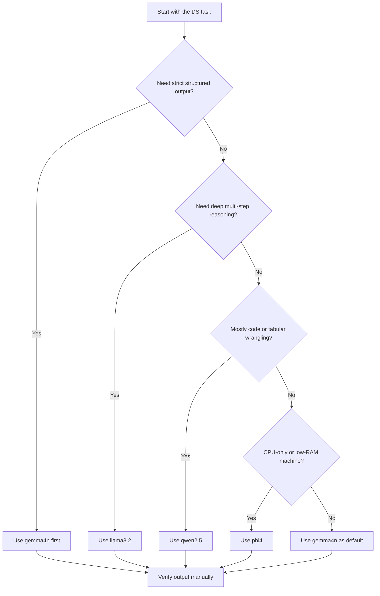

# M12 — Instructor Guide: Local LLM Mastery for Data Scientists
> 120-minute lesson | Datasets: your own notebooks + CSVs | Developer depth

---

## Learning Objectives

By end of session, students can:
1. Call the Ollama REST API from Python using `requests` library
2. Select the right local model (`gemma4n`, `llama3.2`, `qwen2.5`, `phi4`) for a given DS task
3. Apply DS-specific prompt patterns: structured JSON output, chain-of-thought for stats, self-consistency
4. Generate and validate synthetic tabular data at scale using a local model
5. Build a FAISS + `sentence-transformers` RAG pipeline over personal notebooks and CSVs
6. Build a Streamlit + Ollama local DS assistant with RAG
7. Design a privacy-preserving local AI architecture and audit AI use

---

## Lesson Outline

| Time | Activity |
|------|----------|
| 0:00–0:15 | M11 debrief + why local LLMs change the learning game |
| 0:15–0:30 | L12.1 — The local LLM landscape in 2026 |
| 0:30–0:45 | L12.2 — Ollama deep dive: REST API + Modelfiles |
| 0:45–1:00 | L12.3 — Prompt engineering patterns for data science |
| 1:00–1:15 | L12.4 — Synthetic data at scale |
| 1:15–1:30 | L12.5 — RAG over your own data |
| 1:30–1:50 | L12.6 — Building a local DS assistant |
| 1:50–2:00 | L12.7 [AI-OFF] — Privacy architecture design + capstone brief |

---

## Key Concepts

### L12.1 — The local LLM landscape in 2026 `[M12 new]`
#### Why local models matter to data scientists now
In 2026, the question is no longer whether LLMs are useful for data science.
The real question is where the model should run and who controls the data
that enters its context window. For learners working with personal
notebooks, course assessments, sensitive CSVs, and unpublished project
ideas, a local model changes the trust boundary completely. The machine
that stores the data is also the machine that performs inference.

That matters for three reasons. First, privacy becomes operational rather
than contractual: there is no external API provider to trust and no cloud
logging pipeline to hope is configured correctly. Second, cost becomes
predictable because the student owns the hardware and is not charged per
request or token. Third, reproducibility improves because the model,
prompt, dataset, and environment can all be versioned together in one
offline workflow.

Local LLMs also change the pace of learning. Students can test several
prompt designs in quick succession, inspect mistakes without latency
penalties, and keep a stable working context over the lifetime of a
project. Instructors should frame this as an extension of the course's
core thesis: every data-science skill now has a local-AI-accelerated
version, and learners need to know both the accelerated path and the
manual path.

#### Choosing among Gemma, Llama, Qwen, and Phi
The 2026 local model landscape is no longer dominated by one family.
`gemma4n` is a strong teaching model because it follows structured
instructions well, explains statistical reasoning clearly, and behaves
predictably in JSON-style prompts. `llama3.2` is often the stronger choice
for open-ended reasoning and multi-step explanation when the task is more
conceptual than strictly formatted.

`qwen2.5` is especially useful when the student needs help generating or
reviewing code, including pandas transformations, quick utilities, or
schema-aware data-wrangling steps. `phi4` shines on lightweight machines:
it is compact, fast on CPU-heavy setups, and often good enough for first
passes, verification prompts, and tight feedback loops. The teaching goal
is not to crown a winner but to develop model-selection judgment.

A useful classroom decision rule is to ask four questions in order: How
structured must the output be? How much reasoning depth is needed? How
strong is the student's hardware? How expensive would a wrong answer be?
A JSON-only synthetic-data task points one way; an ambiguous research
framing conversation points another. Model choice is part of the workflow,
not a one-time installation decision.

#### Model-selection decision tree
The decision tree below gives students a reusable mental model. It shows
that model choice begins with the task shape, not with brand preference.
If the learner needs rigid formatting or a reliable explanation of a
statistical interpretation, start with `gemma4n`. If the student needs a
heavier reasoning pass or a second opinion, escalate to `llama3.2`.



Instructors can also use the diagram to normalise model switching. A
student who asks one model for everything is acting like a carpenter who
uses only one tool head. Mature local-AI practice means selecting the
model that best matches the DS task, then verifying the answer against
code, source data, or manual reasoning.

#### Code example: build a lightweight decision matrix
A compact code example helps students see model choice as data rather than
myth. The point is not to automate away judgment completely, but to encode
what trade-offs matter for reproducible selection.

```python
import pandas as pd

model_matrix = pd.DataFrame(
    [
        {"model": "gemma4n",  "best_for": "structured output + DS explanation", "reasoning": 4, "speed": 4, "cpu_friendliness": 3},
        {"model": "llama3.2", "best_for": "complex reasoning",                 "reasoning": 5, "speed": 3, "cpu_friendliness": 2},
        {"model": "qwen2.5",  "best_for": "code + tabular tasks",             "reasoning": 4, "speed": 4, "cpu_friendliness": 3},
        {"model": "phi4",     "best_for": "fast CPU-first iteration",         "reasoning": 3, "speed": 5, "cpu_friendliness": 5},
    ]
)


def recommend_model(task: str, cpu_only: bool = False) -> str:
    task = task.lower()
    if "json" in task or "structured" in task or "stats" in task:
        return "gemma4n"
    if "reason" in task or "compare" in task or "critique" in task:
        return "llama3.2"
    if "code" in task or "pandas" in task or "csv" in task:
        return "qwen2.5"
    if cpu_only:
        return "phi4"
    return "gemma4n"

print(model_matrix)
print(recommend_model("generate structured JSON for synthetic rows"))
```

The example also invites an important discussion: a recommendation rule is
only as good as the assumptions inside it. Students should be encouraged
to annotate why they selected a model in `AI_USE.md`, especially when they
change models mid-project because the first attempt underperformed.

#### Common mistakes
Students often treat local-model choice like a popularity contest. That is
a mistake because the best model depends on the cost of a wrong answer,
the structure of the desired output, and the available hardware.

Watch for these mistakes in discussion and notebook reviews:
- Choosing the largest model by default without checking whether latency
  will disrupt the workflow.
- Assuming "better reasoning" automatically means "better JSON" or
  "better code".
- Forgetting that fast CPU-friendly models can be excellent for first-pass
  exploration and verification.
- Treating model output as correct merely because the interaction feels
  more fluent.

#### Practice questions
1. Which model would you try first for a pandas wrangling skeleton, and
   why?
2. When would `phi4` be the most responsible choice even if a larger model
   is installed locally?
3. What would make you switch from `gemma4n` to `llama3.2` in the middle
   of a project?
4. What evidence would you record in `AI_USE.md` to justify your choice?

### L12.2 — Ollama deep dive: REST API and Modelfiles `[M12 new]`
#### Ollama as a local inference layer
Ollama turns a local model into a service with a stable HTTP interface.
That matters pedagogically because students can use the same model from a
terminal, a Python notebook, a Streamlit app, or a lightweight agent loop.
The mental shift is important: Ollama is not just a chat UI. It is the
local inference layer that makes model-backed applications possible.

The three endpoints that matter most in this module are `GET /api/tags`,
`POST /api/generate`, and `POST /api/chat`. `GET /api/tags` answers the
operational question "what models do I actually have available?". The two
POST endpoints answer different application questions: `generate` is
useful for one-prompt completions, while `chat` preserves message roles and
fits better once we care about conversational state, system prompts, or
multi-turn application logic.

Instructors should explicitly contrast these endpoints with a notebook-only
mindset. When students hard-code a long prompt into one cell, they may not
notice when the interaction needs history, error handling, or model
inspection. The REST API forces the workflow to become more modular and,
therefore, more testable.

#### Streaming, non-streaming, and prompt budgeting
A non-streaming response is simplest when students want to parse a full
JSON object, save a single answer, or verify deterministic behavior.
Streaming becomes more useful in interactive interfaces because it reduces
perceived latency and lets the student watch the model reason token by
token. The trade-off is implementation complexity: the client must consume
line-delimited JSON chunks rather than a single completed payload.

Context-window management is the next operational skill. Local models feel
private, but they are not magic. Every token sent in the prompt consumes
part of a fixed context budget. That means students need to learn prompt
budgeting: summarise earlier turns, retrieve only the most relevant chunks,
and avoid pasting entire notebooks when only three code cells matter.

A simple classroom rule works well: if the task requires more than one page
of pasted material, pause and redesign the prompt. Often the right answer
is to retrieve supporting context programmatically rather than to keep
stuffing more text into the model's window. This is the conceptual bridge
into RAG later in the module.

#### Modelfiles and local customisation
Modelfiles are where the course's system-prompt philosophy becomes local
infrastructure. Students can define a base model, set a system prompt,
control temperature, and bake in usage defaults without editing the same
parameters in every notebook cell. That makes local workflows more
reproducible because the model configuration becomes inspectable text.

This is also where instructors can explain why configuration belongs in
version-controlled files rather than memory. If one student says "Gemma was
more strict yesterday" but cannot show the Modelfile or runtime settings,
there is no stable baseline for debugging. Local AI should feel like data
science: parameterised, inspectable, and rerunnable.

GPU offloading is worth a brief but concrete explanation. Ollama decides
what can be placed on GPU and what must stay on CPU based on hardware,
model size, and available memory. Students do not need deep CUDA knowledge,
but they do need the right expectation: the same model can behave
operationally differently across machines even if the prompts are the
same.

#### Code example: a robust Python Ollama client
The wrapper below shows how to turn a local inference server into a
reusable application component. Error handling matters because real
students will eventually hit a stopped server, an unavailable model, or a
malformed response.

```python
from __future__ import annotations

import requests
from typing import Any, Dict, List


class OllamaClient:
    def __init__(self, base_url: str = "http://localhost:11434", timeout: int = 60):
        self.base_url = base_url.rstrip("/")
        self.timeout = timeout

    def list_models(self) -> List[Dict[str, Any]]:
        r = requests.get(f"{self.base_url}/api/tags", timeout=self.timeout)
        r.raise_for_status()
        return r.json().get("models", [])

    def chat(self, model: str, messages: List[Dict[str, str]], stream: bool = False) -> Dict[str, Any]:
        payload = {"model": model, "messages": messages, "stream": stream}
        try:
            r = requests.post(f"{self.base_url}/api/chat", json=payload, timeout=self.timeout)
            r.raise_for_status()
            data = r.json()
        except requests.RequestException as exc:
            raise RuntimeError(f"Ollama request failed: {exc}") from exc

        if "message" not in data or "content" not in data["message"]:
            raise ValueError(f"Unexpected Ollama response: {data}")
        return data


client = OllamaClient()
print([m["name"] for m in client.list_models()])
reply = client.chat(
    model="gemma4n",
    messages=[{"role": "user", "content": "Explain why context windows matter for RAG."}],
)
print(reply["message"]["content"])
```

A good extension exercise is to ask students to add a streaming method of
their own. The goal is not just to make the interface prettier. It is to
make them reason about response shape, error surfaces, and where streaming
is useful versus where full responses are easier to validate.

#### Common mistakes
Students usually struggle here because they collapse several distinct
problems into one: server health, model availability, API syntax, and
prompt quality. Untangling those layers is part of the lesson.

Common mistakes include:
- Calling `/api/chat` when the model is not installed and assuming the
  prompt is the issue.
- Forgetting `stream=False` when trying to parse a single JSON payload.
- Sending too much notebook context instead of retrieving only what is
  relevant.
- Editing temperature or system behavior ad hoc instead of documenting it
  in a Modelfile.

#### Practice questions
1. When is `/api/generate` sufficient, and when is `/api/chat` the better
   API choice?
2. Why is a non-streaming response often preferable for JSON parsing?
3. What operational symptoms suggest that context-window overload, not
   model quality, is causing poor answers?
4. What parts of a model configuration belong in a Modelfile instead of
   a notebook cell?

### L12.3 — Prompt engineering patterns for data science `[M12 new]`
#### Prompt patterns are workflow tools, not magic phrases
Prompt engineering is often taught as a collection of tricks. In a data
science course, that framing is too shallow. The useful idea is that each
prompt pattern changes the failure mode of the interaction. A structured
JSON prompt reduces parsing ambiguity. A chain-of-thought style prompt can
surface faulty statistical reasoning. Self-consistency exposes instability
across repeated runs. These are workflow controls, not decorations.

Students should learn to map patterns to tasks. If the goal is to create a
small synthetic dataset with known columns, structured output is the right
starting point. If the goal is to check whether a confidence interval was
interpreted correctly, a step-by-step reasoning prompt may reveal where the
logic went wrong. If the goal is to probe uncertainty, repeating the same
question with small temperature changes can reveal whether the model's
answer is stable or brittle.

This lesson is also where the course's scaffolding philosophy becomes
concrete. Prompting well does not mean outsourcing the task. It means
designing the interaction so the model produces something the learner can
check, edit, or reject with confidence.

#### Six patterns for DS work
The first pattern is **structured JSON output**. This is useful when the
model must return rows, schema fragments, EDA hypotheses, or ranked lists
that will be parsed by code. The second pattern is **chain-of-thought for
statistics**, where the model is explicitly asked to explain each step in a
confidence-interval, effect-size, or p-value interpretation.

The third pattern is **self-consistency**. Ask the same conceptual
question three times with small temperature variation, then compare the
answers. Divergence is a warning sign that the task is underspecified or
that the model has weak confidence. The fourth pattern is **rubber duck
debugging**, where the student pastes code and asks the model to explain it
line by line until the bug becomes visible.

The fifth pattern is a **misconception probe**: ask, "What are three ways a
student could misinterpret this result?" This is powerful because it turns
the model into a critic rather than a generator. The sixth pattern is
**persona-switch explanation**, such as "Explain this chart to a CFO who
distrusts statistics." This improves communication and forces the model to
reframe evidence for a particular audience.

#### Code example: prompt-pattern toolkit
The example below keeps the interface deliberately simple so students can
focus on pattern choice. The prompt templates are stored in Python strings,
which makes it easy to audit how the request shape changes the answer.

```python
import requests


def ask_local(prompt: str, model: str = "gemma4n", temperature: float = 0.2) -> str:
    payload = {
        "model": model,
        "messages": [{"role": "user", "content": prompt}],
        "stream": False,
        "options": {"temperature": temperature},
    }
    r = requests.post("http://localhost:11434/api/chat", json=payload, timeout=60)
    r.raise_for_status()
    return r.json()["message"]["content"]


structured_prompt = """
Return ONLY valid JSON with keys: hypothesis, metric, caution.
Task: Suggest two EDA hypotheses for a CSV containing churn, tenure, and monthly_spend.
"""

cot_prompt = """
Interpret this result step by step.
A/B test: mean difference = 2.1, 95% CI = [0.4, 3.8], p = 0.01.
Explain what the CI says, what the p-value says, and what remains uncertain.
"""

self_consistency_answers = [
    ask_local("What are 2 risks in interpreting a tiny p-value as practical importance?", temperature=t)
    for t in (0.1, 0.3, 0.5)
]

print(ask_local(structured_prompt))
print(ask_local(cot_prompt))
print(self_consistency_answers)
```

Instructors should point out that temperature control is not a cosmetic
setting here. It is part of the experiment. If the self-consistency answers
agree on the same core caution, the student gains confidence. If the
answers diverge sharply, the right response is not blind selection but a
manual review of the assumptions inside the prompt.

#### Worked examples by task type
For synthetic tabular rows, start with the schema in the prompt and forbid
extra narration. For statistical interpretation, request a numbered,
step-by-step explanation and explicitly ask the model to separate evidence
from inference. For debugging, ask the model to describe what each line of
code is supposed to do before it suggests a fix.

For communication tasks, prompt patterns should carry audience context.
"Summarise this plot for a product manager" produces a different and often
more useful answer than "Explain the plot." The lesson for students is that
precision in the prompt is often just precision in problem framing.

#### Common mistakes
The most common prompt-engineering mistake is asking for too many things at
once. A request that mixes schema design, interpretation, debugging,
visualisation advice, and final recommendations gives the model no clean
success criterion.

Other common mistakes include:
- Asking for JSON but permitting commentary before or after the JSON.
- Treating one fluent answer as proof of correctness without any
  verification step.
- Using self-consistency as a vote-counting trick instead of a prompt
  diagnostic.
- Forgetting to include audience, task, or output format constraints.

#### Practice questions
1. Which prompt pattern would you use to check a student's confidence
   interval interpretation, and why?
2. Why is self-consistency useful even when all three answers are wrong in
   the same direction?
3. What makes a structured-output prompt parseable instead of merely neat?
4. How does persona-switching improve chart communication?

### L12.4 — Synthetic data at scale `[M12 new]`
#### Why synthetic data belongs in a DS workflow
Synthetic data is attractive because it solves several teaching and
engineering problems at once. It can protect privacy during demos, fill in
rare edge cases for testing, and let students prototype a pipeline before
real production data is available. For an offline-first course, it also
provides a controlled way to experiment with local models without exposing
sensitive records.

But the lesson has to begin with a strong guardrail: synthetic data is not
a replacement for measurement. It is an approximation produced under a
prompting regime. That means its value depends on how well it respects the
schema, ranges, and distributional patterns of the real dataset it is meant
to extend. The misconception to flag explicitly is that realism in tone or
column names is not the same as validity.

This is why the synthetic-data workflow always has three stages. First,
define the schema and constraints. Second, generate rows in a machine-
parsable format. Third, validate the result against both rule-based checks
and real-data summaries wherever possible.

#### Schema-controlled generation
Students should write prompts that behave like data contracts. Specify the
columns, the data types, valid ranges, and any hard constraints that must
be obeyed. The model should be told to return only a JSON array or only a
CSV block so that downstream parsing remains clean. Instructors can make a
useful analogy here: a synthetic-data prompt is closer to writing a schema
than to having a conversation.

Once the first batch is generated, the next question is whether the rows
are merely parseable or actually usable. `pandera` helps with type and
range checks. Summary statistics such as `.describe()` help with basic
sanity. Distribution checks such as the Kolmogorov–Smirnov test help reveal
whether the synthetic and real samples are drawn from meaningfully similar
numeric behavior.

#### Code example: generate the first batch
The first code block is intentionally simple. It shows the minimum viable
path from a schema-aware prompt to a DataFrame.

```python
import requests, json, pandas as pd

def ask_gemma(prompt: str, model: str = "gemma4n") -> str:
    r = requests.post(
        "http://localhost:11434/api/chat",
        json={"model": model, "messages": [{"role": "user", "content": prompt}], "stream": False}
    )
    return r.json()["message"]["content"]

schema_prompt = """
Generate 20 rows of realistic e-commerce order data as a JSON array.
Each row: {"order_id": int, "customer_age": int, "product_category": str,
           "order_value": float, "days_to_delivery": int, "returned": bool}
Constraints: age 18-75, value 5.00-500.00, delivery 1-14 days.
Return ONLY the JSON array, no explanation.
"""

raw = ask_gemma(schema_prompt)
df = pd.DataFrame(json.loads(raw))
print(df.dtypes)
df.describe()
```

This block should not end the discussion. After generation, students need
to inspect whether categories are sensible, numeric ranges are respected,
and implausible combinations have slipped through. Instructors should ask,
"What failure modes would still be invisible after `json.loads()` succeeds?"
That question pushes students from syntax validation into data validation.

#### Validation and distribution matching
The next layer of validation is explicit schema enforcement. `pandera`
allows the class to state that `customer_age` must be between 18 and 75,
`order_value` must be positive, and `returned` must be boolean. This is a
good point to remind students that LLM output is text until code proves
otherwise.

Distribution matching matters because a syntactically valid dataset can
still be statistically misleading. In practice, students should compare the
synthetic data to a real reference sample using `.describe()`, histograms,
and a KS test for continuous variables. If the synthetic order values are
all too smooth, too central, or too evenly distributed, the local model may
have generated a tidy fiction rather than a useful approximation.

A strong classroom extension is to ask the model for 1,000 rows and then
show how error compounds at scale. When the generation volume rises,
students see why constraint design, validation, and post-generation audits
matter even more. Bigger output does not automatically mean better output.

#### What synthetic data cannot simulate well
Students should leave the lesson with a healthy sense of limitation.
Synthetic data often struggles with rare-event structure, long-tail
behavior, subtle correlations across many fields, and the kinds of messy
missingness that make real operational data difficult. It may imitate the
marginals while missing the relationships.

That makes synthetic data useful for testing ingestion, demonstrations,
interface design, and some augmentation tasks. It does not make it safe for
claiming real-world performance without comparison to actual measurements.
The phrase to reinforce is: synthetic data extends the workflow; it does
not replace reality.

#### Common mistakes
Synthetic-data failures usually come from weak constraints or weak
validation. Students often celebrate the fact that the model returned
something that *looks* like a table before checking whether the table is
credible.

Common mistakes include:
- Omitting type and range constraints from the prompt.
- Accepting generated rows without schema validation.
- Comparing only a few example rows instead of summary statistics and
  distributions.
- Using synthetic data to support conclusions that should be based on real
  measurements.

#### Practice questions
1. Why is a schema-controlled prompt safer than a natural-language prompt
   that simply says "make the data realistic"?
2. What can `pandera` catch that `.head()` cannot?
3. Why might a KS test disagree with a visual inspection of the same two
   distributions?
4. What are two real-world properties synthetic tabular data may fail to
   preserve?

### L12.5 — RAG over your own data `[M12 new]`
#### Why retrieval-augmented generation changes local AI
Retrieval-augmented generation matters because local models are general,
while student projects are specific. A model may know what a confidence
interval is, but it does not automatically know the details of the
student's notebook, the column names in a personal CSV, or the exact lesson
notes from a capstone draft. RAG closes that gap by retrieving relevant
chunks and placing them into the prompt at inference time.

The offline-first architecture is straightforward and teachable:
`[Your notebooks + CSVs] → [sentence-transformers: all-MiniLM-L6-v2] → [FAISS vector index] → [Gemma 4n]`.
The first stage converts private course materials into searchable text. The
second stage embeds those chunks into vectors. The third stage stores the
vectors for fast similarity search. The fourth stage uses the retrieved
context to ground the model's answer.

The key misconception to challenge is that retrieval is not truth. FAISS
returns the most similar chunks under the chosen embedding model and chunk
strategy, not necessarily the best or correct evidence. Students therefore
need to inspect the retrieved passages and confirm that they actually
support the generated answer.

#### Loading documents and chunking them well
In this module, the most relevant sources are `.ipynb` notebooks and `.csv`
files. For notebooks, students should extract code and markdown cell text,
because both may be useful at query time. For CSVs, it is rarely wise to
embed the entire raw table directly. A better pattern is to create compact
text summaries: column names, dtypes, example rows, and possibly grouped
statistics.

Chunking strategy matters because retrieval quality depends on how the text
is partitioned. Fixed-size chunking is simple and reproducible, which makes
it a good teaching default. Semantic chunking can improve coherence, but it
adds complexity and can be harder to debug when the retriever surfaces
unexpected passages.

Instructors should emphasise that chunking is an information-design choice.
If chunks are too small, the answer may lack context. If chunks are too
large, the retriever may return bloated passages that waste prompt budget.
RAG quality is therefore partly an indexing problem and partly a prompt-
budget problem.

#### Code example: end-to-end local RAG pipeline
The example below is intentionally complete enough to be a working first
prototype. It loads mixed source types, chunks them, embeds them, retrieves
the top matches, and then asks `gemma4n` to answer using only those chunks.

```python
from pathlib import Path
import json
import numpy as np
import pandas as pd
import faiss
import requests
from sentence_transformers import SentenceTransformer


def load_documents(folder: str = "."):
    docs = []
    for path in Path(folder).glob("*.ipynb"):
        nb = json.loads(path.read_text(encoding="utf-8"))
        text = []
        for cell in nb.get("cells", []):
            text.append("".join(cell.get("source", [])))
        docs.append({"source": path.name, "text": "
".join(text)})
    for path in Path(folder).glob("*.csv"):
        df = pd.read_csv(path)
        preview = df.head(5).to_csv(index=False)
        summary = f"Columns: {list(df.columns)}
Shape: {df.shape}
Preview:
{preview}"
        docs.append({"source": path.name, "text": summary})
    return docs


def chunk_text(text: str, chunk_size: int = 500, overlap: int = 100):
    chunks = []
    start = 0
    while start < len(text):
        end = start + chunk_size
        chunks.append(text[start:end])
        start += chunk_size - overlap
    return chunks


def ask_ollama(prompt: str, model: str = "gemma4n") -> str:
    r = requests.post(
        "http://localhost:11434/api/chat",
        json={"model": model, "messages": [{"role": "user", "content": prompt}], "stream": False},
        timeout=120,
    )
    r.raise_for_status()
    return r.json()["message"]["content"]


documents = load_documents(".")
chunk_records = []
for doc in documents:
    for chunk in chunk_text(doc["text"]):
        chunk_records.append({"source": doc["source"], "chunk": chunk})

embedder = SentenceTransformer("all-MiniLM-L6-v2")
embeddings = embedder.encode([r["chunk"] for r in chunk_records], normalize_embeddings=True)
embeddings = np.asarray(embeddings, dtype="float32")

index = faiss.IndexFlatIP(embeddings.shape[1])
index.add(embeddings)

query = "Which notebook cells discuss confidence intervals and effect size?"
query_vec = np.asarray(embedder.encode([query], normalize_embeddings=True), dtype="float32")
dists, idxs = index.search(query_vec, k=3)
retrieved = [chunk_records[i] for i in idxs[0]]
context = "

".join(f"[{r['source']}]
{r['chunk']}" for r in retrieved)

prompt = f"Use only the retrieved context below. If the answer is not supported, say so.

Context:
{context}

Question: {query}"
print(ask_ollama(prompt))
```

A crucial teaching move is to inspect the retrieved chunks before reading
the model's answer. If the wrong notebook cells were retrieved, the answer
quality is downstream of retrieval quality. This prevents students from
blaming the generation model for an indexing mistake.

#### How to evaluate retrieval quality
RAG evaluation starts before generation. Ask whether the right chunks are
being retrieved for a given query. A simple classroom metric is retrieval
hit rate: in the top `k` results, did the retriever surface at least one
chunk that genuinely supports the answer? Another useful metric is answer
grounding: can the final response be traced back to an actual sentence or
cell in the retrieved context?

Students should also experiment with `k`, chunk size, and query wording.
These are not just tuning knobs. They reveal how retrieval behaves under
changed assumptions. If a small wording change completely changes the top
results, the index may need better chunking or better document summaries.

#### Common mistakes
Most RAG problems are really retrieval-design problems. Students often jump
straight to the final answer and forget to inspect whether the context was
relevant in the first place.

Common mistakes include:
- Embedding entire notebooks as one giant chunk.
- Treating top-1 retrieval as sufficient without checking alternatives.
- Forgetting to label retrieved context with source metadata.
- Accepting a grounded-sounding answer without verifying the retrieved
  passage actually supports it.

#### Practice questions
1. Why is `all-MiniLM-L6-v2` a good teaching default for local RAG?
2. What is the trade-off between a 200-character chunk and a 1,500-
   character chunk?
3. How would you test whether your retriever is helping rather than hurting
   answer quality?
4. Why must the student inspect the retrieved chunks before trusting the
   generated answer?

### L12.6 — Building a local DS assistant `[M12 new]`
#### Architecture: Streamlit + Ollama + FAISS
A local DS assistant is not a chatbot pasted onto a notebook. It is a small
application that connects three components: a user interface, a retrieval
layer, and a generation layer. Streamlit makes the interface quick to build
and easy to demo. FAISS handles vector retrieval over the learner's private
materials. Ollama handles local generation once the relevant context has
been selected.

That architecture is educationally powerful because it makes each layer
inspectable. Students can change the query, inspect the retrieved chunks,
and compare answers under different models. A cloud black box hides those
layers. A local app turns them into visible engineering decisions.

The design goal in this lesson is modest but important: build a tool that
can answer questions about the student's own learning artefacts while
keeping data private and the workflow reproducible. Instructors should
frame this as an application assembly lesson, not as a UI-polish lesson.

#### Designing the interaction loop
The assistant should preserve conversation history, but only selectively.
Long histories consume context window budget quickly, so the app needs a
policy: keep the recent turns, summarise older turns, and retrieve fresh
context for each new query. That policy teaches students that state
management is part of local-AI engineering.

RAG integration should occur on every question. The user asks something,
the app embeds the query, retrieves top-`k` chunks, constructs a grounded
prompt, and then streams the answer back to the interface. The student can
be shown the retrieved chunks directly in an expander or side panel. This
is one of the simplest ways to build verification into the product.

Persisting the FAISS index matters because re-embedding the same notebooks
on every run wastes time and makes the experience feel fragile. Saving both
the index and the chunk metadata to disk turns the assistant into a real
local application rather than a one-shot notebook demo.

#### Code skeleton: build the first app
The skeleton below intentionally leaves TODO sections for students. It is a
teaching scaffold rather than a copy-paste finished product.

```python
import json
from pathlib import Path

import faiss
import numpy as np
import requests
import streamlit as st
from sentence_transformers import SentenceTransformer

st.set_page_config(page_title="Local DS Assistant", layout="wide")
st.title("M12 — Local DS Assistant")

# TODO: load your saved chunk metadata from disk
chunk_records = json.loads(Path("chunks.json").read_text(encoding="utf-8"))
index = faiss.read_index("chunks.faiss")
embedder = SentenceTransformer("all-MiniLM-L6-v2")


def retrieve(query: str, k: int = 4):
    query_vec = np.asarray(embedder.encode([query], normalize_embeddings=True), dtype="float32")
    _, idxs = index.search(query_vec, k)
    return [chunk_records[i] for i in idxs[0]]


def ask_ollama(messages, model: str = "gemma4n") -> str:
    payload = {"model": model, "messages": messages, "stream": False}
    r = requests.post("http://localhost:11434/api/chat", json=payload, timeout=120)
    r.raise_for_status()
    return r.json()["message"]["content"]

if "history" not in st.session_state:
    st.session_state.history = []

question = st.chat_input("Ask about your notebooks or CSVs")
if question:
    retrieved = retrieve(question, k=4)
    context = "

".join(f"[{r['source']}]
{r['chunk']}" for r in retrieved)
    prompt = f"Use only the context below. Cite which source file you used.

Context:
{context}

Question: {question}"
    messages = st.session_state.history + [{"role": "user", "content": prompt}]
    answer = ask_ollama(messages)
    st.session_state.history.extend([
        {"role": "user", "content": question},
        {"role": "assistant", "content": answer},
    ])
    st.write(answer)
    with st.expander("Retrieved context"):
        st.write(retrieved)
```

The teaching value of the skeleton lies in the TODO boundaries. Students
must decide how to store chunk metadata, how many chunks to retrieve, and
how much history to preserve. Those choices affect privacy, latency,
retrieval quality, and answer trustworthiness all at once.

#### Verification and deployment discipline
A local assistant should expose its evidence. If the app hides which chunks
were used, students lose the opportunity to verify the answer. Encourage
learners to show source file names, retrieved passages, and model choice in
the interface.

The app should also log important AI interactions in `AI_USE.md`. That may
feel unusual in an engineering module, but it reinforces the course's view
that responsible local AI use includes disclosure, not just technical
competence. A polished interface is not enough if the underlying workflow
is opaque.

#### Common mistakes
Students often spend too much time on visual polish and too little time on
retrieval and validation. The best assistant is not the prettiest one; it
is the one whose answers can be traced, checked, and reproduced.

Common mistakes include:
- Re-embedding all documents on every app run.
- Hiding the retrieved chunks from the user.
- Letting conversation history grow without any context-budget strategy.
- Treating the first working UI as the end of the design process.

#### Practice questions
1. Why should the app retrieve fresh context for each new question instead
   of relying only on chat history?
2. What metadata should be saved alongside a FAISS index?
3. Why is exposing retrieved context a safety feature, not just a debugging
   feature?
4. What trade-off appears when the app keeps too much conversation history?

### L12.7 — Privacy architecture and model trust [AI-OFF] `[M12 new]`
#### The local trust boundary is smaller, not automatic
This lesson is marked **[AI-OFF]** because students need to reason through
privacy boundaries and leakage risks themselves before relying on model
help. The concept to emphasise in class is that local inference changes the
trust boundary, but it does not erase the need for privacy design. What
enters the prompt still enters the model context window. Sensitive data is
still sensitive even if the server is localhost.

That is why students should never paste personally identifiable
information, secrets, or unnecessary raw records into a prompt. A local
model reduces external exposure, but it does not protect against careless
prompt construction, lingering notebook state, copied logs, or accidental
screen sharing. Privacy discipline is still part of data-science practice.

The second trust issue is session memory. Even when there is no cloud
logging, a long-running local workflow can keep prior turns in context,
cache chunks on disk, or write outputs into files that later get committed
or shared. Instructors should frame privacy architecture as a pipeline
question: where can sensitive content enter, persist, leak, or be inferred?

#### Verification and disclosure as trust tools
Students should also learn that privacy and correctness are linked. An
unverified model output can create a secondary leak if it is copied into a
report, notebook, or presentation without review. Trustworthy local AI
therefore requires both input discipline and output verification.

`AI_USE.md` is the course's audit mechanism. Every substantive model
interaction should be logged with the prompt purpose, the type of model
help received, and what the learner accepted or changed. This turns local
AI use into something inspectable during feedback, peer review, or
capstone defense.

The three-way taxonomy is essential here: **AI-assisted** means the student
used the model for hints, scaffolds, or critique; **AI-generated** means a
substantive artefact or block of content came from the model; **AI-
independent** means the work was completed without model help. The design
exercise asks students to classify a DS workflow using this taxonomy on
their own.

#### Code example: redaction and offline audit logging
The code below does not solve the AI-OFF exercise. It simply models the
kind of redaction and logging utilities that belong in a privacy-conscious
local workflow.

```python
from datetime import date
from pathlib import Path
import re


def redact_pii(text: str) -> str:
    text = re.sub(r"[A-Za-z0-9._%+-]+@[A-Za-z0-9.-]+", "[REDACTED_EMAIL]", text)
    text = re.sub(r"\d{3}-\d{2}-\d{4}", "[REDACTED_ID]", text)
    return text


def append_ai_use(stage: str, ai_action: str, accepted: str, changed: str) -> None:
    entry = f"""
## M12 — {date.today().isoformat()}
- Stage: {stage}
- AI action: {ai_action}
- Accepted: {accepted}
- Changed or rejected: {changed}
""".strip()
    path = Path("AI_USE.md")
    with path.open("a", encoding="utf-8") as f:
        f.write("

" + entry)

sample_prompt = "Customer alice@example.com requested a churn explanation."
print(redact_pii(sample_prompt))
```

The important teaching point is not the regex itself. It is the habit of
thinking about prompts and logs as data pipelines with their own leakage
surfaces. Students should be able to explain what they would redact, what
they would never send at all, and what they must record for disclosure.

#### Design exercise framing
Give students a concrete workflow such as: load a CSV of user behavior,
ask a model to suggest features, generate a draft narrative for a chart,
and write a final recommendation memo. Ask them to classify each step as
AI-assisted, AI-generated, or AI-independent, then identify where privacy
or leakage risks appear.

Because the lesson is AI-OFF, the learner must produce that classification
without model help. The instructor's role is to review the reasoning after
submission and connect it back to privacy architecture, model trust, and
disclosure practice.

#### Common mistakes
This lesson exists because students often over-trust the phrase "local
model". Locality lowers one class of risk, but it does not absolve the user
from prompt hygiene, output verification, or disclosure.

Common mistakes include:
- Pasting raw PII because the endpoint is local.
- Forgetting that retrieved notebook chunks may themselves contain private
  notes or identifiers.
- Logging model use vaguely instead of describing what the model actually
  generated or changed.
- Treating AI-generated text as AI-assisted because the final notebook was
  manually edited.

#### Practice questions
1. Why does a local model reduce exposure without removing the need for
   privacy design?
2. What kinds of information should never appear in a prompt, even on a
   local machine?
3. How does `AI_USE.md` support both ethics and reproducibility?
4. What is the difference between AI-assisted and AI-generated work in a
   chart narrative workflow?

---

## Scoring Rubric
| Criterion | 0 | 1 | 2 |
|-----------|---|---|---|
| Ollama API call works | Fails | Partial | Clean response with error handling |
| Synthetic data validated | Not validated | Basic checks | pandera schema + distribution comparison |
| RAG pipeline | Not attempted | Retrieves chunks | Retrieves + generates grounded answer |
| Local DS assistant | Not attempted | Basic chat | RAG-augmented with streaming |
| Privacy design | Not attempted | Lists concerns | Full AI_USE.md + leakage mitigations |

---

## Common Misconceptions to Flag

| Lesson | Misconception | Correction |
|--------|---------------|------------|
| L12.1 | "One local model is best for every DS task" | Model choice depends on structure, reasoning depth, hardware, and verification cost |
| L12.3 | "A clever prompt removes the need for checking" | Prompt design improves outputs, but verification remains mandatory |
| L12.4 | "Synthetic rows are safe to treat like measured data" | Synthetic data must be validated and bounded to testing / augmentation use cases |
| L12.5 | "Top-k retrieval means correct grounding" | Similarity search surfaces likely context, not guaranteed evidence |
| L12.7 | "Local = private by default" | Local reduces exposure, but prompt hygiene, redaction, and audit logging still matter |

---

## Teaching Notes

- Start with `ollama list` or `GET /api/tags` live so students see model
  availability as a concrete systems question.
- Treat every prompt pattern like a method choice. Ask students why they
  chose it and what failure mode it reduces.
- During RAG, pause before generation and inspect retrieved chunks in front
  of the class.
- In the privacy segment, avoid turning AI-OFF into silence. You may teach
  the concepts; you may not help students complete the assessed design
  classification itself.

---

## Assessment Notes

M12 is a build-heavy module. Grade for correctness, auditability, and
verification discipline rather than UI polish alone.

The lab notebook should be runnable offline in the `ds-gemma-course`
environment. If dependencies are missing locally, students should document
what was unavailable and how they would validate the same workflow once the
environment is complete.

The L12.7 AI-OFF design exercise should be reviewed for privacy reasoning,
clear use of the three-way taxonomy, and explicit identification of data-
leakage surfaces in prompts, retrieval, logging, and outputs.
