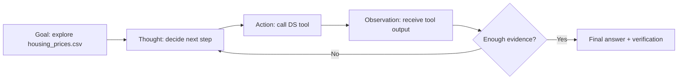

# M13 — Instructor Guide: Agentic DS Workflows
> 120-minute lesson | Datasets: housing_prices.csv, ecommerce_orders.csv | Developer depth
> **Requires M12 completion**

---

## Learning Objectives

By end of session, students can:
1. Explain the ReAct (Reasoning + Acting) agent loop and when it applies to DS tasks
2. Define Python functions as tools that an agent can call
3. Implement a simple ReAct agent that plans, uses tools, and observes results
4. Build an autonomous EDA pipeline using a local Gemma 4n agent
5. Identify failure modes in agentic systems (hallucination, tool misuse, cascading errors)
6. Apply verification checkpoints to every stage of an autonomous analysis

---

## Lesson Outline

| Time | Activity |
|------|----------|
| 0:00–0:15 | M12 debrief + when a chatbot becomes an agent |
| 0:15–0:35 | L13.1 — What is an agent and why does it matter for data science? |
| 0:35–0:55 | L13.2 — Tool design for DS agents |
| 0:55–1:15 | L13.3 — Building a simple ReAct agent |
| 1:15–1:35 | L13.4 — Autonomous EDA pipeline |
| 1:35–1:50 | L13.5 [AI-OFF] — Agent output verification |
| 1:50–2:00 | L13.6 — Safety, limits, and responsible agentic DS |

---

## Key Concepts

### L13.1 — What is an agent and why does it matter for data science? `[M13 new]`
#### Chatbot, pipeline, agent: different kinds of systems
A chatbot responds to text but usually leaves the environment untouched.
A traditional data pipeline executes predetermined steps in a fixed order.
An agent sits between those two ideas: it reasons about a goal, chooses an
action, uses a tool, observes the result, and decides what to do next.
That difference matters because many data-science tasks are exploratory and
multi-step rather than strictly linear.

A useful way to explain this to students is to compare roles. A chatbot is
like a knowledgeable colleague answering questions. A pipeline is like a
factory machine repeating a known process. An agent is like an analyst who
can decide which tool to use next based on what the previous step revealed.
The agent does not just talk about the task; it acts within a bounded tool
environment.

For data science, that makes agents especially relevant in exploratory data
analysis, hypothesis generation, iterative debugging, and report drafting.
These are tasks where the next move depends on what the previous move found.
At the same time, the open-endedness that makes agents useful also makes
them risky. A wrong tool choice or a mistaken intermediate conclusion can
cascade into multiple downstream errors.

#### The ReAct loop for DS tasks
ReAct stands for **Reasoning + Acting**. The loop is usually described as:
**Thought → Action → Observation → Thought ...** until the task is done or
a stopping condition fires. In a DS context, the thought might be "I should
inspect missing values first." The action might be `describe_dataframe`.
The observation is the returned summary. The next thought uses that
observation to plan the next step.

This loop matters because it turns the model from a one-shot text generator
into a controller over tools. The model is no longer producing only an
answer. It is producing a plan of work. Instructors should emphasise that
this changes the verification problem. We now need to verify not just the
final narrative, but each tool invocation and each intermediate claim.

A diagram makes the loop easier to teach because students can map it onto
familiar analytics stages.



The DS-specific extension is that the observations are often numeric,
structured, or visual. That means the agent loop should be paired with a
logging habit: every action, tool input, and observation should be stored
so the learner can inspect the trace later. Without a trace, the agent's
reasoning becomes hard to audit.

#### When agents are useful versus overkill
Agents are valuable when the task is ambiguous enough to need branching but
bounded enough to fit a well-defined toolset. A good example is an EDA goal
such as "Explore `housing_prices.csv` and report three findings." The agent
may need to inspect schema, missingness, summary statistics, and selected
plots before deciding what is interesting.

Agents are overkill when the task is already deterministic. If the student
knows they must load a CSV, fit a specific model, and compute a fixed
metric, a standard script or notebook cell sequence is usually clearer and
safer. This is a crucial boundary to teach. Agentic systems are not more
advanced simply because they are more autonomous.

#### Code example: represent an agent trace explicitly
The code below is intentionally small. It shows that even a simple agent
workflow benefits from a structured trace that preserves the loop.

```python
from dataclasses import dataclass, field
from typing import Any, List


@dataclass
class AgentStep:
    thought: str
    action: str
    action_input: dict
    observation: Any


@dataclass
class AgentTrace:
    goal: str
    steps: List[AgentStep] = field(default_factory=list)

    def log(self, thought: str, action: str, action_input: dict, observation: Any) -> None:
        self.steps.append(AgentStep(thought, action, action_input, observation))


trace = AgentTrace(goal="Explore housing_prices.csv and report 3 findings")
trace.log(
    thought="Start by checking the dataset shape and missingness.",
    action="describe_dataframe",
    action_input={"path": "housing_prices.csv"},
    observation={"rows": 20640, "cols": 10, "missing": {"total_bedrooms": 207}},
)
print(trace)
```

The point of the example is not sophistication. It is the idea that an
agent without a trace is hard to debug, hard to review, and hard to trust.
This trace structure becomes a bridge into the full ReAct implementation in
later lessons.

#### Common mistakes
Students often confuse autonomy with intelligence. A longer trace or a more
confident tone does not make the system more reliable.

Common mistakes include:
- Calling any model-driven loop an agent, even when there are no tools.
- Using agents for tasks that would be clearer as deterministic scripts.
- Reviewing only the final answer and ignoring the intermediate trace.
- Assuming the agent's next action is justified simply because it sounds
  plausible.

#### Practice questions
1. What is the difference between a chatbot, a pipeline, and an agent?
2. Why does the ReAct loop change the verification burden in DS work?
3. Give one DS task where an agent is useful and one where it is overkill.
4. Why should an agent store a trace of its steps?

### L13.2 — Tool design for DS agents `[M13 new]`
#### Good tools make good agents possible
A ReAct agent is only as trustworthy as the tools it can call. In a DS
setting, a good tool does one thing, accepts clearly typed input, returns a
predictable output shape, and fails loudly when something is wrong.
Students should think of tools as tiny APIs. If a tool is vague, stateful,
or overloaded, the agent has too much room to misuse it.

Single responsibility matters because it reduces ambiguity in planning. A
function named `analyze_everything()` is impossible for an agent to use
well. A function named `describe_dataframe(path: str) -> dict` tells the
agent what the tool expects and what it should learn from the result.
Typing matters for the same reason: it gives both humans and models a
schema for interaction.

Error handling is the third pillar. A DS tool should not quietly return
nonsense when a file is missing or a column name is wrong. It should return
a useful error message or raise a clear exception. An agent can recover
from an explicit failure. It cannot recover from a silent wrong answer.

#### Designing DS tools with typed I/O
The most teachable first tools are `load_csv`, `describe_dataframe`,
`plot_histogram`, and `run_regression`. Each maps to a familiar analytic
operation and each has a crisp input/output boundary. Instructors should
show students that tool design is a form of interface design: the easier it
is to describe the tool contract, the easier it is for the agent to plan
correctly.

Input validation belongs in the tool, not just in the calling prompt. If
`plot_histogram` expects a numeric column, the function should check that
condition before plotting. Output schema matters too. Returning a Python
dictionary with named fields is easier for an agent to reason about than
returning an unstructured sentence.

One helpful classroom move is to ask students to imagine documenting the
tool for another human. If the documentation is fuzzy, the tool is probably
not ready for an agent either. Agent design begins with API design.

#### Code example: define three first tools
The example below keeps the tools small, typed, and explicit. The returns
are structured so the agent has predictable material to reason over.

```python
from pathlib import Path
import pandas as pd
import matplotlib.pyplot as plt


def load_csv(path: str) -> pd.DataFrame:
    file_path = Path(path)
    if not file_path.exists():
        raise FileNotFoundError(f"CSV not found: {path}")
    return pd.read_csv(file_path)


def describe_dataframe(path: str) -> dict:
    df = load_csv(path)
    return {
        "shape": df.shape,
        "columns": list(df.columns),
        "missing": df.isna().sum().to_dict(),
        "numeric_summary": df.describe(include="number").to_dict(),
    }


def plot_histogram(path: str, column: str) -> dict:
    df = load_csv(path)
    if column not in df.columns:
        raise KeyError(f"Column not found: {column}")
    if not pd.api.types.is_numeric_dtype(df[column]):
        raise TypeError(f"Column must be numeric: {column}")
    ax = df[column].dropna().plot(kind="hist", bins=20, title=f"Histogram of {column}")
    plt.show()
    return {
        "column": column,
        "mean": float(df[column].mean()),
        "median": float(df[column].median()),
        "non_null": int(df[column].notna().sum()),
    }
```

Students should notice how little text the tools return. This is good
practice. Tool output should be compact enough for the agent to reason over
without wasting context window space. Rich artifacts such as plots can be
shown to the user, but the agent itself should receive the most decision-
useful summary.

#### Tool registries and signatures
Once a few tools exist, students need a registry that maps a tool name to
its function and signature. This registry is what lets the ReAct agent turn
text like `Action: describe_dataframe` into an actual function call. It is
also the natural place to store documentation such as required arguments,
return fields, or safety constraints.

A simple registry can be a Python dictionary. More advanced versions may
carry JSON schemas or docstrings that can be inserted into the prompt so
the model sees the available tools. The teaching priority is not the data
structure itself. It is the fact that the model should be constrained to a
known action space.

#### Common mistakes
Bad tool design produces bad agent behavior even when the model is strong.
That is why tool quality should be graded separately from agent fluency.

Common mistakes include:
- Building one giant tool that tries to do loading, plotting, statistics,
  and narration all at once.
- Returning raw DataFrames or huge text blobs when a small summary would be
  easier to reason about.
- Skipping input validation because "the agent should know better".
- Forgetting to define how errors should be surfaced back to the agent.

#### Practice questions
1. Why is single responsibility important in agent tools?
2. What input validation should `plot_histogram` perform before plotting?
3. Why is a dictionary return value often better than free text for an
   agent tool?
4. What belongs in a tool registry besides the function itself?

### L13.3 — Building a simple ReAct agent `[M13 new]`
#### Implement the loop from scratch
This lesson intentionally avoids heavy frameworks. Students should build a
small ReAct loop in pure Python so they understand the mechanism rather
than only the wrapper library. The agent prompt tells the model what tools
exist and what output format to use. The runtime parses the chosen action,
executes the tool, and feeds the observation back for another iteration.

That architecture reveals a key truth: an agent is mostly orchestration.
The model supplies the reasoning text, but the programmer defines the tool
boundary, the parsing rule, the stopping condition, and the error policy.
If those pieces are poorly designed, the overall system becomes unreliable
regardless of model quality.

Students also need to see that tool calling can be implemented with plain
text. Frameworks often hide this behind abstractions, but a simple pattern
such as `Action: tool_name` plus `Action Input: {...}` is enough for a
teachable first agent.

#### Parsing tool calls safely
Parsing is one of the fragile points in a home-built agent. If the model
returns malformed JSON or invents a tool name, the runtime must handle that
cleanly. Instructors should model defensive programming here: use regular
expressions carefully, validate that the tool exists, catch JSON decoding
errors, and surface the failure back into the loop or trace.

Stopping conditions are equally important. An agent needs a maximum number
of iterations, a clear `Final Answer:` convention, and perhaps a rule that
halts on repeated tool failures. These are not optional safety features.
They are part of what makes the system manageable.

The misconception to flag is that a running loop is not automatically a
correct loop. Students should be taught to ask: Did the tool call make
sense? Did the observation support the next step? Is the final answer
actually grounded in the trace?

#### Code example: a minimal ReAct loop
The following example is compact enough to fit in one lesson while still
showing the essential mechanics.

```python
import json
import re
import requests


def call_ollama(messages, model="gemma4n"):
    r = requests.post(
        "http://localhost:11434/api/chat",
        json={"model": model, "messages": messages, "stream": False},
        timeout=120,
    )
    r.raise_for_status()
    return r.json()["message"]["content"]


def parse_action(text: str):
    action_match = re.search(r"Action:\s*(\w+)", text)
    input_match = re.search(r"Action Input:\s*(\{.*\})", text, flags=re.S)
    final_match = re.search(r"Final Answer:\s*(.*)", text, flags=re.S)
    if final_match:
        return {"type": "final", "content": final_match.group(1).strip()}
    if not action_match or not input_match:
        raise ValueError(f"Could not parse agent output: {text}")
    return {
        "type": "action",
        "action": action_match.group(1).strip(),
        "input": json.loads(input_match.group(1)),
    }


def run_agent(goal: str, tools: dict, max_iters: int = 4):
    tool_docs = "
".join(f"- {name}: {func.__doc__ or 'No docstring provided.'}" for name, func in tools.items())
    messages = [{
        "role": "system",
        "content": (
            "You are a ReAct data-science agent. "
            "Think briefly, choose one tool at a time, and respond in one of two formats:
"
            "1) Action: <tool_name>
Action Input: <JSON object>
"
            "2) Final Answer: <concise grounded answer>
"
            f"Available tools:
{tool_docs}"
        ),
    }, {"role": "user", "content": goal}]

    trace = []
    for _ in range(max_iters):
        agent_text = call_ollama(messages)
        decision = parse_action(agent_text)
        trace.append(agent_text)
        if decision["type"] == "final":
            return {"final_answer": decision["content"], "trace": trace}
        tool_name = decision["action"]
        if tool_name not in tools:
            raise KeyError(f"Unknown tool: {tool_name}")
        observation = tools[tool_name](**decision["input"])
        messages.append({"role": "assistant", "content": agent_text})
        messages.append({"role": "user", "content": f"Observation: {observation}"})
    return {"final_answer": "Stopped: max iterations reached.", "trace": trace}
```

The code is intentionally minimal, but it is already enough to demonstrate
real failure modes. The model may invent a bad tool name. It may return bad
JSON. It may repeat the same action. Those are not reasons to abandon the
exercise. They are reasons to make the runtime more explicit and the tool
space better documented.

#### Verification checkpoints for the loop
At this point in the module, students should adopt a checkpoint mindset.
After each agent step, ask whether the chosen tool was appropriate, whether
the tool input was valid, and whether the observation truly supports the
next thought. Verification is not a post-processing step; it belongs inside
the loop review.

Instructors can model this by pausing the live demo after each iteration.
If the agent asks for a histogram before inspecting column names, the class
should say so. The habit to build is not admiration for autonomy. It is
skepticism toward each transition in the chain.

#### Common mistakes
Students usually make one of two mistakes here: either they over-trust the
model and under-build the runtime, or they over-build the runtime and never
constrain the prompt clearly enough for the model to follow it.

Common mistakes include:
- Using vague output formats that are hard to parse reliably.
- Allowing unlimited iterations.
- Failing to catch malformed JSON or unknown tool names.
- Reviewing only the final answer instead of the full loop trace.

#### Practice questions
1. Why is a minimal pure-Python ReAct loop worth building before using a
   framework?
2. What three stopping conditions would you add to a production-safe agent?
3. Why must tool-call parsing be defensive?
4. What does the `trace` give you that the final answer alone cannot?

### L13.4 — Autonomous EDA pipeline `[M13 new]`
#### Turning EDA into an agent goal
EDA is a good first autonomous-analysis task because it has enough
branching to justify agent behavior and enough structure to remain bounded.
A goal such as "Explore `housing_prices.csv` and report 3 findings" invites
several possible first moves: inspect schema, summarise numeric columns,
check missingness, calculate correlations, or examine selected plots. The
agent must choose a path rather than simply answering from memory.

That makes this lesson an ideal synthesis of M12 and M13. Students use a
local model through Ollama, constrain it with a toolset, and then verify
each step of the resulting analysis. The autonomy is local, inspectable,
and grounded in the dataset at hand.

The teaching challenge is to keep the task ambitious enough to be
interesting but small enough to review. A narrow EDA goal, a limited tool
registry, and a required trace make the exercise auditable.

#### A practical EDA toolbox for agents
A minimal EDA toolbox might include `describe_dataframe`, `correlate_pair`,
`top_missing`, and `plot_histogram`. That is enough for an agent to learn
basic structure, identify obvious issues, and form early findings. The
agent does not need twenty tools. In fact, too many tools often make early
agent behavior worse because the action space becomes noisy.

Observation logging is crucial. Every tool call should be recorded with the
arguments and returned summary. Instructors should encourage students to
store these traces in plain text or structured JSON so that a later manual
review can compare the agent's claims against the actual evidence.

A good classroom test is to ask whether a human reviewer could reproduce
all three findings from the trace alone. If not, the pipeline may be too
opaque for responsible use.

#### Code example: autonomous EDA on housing prices
The example below shows a compact autonomous EDA workflow. It does not hide
the agent trace, and it keeps the final report linked to the observed tool
outputs.

```python
import pandas as pd


def top_missing(path: str) -> dict:
    df = pd.read_csv(path)
    missing = df.isna().sum().sort_values(ascending=False)
    return missing.head(5).to_dict()


def correlate_pair(path: str, column_a: str, column_b: str) -> dict:
    df = pd.read_csv(path)
    subset = df[[column_a, column_b]].dropna()
    return {"correlation": float(subset[column_a].corr(subset[column_b]))}


tools = {
    "describe_dataframe": describe_dataframe,
    "top_missing": top_missing,
    "correlate_pair": correlate_pair,
}

result = run_agent(
    goal=(
        "Explore housing_prices.csv and produce 3 grounded findings. "
        "You must inspect dataset structure, missing values, and at least one correlation. "
        "Do not invent evidence. Use tools first, then write Final Answer."
    ),
    tools=tools,
    max_iters=5,
)

print("FINAL ANSWER:
", result["final_answer"])
print("
TRACE:")
for step in result["trace"]:
    print("-" * 60)
    print(step)
```

The code is intentionally transparent rather than elegant. Students should
see exactly where the goal enters, where the tool choices happen, and where
the trace is printed. That visibility makes it easier to perform the manual
verification exercise in the next lesson.

#### From findings to verification
Once the agent reports three findings, the next instructional move is not
celebration. It is cross-checking. Ask the student to reproduce the most
important number manually or with a direct pandas call. Ask whether the
claimed relationship actually appears in the trace. Ask whether the wording
of the final finding matches the statistic the tool returned.

This is where cascading-error awareness becomes real. If the agent misread
missingness in step one, then picked a strange correlation in step three,
and then wrote a fluent final summary, the final report may sound plausible
while being fundamentally wrong. The verification burden is therefore part
of the autonomous EDA workflow itself.

#### Common mistakes
Students often judge the autonomous EDA agent by the smoothness of the
final narrative rather than by the quality of the evidence chain.

Common mistakes include:
- Giving the agent too many tools before it can use a small toolbox well.
- Allowing the final answer to cite claims that never appeared in the
  observations.
- Forgetting to print or store the trace.
- Treating a correlation as a causal finding in the final narrative.

#### Practice questions
1. Why is EDA a good first target for a ReAct-style DS agent?
2. What is the minimum evidence you would require before accepting an
   agent-generated finding?
3. Why is a smaller toolset often better for a first autonomous EDA agent?
4. How can a fluent final summary hide a weak analysis trace?

### L13.5 — Agent output verification [AI-OFF] `[M13 new]`
#### Verification is a human habit, not an optional add-on
This lesson is **[AI-OFF]** because students must build the verification
habit without help from the very system they are auditing. The key idea is
simple: agents can chain errors quietly. A mistaken tool choice can produce
a misleading observation, which can justify a bad next action, which can
end in a polished but false final answer.

That cascade is why every agent output needs manual review. Students should
be taught to verify the trace, not just the summary. Which tool ran? Were
the inputs correct? Did the observation really say what the agent later
claimed it said? Did the final narrative keep the uncertainty and the scope
of the evidence intact?

The lesson should also develop numerical skepticism. Numbers that look too
clean, correlations that contradict domain expectations, or repeated claims
with no tool evidence are all red flags. The AI-OFF exercise asks students
to inspect an agent EDA report and find at least two errors without any
model assistance.

#### A verification checklist for each step
A useful checklist has four layers. First, verify the tool call: was the
right tool used for the question? Second, verify the input: were the file
name, column names, and parameters correct? Third, verify the observation:
does the raw result support the agent's interpretation? Fourth, verify the
final claim: is the wording faithful to the underlying statistic or plot?

This checklist is powerful because it slows the learner down in exactly the
right place. Agents are valuable because they move quickly, but that speed
must be matched by disciplined review checkpoints. Instructors should model
this live by manually reproducing at least one claimed result from the
agent trace before accepting it.

#### Code example: a structured verification helper
The helper below does not solve the AI-OFF exercise. It simply demonstrates
how a human reviewer might structure a manual audit of numeric claims.

```python
from dataclasses import dataclass


@dataclass
class VerificationResult:
    claim: str
    reported_value: float
    recomputed_value: float
    tolerance: float = 1e-6

    @property
    def passes(self) -> bool:
        return abs(self.reported_value - self.recomputed_value) <= self.tolerance


def verify_numeric_claim(claim: str, reported_value: float, recomputed_value: float) -> VerificationResult:
    return VerificationResult(
        claim=claim,
        reported_value=reported_value,
        recomputed_value=recomputed_value,
    )


check = verify_numeric_claim(
    claim="Correlation between median_income and median_house_value",
    reported_value=0.68,
    recomputed_value=0.66,
)
print(check, "passes=", check.passes)
```

The point is not to automate away judgment. It is to show students the kind
of explicit comparison they should be making by hand when an agent presents
a statistic as fact. Manual verification may use code, but the decision to
trust the output remains a human decision.

#### Red flags in agent-generated analysis
Instructors should explicitly name the warning signs students are likely to
see. If an agent reports identical-looking means across unrelated groups,
claims causation from a simple correlation, or fails to mention missing
values despite a tool reporting them, the learner should stop and audit the
trace immediately.

Another red flag is narrative drift. The agent may begin with one justified
finding and then generalise beyond it in the final answer. The AI-OFF
exercise exists to make students catch that drift. Verification is a way of
keeping the evidence chain intact.

#### Common mistakes
Without practice, students often treat verification as a vague feeling of
confidence. This lesson turns it into a concrete procedure.

Common mistakes include:
- Verifying only the final paragraph instead of the underlying trace.
- Recomputing nothing manually.
- Ignoring domain-knowledge contradictions because the tool output looks
  technical.
- Accepting exact-looking numbers without checking how they were produced.

#### Practice questions
1. Why is it not enough to review only the final answer of an agent?
2. What are the four layers of the verification checklist?
3. Give one example of a number that looks suspiciously clean.
4. Why is manual recomputation an important habit even in an automated
   workflow?

### L13.6 — Safety, limits, and responsible agentic DS `[M13 new]`
#### Autonomous systems need boundaries
A useful agent is not one that can do everything. It is one that stays
inside clear operational limits. In DS workflows, the most important
boundaries are tool scope, iteration count, approval checkpoints, and
allowed output destinations. A local agent that can read files, write
reports, and loop indefinitely is far more dangerous than one that can only
inspect a dataset and suggest next steps.

This is why responsible agentic DS begins with explicit failure modes.
Agents can hallucinate tool names, misuse tools with the wrong inputs,
misread observations, or loop on the same failed action. Students should be
encouraged to think like safety engineers: what could this agent do wrong,
and what design choice would make that failure smaller or more visible?

The lesson also connects directly to the course's disclosure policy. If an
agent generated a substantial analytic narrative, that belongs in
`AI_USE.md`. Responsible use is not just about preventing harm; it is about
making the role of the agent legible in the final artefact.

#### Hard stops and human-in-the-loop checkpoints
A hard stop can be as simple as `max_iters=5`, a repeated-action
threshold, or a manual approval step before the agent can produce a final
report. These controls are not signs of weakness. They are what make the
system governable.

Human-in-the-loop checkpoints are especially important when the agent moves
from observation to interpretation. It may be acceptable for an agent to
compute descriptive summaries autonomously. It is much less acceptable for
that same agent to publish business recommendations without human review.
Students should learn to place approval gates where the cost of error rises.

A strong rule for class projects is this: data loading, descriptive stats,
and early EDA may be agent-assisted; high-stakes interpretation,
prioritisation, or decision recommendations must remain human-led and
verified.

#### Code example: safety controls in the runtime
The runtime below shows how small safety controls can be inserted directly
into an agent loop. These are simple, but they change the behavior of the
whole system.

```python
from collections import Counter


def run_safe_agent(goal: str, tools: dict, max_iters: int = 5, repeat_limit: int = 2):
    messages = [{"role": "user", "content": goal}]
    action_counts = Counter()
    trace = []

    for _ in range(max_iters):
        agent_text = call_ollama(messages)
        decision = parse_action(agent_text)
        trace.append(agent_text)

        if decision["type"] == "final":
            return {"status": "completed", "final_answer": decision["content"], "trace": trace}

        action_name = decision["action"]
        action_counts[action_name] += 1
        if action_counts[action_name] > repeat_limit:
            return {"status": "stopped", "reason": f"repeat limit hit for {action_name}", "trace": trace}

        if action_name not in tools:
            return {"status": "stopped", "reason": f"unknown tool: {action_name}", "trace": trace}

        observation = tools[action_name](**decision["input"])
        messages.append({"role": "assistant", "content": agent_text})
        messages.append({"role": "user", "content": f"Observation: {observation}"})

    return {"status": "stopped", "reason": "max iterations reached", "trace": trace}
```

Students should notice that the runtime says as much about responsibility
as the prompt does. Safety is implemented, not merely promised. Even in a
local environment, governance must be built into the loop.

#### Responsible-use boundary
The final conceptual move is to ask what *should not* be delegated.
Hypothesis generation may be agent-assisted. Verification should be human.
A first-draft EDA summary may be agent-generated. Final analytical claims
in an assessed notebook should be human-reviewed and disclosed. These are
pedagogical boundaries, but they also resemble real professional practice.

Responsible agentic DS means knowing when the speed benefit of autonomy is
worth the review burden it creates. If the review cost becomes higher than
the saved effort, the agent is not helping. Students should leave the
module with the confidence to say, "This step should remain human-led."

#### Common mistakes
The main safety mistake is thinking that local autonomy is inherently safe
because it is offline. Offline reduces one class of risk. It does not
remove misuse, loops, hallucinated findings, or weak disclosure.

Common mistakes include:
- Omitting max-iteration limits.
- Letting the agent produce recommendations without approval checkpoints.
- Forgetting to log agent-generated analysis in `AI_USE.md`.
- Delegating verification to the same model that produced the analysis.

#### Practice questions
1. Why is a max-iteration limit a safety feature rather than a convenience?
2. Which DS stages should remain human-led even when an agent is available?
3. What belongs in `AI_USE.md` when an agent writes part of an analysis?
4. How can a local agent still fail in harmful ways even without any cloud
   connection?

---

## Scoring Rubric
| Criterion | 0 | 1 | 2 |
|-----------|---|---|---|
| ReAct loop explanation | Incorrect or missing | Partial loop described | Clear DS-specific Thought → Action → Observation explanation |
| Tool design | Unsafe or vague tools | Basic tools work | Typed tools with validation and clear outputs |
| Agent implementation | Not attempted | One-step or brittle loop | Multi-step ReAct loop with parsing + stopping conditions |
| Autonomous EDA | Not attempted | Produces a report | Uses tools, logs trace, and grounds findings in observations |
| Verification checkpoints | Not attempted | Some manual checks | Systematic trace review + manual recomputation |
| Responsible use | Not addressed | Mentions risks | Clear boundaries, hard stops, and AI_USE.md disclosure |

---

## Common Misconceptions to Flag

| Lesson | Misconception | Correction |
|--------|---------------|------------|
| L13.1 | "A chatbot with memory is automatically an agent" | An agent must choose and execute actions in a bounded tool environment |
| L13.2 | "The model will figure out bad tools" | Weak tool design creates weak agent behavior |
| L13.3 | "If the loop runs, the analysis is sound" | Running output still requires trace-level verification |
| L13.4 | "A fluent EDA summary proves the tools worked" | The findings must be grounded in observable tool outputs |
| L13.5 | "Verification can be delegated back to the same agent" | Human review is required because errors can cascade silently |
| L13.6 | "Offline agents are safe by default" | Safety requires limits, approval gates, and disclosure |

---

## Teaching Notes

- Keep the first agent's toolset intentionally small.
- Print traces during live demos so students see the loop, not just the
  final answer.
- In the AI-OFF verification lesson, resist the urge to help students find
  the errors themselves. Discuss the process after submission instead.
- Tie every safety discussion back to concrete runtime controls rather than
  abstract ethics alone.

---

## Assessment Notes

M13 should be graded for trace quality, verification discipline, and
responsible-use boundaries as much as for the final answer itself.

If a student's agent produces an impressive narrative but cannot show the
trace or manual checks behind it, the work is incomplete. In this module,
auditability is part of correctness.

The AI-OFF verification exercise should reward specific, evidence-based
error finding rather than vague skepticism. Students should point to the
trace, the recomputed value, or the contradictory observation that justifies
their critique.
