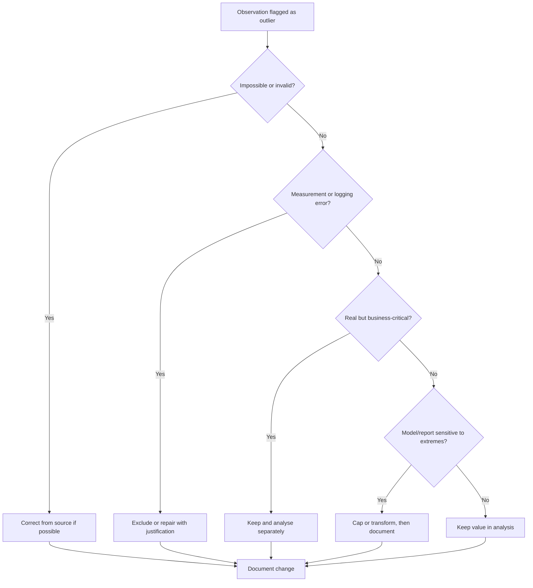

# M3 — Instructor Guide: Descriptive Statistics
> 90-minute lesson | Dataset: `students_scores.csv` | All levels
> **Oral checkpoint at end of this module**

---

## Learning Objectives

By end of session, students can:
1. Compute and interpret the full suite of descriptive statistics (mean, median, mode, std, skewness, kurtosis)
2. Explain when to use median vs mean based on distribution shape
3. Demonstrate (not just state) why visualisation must accompany summary statistics — using Anscombe's Quartet
4. Identify outliers using IQR, z-score, and visual methods
5. Compute and interpret the Coefficient of Variation for cross-column comparison
6. Frame outlier decisions as business decisions, not purely statistical ones

---

## Lesson Outline

| Time | Activity | Notes |
|------|----------|-------|
| 0:00–0:10 | M2 recap — git log, environment check | Quick demo from one student |
| 0:10–0:25 | **L3.1** — Beyond `describe()`: skewness, kurtosis, value_counts | Live demo: `students_scores.csv` |
| 0:25–0:40 | **L3.2** — Mean vs median: when distributions decide | Use exam scores (nearly normal) vs a salary column |
| 0:40–0:55 | **L3.4** [AI-OFF] — Anscombe's Quartet demo | Students compute stats; then plot; then explain the contradiction |
| 0:55–1:05 | **L3.5** — Five-number summary and box plot interpretation | Focus on skewness signals from box plots |
| 1:05–1:15 | **L3.6** — Coefficient of Variation for cross-column comparison | Compare spread across different score columns |
| 1:15–1:20 | **L3.3** — Outlier detection as a business decision | When is a score of 5/100 a data error vs a real result? |
| 1:20–1:30 | **Oral checkpoint prep** — students pair up and explain their findings | Structured questions below |

---

## Key Concepts (with Lesson IDs)

### L3.1 — Beyond `describe()` `[McKinney Ch5 p.140–160]`
#### Why `describe()` is only the first checkpoint
`df.describe()` earns its place because it compresses a large numeric table into something you can scan in seconds. Count tells you where values are missing, quartiles hint at spread, and the range immediately exposes impossible minimums or suspicious maximums. In an exploratory workflow, that speed matters because it helps you decide where to look next.

The danger appears when people treat that first table as a verdict rather than a briefing. Two columns can share a similar mean and standard deviation while hiding very different shapes: one may be balanced, another heavily skewed, and a third split into separate clusters. `describe()` is the opening question, not the final answer.

#### Skewness gives direction to asymmetry
Skewness adds a measure of direction to the idea of shape. In compact form, sample skewness can be written as `g1 = (1/n) Σ((xi - x̄)/s)^3`, and the population version is often shown as `E[((X - μ)/σ)^3]`. A positive result means the right tail is longer, while a negative result means the left tail is longer.

The important insight is interpretive rather than mechanical. If a few unusually high values stretch the right side, the mean is often pulled above the median and the "average" starts to sound more typical than most cases really are. When response times, prices, or incomes are involved, that shift can change the story you tell to a manager or client.

#### Kurtosis warns about tail risk
Kurtosis focuses on tail heaviness and the frequency of extreme observations. A common formula for excess kurtosis is `g2 = (1/n) Σ((xi - x̄)/s)^4 - 3`, while the population form is `E[((X - μ)/σ)^4] - 3`. Pandas reports excess kurtosis, so values near zero resemble a normal distribution, positive values suggest heavier tails, and negative values suggest lighter tails.

In practice, kurtosis matters whenever rare events are costly. A classroom score column with positive excess kurtosis may contain more very low and very high scores than a normal curve would suggest, which changes how you think about interventions. In operations or finance, heavy tails are a reminder that "unusual" outcomes may happen often enough to plan for.

#### Numeric summaries still need categorical context
A complete summary is not only about continuous variables. Columns such as `grade`, `campus`, or `attendance_band` need frequency tables because imbalance across categories can completely change how you interpret the numeric story. `value_counts(normalize=True)` gives a quick view of whether a category is dominant, rare, or missing in suspicious ways.

This matters because analysts often jump from a numeric average to a broad conclusion about the whole dataset. If 70% of rows belong to one grade band or one campus, the overall mean may mostly describe that subgroup. Good descriptive work alternates between numeric columns and categorical composition so the dataset is read as a population, not a spreadsheet.

#### Worked example: the same average, two different classes
Imagine two exam columns, both with a mean around 68 and a standard deviation around 12. In Class A, most students cluster around the centre and the histogram looks balanced. In Class B, many students score in the 50s, a few high achievers score near 100, and the right tail stretches far enough to pull the mean upward.

`describe()` makes those classes look similar, but skewness and kurtosis change the interpretation. Class A suggests a fairly typical assessment, while Class B suggests a mixed classroom where a headline average hides very different student experiences. Once you see that difference, you can ask better questions about teaching, assessment design, or support needs.

#### Code in practice
A strong habit is to move from broad summary to shape-aware checks in a consistent order. First scan the numeric table, then quantify asymmetry and tail behaviour, then inspect category balance, and finally plot everything you think you understand. That sequence reduces the risk of over-trusting a tidy table.

The code below keeps the original classroom workflow and extends it with explicit printing and a rendered plot. The expansion matters because students should see these commands as one connected routine rather than isolated tricks.

```python
import pandas as pd
import matplotlib.pyplot as plt

df = pd.read_csv('data/students_scores.csv')

# Step 1: describe() — starting point only
summary = df.describe()
print(summary)

# Step 2: go further
print(df.skew(numeric_only=True))      # positive skew = right tail = mean > median
print(df.kurtosis(numeric_only=True))  # larger values = heavier tails / more extreme observations

# Step 3: categoricals
print(df['grade'].value_counts(normalize=True).mul(100).round(1))

# Step 4: always plot
df.hist(bins=30, figsize=(12, 8), edgecolor='none', alpha=0.7)
plt.tight_layout()
plt.show()
```

#### Common mistakes
One common mistake is reading skewness as a quality score, as if values near zero automatically mean the data is "good." Skewness only tells you about asymmetry; a bimodal column can have skewness near zero and still be highly misleading if you report one overall mean. Another mistake is comparing kurtosis values without remembering that pandas uses excess kurtosis, not raw fourth moments.

Students also often treat a single metric as decisive. A slightly positive skew does not force you to abandon the mean, and a high kurtosis value does not prove bad data. The right habit is to combine summary statistics with plots, business context, and basic data-quality checks before making a judgment.

#### Connections to later work
These ideas carry directly into feature engineering and modelling. Highly skewed variables often need log transforms or robust summaries, and heavy-tailed features can make models more sensitive to rare cases than expected. The same descriptive questions you ask now become preprocessing decisions later.

They also connect to communication. When you choose mean, median, box plot, or histogram in a report, you are deciding which story about typical behaviour and variability the audience will hear. Learning to move beyond `describe()` is really learning to justify the statistical language you use.

#### Practice questions
Use this lesson to practise explaining, not just computing. If you can describe what skewness and kurtosis are doing in plain language, you are far less likely to misuse them when the dataset becomes larger or messier.

A strong answer should connect the statistic to the plot and then to a reporting choice. The goal is not to recite a definition, but to show how shape would change the sentence you write in a notebook or report.

Try these prompts in writing or discussion: 1) Find a numeric column where `describe()` looks harmless but the histogram changes your interpretation. 2) Explain what a positive skewness value would mean for the relationship between mean and median in that column. 3) Identify one categorical column whose frequency balance should be reviewed before reporting an overall average.

### L3.2 — Mean vs median: distributions decide `[McKinney Ch5 p.160–170]`
#### Choose the summary that matches the shape
A measure of centre is never neutral; it makes a claim about what counts as "typical." The mean treats every value as equally influential because it uses their exact magnitudes, while the median cares only about order and the middle position. The better choice depends on the shape of the distribution you are trying to summarise.

This is why analysts should stop asking which measure is universally better. The real question is which one stays honest when the data are symmetric, skewed, or contaminated by extremes. Distribution shape decides because centre only makes sense relative to how values are arranged around it.

#### Symmetric distributions usually reward the mean
When a distribution is roughly symmetric and unimodal, values above and below the centre balance one another. In that situation, the mean uses all the information in the data without being dragged unfairly to one side, so it often gives the clearest classroom or business summary.

A quick sketch makes the idea memorable:

```text
Symmetric distribution
       ▁▃▆█▆▃▁
            ^
      mean = median
```

When the shape really behaves like this, mean and median usually tell almost the same story. The mean is efficient because the high and low sides counterbalance rather than tugging in one direction, so reporting the average does not exaggerate one tail at the expense of the other.

#### Right-skewed distributions usually favour the median
Right-skewed distributions have a long tail of unusually large values. Those high observations pull the mean to the right, sometimes far enough that the "average" becomes larger than what most people or transactions actually experience. Salaries, house prices, and service delays often behave this way.

The position shift is easier to remember with a picture:

```text
Right-skewed distribution
       █▇▅▃▂▁▁▁
         ^ median
              ^ mean
```

In this shape, the median is usually the more faithful headline because it marks the halfway point instead of letting a few exceptional highs dominate the story. The mean is still useful when your question is about total cost or total revenue, but it should be paired with a clear warning that the right tail is doing real work.

#### Left-skewed distributions need the same discipline
Left-skewed data are less common in everyday examples, but the logic is identical. A long left tail means a few unusually low values drag the mean downward. This can happen when a cohort mostly performs well but a small number of very poor outcomes stretch the lower end.

The visual relationship simply flips direction:

```text
Left-skewed distribution
       ▁▁▁▂▃▅▇█
           ^ mean
                ^ median
```

In these cases, the median still protects the summary from being over-influenced by a small cluster of extreme lows. The mean may understate what most of the group experiences, so the analyst should explain that a handful of poor outcomes are pulling the arithmetic centre leftward.

#### Resistant summaries and the trimmed mean
The reason the median behaves so well under skew is that it is a resistant statistic. If one observation becomes much larger or much smaller, the median often stays put because the middle rank has not changed. The mean, by contrast, moves immediately because every value contributes directly to the arithmetic total.

A trimmed mean sits between the two. By dropping a fixed percentage from both tails before averaging, it keeps more numerical detail than the median while reducing the leverage of extreme points. That makes it a useful compromise when you want robustness without giving up the idea of averaging altogether.

#### Worked example: salaries versus exam scores
Imagine a class exam column with most scores between 55 and 85 and only a few mild extremes. In that setting, mean and median will usually sit close together, so reporting the average score feels fair and efficient. The shape supports the choice.

Now imagine a salary column for the parents of those students. Most households sit in a moderate income range, but a few very high earners stretch the right tail. The mean rises sharply, the median moves much less, and suddenly the question "What is a typical family income here?" has two very different answers depending on which measure you choose.

#### Code in practice
The safest classroom workflow is to compute more than one centre measure and then justify the one you foreground. Looking at mean, median, trimmed mean, and skewness together trains students to think in terms of evidence rather than habit.

This code supports that habit by placing the three summaries side by side. The useful output is not just the numbers themselves, but the explanation that follows them.

```python
from scipy.stats import trim_mean

scores = df['exam_score'].dropna()

print("Exam scores:")
print(f"  Mean:              {scores.mean():.1f}")
print(f"  Median:            {scores.median():.1f}")
print(f"  Trimmed mean 10%:  {trim_mean(scores, 0.1):.1f}")
print(f"  Skew:              {scores.skew():.3f}")

# Rule of thumb:
# |skew| < 0.5  → symmetric enough → mean usually OK
# |skew| > 1.0  → clearly skewed   → median usually better
# Income, house prices, response times → often skewed → check median first
```

#### Common mistakes
A very common mistake is treating the mean as automatically more sophisticated because it uses all the values. Using more arithmetic is not the same as telling a more truthful story. If the distribution is heavily skewed, the mean can become a statement about a few extremes rather than the typical case.

Another mistake is treating the median as a cure-all. Median hides the influence of outliers, but it also throws away information about magnitude. If the business question is about total revenue, total cost, or total demand, the mean may still be essential even when the distribution is skewed.

#### Connections to modelling and reporting
This lesson connects directly to how you choose loss functions and evaluation metrics later. Methods based on squared error often behave like the mean because they are sensitive to large deviations, while methods based on absolute error behave more like the median because they are more resistant. Centre measures are not just descriptive tools; they anticipate modelling behaviour.

It also connects to executive communication. A report that headlines mean salary may support one narrative about prosperity, while a report that headlines median salary may support another. Choosing the centre is part statistical judgment and part ethical communication.

#### Practice questions
Good practice comes from translating shapes into decisions. If you can look at a plot and defend the right centre measure in ordinary language, you are building a skill that transfers to dashboards, briefings, and notebooks alike.

The aim is to justify the choice with the observed distribution rather than with a memorised slogan. Compare your answer with a plot and ask whether the statistic you chose would still feel honest if a non-technical reader saw the full shape.

Try these prompts: 1) Name one variable in your dataset that you expect to be symmetric and defend why the mean is acceptable. 2) Name one variable that is likely right-skewed and explain why the median would be safer. 3) Explain when a trimmed mean would be a better compromise than either the plain mean or the median.

### L3.4 — Anscombe's Quartet `[Expert]` ⚠️ [AI-OFF]
#### Why Anscombe's Quartet still matters
Anscombe's Quartet is famous because it demonstrates a failure mode that appears constantly in real analysis: identical-looking summaries can hide fundamentally different structures. The four datasets were intentionally constructed to share nearly the same means, variances, and correlation, which makes the mismatch between the table and the plots impossible to ignore.

The lesson lands so strongly because it attacks a common beginner assumption. Students often believe that if the summary statistics match, then the datasets are basically the same. Anscombe shows that this belief breaks the moment nonlinearity, leverage, or outliers enter the picture.

#### Dataset I: the summary and the picture agree
The first panel behaves the way people expect a tidy statistical exercise to behave. The points form a roughly linear pattern, so the mean, variance, and correlation all feel aligned with the visual evidence. In other words, the summary is not wrong; it is simply incomplete.

This baseline matters because it gives students something stable to compare against. Without Dataset I, the later panels would feel abstract. With it, the quartet becomes a controlled experiment in what happens when the same numerical summary is produced by very different geometries.

#### Dataset II: curvature hiding behind a linear summary
The second dataset is the first real shock. The scatter plot bends into a curve, yet the correlation remains close to the value in Dataset I. That means the summary statistic is describing strength of association in a way that misses the fact that the relationship is not linear.

This is a valuable warning for regression work. A respectable correlation coefficient does not prove that a straight line is an appropriate model, and a stable mean does not prove the process is simple. Visual shape must be checked before the linear interpretation is trusted.

#### Dataset III: one outlier rewriting the story
The third dataset looks mostly linear until one unusual point changes how the fitted line behaves. This is the classic outlier lesson: a single observation can preserve the summary table while changing the relationship you think you have discovered. If you never look at the plot, you may attribute too much meaning to the apparent linear trend.

The practical consequence is serious. A model built on a pattern dominated by one aberrant case may generalise badly, and a business recommendation based on that model may chase noise rather than signal. Anscombe makes the cost of ignoring outliers visually obvious.

#### Dataset IV: leverage creating an illusion of correlation
The fourth dataset is often the most memorable because the apparent association is created almost entirely by one high-leverage point. Most of the observations form a vertical cluster with little relationship between `x` and `y`, yet one point far to the right manufactures the correlation. The summary statistic survives; the interpretation collapses.

This is the panel that teaches skepticism. Correlation can be mathematically correct and still practically misleading when leverage points dominate the fit. Students need to learn that a strong number is not the same as a strong argument.

#### Worked example: what could go wrong in practice
Imagine reporting that hours studied and exam score have a strong positive relationship because the correlation is around 0.8. If your data resemble Dataset II, the relationship may actually be curved, suggesting diminishing returns. If your data resemble Dataset IV, the relationship may be driven by one exceptional student rather than the class as a whole.

The wrong action follows naturally from the wrong summary. You might redesign study guidance, allocate tutoring resources, or claim evidence for a teaching policy based on a relationship that is either nonlinear or unstable. Anscombe's Quartet turns that risk into something concrete enough to remember.

#### Code in practice
This activity is intentionally marked `[AI-OFF]` because students need to experience the surprise directly. The educational value is not in obtaining the code quickly; it is in seeing the nearly identical summary table and then confronting the visual contradiction with their own eyes.

During discussion, press for interpretation rather than description. Ask students which dataset would be safest for linear modelling, which one is distorted by an outlier, and which one is dominated by leverage. The reasoning is the real outcome.

```python
# [AI-OFF] Students must complete this cell without AI assistance

import seaborn as sns

anscombe = sns.load_dataset('anscombe')

# Task 1: compute stats for all 4 datasets
stats = anscombe.groupby('dataset').agg(
    mean_x=('x','mean'), mean_y=('y','mean'),
    std_x=('x','std'),   std_y=('y','std'),
    corr=('x', lambda g: g.corr(anscombe.loc[g.index,'y']))
).round(2)
print(stats)

# Task 2: plot all 4
sns.lmplot(data=anscombe, x='x', y='y', col='dataset', col_wrap=2, height=4)

# Task 3 (markdown cell — no AI):
# "All four datasets have nearly identical summary statistics.
#  Write 2–3 sentences explaining what this tells you about relying
#  on summary statistics alone."
```

#### Common mistakes
One mistake is to treat Anscombe's Quartet as a historical curiosity rather than a living analytic habit. The quartet is not telling you that summary statistics are useless; it is telling you that summaries without plots are fragile. The goal is not to replace numbers with pictures, but to combine them responsibly.

Another mistake is to focus only on the shock value of "same statistics, different plots" without naming the specific structural differences. Students should leave able to say: this panel is curved, this one has an outlier, this one has leverage. Precision in language prevents the lesson from becoming a slogan.

#### Connections to later work
The quartet connects directly to model diagnostics. Residual plots, influence measures, and leverage statistics all exist because a regression summary can look convincing while the data structure is telling a different story. What begins here as a plotting habit becomes later a formal diagnostic workflow.

It also connects to communication and reproducibility. When analysts include both a summary table and a visualization, they give readers a way to challenge or confirm the interpretation. That makes the analysis more trustworthy and easier to audit.

#### Practice questions
The best practice questions ask students to move from observation to implication. Naming what the plot looks like is only the first step; the stronger skill is explaining what bad decision would follow if you stopped at the table.

Students should practise attaching each visual pattern to a modelling or reporting consequence. That habit turns the quartet from a memorable curiosity into a reusable analytic checkpoint.

Try these prompts: 1) Which of the four datasets is most appropriate for a simple linear model, and why? 2) Which dataset shows an outlier changing the relationship, and what false conclusion might that create? 3) Which dataset shows leverage, and how would you explain that risk to a non-technical stakeholder?

### L3.5 — Five-number summary and box plots `[Expert]`
#### The five numbers that anchor a distribution
The five-number summary gives you a compact but surprisingly rich description of a variable: minimum, Q1, median, Q3, and maximum. Instead of focusing on exact distances from the mean, it describes where the data begin, where the middle half sits, and where the extremes end. That makes it an especially useful first summary for skewed or noisy data.

Each number answers a slightly different question. The minimum and maximum show the observed range, Q1 and Q3 frame the central bulk of the data, and the median marks the halfway point. Read together, they provide a resistant sketch of distribution shape without assuming normality.

#### Quartiles create a resistant map of the middle
Quartiles are positional markers, not arithmetic averages. Q1 is the 25th percentile, the median is the 50th percentile, and Q3 is the 75th percentile, so they divide the sorted data into four equal parts by count. Because quartiles depend on order, a single extreme value changes them far less than it changes the mean or standard deviation.

This is why the five-number summary works so well on real-world data. If one student enters a score of 999 by mistake, the maximum explodes but Q1, median, and Q3 may stay almost unchanged. That separation helps you distinguish what is typical from what is merely extreme.

#### IQR and the box-plot fences
The interquartile range is defined as `IQR = Q3 - Q1`, which measures the spread of the middle 50% of the data. A small IQR means the central observations are packed tightly together, while a large IQR means typical values are more dispersed even before you look at the tails.

Standard box plots extend this with outlier fences: `Lower fence = Q1 - 1.5 × IQR` and `Upper fence = Q3 + 1.5 × IQR`. Values beyond those limits are flagged as potential outliers, not automatically bad rows. The fence is a screening device that tells you where to inspect more carefully.

#### Reading a box plot line by line
A box plot becomes much easier once you learn to decode it piece by piece. The box spans from Q1 to Q3, the line inside marks the median, and the whiskers extend toward the most typical extreme values that still fall within the fence rules. Points beyond the whiskers are the observations asking for extra attention.

Shape signals also appear in the geometry. If the median sits low in the box and the upper whisker stretches farther, the variable often has positive skew. If the median sits high in the box and the lower whisker is longer, negative skew is more likely. A box plot does not show every detail, but it is excellent at summarising centre, spread, and asymmetry quickly.

#### Comparing groups with box plots
One box plot is useful; several aligned box plots are often better. When you compare classes, campuses, or product lines side by side, the eye can quickly detect shifts in median, different IQR widths, and unequal numbers of flagged points. That makes box plots one of the most efficient comparison tools in descriptive analysis.

The trade-off is that box plots compress detail. They will not show multimodality as clearly as a histogram or density plot, so they should often be paired with another view when the internal shape matters. Think of them as comparison instruments rather than full portraits.

#### Worked example: exam scores with a long upper tail
Suppose a class has scores mostly between 58 and 78, a median of 67, and a small group of students scoring in the 90s. The five-number summary quickly shows where the middle of the class sits, while the IQR tells you how tightly the majority are grouped. A long upper whisker and a few high points would suggest that strong performers are stretching the top end.

That interpretation is different from simply saying the average score is 69. The average sounds like one classroom, while the box plot suggests a tighter middle with a distinct cluster of high performers. For teaching decisions, that difference matters because it points toward enrichment rather than broad remediation.

#### Code in practice
The code below links every printed quantity to a visual object. Students should read the values first, estimate what the box plot ought to look like, and only then render the chart. That small pause helps them connect arithmetic and visualization rather than treating the plot as decoration.

It also reinforces vocabulary. Saying "the median is closer to Q1" or "the upper fence is far above Q3" becomes much easier once the numbers and the picture are seen together.

```python
import seaborn as sns

# Five-number summary
q1, q3 = df['exam_score'].quantile([0.25, 0.75])
iqr = q3 - q1
lower_fence = q1 - 1.5 * iqr
upper_fence = q3 + 1.5 * iqr

print(f"Min:    {df['exam_score'].min()}")
print(f"Q1:     {q1}")
print(f"Median: {df['exam_score'].median()}")
print(f"Q3:     {q3}")
print(f"Max:    {df['exam_score'].max()}")
print(f"IQR:    {iqr}")
print(f"Fences: [{lower_fence:.1f}, {upper_fence:.1f}]")

# Box plot interpretation signals:
# Median closer to Q1 → often positive skew
# Median closer to Q3 → often negative skew
# Many points beyond whiskers → potential outliers / heavy tails
sns.boxplot(data=df, orient='h')
```

#### Common mistakes
A common error is to talk as if every point beyond a whisker is wrong data. Box plots do not diagnose cause; they only flag unusual position relative to the quartiles. Some extreme points are data-entry problems, but others are the most important real cases in the dataset.

Another mistake is to over-read the plot. A box plot can suggest skewness, but it cannot reveal everything about bimodality or clustering. Students should learn to use it as a summary view and then switch to histograms or scatter plots when they need more structural detail.

#### Connections to robust statistics
The five-number summary connects naturally to robust statistics because it relies on medians and quartiles rather than mean and variance alone. That makes it a useful bridge into later discussions about robust scaling, median absolute deviation, and resistant modelling choices.

It also connects to business reporting. Many dashboards use box plots to compare branches, teams, or products because they communicate variability and outliers quickly without overwhelming the audience. Learning to read them well improves both analysis and presentation.

#### Practice questions
Practise turning the geometry of a box plot back into words. The more fluently you can explain what the box, median line, whiskers, and flagged points mean, the easier it becomes to spot when a summary is hiding a more complicated story.

A strong response should move from numbers to picture to decision. Students should be able to say what the IQR means, what the whiskers suggest, and what follow-up check would be appropriate before acting on any flagged points.

Try these prompts: 1) Compute the five-number summary for a score column and explain what the IQR says about the middle 50%. 2) Decide whether the plot suggests positive skew, negative skew, or rough symmetry, and justify your choice. 3) If several points lie beyond the upper fence, explain what you would investigate before deciding whether to remove them.

### L3.6 — Coefficient of Variation `[Expert]`
#### Why raw standard deviations can mislead
Standard deviation measures spread in the original units of a variable. That is perfectly appropriate when you stay inside one column, but it becomes hard to compare across variables with different scales. A variability of 10 points means something very different when the average is 12 than when the average is 500.

This is where analysts often make an intuitive mistake. They look at the larger standard deviation and assume it signals the less stable process, even when the underlying mean is dramatically larger. Absolute spread is not the same thing as relative instability.

#### The CV formula turns spread into a relative measure
The Coefficient of Variation solves that comparison problem by dividing spread by level: `CV = (s / x̄) × 100%`. Here `s` is the sample standard deviation and `x̄` is the sample mean. Because the result is expressed as a percentage, it tells you how large the typical wobble is relative to the typical value.

That percentage interpretation is powerful. A process with mean 100 and standard deviation 10 has `CV = 10%`, while a process with mean 5 and standard deviation 3 has `CV = 60%`. The second process varies much more relative to its own scale, even though its raw standard deviation is smaller.

#### Relative variability makes cross-column comparison fairer
CV is especially useful when columns live in different units or magnitudes. You can compare exam scores, attendance counts, and assignment completion rates more fairly once each spread is translated into a relative percentage. The unitless nature of CV makes it a practical ranking tool.

This does not mean CV replaces standard deviation. It answers a different question. Standard deviation asks about absolute spread in the original units; CV asks whether that spread is large or small relative to the average level. Good analysts know which of those questions the stakeholder actually cares about.

#### When CV is the wrong tool
CV becomes unstable when the mean is zero or very close to zero because you are dividing by something tiny. In that situation, a modest amount of noise can explode into a misleading percentage. Variables with meaningful negative values can also make interpretation awkward, because "relative to the mean" stops being straightforward.

The lesson is not to force CV everywhere. If a column can be negative, crosses zero regularly, or has a mean so small that the ratio becomes erratic, a different spread measure such as SD, IQR, or a domain-specific reliability metric is usually safer.

#### Worked example: two classes with different baselines
Imagine Class A has an average quiz score of 80 with a standard deviation of 8, while Class B has an average of 20 with a standard deviation of 6. Looking only at standard deviations, the classes appear similarly variable. Once you compute CV, however, Class A is at 10% and Class B is at 30%.

That changes the interpretation. Class B is much less consistent relative to its own performance level, even though its raw spread is slightly smaller. The teacher who only reads SD may miss which class has the more unstable learning outcomes.

#### Code in practice
The code below calculates CV across all numeric columns and ranks them from most relatively variable to least. That ranking is a fast way to identify which measurements deserve further investigation, especially when the dataset mixes very different scales.

The important follow-up is interpretive. A high CV may indicate genuine volatility, but it may also indicate a tiny mean, a skewed process, or a data-quality problem. The statistic starts the conversation; it does not finish it.

```python
# CV = std / mean — normalises spread for cross-column comparison

cv = (df.std(numeric_only=True) / df.mean(numeric_only=True) * 100).sort_values(ascending=False)
print("Coefficient of Variation (%):")
print(cv.round(1))

# Example interpretation:
# mean=100, std=10  → CV=10%
# mean=5,   std=3   → CV=60%
# The second column is more variable relative to its own scale.
```

#### Common mistakes
One common mistake is to use CV on any column without checking whether the mean makes the ratio meaningful. If the mean is near zero, the statistic can become so unstable that the ranking is more noise than insight. Students should learn to inspect the denominator before trusting the percentage.

Another mistake is to present CV as if it were automatically more informative than standard deviation. Sometimes the absolute units matter more than the relative percentage, especially in budgeting, capacity planning, or safety thresholds. CV is a tool for comparison, not a universal replacement.

#### Connections to operations and risk
CV connects naturally to operational thinking because many real decisions are about consistency relative to baseline. A product with lower average sales but much higher CV may be harder to forecast. A cohort with high CV in quiz performance may need differentiated support even if the mean looks acceptable.

It also connects to later modelling choices. Features with extremely different relative variability may need scaling or separate interpretation, and unstable variables often deserve extra scrutiny before they are used in comparisons or dashboards.

#### Practice questions
To practise CV well, always pair the computation with a sentence that interprets the ratio in context. That habit prevents the statistic from becoming an abstract percentage detached from the real process you are studying.

The goal is to compare relative instability without forgetting the denominator. Students should explain both what the percentage says and why CV is or is not appropriate for the specific variable under discussion.

Try these prompts: 1) Find two numeric columns with different means and compare their CVs. 2) Explain why the column with the larger standard deviation is not always the more variable one in relative terms. 3) Identify one situation in your dataset where CV would be a poor choice because the mean is too small or the values can be negative.

### L3.3 — Outlier detection as a business decision `[Géron Ch2 p.55–65]`
#### Detecting an outlier is not the same as deciding what to do
An outlier is an observation that looks unusual relative to the rest of the data, but "unusual" is only the start of the conversation. Statistics can flag a value; they cannot, by themselves, tell you whether the value is wrong, rare-but-real, or strategically important. That second step requires domain knowledge.

This is why outlier work should be framed as a business decision, not a cleanup reflex. Removing a true extreme can erase the most important case in the dataset, while keeping a recording error can distort every average, model, and downstream decision. Detection is technical; treatment is managerial.

#### The IQR rule is a robust first pass
The IQR method is often the safest starting point because it does not assume a normal distribution. You compute `IQR = Q3 - Q1`, then flag values below `Q1 - 1.5 × IQR` or above `Q3 + 1.5 × IQR`. Because quartiles are resistant to extremes, the method works reasonably well on messy real-world data.

The strength of the rule is its simplicity. It gives you a first shortlist of observations that deserve inspection without pretending to know why they are unusual. For many classroom, retail, or operational datasets, that shortlist is more useful than a complex method applied without context.

#### Z-score frames distance from the mean
A Z-score measures how far a value sits from the mean in standard-deviation units: `z = (x - μ) / σ`, or in sample language `z = (x - x̄) / s`. A common screening rule is to flag observations where `|z| > 3`, though the threshold depends on context. This works best when the distribution is roughly symmetric and bell-shaped.

The limitation is just as important as the formula. If the data are heavily skewed or already distorted by extreme values, the mean and standard deviation can move in response, making the Z-score less trustworthy. That is why it should be used as one lens among several, not as an automatic judge.

#### Visual inspection exposes structure that rules can miss
Histograms, box plots, and scatter plots often reveal patterns that numeric rules alone cannot capture. A flagged point may belong to a separate cluster, a seasonal pattern, or a subgroup that should be analysed separately rather than removed. Visual inspection keeps you alert to the possibility that the data structure itself is more complicated than one rule assumes.

This matters because the same numeric value can be ordinary in one subgroup and bizarre in another. A score of 5/100 may be plausible in a very difficult diagnostic test but suspicious in a simple quiz with open-book retakes. Plots do not replace rules; they tell you whether the rule is being applied to the right story.

#### A decision tree keeps the business question visible
Once a value is flagged, the useful next step is not immediate deletion but structured questioning. Ask whether the point is impossible, whether it can be verified from source records, whether it represents a known exception, and whether the decision context requires preserving extremes or smoothing them.

The decision tree below is intentionally practical. It turns a vague instruction like "handle outliers" into a series of documented choices that can be explained to teammates, instructors, or auditors.



#### Worked example: a score of 5/100
Suppose a student score of 5/100 is flagged by both the IQR rule and the Z-score rule. If this exam was a high-stakes diagnostic test taken under timed conditions, that score may be entirely real and educationally important. Removing it would make the class look stronger than it actually is.

Now change the context: the score came from an online quiz where the student usually scores above 70, and the raw export shows the quiz was submitted after ten seconds because of a browser crash. The same value now looks more like a process failure than a meaningful outcome. The business decision changes because the context changed.

#### Code in practice
The code below deliberately compares an IQR-based screen with a Z-score-based screen. Agreement between the two methods can increase confidence that a point is unusual, but disagreement is also informative because it hints at skewness, heavy tails, or subgroup effects.

After running the code, the real work begins: inspect the flagged rows and write down your treatment rule. A reusable outlier policy is always stronger than ad hoc row deletion because it can be explained and repeated.

```python
from scipy import stats

scores = df['exam_score'].dropna()
q1, q3 = scores.quantile([0.25, 0.75])
iqr = q3 - q1
lower = q1 - 1.5 * iqr
upper = q3 + 1.5 * iqr

iqr_flags = df[(df['exam_score'] < lower) | (df['exam_score'] > upper)]
z_scores = stats.zscore(scores, nan_policy='omit')
z_flags = scores[abs(z_scores) > 3]

print(f"IQR rule flagged {len(iqr_flags)} rows")
print(f"Z-score rule flagged {len(z_flags)} values")
print(f"IQR fences: [{lower:.1f}, {upper:.1f}]")
```

#### Common mistakes
The biggest mistake is to equate unusual with wrong. In fraud detection, equipment failure, or student intervention work, extreme values are often the cases you most need to keep. Automatically removing them can make the analysis neater and the decision worse.

Another mistake is failing to document the rule used. If one analyst deletes rows with `|z| > 3` while another caps values beyond the IQR fence, the results are no longer comparable. Good outlier handling includes both a method and a written rationale.

#### Connections to modelling and governance
This lesson connects directly to data governance because outlier decisions affect fairness, reproducibility, and auditability. If a model is trained after silent row deletion, later users may not understand why the training data no longer represent the real population. Documented policies reduce that risk.

It also connects to robust modelling choices. Transformations, winsorisation, and tree-based models all respond differently to extremes. Knowing whether an outlier is error, rare event, or meaningful segment helps you choose the right next analytic step.

#### Practice questions
Strong practice means forcing yourself to justify the action after the detection step. A student who can name an outlier method but cannot defend what should happen next has learned the mechanics without the decision-making.

The best answers make the policy explicit: what evidence would trigger correction, what evidence would justify keeping the point, and how the final decision would be documented for others. That turns a one-off judgment into a reproducible process.

Try these prompts: 1) Find one flagged observation and explain whether it should be corrected, removed, capped, or kept. 2) Compare what the IQR rule and Z-score rule identify in the same column and explain any difference. 3) Use the decision tree to describe how you would document an outlier policy for a real report or model.


---

## Local AI Integration

### How Gemma 4n supports M3
Descriptive statistics is where learners first encounter the gap between "knowing a formula" and "understanding what it means." Gemma 4n serves as a misconception checker — learners write their interpretation of a statistical result (mean, median, standard deviation, skewness), then ask AI to verify whether the interpretation is correct.

Critically, M3 contains two [AI-OFF] cells: the Anscombe's Quartet analysis and the CV interpretation. These are intentionally blocked because they require the learner to develop their own statistical intuition. AI can help before and after these cells — but never during.

### What to use AI for in M3 (🤖 ai-assisted)
- STATS-VERIFY: paste your interpretation of a mean, median, or standard deviation and ask AI to check it
- MISCONCEPTION-CHECK: test whether your understanding of a concept is correct before submitting
- EXPLAIN: ask AI to explain a concept (e.g., "what does a high coefficient of variation mean?")
- After completing an [AI-OFF] cell, ask AI to review your reasoning in retrospect

### What NOT to use AI for in M3 (⊘ ai-off)
- Lab 3.2: Anscombe's Quartet — analysis must be done independently
- Quiz 3: Descriptive stats — the quiz is [AI-OFF]
- CV interpretation cell — must be written without AI assistance first

### Approved prompt templates
See `prompts.md` for STATS-VERIFY, MISCONCEPTION-CHECK, and EXPLAIN templates.

---

## New Lessons Integrated

| ID | Lesson | Type | Cell type |
|----|--------|------|-----------|
| L3.4 | Anscombe's Quartet | Expert addition | [AI-OFF] |
| L3.5 | Five-number summary & box plot reading | Expert addition | AI allowed |
| L3.6 | Coefficient of Variation | Expert addition | AI allowed |

---

## Oral Checkpoint — End of M3

### Questions for each student (5 min each)

1. "Open your notebook. Point to a column where the mean is a bad measure of centre. How do you know?"
2. "Show me your Anscombe's Quartet output. Why are four datasets with the same mean and correlation completely different? What does this mean for your practice?"
3. "You found a student with a score of 2/100. Walk me through your decision process — data error or real observation?"
4. "Which column in `students_scores.csv` has the highest relative variability? How do you know, and what does that mean?"

### Instructor scoring for oral checkpoint
- Full marks: student can explain the concept without referring to notes
- Partial: can explain with notes
- Fail: cannot explain the concept at all (AI misuse suspected — flag for review)

---

## AI Integration (M3)

**Allowed prompts:** `EXPLAIN`, `SCAFFOLD`, `REVIEW`

**[AI-OFF] cells:**
- Anscombe's Quartet computation and written explanation (L3.4)
- CV interpretation markdown cell (L3.6 partial)

---

## Common Misconceptions to Flag

- **"`describe()` is enough"** → It hides shape, multimodality, and impossible distributions
- **"outliers should always be removed"** → Outlier treatment is a business decision; removing data changes your population
- **"high correlation means strong relationship"** → Anscombe dataset IV shows r=0.816 with a nonlinear relationship
