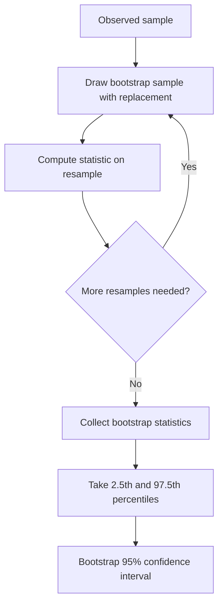
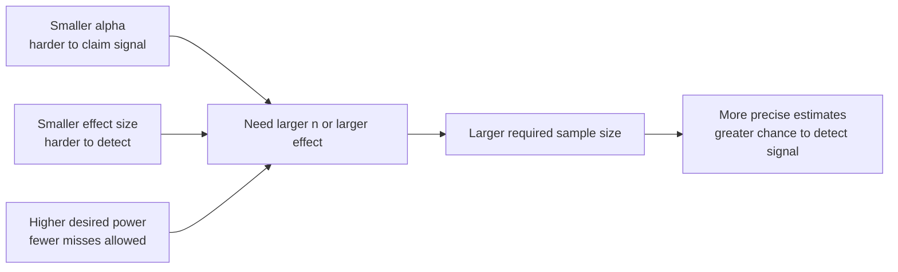
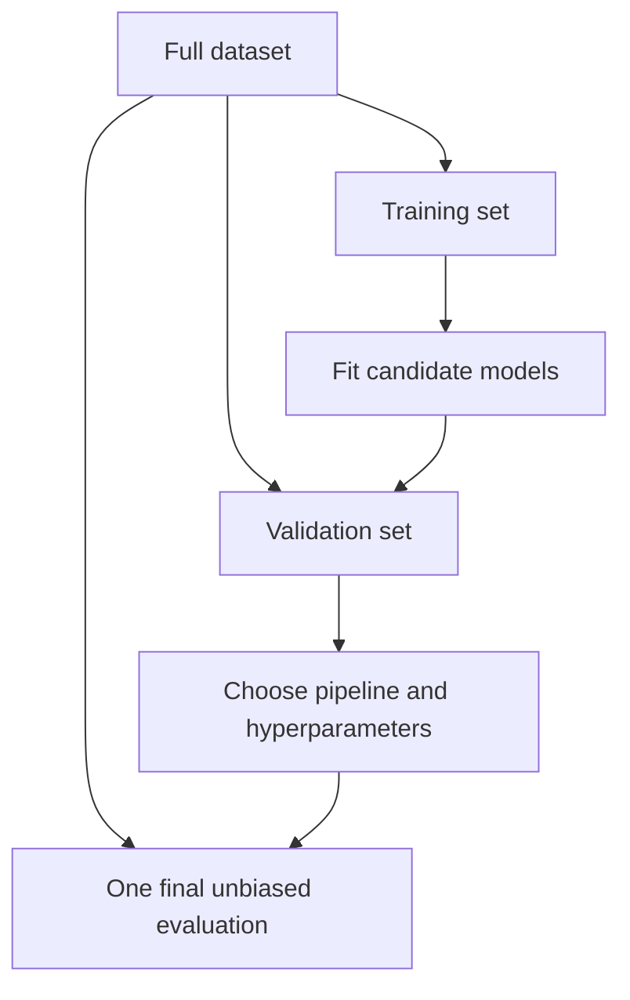

# M4 — Instructor Guide: Inferential Statistics
> 90-minute lesson | Dataset: `students_scores.csv` | Developer depth

---

## Learning Objectives

By end of session, students can:
1. Simulate the Central Limit Theorem and explain why it works
2. State the correct interpretation of a confidence interval (not the common misconception)
3. Distinguish Standard Error from Standard Deviation and know when to use each
4. Compute a bootstrap confidence interval without distributional assumptions
5. Apply stratified sampling when populations are skewed
6. Conduct a basic power analysis to determine required sample size

---

## Lesson Outline

| Time | Activity | Notes |
|------|----------|-------|
| 0:00–0:10 | M3 oral checkpoint debrief — what patterns did you see? | 2–3 student examples |
| 0:10–0:25 | **L4.3** [AI-OFF] — CLT simulation: exponential population → normal sample means | Students write the loop themselves |
| 0:25–0:40 | **L4.4** — Correct CI interpretation: the "100 experiments" mental model | Emphasise what it does NOT mean |
| 0:40–0:50 | **L4.5** — SE vs SD: definitions, formulas, when each applies | Use students_scores.csv |
| 0:50–1:05 | **L4.2** — Bootstrap CI: no distributional assumptions required | Live code + run for students_scores |
| 1:05–1:15 | **L4.1** — Stratified sampling for skewed populations | Quick demo with pd.cut() |
| 1:15–1:25 | **L4.6** — Power analysis: how many samples do I need? | statsmodels demo |
| 1:25–1:30 | Preview M5 — from description to decision | |

---

## Key Concepts (with Lesson IDs)

### L4.3 — CLT Simulation `[Expert]` ⚠️ [AI-OFF]
#### Why this theorem feels counterintuitive
The Central Limit Theorem matters because it asks students to separate two ideas that beginners naturally fuse together: the shape of the **population** and the shape of the **sampling distribution of the mean**. A population can be visibly skewed, jagged, or heavy-tailed, and yet the average computed from many repeated samples can still settle into a much smoother bell-shaped pattern. That contrast is the intellectual payoff of the lesson.

Using an exponential population makes the point hard to miss. Students can see that nothing about the raw population has become symmetric; the raw data stay lopsided the whole time. What changes is the behaviour of the **mean** across repeated samples, which is exactly the quantity that later supports interval estimation and hypothesis testing.

#### The formal CLT statement
For independent observations with population mean $\mu$ and finite variance $\sigma^2$, the CLT states that

$$
\frac{\bar{X}_n - \mu}{\sigma / \sqrt{n}} \xrightarrow{d} N(0,1)
$$

as $n$ becomes large. An equivalent classroom-friendly version is that, for sufficiently large $n$, the sample mean is approximately distributed as

$$
\bar{X}_n \approx N\left(\mu, \frac{\sigma^2}{n}\right).
$$

The assumptions matter. Independence matters because repeated information is not the same as new information, and finite variance matters because some extreme heavy-tailed settings do not settle down in the usual way. For most applied data problems students meet in an introductory workflow, however, the theorem is a powerful and practical approximation.

#### Population shape versus mean shape
A useful teaching move is to keep asking, “What object are we plotting?” When students look at the histogram of the raw exponential population, they are looking at **individual observations**. When they look at the histogram of 10,000 sample means, they are looking at **one summary statistic repeated across many hypothetical samples**.

Those two histograms answer different questions. The first describes what one student, customer, or measurement might look like. The second describes how the **average** would vary if the data collection process were repeated again and again. The theorem does not claim that the original data become normal; it claims that the distribution of the mean becomes tractable.

#### How the simulation should be read
The simulation is most informative when students compare several sample sizes side by side. With $n=5$, the sample-mean histogram often still shows visible skew because each mean is built from only a few observations. With $n=30$, the histogram usually looks much smoother and more symmetric. With $n=100$, the means are tightly clustered and the bell shape becomes even more convincing.

That progression illustrates two ideas at once. First, larger samples make the normal approximation stronger. Second, the spread of the sample means shrinks as $n$ grows, because averages based on more observations are more stable. Students should be asked not just whether the plot “looks normal,” but also why the histogram narrows as sample size increases.

```python
# [AI-OFF] — students complete the repeated-sampling line themselves
import numpy as np
import matplotlib.pyplot as plt

population = np.random.exponential(scale=2, size=100_000)
fig, axes = plt.subplots(1, 4, figsize=(16, 4))
axes[0].hist(population, bins=80, alpha=0.7, edgecolor='none')
axes[0].set_title('Population (exponential)')

for ax, n in zip(axes[1:], [5, 30, 100]):
    sample_means = _______________  # 10,000 sample means of size n
    ax.hist(sample_means, bins=60, alpha=0.7, edgecolor='none')
    ax.set_title(f'Sample means (n={n})')

plt.suptitle('Central Limit Theorem Simulation', fontsize=13)
plt.tight_layout()
```

#### Worked example: reading one run of the experiment
Suppose the exponential population has mean near 2 and a long right tail. In a run with 10,000 repeated samples, the $n=5$ sample means may still lean right, because a few unusually large observations can pull small-sample averages upward. Students should see that the means are already less extreme than the raw population, but not yet especially close to a textbook bell curve.

Now compare that with $n=30$ and $n=100$. The centre stays near the population mean, but the shape becomes smoother and the tails become less dramatic. That is the repeated-sampling story in action: the average keeps targeting the same population centre, while the sampling noise around that centre becomes more regular and easier to model.

#### Common mistakes to surface explicitly
A frequent mistake is saying that the CLT means “all data become normal when the sample size is large.” That statement is false. A large dataset drawn from a skewed population is still a large skewed dataset. The theorem is about the **distribution of the mean across repeated samples**, not the shape of the observed sample itself.

A second mistake is treating $n \ge 30$ as a law. It is only a rule of thumb. Mildly skewed data may behave well with smaller samples, while very heavy-tailed or strongly asymmetric data may need much larger ones. The right habit is to combine theory, context, and diagnostic plots rather than repeating a threshold mechanically.

#### Why this lesson connects to the rest of inference
Confidence intervals for means, $t$-tests, and many regression summaries all lean on the idea that an estimator has a predictable sampling distribution. The CLT is the bridge that explains why normal-based reasoning often works even when real-world data are messy. Once students accept that the mean has a repeated-sampling distribution, the logic of uncertainty quantification becomes much easier to teach.

The lesson also connects to machine learning workflows. Validation metrics, cross-validation averages, and bootstrap summaries all depend on thinking about a statistic as something that varies across hypothetical samples. In that sense, the CLT is not just a theorem for statistics class; it is part of the mental model behind reliable empirical work.

#### Questions students should practice answering
Ask students to explain, in words, why the histogram of sample means can look more normal than the histogram of the raw data even when both come from the same population. Then ask them to predict how the centre and spread of the sample-mean histogram will change as $n$ rises from 5 to 50 to 500.

A second strong practice prompt is to show two histograms—one of raw data and one of sample means—without labels and ask students to identify which is which. If they can justify the choice by talking about skew, concentration, and repeated sampling, they are reasoning about the theorem rather than memorising a slogan.

### L4.4 — Correct CI Interpretation `[Expert]` ⚠️ [AI-OFF for written cell]
#### The confidence level belongs to the method
A 95% confidence interval is best understood as a property of a **procedure** that can be repeated, not as a probability statement about one fixed parameter after the data have already been observed. If we repeatedly sampled from the same population in the same way and built an interval each time, about 95% of those intervals would capture the true parameter. That long-run performance is what “95% confidence” means.

This sounds picky at first, but it protects students from a deep conceptual mistake. In the frequentist frame, the population mean is fixed, even if unknown. The interval varies because different samples produce different endpoints. Once a particular interval has been computed, it either contains the parameter or it does not; the uncertainty lives in the procedure that generated the interval.

#### The formula and what each part represents
For a mean estimated with a $t$ interval, the common template is

$$
\bar{x} \pm t^* \times SE,
$$

where $\bar{x}$ is the sample mean, $t^*$ is the critical value tied to the desired confidence level, and $SE$ is the standard error of the mean. The formula is worth teaching slowly because it shows the interval as a centre plus and minus a margin of error.

Each component has a role in the repeated-sampling story. The sample mean marks where this sample landed, the standard error measures how much that estimate would typically move across repeated samples, and the critical value sets how cautious we want the procedure to be. A wider interval is not “better” in the abstract; it is simply the price paid for higher long-run coverage.

#### The 100-interval mental model
A reliable way to teach interpretation is to imagine running the whole study 100 times. Each time, collect a fresh sample, compute a fresh mean, and construct a fresh 95% confidence interval. If the procedure is well calibrated, roughly 95 of those intervals will cross the true mean and about 5 will miss it.

That picture makes two important points concrete. First, some correctly constructed intervals will still fail, because 95% is not 100%. Second, the confidence level is about the **collection of intervals** across many possible samples. The power of the mental model is that it shifts attention away from one interval as an object of belief and toward the sampling process that created it.

#### Worked example with exam scores
Suppose the sample mean exam score is 72.4, the standard error is 1.8, and the 95% interval comes out to $(68.8, 76.0)$. The correct interpretation is not that there is a 95% chance the true mean lies between 68.8 and 76.0. The correct interpretation is that the method used to generate this interval would capture the true population mean about 95% of the time over repeated samples from the same population.

That wording can feel less natural than the common mistake, so students need repeated practice saying it aloud. One useful coaching line is: “This interval is one output from a procedure with 95% long-run coverage.” It is concise, accurate, and keeps the focus on repeated sampling rather than on post hoc probability about a fixed unknown.

```python
from scipy import stats
import numpy as np

scores = df['exam_score'].dropna()
n = len(scores)
mean = scores.mean()
se = scores.std(ddof=1) / np.sqrt(n)
ci = stats.t.interval(confidence=0.95, df=n-1, loc=mean, scale=se)
print(f"Sample mean: {mean:.2f}")
print(f"95% CI: ({ci[0]:.2f}, {ci[1]:.2f})")
```

> **[AI-OFF] Written cell:** Explain the interval as long-run performance of the procedure, and avoid saying that the parameter has a 95% probability of being inside this specific interval.

#### The wrong interpretations to challenge directly
The most common incorrect sentence is, “There is a 95% probability that the true mean is in this interval.” That sentence treats the parameter as random after the data are observed, which is not the frequentist interpretation. It sounds plausible, so students often need to see why it is attractive before they can replace it with the correct idea.

A second incorrect sentence is, “95% of data points fall inside the confidence interval.” That confuses parameter uncertainty with data variability. Confidence intervals talk about plausible values for a parameter such as the population mean. If the question is about where individual future observations might land, the relevant tool is usually a prediction interval, not a confidence interval.

#### Why precision and interpretation can move separately
Students often assume that a narrow interval is automatically “good” and a wide interval is automatically “bad.” A narrower interval does indicate more precise estimation, but precision alone does not guarantee validity. A very narrow interval based on biased sampling or data leakage can be confidently wrong.

This is why interpretation cannot be separated from study design. Coverage guarantees are only meaningful when the sampling procedure and model assumptions are reasonable. The interval formula looks compact, but behind it sits the entire logic of measurement, sampling, and repeated experiments.

#### Connections to other interval ideas
It helps to contrast confidence intervals with two nearby ideas. A **prediction interval** is about where a new observation may fall, so it is typically wider because it must account for individual-level variability as well as uncertainty in the mean. A **credible interval** in Bayesian statistics answers a different question entirely, because it treats the parameter itself as uncertain under a posterior distribution.

Making those distinctions early improves communication later. Analysts regularly present intervals in meetings, reports, and dashboards, and their audience rarely asks which theory produced them. Clear wording is therefore part of technical correctness, not an optional layer added after the calculations are done.

#### Questions students should practice answering
A strong exercise is to give students three candidate interpretations of the same interval and ask them to select the correct one and rewrite the other two. This forces them to distinguish long-run coverage from parameter probability and from data coverage. The discussion is often more valuable than the arithmetic.

A second practice prompt is to ask what it means if one correctly computed 95% interval misses the truth. The right answer is that nothing is “broken”; occasional misses are built into the method. If students can explain that calmly, they understand confidence intervals as procedures rather than guarantees.

### L4.5 — SE vs SD `[Expert]`
#### Two spreads answering two different questions
Standard deviation and standard error are related numbers, but they live at different levels of the story. The **standard deviation (SD)** describes how far individual observations tend to lie from the sample mean. If exam scores vary widely from student to student, the SD will be large because the raw data cloud is spread out.

The **standard error (SE)** describes something narrower: how much the **sample mean** would vary across repeated samples. That makes SE a measure of estimator precision rather than a measure of person-to-person variability. Students need this distinction early, because both quantities are often summarised with the word “spread,” even though they answer different questions.

#### The key formula
For the sample mean, the standard error is

$$
SE(\bar{x}) = \frac{s}{\sqrt{n}},
$$

where $s$ is the sample standard deviation and $n$ is the sample size. The formula immediately shows why SE is tied to both variability and information: more variable data increase it, while more observations decrease it.

That structure is conceptually useful. SD tells us how noisy the underlying observations are, while dividing by $\sqrt{n}$ converts that raw variability into uncertainty about the mean. Put differently, SD is about the width of the data cloud; SE is about how precisely we know the cloud’s centre.

#### A geometric way to separate the ideas
Imagine plotting every student’s score on a number line. The SD is about how widely those points are scattered around the average score in the current sample. If high and low performers are both common, the SD reflects that visible spread regardless of how many students were sampled.

Now imagine repeating the whole sampling process many times and writing down only the sample mean each time. The SD of those repeated means would be the sampling variability of the mean, which is what the SE approximates. This is why SE is usually much smaller than SD: averages fluctuate less than individual observations.

#### Worked example using exam scores
Suppose a class sample has mean 72, standard deviation 12, and sample size 144. The SD of 12 says individual students often sit many points away from the class average. Some students score far above 72, some far below, and the observed data genuinely have substantial dispersion.

The SE, however, is $12 / \sqrt{144} = 1$. That value says the **estimated mean** is fairly stable across repeated samples of this size. The class is still diverse, but the average itself can be estimated with much more precision than any one student’s score can be predicted.

```python
import numpy as np

scores = df['exam_score'].dropna()
sd = scores.std(ddof=1)
se = sd / np.sqrt(len(scores))

print(f"Standard Deviation: {sd:.2f}")
print(f"Standard Error:     {se:.2f}")
print(f"n = {len(scores)}")
```

#### Why larger samples change SE but not SD
If we collect more students from the same population, the population’s natural variation does not disappear. Strong students remain strong, weak students remain weak, and the spread of individual scores stays governed by the underlying process. That is why SD does not systematically shrink just because the sample grows.

The sample mean behaves differently. As more observations are averaged together, unusually high and unusually low values increasingly offset one another, making the mean more stable. That stabilisation is exactly what the $\sqrt{n}$ in the denominator captures. Larger samples buy precision in the estimate, not uniformity in the population.

#### Common mistakes in reports and plots
One frequent reporting mistake is to place SE bars on a figure when the real goal is to show how dispersed the observations are. SE bars can look reassuringly small, but they may hide a very heterogeneous dataset. Readers then come away with a false sense that the individual data themselves are tightly clustered.

The opposite mistake is also common. Authors sometimes use SD bars when discussing uncertainty in the estimated mean, making the estimate look much less precise than it is. The cure is not just picking the “right” number; it is naming the quantity clearly and tying it to the exact question the graph or sentence is trying to answer.

#### Connections to confidence intervals and modelling
Confidence intervals for the mean are built from the SE, not the SD, because intervals target uncertainty in the estimated centre. Regression coefficients, average treatment effects, and many model summaries follow the same logic. Once students understand SE for the mean, they are already halfway to understanding standard errors for more complex estimators.

At the same time, SD remains essential in exploratory analysis. It helps describe distributions, compare subgroup variability, and reason about outliers. The two quantities are therefore partners rather than competitors: SD describes the data you saw, while SE helps quantify what you do and do not know from those data.

#### Questions students should practice answering
Ask students to compare two samples with the same SD but different sample sizes and predict which one has the smaller SE. Then reverse the exercise by keeping the sample size fixed and changing the SD. These small thought experiments reveal whether students can read the formula conceptually instead of mechanically.

A second strong prompt is to ask which quantity belongs in each sentence: “How variable are students?” and “How precise is our estimate of the average student score?” If students consistently map the first question to SD and the second to SE, the distinction has become operational.

### L4.2 — Bootstrap Confidence Interval `[McKinney Ch12 p.420–430]`
#### Why the bootstrap is such a practical idea
The bootstrap gives students a way to think about uncertainty without needing a closed-form sampling distribution for every statistic. Instead of solving a new algebra problem each time, we let computation approximate the repeated-sampling behaviour of an estimator. That makes the lesson especially valuable for statistics used in data work, where medians, quantiles, and custom metrics appear all the time.

The core move is simple but powerful: treat the observed sample as a provisional stand-in for the population. If that sample is reasonably informative, then repeatedly resampling from it can mimic the kind of variation we would expect to see across fresh samples. The bootstrap is therefore a computational answer to a conceptual question about repeated sampling.

#### What “with replacement” really means
A bootstrap sample is drawn **with replacement**, which means each selected observation goes back into the pool before the next draw. Because of that, one resample may repeat the same value several times while omitting other values entirely. Students often find this strange at first, but the weirdness is exactly what creates variability across bootstrap datasets.

This detail matters because sampling without replacement would merely reshuffle the original data and would not create new pseudo-samples of the same size. Replacement allows the resample to behave like a fresh draw from the empirical distribution defined by the data you actually observed. That empirical distribution is the bootstrap’s temporary substitute for the unknown population.

#### The bootstrap procedure at a glance
The percentile bootstrap for a 95% interval follows a clear loop: resample, recompute the statistic, store the result, and then read off the central percentiles of the resulting distribution. The statistic can be a mean, median, correlation, accuracy score, or any other quantity that can be computed repeatedly.



The diagram helps students see that the interval does not appear from a single formula. It emerges from a distribution created by many repeated computations. That is an important modelling habit: sometimes we learn about uncertainty by simulating the estimator rather than by deriving it symbolically.

#### Worked example with the sample mean
Suppose the observed exam scores are somewhat right-skewed and you want a confidence interval for the mean without leaning too heavily on a normal approximation. Draw 10,000 bootstrap samples, each the same size as the original dataset, compute the mean for each resample, and store those 10,000 means. The resulting histogram is an empirical approximation to the sampling distribution of the sample mean.

If the 2.5th percentile of those means is 69.1 and the 97.5th percentile is 75.6, the percentile bootstrap interval is $(69.1, 75.6)$. The interval is not magic; it is a summary of where the mean landed across thousands of plausible resampled datasets constructed from the data in hand.

```python
import numpy as np

data = df['exam_score'].dropna().values
rng = np.random.default_rng(seed=42)
n_bootstrap = 10_000

boot_means = np.array([
    rng.choice(data, size=len(data), replace=True).mean()
    for _ in range(n_bootstrap)
])

ci_lower = np.percentile(boot_means, 2.5)
ci_upper = np.percentile(boot_means, 97.5)
print(f"Bootstrap 95% CI: ({ci_lower:.2f}, {ci_upper:.2f})")
```

#### How to interpret the bootstrap distribution
The bootstrap histogram should be read like any other sampling-distribution approximation. Its centre tells you where the statistic usually falls under resampling, and its spread tells you how sensitive that statistic is to sampling variation. A tight bootstrap distribution signals a stable estimate, while a wide one signals more uncertainty.

It is also useful to compare the bootstrap interval with a classical $t$ interval for the same mean. If the two are similar, students see that bootstrap and analytic methods can agree. If they differ meaningfully, that becomes a chance to talk about skew, small samples, and the consequences of relying on different approximations.

#### Common mistakes and real limits
A common mistake is to say that the bootstrap “avoids assumptions entirely.” It avoids some analytic distributional assumptions, but it still assumes that the observed sample is informative enough to stand in for the population. If the sample is tiny, biased, or corrupted by serious outliers, the bootstrap will faithfully recycle those weaknesses.

Students should also know that not every bootstrap interval is equally good. The percentile interval is easy to teach and often useful, but there are settings where bias-corrected or accelerated variants perform better. At this stage, the key lesson is not to memorise interval variants; it is to understand what repeated resampling is approximating and when that approximation might struggle.

#### Connections to broader data work
The bootstrap connects naturally to model evaluation and machine learning because many metrics lack neat textbook formulas. Analysts bootstrap medians, AUC values, regression coefficients, and feature-importance summaries for exactly the same reason taught here: if a statistic can be recomputed, its variability can often be approximated computationally.

The lesson also ties back to the CLT and forward to communication. Both the bootstrap and the CLT are ways of reasoning about the behaviour of an estimator across hypothetical repetitions. One route leans on asymptotic theory, the other leans on computation. Seeing both gives students flexibility rather than forcing them into one inferential style.

#### Questions students should practice answering
Ask students why sampling **with** replacement is essential and what would go wrong if they instead resampled without replacement. Then ask them to explain why a bootstrap interval for the median is especially attractive compared with trying to derive a clean formula by hand.

A second useful prompt is to show two bootstrap histograms—one narrow and one wide—and ask what each says about estimator stability. If students can connect width to uncertainty and can explain the interval in repeated-resampling language, they have understood more than the button-pushing procedure.

### L4.1 — Stratified Sampling `[Géron Ch2 p.55–65]`
#### Why pure random sampling can still fail you
Simple random sampling is unbiased in expectation, but a single realised sample can still misrepresent important subgroups. If a small but consequential group makes up only a modest share of the population, ordinary random selection may include too few of its members to preserve the population structure. The problem becomes serious when the outcome of interest differs across those groups.

That is why this topic matters beyond textbook surveys. In applied modelling, under-representing a subgroup can distort performance estimates, weaken fairness checks, and produce decisions that look strong on average while failing a minority population. Stratification is one of the simplest design choices that guards against this kind of accidental imbalance.

#### What a stratum is and how it is chosen
A **stratum** is a subgroup defined before sampling on the basis of a variable believed to matter for representation. Good stratifying variables are meaningful, observable, and related either to the target or to the population structure you want to preserve. Age band, region, class label, and income bracket are classic examples.

The quality of the method depends on choosing strata that support the substantive question. Stratifying on an irrelevant variable adds complexity without much gain, while failing to stratify on a crucial variable can leave important imbalance untouched. Students should learn that stratification is not a ritual; it is a deliberate design choice tied to domain knowledge.

#### How proportion preservation works
In proportional stratified sampling, each subgroup contributes to the sample in roughly the same share that it occupies in the full population. If 20% of the population is in one grade band and 35% is in another, the sampled dataset should reflect those proportions closely. This makes the sample a better mirror of the original population structure.

That improved mirroring helps both estimation and evaluation. Summary statistics are less likely to drift because of accidental over- or under-representation, and train/test splits are less likely to create one dataset that is unusually easy or unusually hard compared with another. In short, stratification reduces avoidable sampling noise when the composition of the population matters.

#### Worked example with grade bands
Suppose exam scores are heavily concentrated in the middle, with relatively few students at the extremes. If we care about performance across the whole achievement range, a naive random split might leave too few high-distinction students in the test set to evaluate the model meaningfully. That does not mean the split was “biased on purpose”; it means randomness alone did not protect representation.

By binning scores into grade bands and sampling proportionally within each band, we preserve the structure of the population. The resulting train and test sets then contain comparable shares of failing, passing, merit, and distinction-level students. That gives a much fairer basis for comparing model behaviour across the full score distribution.

```python
import pandas as pd
from sklearn.model_selection import train_test_split

df['grade_band'] = pd.cut(
    df['exam_score'],
    bins=[0, 40, 60, 75, 90, 100],
    labels=['Fail', 'Pass', 'Merit', 'Distinction', 'High Distinction'],
    include_lowest=True,
)

train_strat, test_strat = train_test_split(
    df,
    test_size=0.2,
    random_state=42,
    stratify=df['grade_band'],
)
```

#### Practical workflow: stratify, then verify
A disciplined workflow does not stop once `stratify=` is written into the split function. After the split, students should check the subgroup proportions in the population, training set, and test set using normalized counts. The point of stratification is representational fidelity, and fidelity should be measured rather than assumed.

This verification step is pedagogically useful because it makes sampling design concrete. Students see actual proportions instead of treating the split as an invisible preprocessing choice. It also builds the habit of auditing data preparation steps, which matters later for leakage checks, fairness checks, and reproducibility.

#### Common mistakes to warn about
One common mistake is stratifying on a variable with too many tiny categories. If some strata contain only a handful of observations, the split can become unstable or even impossible. In those cases, categories may need to be combined, or the sampling plan may need to be reconsidered entirely.

Another mistake is assuming that stratification fixes every sampling problem. It preserves composition on the chosen variable, but it cannot correct selection bias already present in the dataset. If the original data source excludes certain populations, proportionally preserving those exclusions does not make the sample representative of the real world.

#### Connections to imbalance, fairness, and evaluation
The connection to classification is immediate: imbalanced classes often demand stratified train/test splits so that rare classes appear in both sets. But the idea is broader than class balance. Any time a subgroup matters for interpretation, policy, or fairness, stratification can support more trustworthy conclusions.

This lesson also pairs naturally with train/test/validation splitting. A model evaluation pipeline is only as credible as the data partitions underneath it. If the partitions distort the population mix, the resulting metrics can mislead even when the modelling code is perfectly correct.

#### Questions students should practice answering
Ask students to explain why a random sample can be unbiased on average and still be unhelpful in one realised dataset. Then ask them to name a variable in the current project that would be a sensible basis for stratification and to justify why it matters.

A second useful prompt is to show pre- and post-split subgroup proportions and ask whether the split preserved the population structure closely enough. If students can diagnose when stratification was successful and when it was poorly chosen, they are thinking like data practitioners rather than only like library users.

### L4.6 — Power Analysis `[Expert]`
#### Why power belongs before data collection
Power analysis forces students to confront a question that is often ignored until too late: how much evidence can this study realistically generate? A design with very low power may produce a non-significant result even when an important effect is present, which means the study can fail without ever clearly saying so. Planning sample size up front is therefore part of scientific honesty, not mere administrative detail.

This matters in practical analytics as much as in formal experiments. If a team wants to compare two teaching interventions, two model variants, or two product flows, it needs to know whether the planned sample is large enough to detect a difference worth caring about. Otherwise the project risks confusing “no evidence detected” with “no meaningful difference exists.”

#### The four-way relationship
Power analysis is built around four linked quantities: effect size, sample size, significance level, and statistical power. Once three are fixed, the fourth is determined. This makes the topic feel less like memorising jargon and more like understanding a constrained system where tightening one requirement forces movement elsewhere.



The diagram gives students a planning intuition. Demanding a stricter false-positive threshold, trying to detect a subtler effect, or insisting on higher power all push the design toward a larger sample. There is no free lunch; ambition in one direction has to be paid for somewhere else.

#### Alpha, beta, and what the errors mean
The significance level $\alpha$ is the tolerated probability of a Type I error, meaning a false positive. The quantity $\beta$ is the probability of a Type II error, meaning a false negative, and power is therefore $1 - \beta$. This relationship is simple enough to memorise, but students should also connect it to consequences in context.

In an educational intervention study, a false positive may cause a school to adopt an ineffective change, while a false negative may cause it to overlook a genuinely helpful one. Neither error is abstract. Power analysis becomes more meaningful when students discuss which mistake is more costly in the decision environment they actually care about.

#### Why effect size must be substantive, not just statistical
Effect size is the minimum signal worth detecting. For a two-group mean comparison, a common standardised measure is Cohen’s $d$, with rough benchmarks such as 0.2 for small, 0.5 for medium, and 0.8 for large effects. Those labels are useful starting points, but they should not replace domain judgment.

A statistically detectable effect can still be too small to matter in practice, especially with huge datasets. Conversely, a practically important effect may be difficult to detect with limited resources. Power analysis becomes most valuable when students learn to articulate a **meaningful** effect before asking software to solve for sample size.

#### Worked example: solving for required sample size
Suppose an instructor wants to compare two teaching methods and decides that a medium effect, $d = 0.5$, is the smallest difference worth detecting. If the design uses $\alpha = 0.05$ and targets power of 0.80, a power solver can return the required number of students per group. The output is not just a number; it is the quantitative consequence of the study’s ambitions.

If the solver returns about 64 students per group, the interpretation is practical: with fewer than that, the study is more likely to miss a real medium-sized effect than the team has said it is willing to tolerate. That turns an abstract planning conversation into a concrete staffing and recruitment decision.

```python
from statsmodels.stats.power import TTestIndPower

analysis = TTestIndPower()
n_required = analysis.solve_power(effect_size=0.5, alpha=0.05, power=0.80)
print(f"Required n per group: {n_required:.0f}")

n_per_group = len(df) // 2
detectable_d = analysis.solve_power(nobs1=n_per_group, alpha=0.05, power=0.80)
print(f"With n={n_per_group} per group, detectable effect size: d={detectable_d:.2f}")
```

#### Sensitivity analysis when sample size is fixed
In real projects, sample size is often constrained by budget, time, or data availability. When that happens, the question flips: instead of asking how much data are needed for a chosen effect, we ask what effect size is detectable with the data we can realistically collect. This sensitivity view is often more honest than pretending the ideal sample is attainable.

That shift in perspective is also useful for communicating limitations. If the available dataset can only detect very large effects, then a null result should be described cautiously. Students should learn that underpowered studies do not simply produce “boring” findings; they produce weak evidence that may be unable to settle the question at hand.

#### Common mistakes that weaken studies
A common mistake is doing power analysis after seeing the result and using it to explain away a disappointing finding. Post hoc power discussions are usually far less informative than planned design analysis. The real value of power lies in shaping the study before data collection, when decisions about sample size and detectable effect are still actionable.

Another mistake is treating 0.80 power and 0.05 alpha as universal defaults that require no thought. They are common conventions, not laws of nature. Different domains justify different thresholds, and students should understand why those choices are made instead of assuming that software defaults are automatically scientifically appropriate.

#### Connections to experiments, models, and communication
Power analysis connects directly to A/B testing, experimental design, and model evaluation. Any comparison between two conditions implicitly asks whether the available data can distinguish meaningful differences from noise. In that sense, power is part of responsible empirical design across statistics and machine learning, not just in classical laboratory experiments.

It also improves how results are communicated. Teams often celebrate significant findings without discussing whether the study was designed well enough to detect the effects they truly cared about. Teaching power gives students a way to discuss negative results, design constraints, and uncertainty with more honesty and more precision.

#### Questions students should practice answering
Ask students what happens to required sample size if they try to detect a smaller effect while keeping alpha and power fixed. Then ask what happens if they insist on 90% power instead of 80%. These comparisons help students see the four-way relationship as a system of trade-offs rather than as isolated definitions.

A second useful prompt is to ask whether a study with a null result but very low power provides strong evidence for no effect. The correct answer is no: it may simply have lacked the sensitivity to detect the effect. If students can explain that distinction, they are thinking like careful study designers.


### L4.7 — Train/test/validation split `[Géron Ch2 p.75–80]`
#### Why splitting the data is a scientific safeguard
A train/test/validation split is not merely a software convention; it is a way to protect evaluation from wishful thinking. As soon as model choices are influenced by a dataset, that dataset stops being a neutral judge. Splitting the data creates separate roles so that model construction, model selection, and final assessment do not contaminate one another.

This matters because modern workflows are iterative. Analysts try features, compare preprocessing choices, adjust hyperparameters, and inspect performance repeatedly. Without protected partitions, the modelling process quietly optimises to the feedback it sees, and the reported performance becomes a score on a problem that has already been partially rehearsed.

#### The role of each split
The **training set** is used to fit model parameters: coefficients, tree splits, embeddings, or any learned structure. The **validation set** is used to compare modelling choices, tune hyperparameters, and decide which pipeline should survive. The **test set** is reserved for the final evaluation after those choices have been locked in.

Students should hear that the three sets answer three different questions. Training asks, “What patterns can the model learn?” Validation asks, “Which version should we choose?” Testing asks, “How well does the chosen version generalise to genuinely unseen data?” Collapsing those roles into one dataset invites overfitting even when the code looks clean.

#### A visual picture of the workflow
A diagram helps students see why the test set must remain untouched during iteration. The model development loop is allowed to pass back and forth between training and validation, but the test set sits outside that loop until the very end.



The goal is not secrecy for its own sake. The goal is to preserve one dataset as an honest proxy for future data. When students internalise that idea, they stop asking whether it is “okay” to peek at the test set and start asking how to keep the final score trustworthy.

#### Worked example with a three-way split
Suppose a classification dataset has 1,000 observations and mildly imbalanced classes. A sensible first split might allocate 70% to training and 30% to a temporary holdout. That holdout is then split in half to create validation and test sets of 15% each. The exact percentages can vary, but the logic of protected roles remains the same.

If the analyst trains five models, compares them on the validation set, and then reports only the final chosen model’s score on the test set, the workflow stays clean. If the analyst keeps revisiting the test score after each modelling idea, the test set gradually becomes a second validation set and loses its value as an unbiased benchmark.

```python
from sklearn.model_selection import train_test_split

X_train, X_temp, y_train, y_temp = train_test_split(
    X, y,
    test_size=0.30,
    stratify=y,
    random_state=42,
)

X_val, X_test, y_val, y_test = train_test_split(
    X_temp, y_temp,
    test_size=0.50,
    stratify=y_temp,
    random_state=42,
)
```

#### Why stratification and leakage checks matter
For classification, the split should often be stratified so that class proportions remain similar across train, validation, and test sets. Otherwise one set may accidentally become easier or harder than another simply because the class mix shifted. In regression, the same idea can be approximated by binning the target before stratification when preserving the target distribution matters.

Leakage is the other major risk. Scaling, imputation, target encoding, feature selection, and any operation that learns from the data must be fit on the training set and then applied to validation and test sets. If preprocessing is fit on the whole dataset first, information from the evaluation sets leaks backward and the reported generalisation score becomes optimistic.

#### Common mistakes to call out explicitly
The most common mistake is using the test set repeatedly during development because it feels like the “real” score. That instinct is understandable, but it destroys the point of having a held-out benchmark. Once model decisions have been shaped by test feedback, the final score is no longer a clean estimate of future performance.

Another mistake is assuming that random splits are always appropriate. Time-ordered data, grouped data, and panel data often require specialised splitting strategies. For time series, chronological splits are essential because the future must never leak into the past. For grouped observations, members of the same group may need to remain together to avoid overly optimistic evaluation.

#### Connections to cross-validation and deployment
Validation splits connect naturally to cross-validation. Cross-validation is often a stronger way to use limited data for model selection, but even then a final untouched test set remains valuable if a trustworthy end-of-project estimate is needed. Students should see cross-validation as a refinement of the validation role, not as a reason to abandon honest final testing.

This lesson also connects directly to deployment thinking. The test set is a rehearsal for future data, so any mismatch between the split strategy and the real deployment setting weakens the evaluation. Good splitting is therefore part of problem formulation, not just a line of scikit-learn code.

#### Questions students should practice answering
Ask students to explain why a model can have an excellent validation score and still fail on genuinely new data if the workflow touched the test set too early. Then ask them which split should be used for hyperparameter tuning and why. These questions test whether they understand the roles, not just the terminology.

A second useful prompt is to present a time-series problem and ask whether random splitting is acceptable. If students answer by discussing temporal leakage and future-to-past contamination, they have moved from memorising default proportions to reasoning about evaluation design.

---

## Local AI Integration

### How Gemma 4n supports M4
Confidence interval interpretation is one of the most persistently misunderstood concepts in statistics. The classic error — "95% CI means 95% chance the true value is inside" — appears in textbooks, papers, and professional reports. Gemma 4n acts as a CI wording checker: learners write their CI interpretation, ask AI to verify it, and build the habit of checking before publishing.

### What to use AI for in M4 (🤖 ai-assisted)
- CI-REVIEW: paste your CI interpretation and ask AI to check the wording
- EXPLAIN: ask AI to explain the CLT or sampling distributions with an analogy
- Ask AI to explain the difference between confidence interval and prediction interval

### What NOT to use AI for in M4 (⊘ ai-off)
- CLT simulation loop — must be coded independently
- CI written interpretation cell — first attempt must be without AI

### Approved prompt templates
See `prompts.md` for CI-REVIEW and EXPLAIN templates.

---

## New Lessons Integrated

| ID | Lesson | Type | Cell type |
|----|--------|------|-----------|
| L4.3 | CLT simulation | Expert addition | [AI-OFF] |
| L4.4 | Correct CI interpretation (written cell) | Expert addition | [AI-OFF for written part] |
| L4.5 | SE vs SD distinction | Expert addition | AI allowed |
| L4.6 | Power analysis with statsmodels | Expert addition | AI allowed |

---

## Common Misconceptions to Flag

- **"95% CI = 95% chance true value is inside"** → The interval is random, not the parameter
- **"SE and SD are the same"** → SD describes data; SE describes the sampling distribution of a statistic
- **"Larger sample = better results automatically"** → Larger n reduces SE but cannot fix biased sampling

---

## v2 New Lessons

### L4.7 — Train/test/validation split `[Géron Ch2 p.75–80]`
#### Why splitting the data is a scientific safeguard
A train/test/validation split is not merely a software convention; it is a way to protect evaluation from wishful thinking. As soon as model choices are influenced by a dataset, that dataset stops being a neutral judge. Splitting the data creates separate roles so that model construction, model selection, and final assessment do not contaminate one another.

This matters because modern workflows are iterative. Analysts try features, compare preprocessing choices, adjust hyperparameters, and inspect performance repeatedly. Without protected partitions, the modelling process quietly optimises to the feedback it sees, and the reported performance becomes a score on a problem that has already been partially rehearsed.

#### The role of each split
The **training set** is used to fit model parameters: coefficients, tree splits, embeddings, or any learned structure. The **validation set** is used to compare modelling choices, tune hyperparameters, and decide which pipeline should survive. The **test set** is reserved for the final evaluation after those choices have been locked in.

Students should hear that the three sets answer three different questions. Training asks, “What patterns can the model learn?” Validation asks, “Which version should we choose?” Testing asks, “How well does the chosen version generalise to genuinely unseen data?” Collapsing those roles into one dataset invites overfitting even when the code looks clean.

#### A visual picture of the workflow
A diagram helps students see why the test set must remain untouched during iteration. The model development loop is allowed to pass back and forth between training and validation, but the test set sits outside that loop until the very end.


The goal is not secrecy for its own sake. The goal is to preserve one dataset as an honest proxy for future data. When students internalise that idea, they stop asking whether it is “okay” to peek at the test set and start asking how to keep the final score trustworthy.

#### Worked example with a three-way split
Suppose a classification dataset has 1,000 observations and mildly imbalanced classes. A sensible first split might allocate 70% to training and 30% to a temporary holdout. That holdout is then split in half to create validation and test sets of 15% each. The exact percentages can vary, but the logic of protected roles remains the same.

If the analyst trains five models, compares them on the validation set, and then reports only the final chosen model’s score on the test set, the workflow stays clean. If the analyst keeps revisiting the test score after each modelling idea, the test set gradually becomes a second validation set and loses its value as an unbiased benchmark.

```python
from sklearn.model_selection import train_test_split

X_train, X_temp, y_train, y_temp = train_test_split(
    X, y,
    test_size=0.30,
    stratify=y,
    random_state=42,
)

X_val, X_test, y_val, y_test = train_test_split(
    X_temp, y_temp,
    test_size=0.50,
    stratify=y_temp,
    random_state=42,
)
```

#### Why stratification and leakage checks matter
For classification, the split should often be stratified so that class proportions remain similar across train, validation, and test sets. Otherwise one set may accidentally become easier or harder than another simply because the class mix shifted. In regression, the same idea can be approximated by binning the target before stratification when preserving the target distribution matters.

Leakage is the other major risk. Scaling, imputation, target encoding, feature selection, and any operation that learns from the data must be fit on the training set and then applied to validation and test sets. If preprocessing is fit on the whole dataset first, information from the evaluation sets leaks backward and the reported generalisation score becomes optimistic.

#### Common mistakes to call out explicitly
The most common mistake is using the test set repeatedly during development because it feels like the “real” score. That instinct is understandable, but it destroys the point of having a held-out benchmark. Once model decisions have been shaped by test feedback, the final score is no longer a clean estimate of future performance.

Another mistake is assuming that random splits are always appropriate. Time-ordered data, grouped data, and panel data often require specialised splitting strategies. For time series, chronological splits are essential because the future must never leak into the past. For grouped observations, members of the same group may need to remain together to avoid overly optimistic evaluation.

#### Connections to cross-validation and deployment
Validation splits connect naturally to cross-validation. Cross-validation is often a stronger way to use limited data for model selection, but even then a final untouched test set remains valuable if a trustworthy end-of-project estimate is needed. Students should see cross-validation as a refinement of the validation role, not as a reason to abandon honest final testing.

This lesson also connects directly to deployment thinking. The test set is a rehearsal for future data, so any mismatch between the split strategy and the real deployment setting weakens the evaluation. Good splitting is therefore part of problem formulation, not just a line of scikit-learn code.

#### Questions students should practice answering
Ask students to explain why a model can have an excellent validation score and still fail on genuinely new data if the workflow touched the test set too early. Then ask them which split should be used for hyperparameter tuning and why. These questions test whether they understand the roles, not just the terminology.

A second useful prompt is to present a time-series problem and ask whether random splitting is acceptable. If students answer by discussing temporal leakage and future-to-past contamination, they have moved from memorising default proportions to reasoning about evaluation design.

