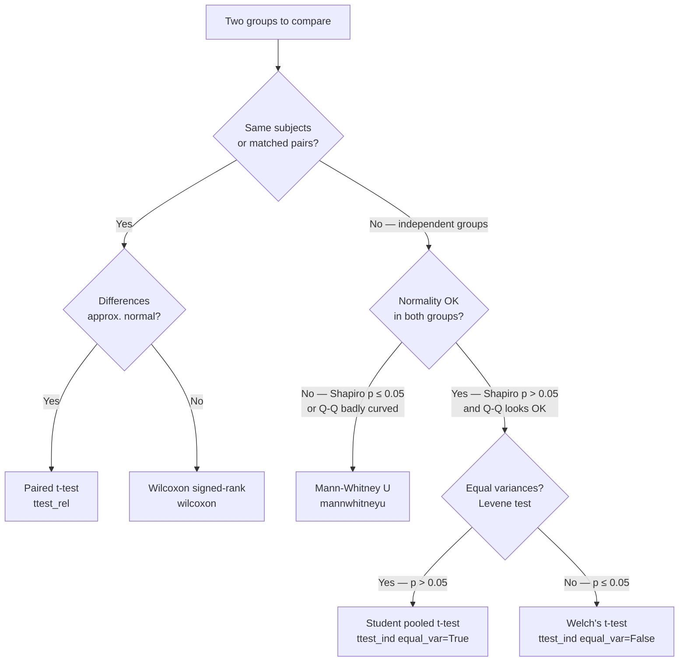
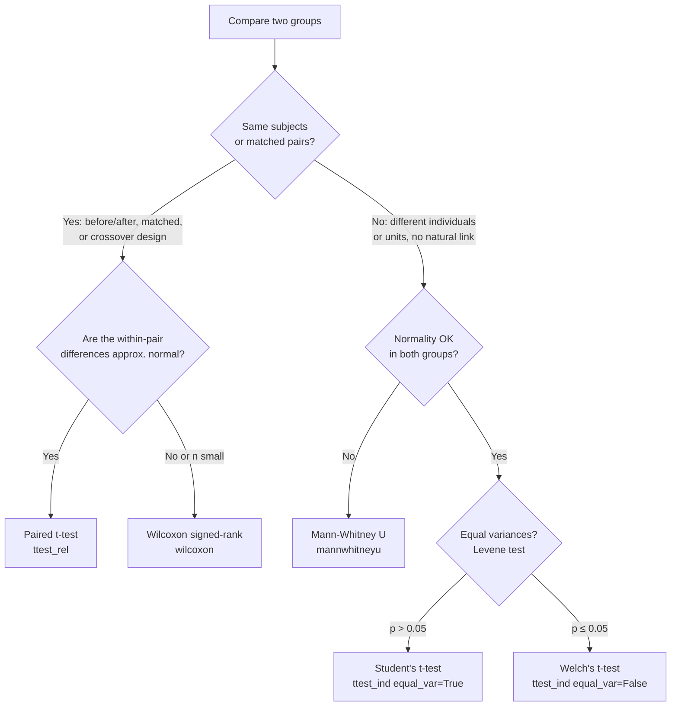

# M5 — Instructor Guide: Hypothesis Testing & P-Values
> 90-minute lesson | Dataset: `students_scores.csv` | All levels

---

## Learning Objectives

By end of session, students can:
1. State the correct definition of a p-value (without using the common inversion error)
2. Run a t-test and verify its assumptions before reporting results
3. Compute Cohen's d and interpret effect size magnitude
4. Apply Bonferroni and Benjamini-Hochberg correction for multiple comparisons
5. Distinguish paired from independent samples and choose the correct test
6. Explain why failing to reject H0 is not proof that H0 is true

---

## Lesson Outline

| Time | Activity | Notes |
|------|----------|-------|
| 0:00–0:10 | M4 debrief — CI misconception check | 2–3 students share their written CI interpretation |
| 0:10–0:25 | **L5.1** — The p-value: correct definition, prosecutor's fallacy | No code yet — concept discussion first |
| 0:25–0:40 | **L5.2** — Assumption checking before running any parametric test | Live: Shapiro-Wilk + Levene on students_scores |
| 0:40–0:55 | **L5.3** [AI-OFF] — Effect size: Cohen's d alongside p-value | Students compute d and interpret magnitude |
| 0:55–1:05 | **L5.4** — Multiple comparisons: Bonferroni + FDR correction | Demo with 5 group comparisons |
| 1:05–1:15 | **L5.5** — Paired vs independent t-test: when to use which | before/after test scores scenario |
| 1:15–1:25 | **L5.6** — Failing to reject H0 ≠ proving H0 | Underpowered study simulation |
| 1:25–1:30 | Preview M6 — pandas at scale | |

---

## Key Concepts (with Lesson IDs)

### L5.1 — The correct p-value definition `[Expert]`


#### Setting up the null and alternative hypotheses

Every hypothesis test begins with a pair of complementary statements about the world. The **null hypothesis** (H₀) represents the default position — typically that no effect exists, no difference separates the groups, or a parameter equals a specified baseline value. It is a sharp, falsifiable claim, not a vague one. For example, H₀ might say "the mean exam score is equal for students in two different teaching methods" or "a coin has a 50% probability of heads." The **alternative hypothesis** (H₁ or Hₐ) represents what an investigator suspects or hopes to demonstrate — perhaps that one teaching method produces higher scores, or that the coin is biased.

The structure of this pair determines every subsequent calculation. You should always write both hypotheses before touching any data. Writing H₀ and H₁ forces you to specify exactly what kind of claim you are testing, which in turn determines whether you need a one-tailed or two-tailed test, what test statistic is appropriate, and which distribution you will consult.

A classic error is to phrase H₁ as "there is *some* difference" and then report the result as confirming the size or direction of that difference. Hypothesis testing can only tell you whether the data are consistent with H₀; it cannot specify how large or meaningful any departure from H₀ might be.

$$H_0: \mu_1 = \mu_2 \quad \text{vs} \quad H_1: \mu_1 \neq \mu_2$$

That formulation is a **two-sided** test — we are open to the possibility that either group might be larger. A one-sided alternative $H_1: \mu_1 > \mu_2$ restricts the claim to a specific direction and should only be pre-registered if a directional expectation exists before the data are collected.

#### The precise mathematical definition of a p-value

A p-value is the probability of observing a test statistic **at least as extreme** as the one computed from the sample, **assuming that H₀ is perfectly true**. In conditional probability notation:

$$p = P\!\left(T \geq t_{\text{obs}} \mid H_0 \text{ is true}\right)$$

where $T$ is a random variable representing the test statistic under H₀, and $t_{\text{obs}}$ is the value actually computed from the data. "At least as extreme" means in the direction(s) specified by H₁ — both tails for a two-sided test, one tail for a one-sided test.

This definition contains two important ingredients: the word **given** (the vertical bar | ) and the phrase **H₀ is true**. Together they say that the entire calculation is conducted inside a hypothetical universe where H₀ holds. The p-value is therefore a property of the data-under-H₀, not a statement about which hypothesis is more likely to be correct in the real world.

Think of it this way: you are standing inside H₀'s world and asking "Is what I observed ordinary or extraordinary here?" If the answer is extraordinary — if $p$ is very small — you have grounds to doubt whether H₀'s world is the real world. If the answer is ordinary, you do not have grounds to conclude that H₀'s world is definitely the real world; only that you cannot distinguish it from the real world on the basis of this sample alone.

A small p-value is evidence that the data are surprising under H₀. It is not evidence about how likely H₀ is to be true, how large an effect is, or whether the result matters in practice. All three of those questions require additional tools.

#### What α (alpha) means and how to choose it

The significance level $\alpha$ is a **pre-specified threshold** for the p-value. It expresses your willingness to commit a **Type I error** — rejecting a true H₀. The most common values are 0.05, 0.01, and 0.001. Choosing 0.05 means that, over a very large number of identical experiments conducted in a world where H₀ is true, roughly 5% of those experiments would produce a test statistic as extreme as the one you observed purely by sampling variability.

Crucially, $\alpha$ must be decided **before** you look at the data. Choosing $\alpha$ after seeing the p-value — or adjusting it until $p < \alpha$ — is a form of data dredging that invalidates the false-positive guarantee entirely. The decision rule is simple: if $p < \alpha$, you reject H₀ and call the result **statistically significant at level $\alpha$**; if $p \geq \alpha$, you **fail to reject** H₀.

Different fields use different conventions. Medical research often demands $\alpha = 0.001$ for drug approval studies because the cost of a false positive is high. Exploratory data science may use 0.10 when generating hypotheses for later confirmation. The key is that $\alpha$ is a policy decision reflecting the real-world consequences of each error type, not a universal law of nature.

```
               Reality
              H₀ true    H₀ false
Reject H₀  |  Type I   |    ✓    |   ← α controls Type I rate
           |  (α)      |         |
Fail to    |    ✓      |  Type II|   ← β = Type II rate
reject H₀  |           |  (β)    |   ← power = 1 − β
```

Type I and Type II errors trade off against each other for a fixed sample size. Reducing $\alpha$ makes false positives less likely but missed real effects (Type II errors) more likely.

#### One-tailed versus two-tailed tests

A **two-tailed** test places the rejection region in both tails of the null distribution. Use it whenever the hypothesis does not predict a direction for the effect. A **one-tailed** test places the rejection region in only one tail. Use it only when theory or prior evidence gives a clear directional prediction *before* the data arrive — not after you have seen which direction the effect goes.

```
Two-tailed (α = 0.05):        One-tailed (α = 0.05, right tail):

reject | accept | reject       accept        | reject
   ────┼────────┼────           ─────────────┼────────
  α/2=.025    α/2=.025               α = .05
```

Using a one-tailed test when you had no prior directional reason — or after you noticed the direction in the data — is a form of p-value manipulation. A one-tailed test at $\alpha = 0.05$ is equivalent in power to a two-tailed test at $\alpha = 0.10$: you are spending your entire false-positive budget on one side of the distribution.

In practice, most published research uses two-tailed tests by convention unless the study design inherently specifies a direction (for example, a non-inferiority clinical trial). When in doubt, default to two-tailed and state your reasoning explicitly.

#### The prosecutor's fallacy and the inversion error

The **prosecutor's fallacy** is the error of treating $P(\text{data} \mid H_0)$ as if it were $P(H_0 \mid \text{data})$. The first quantity is the p-value. The second is the probability that H₀ is true given what you observed — which the p-value never tells you.

$$\underbrace{P(H_0 \mid \text{data})}_{\text{what you want to know}} \neq \underbrace{P(\text{data} \mid H_0)}_{\text{what the p-value measures}}$$

Named after cases where forensic evidence was misrepresented in court, the fallacy goes: "The probability of finding evidence this specific if the defendant were innocent is 1 in a million, so the defendant is almost certainly guilty." This reasoning ignores the prior probability of guilt and the base rate of the event. In statistics the same error appears as: "p = 0.03, so there is only a 3% chance H₀ is true." That is completely wrong.

The correct p-value logic says only: if H₀ were true, data as extreme as these would arise about 3% of the time. That still leaves open the prior probability that H₀ is true, the effect size if H₁ is true, and many other considerations. Bayesian inference can answer "how probable is H₀ given the data?" but it requires specifying a prior. Classical hypothesis testing deliberately leaves that question unanswered in exchange for guarantees that hold regardless of any prior.

#### Five major misconceptions in plain language

Even experienced researchers slip into recurrent errors. Understanding them precisely is more valuable than memorising rules.

**Misconception 1 — "p < 0.05 means there is a 95% chance the result is real."** This inverts the conditional: p gives $P(\text{data} \mid H_0)$, not $P(H_1 \mid \text{data})$.

**Misconception 2 — "p > 0.05 means there is no effect."** A non-significant result means the data are consistent with H₀, not that H₀ is confirmed. The effect may exist but be too small for the current sample to detect.

**Misconception 3 — "A smaller p-value means a larger effect."** Sample size inflates statistical significance independently of effect size. A p-value of 0.0001 with $n = 10{,}000$ might correspond to a trivially small effect; p = 0.08 with $n = 15$ might correspond to a practically meaningful one.

**Misconception 4 — "Once p < 0.05, the finding is automatically replicated."** Replication requires a new sample from the same population with the same procedure. A single p-value cannot guarantee replication.

**Misconception 5 — "p is the probability my data were produced by random chance."** Chance variation is always present. The p-value calibrates the extremeness of the observed pattern against a specific model (H₀), not against all possible explanations.

#### A step-by-step worked example

Suppose a school tries a new study-skills course. Thirty students are measured before and after. We want to know whether the mean score changed.

**Step 1 — Write the hypotheses.** Let $\mu_d$ = mean of (after − before) differences per student.

$$H_0: \mu_d = 0 \qquad H_1: \mu_d \neq 0$$

**Step 2 — Choose α.** Decide $\alpha = 0.05$ before collecting data.

**Step 3 — Choose the test.** The same students appear in both conditions → paired t-test.

**Step 4 — Compute the test statistic.** Suppose the differences have $\bar{d} = 4.2$, $s_d = 9.8$, $n = 30$.

$$t = \frac{\bar{d}}{s_d / \sqrt{n}} = \frac{4.2}{9.8 / \sqrt{30}} = \frac{4.2}{1.789} \approx 2.35$$

**Step 5 — Find the p-value.** Under H₀, $T \sim t_{29}$. The two-tailed p-value for $|t| = 2.35$ with 29 df is approximately $p = 0.026$.

**Step 6 — Make a decision.** Because $p = 0.026 < \alpha = 0.05$, reject H₀. Statistically significant at the 5% level.

**Step 7 — Interpret carefully.** There is evidence the mean score changed after the course in this sample. This does **not** tell us whether the change is large enough to matter in practice, nor whether it will replicate. Compute Cohen's d next (see L5.3).

#### Connecting significance to practical interpretation

Statistical significance and practical significance are different. A p-value below α is a license to say "this sample provides statistical evidence of a departure from H₀." It is not a license to say "the departure is large" or "it matters."

Consider two studies both reporting $p = 0.04$. Study A uses $n = 20$ and finds a mean difference of 15 points on a 100-point scale. Study B uses $n = 10{,}000$ and finds a mean difference of 0.3 points. Both pass the $\alpha = 0.05$ threshold, but only Study A might have a difference worth caring about in practice. Effect size (Cohen's d, see L5.3) quantifies this dimension, and confidence intervals (see L4) give a range of plausible values.

The p-value should always be one of several reported numbers, never the only one. Reporting $p$, effect size, confidence interval, and sample size together gives a far more honest picture than any single figure alone. The American Statistical Association's 2016 statement on p-values made exactly this recommendation, noting that a p-value alone "does not measure the size of an effect or the importance of a result."

#### Common Mistakes

- **Reporting only whether $p < 0.05$ without the numerical p-value itself.** "Significant" conveys almost no information; always report the actual p-value to three decimal places alongside the test statistic and degrees of freedom.
- **Choosing $\alpha$ after seeing the data.** This guarantees the appearance of statistical significance regardless of the truth, inflating Type I errors without bound.
- **Using a one-tailed test because the observed direction matched H₁.** One-tailed tests must be pre-registered with a directional rationale before data collection, not selected post hoc.
- **Interpreting $p = 0.06$ as clear evidence of "no effect."** P-values near the threshold are inherently ambiguous; they warrant replication, not a binary verdict.
- **Treating two tests on the same dataset with slightly different parameterisations as independent confirmation.** Independent confirmation requires a new independent sample.
- **Forgetting that the p-value presupposes a correctly specified null model.** If the model is wrong — wrong distributional family, wrong independence structure — the p-value is not calibrated to $\alpha$ and its interpretation is invalid.

#### Practice Questions

1. A researcher reports "the new training programme improves test scores by a statistically significant amount ($p = 0.049$)." Write the exact null and alternative hypotheses they were testing, and explain precisely what the p-value of 0.049 means in plain language without using the words "chance" or "probability of the hypothesis."

2. In a study of $n = 5{,}000$ customers, a marketing analyst finds that customers who received Email A opened it slightly more often than those who received Email B ($p = 0.002$). Should the analyst conclude Email A is meaningfully better? What additional information is needed, and why?

3. A classmate says: "Our experiment had $p = 0.03$, so there is only a 3% chance H₀ is true." Identify the specific logical error and write a corrected statement.

4. A study comparing two diet plans reports $p = 0.15$. A journalist writes: "Scientists found no difference between the diets." Explain why this headline is misleading, and write a more accurate version.

5. You design a two-sided t-test to compare mean study hours between two student groups and set $\alpha = 0.05$. (a) What does this choice of $\alpha$ guarantee about your false-positive rate over many hypothetical repetitions of the study where H₀ is true? (b) How would the critical region change if you switched to a one-sided alternative $H_1: \mu_1 > \mu_2$?

### L5.2 — Assumption checking `[Géron Ch4 p.130–145]`


#### Why assumption checking is not optional

Parametric tests such as the t-test derive their p-values from a specific mathematical model. The t-distribution probability calculations underlying `scipy.stats.ttest_ind` are exact only when the data satisfy that model's assumptions. When those assumptions are violated badly enough, the p-values become unreliable: the Type I error rate may no longer equal $\alpha$, and power calculations that guide sample sizing break down. Assumption checking is therefore an act of quality control on the analysis machinery itself, not bureaucratic box-ticking.

Many practitioners skip assumption checks because the code runs cleanly without them. But the absence of a Python error means only that the computer executed instructions successfully. Statistics requires a separate layer of human judgment about whether the model is appropriate for the data at hand. A p-value obtained from a test applied inappropriately can be misleadingly small (inflated false positives) or misleadingly large (lost sensitivity). Both failures have real scientific consequences.

The three assumptions for a two-sample independent t-test are: **independence of observations**, **approximate normality** of each group's distribution (or large enough $n$ for the Central Limit Theorem to apply), and **equality of population variances** (for the pooled-variance version). Each has a corresponding diagnostic. The workflow presented here establishes the habit of checking all three before running any test.

#### The independence assumption

Independence means that knowing one observation tells you nothing useful about any other. In practice this is guaranteed by study design rather than verified statistically: if each row represents a different randomly selected individual with no clustering, dependency, or repeated measurement, independence is satisfied by construction.

Common violations include collecting all data from the same classroom (cluster effects), measuring the same individuals multiple times under different conditions (repeated measures), or using family members or roommates as "separate" observations (natural pairing). In each case, the standard two-sample t-test is inappropriate regardless of the normality or variance situation.

When independence is violated, the standard error of the mean is typically underestimated, which artificially inflates the test statistic and deflates the p-value. No formal test in `scipy.stats` detects non-independence — it must be verified from study design documentation. This makes it the most dangerous assumption to overlook, because software will never warn you about it.

#### Testing normality with Shapiro-Wilk

The **Shapiro-Wilk test** (1965) tests H₀: the sample was drawn from a normal distribution. It compares observed order statistics with expected normal order statistics. The result is a **W statistic** between 0 and 1: W = 1 means perfect agreement with normality; lower values indicate departure.

$$W = \frac{\left(\displaystyle\sum_{i=1}^n a_i\, x_{(i)}\right)^2}{\displaystyle\sum_{i=1}^n (x_i - \bar{x})^2}$$

where $x_{(i)}$ is the $i$-th order statistic and $a_i$ are constants derived from expected values and covariance of normal order statistics. The p-value is the probability of obtaining a W this low or lower under normality.

In practice, treat the Shapiro-Wilk result as a signal, not a verdict. With very large $n$, even tiny inconsequential deviations return $p < 0.05$. With very small $n$ (< 10), the test has low power and may miss meaningful non-normality. For $n$ between 10 and about 80, it is a useful first checkpoint — but always pair it with a Q-Q plot, never rely on the number alone.

```python
from scipy import stats

# Run Shapiro-Wilk on each group separately — normality must hold within
# each group, not in the pooled combined sample
w_a, p_a = stats.shapiro(group_a)
w_b, p_b = stats.shapiro(group_b)

# W close to 1.0 → roughly normal; p < 0.05 → detectable departure
print(f"Group A: W = {w_a:.4f}, p = {p_a:.4f}")
print(f"Group B: W = {w_b:.4f}, p = {p_b:.4f}")
```

#### Reading a Q-Q plot

A **Quantile-Quantile (Q-Q) plot** compares sample quantiles with theoretical normal quantiles. On the x-axis are the expected quantiles of a standard normal distribution; on the y-axis are the ordered data values after standardisation. If the data are perfectly normal, all points lie on a straight diagonal line.

Departures from the diagonal have characteristic shapes that experienced analysts learn to recognise quickly:

```
Perfect normal:         Heavy tails:            Right skew:
    *  *                    *                              *
  *      *              *       *                      *   *
 *          *          *         *               *   *
*            *        *           *           *
               *     *             *        *
                 *  *               *     *
                                            *
S-shape = heavy tails    Concave = right skew    Convex = left skew
```

An S-shaped curve (points above the line at both extremes) indicates heavier tails than normal. A curve that bends consistently above or below the line indicates skewness. Single stray outlier points at the extremes are also visible here but invisible in a histogram. Producing Q-Q plots for both groups before any test should be standard practice.

```python
import matplotlib.pyplot as plt
from scipy import stats

fig, axes = plt.subplots(1, 2, figsize=(10, 4))

# probplot plots sample quantiles (y) against theoretical normal quantiles (x)
# and fits a line through the first and third quartile points
stats.probplot(group_a, dist='norm', plot=axes[0])
axes[0].set_title('Q-Q plot: Group A')
axes[0].set_xlabel('Theoretical quantiles')
axes[0].set_ylabel('Sample quantiles')

stats.probplot(group_b, dist='norm', plot=axes[1])
axes[1].set_title('Q-Q plot: Group B')
axes[1].set_xlabel('Theoretical quantiles')
axes[1].set_ylabel('Sample quantiles')

plt.tight_layout()
plt.show()
```

**Skewness and kurtosis as supplementary shape descriptors.** Beyond Shapiro-Wilk and Q-Q plots, **skewness** and **excess kurtosis** provide compact shape summaries. Skewness measures asymmetry: 0 = symmetric, positive = right tail heavier, negative = left tail heavier. Values beyond ±1 are often noticeable. **Excess kurtosis** (returned by `scipy.stats.kurtosis` by default) measures tail weight relative to a normal distribution: 0 = normal, positive = heavier tails, negative = lighter tails. Values beyond ±2 warrant inspection.

These two numbers provide a quick pipeline-friendly check when plots are not convenient. However, a distribution can have near-zero skewness and kurtosis yet look nothing like a normal distribution — bimodal distributions are a common example. Numbers alone cannot replace the visual inspection step; they supplement it.

```python
from scipy import stats

# scipy's kurtosis() returns excess kurtosis: normal distribution returns 0
# (Fisher definition; set fisher=False for Pearson's definition where normal → 3)
for label, grp in [('Group A', group_a), ('Group B', group_b)]:
    sk = stats.skew(grp)
    ku = stats.kurtosis(grp)        # excess kurtosis
    print(f"{label}: skewness = {sk:.3f},  excess kurtosis = {ku:.3f}")
    # Rough flags: |skewness| > 1.0 or |excess kurtosis| > 2.0 → inspect plots
```

#### Testing variance equality with Levene's test

When comparing two independent groups with the pooled-variance t-test, both populations are assumed to have the same variance. **Levene's test** (Levene, 1960) tests H₀: all group variances are equal. It computes the absolute deviations from each group's median, then runs a one-way ANOVA on those deviations. The median-based version is more robust to non-normality than the older Bartlett test.

$$W = \frac{(N-k)}{(k-1)} \cdot \frac{\displaystyle\sum_{i=1}^k n_i\,(\bar{Z}_{i\cdot} - \bar{Z}_{\cdot\cdot})^2}{\displaystyle\sum_{i=1}^k \sum_{j=1}^{n_i}(Z_{ij} - \bar{Z}_{i\cdot})^2}$$

where $Z_{ij} = |Y_{ij} - \tilde{Y}_{i\cdot}|$ is the absolute deviation from the group median. Under H₀, W follows an F-distribution with $(k-1, N-k)$ degrees of freedom.

In practice: if Levene returns $p > 0.05$, the equal-variance assumption is defensible. If $p \leq 0.05$, use **Welch's t-test** with `equal_var=False`. Many statisticians recommend using Welch's test by default regardless, because it performs nearly identically to the pooled test when variances are equal but substantially better when they are not.

```python
from scipy import stats

# center='median' (default) is robust to non-normality
# center='mean' reduces to Bartlett-like behaviour — avoid for skewed data
lev_stat, p_lev = stats.levene(group_a, group_b, center='median')
print(f"Levene's test: W = {lev_stat:.4f}, p = {p_lev:.4f}")

# Variance ratio as a quick sanity check
var_ratio = group_a.var() / group_b.var()
print(f"Variance ratio (A/B): {var_ratio:.3f}")
# Ratios far from 1 (e.g., > 3 or < 0.33) suggest heteroscedasticity
# even if Levene's test is borderline in small samples
```

#### When to use Welch's t-test

**Welch's t-test** (1947) relaxes the equal-variance assumption by computing a modified standard error and using the Welch-Satterthwaite approximation for degrees of freedom:

$$t_{W} = \frac{\bar{x}_1 - \bar{x}_2}{\sqrt{\dfrac{s_1^2}{n_1} + \dfrac{s_2^2}{n_2}}}, \qquad \nu \approx \frac{\left(\dfrac{s_1^2}{n_1} + \dfrac{s_2^2}{n_2}\right)^2}{\dfrac{(s_1^2/n_1)^2}{n_1-1} + \dfrac{(s_2^2/n_2)^2}{n_2-1}}$$

In `scipy`, `ttest_ind(a, b, equal_var=False)` computes Welch's test; `equal_var=True` (the default) computes the pooled-variance test. A growing consensus recommends Welch's as the default for two independent groups: the slight power cost when variances are truly equal is far outweighed by the protection when they are not.

#### A decision tree for test selection



This diagram is a starting point, not a rigid algorithm. With large samples ($n > 100$ per group), the Central Limit Theorem allows the t-test even with moderately non-normal data. With small samples, non-normality and unequal variances are far more dangerous.

#### Step-by-step worked example

**Setting:** Two classes sat the same exam. Class A has 25 students; Class B has 22. Complete assumption-checking workflow before running any inferential test.

**Step 1 — Visual inspection.** Histograms and box plots reveal no obvious bimodality, no extreme outliers, and moderate overlap between groups. Both distributions look roughly bell-shaped.

**Step 2 — Shapiro-Wilk.** $W_A = 0.962$, $p_A = 0.47$; $W_B = 0.944$, $p_B = 0.22$. Both p-values exceed 0.05; normality is not contradicted.

**Step 3 — Q-Q plots.** Points track the diagonal closely for both groups with no systematic curves. Consistent with Step 2.

**Step 4 — Shape descriptors.** $\text{skew}_A = 0.31$, $\text{kurt}_A = -0.44$; $\text{skew}_B = -0.18$, $\text{kurt}_B = 0.12$. All values modest.

**Step 5 — Levene's test.** $W = 3.42$, $p = 0.07$. Fail to reject equal variances.

**Step 6 — Choose and run.** Normality OK, variances OK → pooled Student's t-test.

```python
from scipy import stats

# All assumption checks passed — pooled t-test is appropriate
t_stat, p_val = stats.ttest_ind(group_a, group_b, equal_var=True)
print(f"t({len(group_a)+len(group_b)-2}) = {t_stat:.3f}, p = {p_val:.4f}")

# Step 7: if p < 0.05, also compute Cohen's d (see L5.3) before concluding
n_a, n_b = len(group_a), len(group_b)
sp = (((n_a-1)*group_a.std()**2 + (n_b-1)*group_b.std()**2) / (n_a+n_b-2))**0.5
cohens_d = (group_a.mean() - group_b.mean()) / sp
print(f"Cohen's d = {cohens_d:.3f}")
```

#### Common Mistakes

- **Running Shapiro-Wilk on the combined sample** rather than on each group separately. Normality must hold within each group; the mixture distribution is irrelevant to the t-test's assumptions.
- **Relying only on Shapiro-Wilk without a Q-Q plot.** The formal test can miss bimodality and structured outlier patterns that are immediately obvious in a plot.
- **Treating $p > 0.05$ on Shapiro-Wilk as proof of normality.** In small samples the test has low power; a non-significant result only means the sample does not contradict normality, not that normality is guaranteed.
- **Always using the default `equal_var=True`** (pooled test) without checking Levene's result. This can produce misleading p-values when group variances differ substantially.
- **Running assumption checks after seeing the primary test result** and selecting the variant that gives the smallest p-value. All assumption diagnostics must be completed before and independently of the primary test.
- **Ignoring the independence assumption entirely.** No test in `scipy.stats` checks for non-independence; it must be verified from study design. If the same individuals appear in both groups at different time points, a two-sample test is structurally wrong.

#### Practice Questions

1. You run `stats.shapiro(scores)` on a group of 18 students and get `W = 0.91, p = 0.003`. (a) What does this result tell you? (b) Does it mean you cannot run any parametric test? What additional diagnostic would you examine, and why?

2. A Q-Q plot of exam scores shows points that track the diagonal closely in the middle but curve above the line at both extremes. What distribution shape does this suggest, and how does it affect t-test validity?

3. You have Group A with $n = 180$ and Group B with $n = 12$. Should you apply the same decision-tree logic as for equal-sized small groups? What role does the Central Limit Theorem play, and does it help Group B as much as Group A?

4. Levene's test returns $p = 0.02$ for two groups that both pass the Shapiro-Wilk test. Which t-test do you choose, and why? Write the exact `scipy` call.

5. A researcher runs all assumption diagnostics after seeing the primary t-test result and reports whichever combination gives the most significant outcome. Explain why this practice is scientifically invalid and describe the correct sequence of steps.

### L5.3 — Effect size: Cohen's d `[Expert]` ⚠️ [AI-OFF]


#### Why a p-value alone tells an incomplete story

When a p-value falls below $\alpha$, it tells you only that the observed pattern would be surprising if H₀ were true. It says nothing about the **magnitude** of the difference. In a world where data collection is cheap and sample sizes can reach tens of thousands, statistical significance has become easy to manufacture: a large enough sample will almost always find a "significant" result for any non-zero effect, no matter how small that effect is in practical terms.

Imagine a study comparing resting heart rates of runners who stretch before a run versus those who do not. With $n = 50{,}000$ participants, even a difference of 0.2 beats per minute might reach $p < 0.001$. A cardiologist would correctly dismiss 0.2 BPM as clinically irrelevant. Statistical significance said one thing; practical meaning said another. This gap is precisely the problem that **effect size** measures are designed to close.

The American Statistical Association's 2016 statement on p-values explicitly cautioned against making decisions based on p-values alone and called for effect sizes to accompany every hypothesis test. The idea has been standard in educational psychology and medicine for decades, and data science practice is gradually following. For this course, reporting a p-value without a corresponding effect size is considered an incomplete analysis.

#### Defining Cohen's d

For two independent groups with sample means $\bar{x}_1$ and $\bar{x}_2$, **Cohen's d** standardises the raw mean difference by the **pooled standard deviation**:

$$d = \frac{\bar{x}_1 - \bar{x}_2}{s_p}$$

where the pooled standard deviation $s_p$ is a weighted average of the two group standard deviations:

$$s_p = \sqrt{\frac{(n_1 - 1)\,s_1^2 + (n_2 - 1)\,s_2^2}{n_1 + n_2 - 2}}$$

The pooled standard deviation gives more weight to the group with more observations, producing a common unit of spread. The resulting $d$ is interpreted like a standardised score: a value of 1.0 means the groups differ by exactly one pooled standard deviation. The sign indicates direction; the absolute value indicates magnitude.

The numerator is the raw mean difference; the denominator is typical within-group spread. Converting the raw gap into this ratio makes $d$ interpretable regardless of the original measurement scale — whether scores range from 0–100 or 0–1000, the Cohen's d is directly comparable across studies.

#### The Cohen benchmarks and their context

Jacob Cohen introduced rough benchmarks in his 1988 book *Statistical Power Analysis for the Behavioral Sciences*:

| Cohen's $d$ | Conventional label |
|-------------|-------------------|
| 0.2         | Small             |
| 0.5         | Medium            |
| 0.8         | Large             |

These numbers were derived from a survey of effect sizes in psychological research circa 1960 and were never intended as universal thresholds. Cohen himself wrote that "there is no wisdom in an iron rule" about their application. Context determines what magnitude matters.

In educational intervention research, meta-analyses show that a $d$ of 0.2–0.3 is typical for well-designed randomised programmes; expecting $d = 0.8$ from a realistic classroom intervention would be overly optimistic. In clinical pharmacology, even $d = 0.1$ can translate into thousands of prevented adverse events at population scale if the condition is common. Always ask: what does a one-standard-deviation difference mean in the actual domain and units of the measurement?

#### How d relates to the overlap between distributions

A powerful way to understand $d$ intuitively is through the **distributional overlap** between two groups with equal within-group variance. When $d = 0$, the distributions are identical. As $d$ grows, they pull apart.

```
d = 0.2 (small):
  Group 1:  ████████████████████████████████████
  Group 2:      ████████████████████████████████████
            ~92% overlap — gap is nearly invisible in raw data

d = 0.5 (medium):
  Group 1:  █████████████████████████
  Group 2:          █████████████████████████
            ~80% overlap — noticeable but substantial overlap

d = 0.8 (large):
  Group 1:  ███████████████████
  Group 2:              ███████████████████
            ~69% overlap — clear separation visible in histograms

d = 1.2 (very large):
  Group 1:  ████████████████
  Group 2:                    ████████████████
            ~55% overlap — majority of Group 2 exceeds Group 1's mean
```

This overlap framing is useful for communicating results to non-technical audiences. For $d = 0.8$ and normally distributed equal-variance groups, approximately 79% of Group 2 would exceed the median of Group 1 — a concrete way to describe the practical meaning of the effect.

#### Variants for different designs

The independent-groups formula above applies when both groups are independent and have roughly similar spreads. Several variants address other situations.

**Hedges' g** is a bias-corrected version recommended when sample sizes are small ($n < 20$ per group). Small samples overestimate $|d|$ because the sample standard deviation tends to underestimate the population value. The correction factor is:

$$g = d \times \left(1 - \frac{3}{4(n_1 + n_2 - 2) - 1}\right)$$

For $n_1 = n_2 = 20$ this correction is approximately 0.97 — small but non-trivial for meta-analyses that accumulate many small studies.

**Glass's Δ** uses only the control group's standard deviation in the denominator:

$$\Delta = \frac{\bar{x}_1 - \bar{x}_2}{s_{\text{control}}}$$

This is preferred when the experimental treatment is expected to change within-group variance as well as the mean. If a training programme both raises average performance and makes students more consistent (reducing spread), pooling the two standard deviations mixes pre-training and post-training variability and produces a misleading denominator.

**Cohen's $d_z$** for paired designs uses the standard deviation of the within-pair difference scores:

$$d_z = \frac{\bar{d}}{s_d}$$

This is the effect size that corresponds naturally to a paired t-test (see L5.5). It captures the consistency of improvement across individuals, not just the group-level means.

#### Computing Cohen's d by hand: a worked example

**Scenario:** A tutoring intervention is tested on Group T ($n = 30$, $\bar{x}_T = 78.4$, $s_T = 11.2$) versus a control Group C ($n = 28$, $\bar{x}_C = 71.9$, $s_C = 12.8$).

**Step 1 — Compute the pooled standard deviation:**

$$s_p = \sqrt{\frac{(30-1)(11.2)^2 + (28-1)(12.8)^2}{30 + 28 - 2}}$$

$$= \sqrt{\frac{29 \times 125.44 + 27 \times 163.84}{56}} = \sqrt{\frac{3{,}637.76 + 4{,}423.68}{56}} = \sqrt{\frac{8{,}061.44}{56}} \approx \sqrt{143.95} \approx 12.0$$

**Step 2 — Compute Cohen's d:**

$$d = \frac{78.4 - 71.9}{12.0} = \frac{6.5}{12.0} \approx 0.54$$

**Step 3 — Interpret:** $d \approx 0.54$ falls in the **medium** range by Cohen's convention. The tutoring group's mean is about 0.54 standard deviations above the control's mean — a gap that, while not dramatic, is educationally meaningful if the intervention is cost-effective.

**Step 4 — Pair with the p-value.** Suppose the corresponding t-test gives $p = 0.03$. Complete reporting: "The tutoring group outperformed controls by a statistically significant margin, $t(56) = 2.21$, $p = 0.03$, Cohen's $d = 0.54$, 95% CI for the mean difference: [0.6, 12.4] points."

#### Effect size, power, and sample planning

Cohen's d is also the input to **statistical power analysis**. Power — the probability of detecting a real effect when it exists — depends jointly on $d$, $n$, and $\alpha$. For a two-sample t-test at $\alpha = 0.05$ with 80% power:

| Cohen's $d$ | $n$ per group required |
|-------------|------------------------|
| 0.2 (small) | ~197                   |
| 0.5 (medium)| ~34                    |
| 0.8 (large) | ~14                    |

A study designed to detect a small effect ($d = 0.2$) needs nearly 200 participants per group. If a researcher runs only $n = 30$ per group hoping to detect $d = 0.2$, the study is underpowered: even if the effect is genuine, the study will produce $p > 0.05$ about 80% of the time and the investigator will incorrectly conclude "no effect found." This is the core reason why reporting effect size and power together is so important — it allows readers to evaluate whether a null result is informative or merely reflects an inadequate design.

#### Reporting effect size responsibly

The standard reporting format for a t-test with effect size is:

> "A two-sample t-test indicated that Group A scored significantly higher than Group B, $t(df) = t_{\text{obs}}$, $p = p_{\text{val}}$, Cohen's $d = d_{\text{val}}$, 95% CI [$lb$, $ub$]."

The confidence interval is as important as the point estimate. It communicates uncertainty about the true effect size. A study with $d = 0.8$ and a 95% CI of [0.1, 1.5] says "we are fairly confident the effect is real but quite uncertain about its magnitude." That is a very different message from $d = 0.8$, 95% CI [0.6, 1.0].

For the [AI-OFF] assignment, students should compute $d$ from the formula by hand, record each arithmetic step, look up the appropriate benchmark, and write two to three sentences contextualising the result in the domain of the study. The goal is to understand the formula deeply enough to reproduce it from memory — not to produce code, but to own the calculation.

#### Common Mistakes

- **Computing $d$ with the wrong denominator.** Using only one group's standard deviation when the groups have similar variances, or using the pooled SD when the intervention is expected to change both mean and spread, produces a misleading standardised effect.
- **Reporting $d$ without a confidence interval.** A point estimate of effect size without its uncertainty is incomplete; small-sample estimates of $d$ are highly variable and can differ markedly from the true population value.
- **Using Cohen's $d$ for heavily skewed or outlier-prone distributions without comment.** Cohen's $d$ is defined in terms of means and standard deviations, which are sensitive to outliers. For markedly non-normal data, the rank-biserial correlation corresponding to the Mann-Whitney U test may be a more appropriate effect size measure.
- **Treating Cohen's 0.2/0.5/0.8 benchmarks as hard thresholds.** A $d$ of 0.49 is not meaningfully different from $d = 0.50$; the labels are rough guides anchored in one historical research domain.
- **Using the independent-groups formula for paired data instead of $d_z$.** This underestimates the effect because it does not account for the reduced within-pair variability that makes paired designs more sensitive.

#### Practice Questions

1. A study compares test scores between a lecture-only class ($\bar{x}_1 = 68$, $s_1 = 9$, $n_1 = 40$) and a flipped-classroom class ($\bar{x}_2 = 73$, $s_2 = 10$, $n_2 = 40$). Calculate Cohen's $d$ step by step and interpret the result using Cohen's conventional labels.

2. Explain in plain language why a study with $p = 0.0001$ and $d = 0.05$ might be less practically useful than a study with $p = 0.08$ and $d = 0.45$.

3. What is Hedges' $g$ and when should you prefer it over Cohen's $d$? Using the group statistics from Question 1, calculate the Hedges' $g$ correction factor and compute $g$.

4. A researcher reports a paired t-test result but uses the independent-groups pooled-SD formula for Cohen's $d$ instead of $d_z$. In which direction does this bias the effect size estimate, and why?

5. You read a paper that reports only "the effect was statistically significant ($p < 0.05$)" with no effect size. From the means, SDs, and sample sizes in the paper's data table, you compute $d = 0.18$. Write a one-paragraph critical commentary on the paper's reporting quality and explain what the authors should have included.

### L5.4 — Multiple comparisons correction `[Expert]`


#### The accumulation of false positives

Every hypothesis test carries a false-positive rate. When you test at $\alpha = 0.05$, you accept a 5% chance of rejecting a true H₀ for that one specific test. The problem arises when you run many tests: the false-positive chances accumulate, and the overall probability of making at least one spurious rejection grows rapidly with the number of tests.

Consider a genomics researcher scanning 20,000 gene expression levels to find which genes differ between a treatment and control group. At $\alpha = 0.05$, even if no gene is truly differentially expressed, you would expect approximately $20{,}000 \times 0.05 = 1{,}000$ false positives by chance alone. Publishing those 1,000 "significant" genes as biologically meaningful would be a serious scientific error.

The same problem arises in less extreme settings. Comparing five student groups pairwise produces $\binom{5}{2} = 10$ tests; testing 20 dataset features for association with an outcome produces 20 tests; running a series of A/B tests for different website button colours generates multiple tests over the same visitor pool. In each case, the unadjusted p-values cannot be interpreted at face value. Recognising when you are in a multiple-comparison setting is the first step toward handling it correctly.

#### The familywise error rate

The **Familywise Error Rate (FWER)** is the probability of making **at least one** Type I error across the entire family of tests. For $m$ independent tests each conducted at level $\alpha$:

$$\text{FWER} = 1 - (1 - \alpha)^m$$

At $\alpha = 0.05$ and $m = 10$: $\text{FWER} = 1 - (0.95)^{10} \approx 0.40$. A 40% chance of at least one false positive if no true effects exist — nearly eight times the advertised 5% rate.

```
m tests at α = 0.05, all H₀ true:

m =  1:  FWER ≈  5%   ██
m =  5:  FWER ≈ 23%   ████████
m = 10:  FWER ≈ 40%   ██████████████
m = 20:  FWER ≈ 64%   ████████████████████████
m = 50:  FWER ≈ 92%   █████████████████████████████████████
```

FWER-controlling methods aim to bring this overall rate back down to $\alpha$ regardless of how many tests are run. The simplest is the Bonferroni correction.

#### The Bonferroni correction

The **Bonferroni correction** divides the significance threshold by the number of tests:

$$\alpha_{\text{Bonferroni}} = \frac{\alpha}{m}$$

Equivalently, multiply each raw p-value by $m$ and compare to the original $\alpha$:

$$p_{\text{adjusted}} = \min(m \cdot p_{\text{raw}},\; 1)$$

For $m = 5$ pairwise comparisons at $\alpha = 0.05$, each test must clear $0.05 / 5 = 0.01$ to be declared significant. This guarantees $\text{FWER} \leq \alpha$ regardless of correlations between tests.

Bonferroni is conservative: when tests are positively correlated (typical for pairwise comparisons of overlapping groups), the actual FWER is well below $\alpha$. With many correlated tests, Bonferroni can become so strict that genuine effects are systematically missed — a high Type II error rate is the price of this strong false-positive control.

#### The false discovery rate and Benjamini-Hochberg

The **False Discovery Rate (FDR)** controls a different quantity: the **expected proportion of discoveries that are false**.

$$\text{FDR} = E\!\left[\frac{V}{R}\right]$$

where $V$ = number of false positives and $R$ = total number of rejections (FDR = 0 when $R = 0$ by convention). An FDR of 5% means that among all tests you call significant, about 5% are expected to be false positives.

The **Benjamini-Hochberg (BH) procedure** (1995) controls FDR at level $\alpha$:

1. Sort all $m$ raw p-values ascending: $p_{(1)} \leq p_{(2)} \leq \cdots \leq p_{(m)}$.
2. Find the largest $k$ such that $p_{(k)} \leq \dfrac{k}{m} \cdot \alpha$.
3. Reject all hypotheses $H_{(1)}, \ldots, H_{(k)}$.

BH is **more powerful** than Bonferroni when many tests are performed, because it allows more discoveries while controlling the proportion of errors among them. The trade-off: a single false positive is possible, whereas Bonferroni makes even one unlikely.

```mermaid
flowchart TD
    A[m raw p-values from m tests] --> B[Sort ascending: p₍₁₎ ≤ … ≤ p₍ₘ₎]
    B --> C{Which error to control?}
    C -->|Zero false positives preferred\nsmall m or high cost per FP| D[Bonferroni\np_adj = min(m × p_raw, 1)]
    C -->|Some FP tolerable\nlarge m or power matters| E[Benjamini-Hochberg\nfind largest k with p₍ₖ₎ ≤ k/m × α]
    D --> F[Reject where p_adj < α]
    E --> G[Reject all H₍ᵢ₎ for i ≤ k]
```

#### Choosing between the two approaches

The choice depends on the consequences of false positives versus false negatives in your specific context.

Use **Bonferroni** (or Holm-Bonferroni) when:
- The family of tests is small (fewer than 10–20 comparisons).
- Any single false positive has high consequences (medical safety decisions, regulatory approval).
- Tests are largely independent.

Use **Benjamini-Hochberg** when:
- You have many tests (genomics, large-scale feature selection, multi-arm experiments).
- Some false positives are tolerable as long as most discoveries are correct.
- You want to maximise the number of detected true effects while keeping the false-discovery proportion bounded.

A concrete analogy: Bonferroni requires every witness in a trial to be completely reliable before any conviction; BH accepts that a small fraction of convictions might be wrong but keeps that fraction below a specified level. Neither is universally better — the right choice depends on the stakes of the decision.

#### The Holm-Bonferroni step-down improvement

The **Holm-Bonferroni** procedure controls FWER just as strictly as Bonferroni but is uniformly more powerful. After sorting p-values ascending, compare the $k$-th sorted value to a progressively less strict threshold:

$$p_{(k)} \leq \frac{\alpha}{m - k + 1}$$

Continue rejecting until the first non-rejection; reject all hypotheses up to that point. This is available as `method='holm'` in `statsmodels.stats.multitest.multipletests` and is almost always preferable to plain Bonferroni when FWER control is required. The traditional Bonferroni method is retained in curricula mainly because it is simple to compute mentally.

#### Step-by-step worked example with code

**Setting:** Five student groups (A, B, C, D, E) took the same exam. We want to compare every possible pair. Number of comparisons: $\binom{5}{2} = 10$.

```python
import pandas as pd
from scipy import stats
from statsmodels.stats.multitest import multipletests

# --- Step 1: Enumerate all unique pairwise combinations ---
group_labels = ['A', 'B', 'C', 'D', 'E']
pairs = [(a, b) for i, a in enumerate(group_labels)
                for b in group_labels[i+1:]]   # 10 pairs

# --- Step 2: Run Welch's t-test for each pair ---
# Use equal_var=False (Welch) as a safe default without individual assumption
# checks for every pair — adjust if full checks warrant pooled tests
raw_p_values = []
for left, right in pairs:
    x = df[df['class'] == left]['exam_score'].dropna()
    y = df[df['class'] == right]['exam_score'].dropna()
    _, p_val = stats.ttest_ind(x, y, equal_var=False)  # Welch's t-test
    raw_p_values.append(p_val)

# --- Step 3: Bonferroni correction ---
# multipletests returns: (reject_array, corrected_p_values, alpha_sidak, alpha_bonf)
reject_bonf, p_bonf, _, _ = multipletests(
    raw_p_values, alpha=0.05, method='bonferroni'
)   # adjusted p = min(m × p_raw, 1.0)

# --- Step 4: Benjamini-Hochberg FDR correction ---
reject_bh, p_bh, _, _ = multipletests(
    raw_p_values, alpha=0.05, method='fdr_bh'
)   # BH step-up procedure; controls expected FDR at 5%

# --- Step 5: Holm-Bonferroni (same FWER as Bonferroni, more powerful) ---
reject_holm, p_holm, _, _ = multipletests(
    raw_p_values, alpha=0.05, method='holm'
)

# --- Step 6: Assemble readable comparison table ---
results = pd.DataFrame({
    'comparison':    [f'{a} vs {b}' for a, b in pairs],
    'raw_p':         [round(p, 4) for p in raw_p_values],
    'bonf_p':        [round(p, 4) for p in p_bonf],
    'bonf_reject':   reject_bonf,
    'holm_p':        [round(p, 4) for p in p_holm],
    'holm_reject':   reject_holm,
    'bh_p':          [round(p, 4) for p in p_bh],
    'bh_reject':     reject_bh,
})

# Pairs where BH rejects but Bonferroni/Holm do not reveal BH's extra power
print(results.to_string(index=False))
extra_bh = results[results['bh_reject'] & ~results['bonf_reject']]
if not extra_bh.empty:
    print(f"\nBH found {len(extra_bh)} extra rejection(s) over Bonferroni:")
    print(extra_bh[['comparison', 'raw_p', 'bh_p']].to_string(index=False))
```

After running this, compare `bonf_reject` and `bh_reject`. BH typically declares more pairs significant. Those extra declarations represent true effects that Bonferroni or Holm missed, or they are the small number of false discoveries that FDR accepts. The critical point is that BH is calibrated to keep the false-discovery proportion at 5%, not to prevent every individual false discovery.

#### When corrections are and are not needed

Not every multi-test analysis requires correction. Corrections are most important when all tests address a single global question (for example, "does this gene panel show any difference?") and the tests form a coherent **family** reported together.

Corrections are less clearly needed when each test addresses a completely independent scientific question across separate domains, or when tests are pre-specified confirmatory analyses each with its own independently registered hypothesis. A useful rule of thumb: if you would not correct a thermometer for being used twice in unrelated cooking tasks, you probably do not need correction for two entirely unrelated hypothesis tests. But if you are scanning dozens of variables hoping to find "anything significant," correction is mandatory.

#### Common Mistakes

- **Running 10 pairwise t-tests and reporting all with $p < 0.05$ without any correction.** This is p-hacking and inflates FWER to approximately 40%.
- **Applying Bonferroni to correlated tests and then arguing the result is "too conservative" to justify no correction.** Bonferroni is indeed conservative for correlated tests, but the solution is to use Holm or BH — not to abandon correction entirely.
- **Confusing FDR with FWER.** BH does not guarantee zero false positives; it controls the proportion. If you call 20 pairs significant and one is a false positive, your FDR is 5%, not 0%.
- **Applying correction to every test in the paper, even tests addressing completely independent questions.** Overcorrecting reduces power unnecessarily; define your family of tests carefully before analysis.
- **Forgetting corrections when interpreting ANOVA post-hoc comparisons.** The ANOVA F-test identifies that *some* difference exists; post-hoc pairwise tests (Tukey's HSD, Dunnett's test, or BH-corrected t-tests) are required to identify which pairs differ and must be corrected.

#### Practice Questions

1. You plan to run 8 independent pairwise t-tests between student groups, all at $\alpha = 0.05$. If H₀ is true for every comparison, what is the probability of at least one false positive? Show the calculation using the FWER formula.

2. After applying Bonferroni correction to 10 tests at $\alpha = 0.05$, what is the new per-test threshold? If the raw p-values are [0.001, 0.008, 0.032, 0.045, 0.12, 0.18, 0.24, 0.39, 0.52, 0.87], which are rejected?

3. Apply the Benjamini-Hochberg procedure manually to the first five p-values from Question 2: [0.001, 0.008, 0.032, 0.045, 0.12]. Which are rejected at $\alpha = 0.05$? Compare with Bonferroni and explain any differences.

4. A genomics study tests 10,000 genes. Using Bonferroni at $\alpha = 0.05$, what is the per-test threshold? A gene has raw $p = 0.000003$. Is it significant after Bonferroni correction?

5. A student says: "My study only had one main research question, but I ran five exploratory t-tests on different variables. I don't think I need to correct because my main question was only one test." Evaluate this reasoning carefully, distinguishing between confirmatory and exploratory testing.

### L5.5 — Paired vs independent t-test `[Expert]`


#### Two structurally different research designs

The distinction between a paired and an independent-samples t-test is not merely computational — it reflects a fundamental difference in how data were collected. In an **independent-samples design**, each observation belongs to exactly one group, and the two groups share no systematic link. A study comparing exam scores of students from private versus public schools uses independent samples: knowing one student's score tells you nothing about any specific student in the other group.

In a **paired design**, every observation in one group has a natural, one-to-one partner in the other group. The most common examples are: a **before-and-after** measurement on the same person, **matched pairs** (each treatment participant is individually matched to a control participant on key baseline characteristics), and **crossover trials** (each participant receives both treatments in different periods). In all three cases, the pairing structure carries information that the test should exploit.

Applying an independent-samples t-test to paired data discards the within-pair information and typically produces a less sensitive test. Applying a paired test to genuinely independent data is conceptually wrong and can produce incorrect standard errors. Identifying which design applies is the most important question before running any test, and the answer comes from how the data were collected, not from how they happen to be stored in a spreadsheet.

#### The mathematical reason pairing reduces noise

For independent groups, the variance of the mean difference is:

$$\text{Var}(\bar{x}_1 - \bar{x}_2) = \frac{\sigma_1^2}{n} + \frac{\sigma_2^2}{n}$$

For paired data, we compare **within-pair differences** $d_i = x_{1i} - x_{2i}$. The variance of the mean difference is:

$$\text{Var}(\bar{d}) = \frac{\sigma_d^2}{n} = \frac{\sigma_1^2 + \sigma_2^2 - 2\rho\,\sigma_1\sigma_2}{n}$$

where $\rho$ is the correlation between the two repeated measurements on the same individual. When $\rho > 0$ — which is almost always true for before/after measurements, because students who score high once tend to score high again — the variance of the differences is **smaller** than the sum of the two individual variances. This directly reduces the standard error of the mean difference, increases the t-statistic, and makes real effects easier to detect.

The precision gain is proportional to $\rho$. For highly correlated pairs ($\rho = 0.8$), the paired design's standard error can be less than half that of the independent design for the same sample size. For poorly correlated pairs ($\rho \approx 0$), the paired design offers little advantage and loses one degree of freedom (using $n-1$ pairs rather than $n_1 + n_2 - 2$), making it slightly less powerful. Matching should therefore be done on variables known to correlate with the outcome.

#### The paired t-test formula

The paired t-test reduces to a one-sample t-test on the differences:

$$t = \frac{\bar{d}}{s_d / \sqrt{n}}, \qquad t \sim t_{n-1} \text{ under } H_0$$

where $\bar{d}$ is the mean of the $n$ within-pair differences, $s_d$ is their standard deviation, and the null hypothesis is $H_0: \mu_d = 0$ (on average, no change). The alternative is typically two-sided: $H_1: \mu_d \neq 0$.

```
Paired data structure example (n = 6 students):

Student | Pre  | Post | Difference (Post − Pre)
--------|------|------|------------------------
Alice   |  62  |  71  |  +9
Bob     |  74  |  72  |  −2
Carol   |  58  |  68  | +10
Dave    |  81  |  85  |  +4
Eve     |  69  |  73  |  +4
Frank   |  66  |  72  |  +6
--------|------|------|------------------------
Mean difference:  +5.2
SD(differences):   4.1
n = 6 pairs

t = 5.2 / (4.1 / √6) = 5.2 / 1.67 = 3.11   →   p ≈ 0.026
```

#### When pairing can hurt: the degree-of-freedom cost

Pairing reduces degrees of freedom from $n_1 + n_2 - 2$ to $n - 1$. For a study with $n_1 = n_2 = 30$, this moves from 58 to 29 df. Fewer df means a slightly wider t-distribution and a larger critical value for significance. This cost is trivial when $\rho$ is high, because the variance reduction far outweighs the df penalty. But if pairs are poorly matched ($\rho \approx 0$ or negative), the paired test can actually be **less powerful** than the independent test.

The break-even correlation — where paired and independent tests have equal power — is roughly $\rho = \frac{1}{n_1+n_2-2}$ for balanced designs. In practice, with $\rho > 0.3$, the paired test almost always wins. With $\rho < 0.1$, it is worth reconsidering whether the pairing adds value or merely costs degrees of freedom.

#### Decision flowchart for choosing the correct test



#### Step-by-step worked example with code

**Scenario:** Thirty students take a pre-test, attend a five-week workshop, then take a post-test. We want to know if the workshop improved scores.

```python
from scipy import stats

# --- Load paired data: each row is one student with two measurements ---
pre  = df['pre_test_score'].dropna()   # 30 pre-workshop scores
post = df['post_test_score'].dropna()  # same 30 students' post-workshop scores

# WRONG — treats the 60 values as if from 60 different people.
# This ignores the within-student correlation, inflating the standard error
# and reducing power. It can produce p > 0.05 for a real, meaningful effect.
t_ind, p_ind = stats.ttest_ind(pre, post, equal_var=False)
print(f"[WRONG] Independent t:  t = {t_ind:.3f},  p = {p_ind:.4f}")

# RIGHT — computes d_i = pre_i − post_i for each student, then tests
# H₀: mean(d) = 0. The pairing removes stable individual-level differences
# (e.g., natural ability, study habits) from the error term.
t_paired, p_paired = stats.ttest_rel(pre, post)
print(f"[ OK ] Paired t-test:   t = {t_paired:.3f},  p = {p_paired:.4f}")

# Effect size for paired design: Cohen's d_z uses SD of differences
diff = pre - post
d_z  = diff.mean() / diff.std(ddof=1)
print(f"       Cohen's d_z = {d_z:.3f}")
```

If the paired test gives $t = -3.82$, $p = 0.0006$ while the independent test gives $t = -1.41$, $p = 0.163$, the wrong test would lead you to miss a real, meaningful improvement ($d_z \approx 0.70$, a medium-to-large effect). The entire missed detection is due to using the wrong design.

#### The Wilcoxon signed-rank test as a non-parametric alternative

If the distribution of within-pair differences is strongly non-normal (many near-zero differences with a few extreme ones, or clear outlier structure), the paired t-test's normality assumption on the differences is violated. The **Wilcoxon signed-rank test** is the non-parametric analogue: it ranks the absolute differences and tests whether the positive and negative ranks are equally distributed, without assuming a specific distributional shape.

```python
# Wilcoxon signed-rank test: rank-based alternative to the paired t-test.
# Use when the distribution of (post − pre) differences is markedly non-normal
# or when extreme outliers are present in the differences.
stat, p_wilcoxon = stats.wilcoxon(post - pre)
print(f"Wilcoxon signed-rank: stat = {stat:.1f},  p = {p_wilcoxon:.4f}")
# A small p-value indicates the median within-pair difference is non-zero.
# Note: wilcoxon() by default drops zero differences; this is appropriate
# for genuine ties but be aware when many zeros exist in the data.
```

With $n > 30$, the Wilcoxon and paired t-test typically give very similar p-values when normality approximately holds. The Wilcoxon test is slightly less powerful than the paired t-test when normality holds, but it is robust to outliers and asymmetric difference distributions.

#### Common Mistakes

- **Applying an independent t-test to paired data.** This is the most common error. The giveaway is when the same student, patient, or unit appears once in the "before" column and once in the "after" column but the analysis treats them as 2n separate individuals.
- **Pairing data arbitrarily to gain degrees-of-freedom savings.** Pairing is only valid and beneficial when the pairs are meaningfully connected. Randomly assigning pairs to exploit reduced variance is statistically invalid.
- **Checking normality of the raw pre and post scores rather than of the within-pair differences.** For the paired t-test, the normality assumption applies to $d_i = x_{1i} - x_{2i}$, not to the marginal distributions of pre or post scores separately.
- **Using `ttest_ind` on two columns of the same DataFrame where each row represents the same individual.** The two-column structure looks like two separate groups but is a paired design. Always check study design documentation, not just data structure.
- **Reporting only whether $p < 0.05$ without specifying which t-test was used.** Paired and independent t-tests on the same data can give dramatically different p-values; the test choice must be explicitly stated and justified.

#### Practice Questions

1. Forty patients have blood pressure measured before and after a two-week programme. A researcher runs `ttest_ind(before, after)`. Identify the error and write the correct `scipy` call.

2. For a paired design with $n = 25$ pairs and $\rho = 0.75$ between before and after measurements, approximately how much smaller is the paired-test variance compared to the independent-samples variance? Use the variance formula to show your reasoning.

3. A study finds a paired t-test gives $p = 0.031$ but an independent t-test on the same data gives $p = 0.198$. Explain why the two tests produce such different results on identical data, and state which one is appropriate.

4. You have matched three control participants to each treatment participant based on age, gender, and baseline score. The treatment group has $n = 20$; the control group has $n = 60$. Can you use a standard paired t-test? What design does this call for, and how would you analyse it?

5. When would you choose the Wilcoxon signed-rank test over the paired t-test? What specific feature of the data would drive this decision? Describe a realistic classroom-data scenario where you would make this choice.

### L5.6 — Failing to reject H0 ≠ proving H0 `[Expert]`


#### The asymmetry built into frequentist testing

The logic of classical hypothesis testing is deliberately asymmetric. You can accumulate evidence **against** H₀ until it is no longer tenable, but the test is never designed to collect evidence **for** H₀. This asymmetry is not a flaw — it reflects a philosophical choice: absent strong evidence, maintain the default assumption rather than claim the world is simpler than the data can yet confirm.

Think of it like a legal standard: we can convict (reject H₀) when evidence is overwhelming, but acquitting (failing to reject H₀) is not the same as proving innocence. A defendant acquitted due to insufficient evidence may still be guilty; a null hypothesis retained because $p > 0.05$ may still be false. Both verdicts are procedurally correct; neither constitutes a positive claim about the truth.

This has a direct practical consequence. A published study reporting $p = 0.12$ and concluding "there is no effect" has made a logical error. The correct statement is: "this study did not find statistically significant evidence of an effect at the 5% level." That distinction is not pedantic — it changes how the study should be weighted in meta-analyses, how it informs policy, and how it shapes follow-up research design.

#### What a non-significant result actually contains

A p-value of 0.24 means that data this extreme or more extreme would arise about 24% of the time in a world where H₀ is perfectly true. The data are consistent with H₀. But they are also consistent with many small effects: an effect of $d = 0.1$, $d = 0.2$, or even $d = 0.3$ might all produce $p \approx 0.24$ in a small-sample study.

The correct interpretation accounts for **power**: the probability of detecting a real effect when it exists. If the study had 40% power to detect a medium effect ($d = 0.5$), then even if a true $d = 0.5$ effect exists in the population, there is a 60% chance the study produces $p > 0.05$.

$$\text{Power} = P(\text{reject } H_0 \mid H_1 \text{ is true}) = 1 - \beta$$

Reporting "$p > 0.05$, therefore no effect" when power = 0.40 is like saying "our metal detector found no gold, therefore there is no gold here" when the detector only registers nuggets larger than a kilogram.

#### How sample size determines the informativeness of a null result

```python
import numpy as np
from scipy import stats

np.random.seed(42)

# True effect exists in the population: Group B's mean is 5 points higher.
# With SD = 10, this corresponds to Cohen's d = 0.5 (medium effect).
true_d = 0.5
sd = 10
n_per_group = 10          # deliberately small study
n_simulations = 10_000

rejections = 0
for _ in range(n_simulations):
    group_a = np.random.normal(loc=70,              scale=sd, size=n_per_group)
    group_b = np.random.normal(loc=70 + true_d*sd, scale=sd, size=n_per_group)
    _, p = stats.ttest_ind(group_a, group_b, equal_var=False)
    if p < 0.05:
        rejections += 1

empirical_power = rejections / n_simulations
# With n=10 per group and d=0.5, power is roughly 18%:
# the study will MISS this real effect about 82% of the time
print(f"True d = {true_d}, n = {n_per_group} per group")
print(f"Estimated power:          {empirical_power:.1%}")
print(f"Rate of missing a real effect: {1-empirical_power:.1%}")
# Interpretation: 82% of replications of this study would (incorrectly)
# conclude 'no significant effect' even though the effect is genuine.
```

The simulation reveals that with only 10 participants per group and a true $d = 0.5$, we miss the real effect over 80% of the time. A researcher who ran this study and reported "no significant effect found" would be making an error of omission in 82% of replications — not because the test was wrong, but because the study lacked the statistical machinery to see what was there.

#### Confidence intervals as a richer diagnostic

Instead of asking only "is the result significant?", a **confidence interval** for the mean difference captures a range of plausible effect sizes. A 95% CI that includes zero is consistent with H₀, but it also quantifies the largest effects still compatible with the data.

Compare two studies both with $p > 0.05$:

- **Study A:** Mean difference = 1.2, 95% CI [−0.5, 3.0 points]. Compatible with both zero and a small-to-medium effect. This is genuinely uninformative — we cannot rule out effects that would matter.
- **Study B:** Mean difference = 0.3, 95% CI [−0.2, 0.8 points]. Compatible with zero, but also excludes most effects larger than $d \approx 0.05$. This is near-null evidence — we can conclude with confidence that no large effect is present.

```
Visualising what CIs reveal that p-values alone cannot:

           0 (null)
           │
Study A:   [─────────────●────────────────────────────]
           wide CI — "we don't know if the effect is real"

Study B:   [──────●────]
           narrow CI near zero — "the effect, if real, is very small"

Study C:              [────────────●──────────────]
           CI excludes zero — "evidence of a non-trivial effect"
```

Reporting CIs routinely helps readers distinguish "no evidence of an important effect" from "evidence that there is no important effect." Study B makes the second, much stronger claim; Study A makes only the first.

#### Equivalence testing with TOST

When the scientific goal is to demonstrate that two conditions are **practically equivalent** — not just that a difference is statistically undetectable — a different framework is needed: **Two One-Sided Tests (TOST)**, the simplest form of equivalence testing.

The logic reverses the standard framework. Instead of H₀: $\mu_1 - \mu_2 = 0$, TOST pre-specifies an **equivalence margin** $\Delta$ — the largest difference you would consider practically unimportant — and tests:

$$H_0^-: \mu_1 - \mu_2 \leq -\Delta \qquad H_0^+: \mu_1 - \mu_2 \geq +\Delta$$

Equivalence is concluded only if **both** one-sided nulls are rejected at level $\alpha$. This is equivalent to testing whether the entire 90% confidence interval for the mean difference falls within $(-\Delta, +\Delta)$.

TOST is standard in pharmaceutical bioequivalence trials (proving a generic drug's absorption is within ±20% of the brand-name) and is increasingly used in psychology to demonstrate that a replication is consistent with a null original result. A key point: you cannot use a standard null-hypothesis test to "prove" equivalence by failing to reject H₀; TOST requires explicitly pre-specifying $\Delta$ and is designed for this purpose.

#### Why publication bias amplifies the problem

When journals preferentially publish studies with $p < 0.05$, non-significant results are systematically underreported. This creates a distorted literature: readers encounter many "significant" findings and few well-powered null results. Meta-analyses of the published literature then overestimate true effect sizes, and entire research programmes are built on unreproducible discoveries.

A well-powered study ($n = 200$ per group) finding $p = 0.31$ with 95% CI [−0.8, 2.3 points] is highly informative: it rules out all effects larger than about $d = 0.15$. A poorly-powered study ($n = 12$ per group) with $p = 0.58$ and CI [−7.2, 12.4 points] tells you almost nothing — the CI is so wide it is compatible with effects of any practical size. Both produce $p > 0.05$, but they are not equally informative. Sample size and power determine whether a non-significant result is a genuine near-null finding or merely a small study that had little chance of detecting what was there.

#### Common Mistakes

- **Writing "the study found no effect" when the result was $p > 0.05$.** The correct phrasing is "the study found no statistically significant evidence of an effect" — followed by information about the study's power and confidence interval width.
- **Treating small-sample non-significant results as evidence that H₀ is correct.** An underpowered study's non-significance is essentially uninformative; it is consistent with a wide range of true effect sizes.
- **Treating $p = 0.051$ as "no effect" and $p = 0.049$ as "real effect."** The p-value is a continuous quantity; the threshold $\alpha$ imposes a binary decision rule for error-rate control, not a truth oracle. Results near the boundary are inherently ambiguous.
- **Failing to compute and report power or a confidence interval alongside a non-significant p-value.** A non-significant result is only interpretable when readers can assess what effect sizes the study could have detected.
- **Using a standard null-hypothesis test to "prove equivalence."** Failing to reject H₀: $\mu_1 = \mu_2$ is not the same as concluding $\mu_1 \approx \mu_2$. Use TOST or another equivalence procedure for claims of practical similarity.

#### Practice Questions

1. A study with $n = 15$ per group reports $p = 0.18$. Another study with $n = 1{,}500$ per group reports $p = 0.18$. Are these two results equally informative about the null hypothesis? Explain your reasoning using the concept of statistical power.

2. A 95% CI for the mean score difference between two teaching methods is [−1.2, 4.3 points]. Graders consider any difference smaller than 5 points educationally irrelevant. What can you conclude? How does this differ from simply reporting $p > 0.05$?

3. A pharmaceutical company wants to prove that their generic drug has the same efficacy as the brand-name version. Should they run a standard two-sided t-test and report "fail to reject H₀"? If not, what framework should they use, and what additional pre-analysis decision must they make?

4. Describe a realistic study in which $p = 0.55$ from one experiment is far more informative than $p = 0.55$ from another experiment. What feature of the studies produces this difference in informativeness?

5. The phrase "absence of evidence is not evidence of absence" is often quoted in science. Construct a specific numerical example — specifying sample size, true effect size, and resulting power — that illustrates this principle clearly and explains when absence of evidence actually *does* constitute meaningful evidence of absence.


---

## New Lessons Integrated

| ID | Lesson | Type | Cell type |
|----|--------|------|-----------|
| L5.1 | Correct p-value definition | Expert addition | Conceptual (no AI-OFF but emphasis) |
| L5.3 | Cohen's d effect size | Expert addition | [AI-OFF] |
| L5.4 | Multiple comparisons correction | Expert addition | AI allowed |
| L5.5 | Paired vs independent t-test | Expert addition | AI allowed |
| L5.6 | Failing to reject H0 ≠ proof of H0 | Expert addition | AI allowed |

---

## Common Misconceptions to Flag (all critical in M5)

| Misconception | Correct statement |
|---------------|------------------|
| "p < 0.05 means the result is important" | Always compute Cohen's d — small d + large n = significant but trivial |
| "p > 0.05 proves no effect" | Absence of evidence ≠ evidence of absence |
| "p-value = probability H0 is true" | p = P(data this extreme given H0 is true) |
| "All t-tests are the same" | Paired data requires paired t-test; violating this inflates Type II error |

---

## AI Integration (M5)

**Allowed:** `EXPLAIN`, `SCAFFOLD`, `MISCONCEPTION-CHECK`

**[AI-OFF]:**
- Cohen's d function — students write the formula themselves
- Effect size interpretation markdown cell
- Written explanation of what a p-value means (Q1 of quiz)

---

## v2 New Lessons

### L5.7 — Assumption testing in code `[Géron Ch4 p.130–145 + scipy.stats]` ⚠️ [AI-OFF]


#### The philosophy of the pre-test workflow

Assumption checking is the practice of asking: "Does the statistical model I am about to apply fit the data I actually have?" It should be a ritual performed before every parametric test, not an afterthought triggered by a reviewer's comment. The fundamental point is that p-values from t-tests are valid only within the probabilistic model that defines the t-distribution, and that model rests on assumptions that real data may or may not satisfy.

A useful mental model is to think of the parametric test as a tool designed for a specific material. A t-test is designed for data that are independently sampled, approximately normally distributed within groups, and (for the pooled version) have similar within-group spreads. Using it on data that violates these conditions is like using a screwdriver on a nail: the tool runs without error but the outcome is wrong. Assumption checks are the inspector who confirms you have the right tool before work begins.

This lesson is AI-OFF, meaning students should execute every step themselves, read every diagnostic output, and make every judgment call by hand. The goal is not to produce code that runs — it is to develop the statistical intuition to know what the code is telling you and why. By the end of this lesson, you should be able to look at a set of diagnostic outputs and immediately articulate which test is appropriate and why.

#### Step 1 — Isolate groups and compute descriptive statistics

Before running any diagnostic, extract the relevant columns for each group and compute basic descriptive statistics. Mean, median, standard deviation, minimum, maximum, and count of valid observations are the minimum. Large discrepancies between mean and median signal skewness; a large range relative to the standard deviation may signal outliers or heavy tails. These numbers set the context for every subsequent diagnostic step.

```python
import pandas as pd
from scipy import stats
import matplotlib.pyplot as plt

# --- Extract the two groups from the dataset ---
# dropna() removes missing values; always check how many were dropped
group_a = df[df['class'] == 'A']['exam_score'].dropna()
group_b = df[df['class'] == 'B']['exam_score'].dropna()

# --- Step 1a: Descriptive statistics ---
# describe() returns count, mean, std, min, 25th pct, median, 75th pct, max
print("Group A:")
print(group_a.describe().round(2))
print("\nGroup B:")
print(group_b.describe().round(2))

# Cross-check: if mean >> median → right-skewed distribution
# If min or max is far from the IQR range → potential outliers worth flagging
# Note the sample sizes: n < 20 means low Shapiro-Wilk power; n > 200 means
# CLT likely applies and Shapiro-Wilk will be hypersensitive to minor bumps
```

Pay attention to sample size from the outset. With fewer than about 20 observations per group, the Shapiro-Wilk test has limited power and the t-test itself is sensitive to outliers. With more than 200 observations per group, the Central Limit Theorem largely handles the normality concern, but Levene's test may flag small, practically irrelevant variance differences. Context matters at every step.

#### Step 2 — Visual distribution inspection

Before running any formal test, look at the data. Plot histograms and box plots side by side for both groups. The eye is a powerful statistical instrument that formal tests cannot replace. A histogram reveals bimodality (which Shapiro-Wilk may miss entirely), extreme skew, gaps, and clustering artefacts. A box plot immediately shows relative medians, interquartile range spread, and outlier points.

```python
# --- Step 2: Visual checks — always before any formal test ---
fig, axes = plt.subplots(1, 3, figsize=(15, 4))

# Overlapping histograms: transparency allows direct visual comparison
# Choose bin count carefully — too few hides shape, too many is noise
axes[0].hist(group_a, bins=12, alpha=0.6, label='Group A', color='steelblue',
             edgecolor='white')
axes[0].hist(group_b, bins=12, alpha=0.6, label='Group B', color='coral',
             edgecolor='white')
axes[0].set_title('Histograms')
axes[0].set_xlabel('Exam score')
axes[0].set_ylabel('Count')
axes[0].legend()

# Side-by-side box plots: median line, IQR box, whiskers = 1.5×IQR, dots = outliers
axes[1].boxplot([group_a, group_b], labels=['Group A', 'Group B'],
                medianprops={'color': 'black', 'linewidth': 2})
axes[1].set_title('Box plots')
axes[1].set_ylabel('Exam score')

# Empirical CDFs: useful for comparing overall distribution shapes
# A large horizontal gap = different medians; different slopes = different spreads
axes[2].plot(sorted(group_a),
             [i / len(group_a) for i in range(len(group_a))],
             label='Group A', color='steelblue')
axes[2].plot(sorted(group_b),
             [i / len(group_b) for i in range(len(group_b))],
             label='Group B', color='coral')
axes[2].set_title('Empirical CDFs')
axes[2].set_xlabel('Exam score')
axes[2].set_ylabel('Cumulative proportion')
axes[2].legend()

plt.tight_layout()
plt.show()
# Before proceeding: note any bimodality, strong skew, extreme outliers, or
# very different spreads between groups — these inform Steps 3-5
```

#### Step 3 — Formal normality check with Shapiro-Wilk

After visual inspection, quantify normality with the Shapiro-Wilk test. Run it **separately on each group**. Record the W statistic and the p-value for both. The interpretive frame is: W close to 1.0 = consistent with normality; p < 0.05 = statistically detectable departure for this sample size.

The test has a known power problem at the extremes. With $n < 15$, even pronounced non-normality may not reach $p < 0.05$. With $n > 200$, even trivial real-world deviation from normality (every empirical distribution has some) will return $p < 0.05$. This is why Shapiro-Wilk is always combined with Q-Q plots rather than used in isolation.

```python
# --- Step 3: Shapiro-Wilk normality test ---
# H₀: the sample was drawn from a normal distribution
# Run separately on each group — normality must hold within groups,
# not in the combined sample

w_a, p_a = stats.shapiro(group_a)
w_b, p_b = stats.shapiro(group_b)
print(f"Shapiro-Wilk — Group A: W = {w_a:.4f}, p = {p_a:.4f}")
print(f"Shapiro-Wilk — Group B: W = {w_b:.4f}, p = {p_b:.4f}")

# Context for interpretation:
# n < 20:  low power — p > 0.05 doesn't confirm normality; weight Q-Q plot more
# n 20–80: reasonable sensitivity — use alongside Q-Q plot
# n > 200: hypersensitive — even trivial bumps give p < 0.05; rely on Q-Q plot

# Supplement with skewness and excess kurtosis
for label, grp in [('A', group_a), ('B', group_b)]:
    sk = stats.skew(grp)
    ku = stats.kurtosis(grp)   # excess kurtosis: normal distribution = 0
    print(f"Group {label}: skewness = {sk:.3f},  excess kurtosis = {ku:.3f}")
# Flags: |skewness| > 1.0 or |excess kurtosis| > 2.0 → worth inspecting
```

#### Step 4 — Q-Q plot interpretation

Generate Q-Q plots for each group. These are arguably more informative than the formal Shapiro-Wilk number because they show *where* and *how* the distribution departs from normality, not just *whether* it does. The diagonal line is the reference; all deviations from it carry meaning.

```python
# --- Step 4: Q-Q plots — visual normality check ---
fig, axes = plt.subplots(1, 2, figsize=(10, 4))

# probplot() plots: x-axis = theoretical normal quantiles
#                   y-axis = sorted (standardised) sample data
# The returned tuple contains (theoretical, sample) arrays and regression stats
(_, _), (slope_a, intercept_a, r_a) = stats.probplot(
    group_a, dist='norm', plot=axes[0])
axes[0].set_title(f'Q-Q — Group A  (r = {r_a:.4f})')
axes[0].set_xlabel('Theoretical quantiles')
axes[0].set_ylabel('Sample quantiles')

(_, _), (slope_b, intercept_b, r_b) = stats.probplot(
    group_b, dist='norm', plot=axes[1])
axes[1].set_title(f'Q-Q — Group B  (r = {r_b:.4f})')
axes[1].set_xlabel('Theoretical quantiles')
axes[1].set_ylabel('Sample quantiles')

plt.tight_layout()
plt.show()
```

Learn to read the diagnostic patterns:

```
Ideal (normal):         Heavy tails (S-shape):    Right skew (concave up):

points on diagonal      *    ← above at top           *
  *  *                *    *                      *   *
 *    *              *       *                  *
*      *            *         *              *
        *          *           *          *
         *  *     *             *       *

S-shape = heavy tails   Concave up = right skew   Convex = left skew
(leptokurtic)
```

A few stray points at the very ends of the diagonal are normal even for genuinely normal data and should not cause alarm. Systematic bending throughout the plot, or a staircase pattern from integer-valued data, deserves attention.

#### Step 5 — Levene's test for variance equality

After assessing normality, test whether the two groups have similar variances before deciding whether to use the pooled or Welch variant of the t-test.

```python
# --- Step 5: Levene's test for equality of variances ---
# H₀: σ²_A = σ²_B
# center='median' (default in scipy) is more robust to non-normality
# than center='mean' (Bartlett-like behaviour)
lev_stat, p_lev = stats.levene(group_a, group_b, center='median')
print(f"Levene's test: W = {lev_stat:.4f}, p = {p_lev:.4f}")

# Supplementary variance ratio check
var_ratio = group_a.var(ddof=1) / group_b.var(ddof=1)
print(f"Variance ratio (A/B): {var_ratio:.3f}")

# Interpretation:
# p > 0.05 → fail to reject equal variances; pooled t-test defensible
# p ≤ 0.05 → significant variance difference; use Welch's t-test
# Variance ratio > 3 or < 0.33 with unequal n is a red flag even if
# Levene's p is borderline in small samples
```

#### Step 6 — The decision tree in code

Combine the results from Steps 3 and 5 into a structured decision that selects the appropriate test:

```python
# --- Step 6: Decision logic — choose test based on assumption diagnostics ---

# Boolean flags summarising each assumption check
normality_ok_a = (p_a > 0.05)    # True if Group A consistent with normality
normality_ok_b = (p_b > 0.05)    # True if Group B consistent with normality
equal_var_ok   = (p_lev > 0.05)  # True if equal-variance assumption holds

print("\n=== Assumption summary ===")
print(f"  Group A normality: {'OK' if normality_ok_a else 'SUSPECT'}"
      f"  (Shapiro p = {p_a:.3f})")
print(f"  Group B normality: {'OK' if normality_ok_b else 'SUSPECT'}"
      f"  (Shapiro p = {p_b:.3f})")
print(f"  Equal variances:   {'OK' if equal_var_ok   else 'SUSPECT'}"
      f"  (Levene  p = {p_lev:.3f})")

# Branch to the most appropriate test
if normality_ok_a and normality_ok_b:
    if equal_var_ok:
        # Both normal, variances equal → classic Student's pooled t-test
        t_stat, p_val = stats.ttest_ind(group_a, group_b, equal_var=True)
        test_name = "Student's pooled t-test (equal_var=True)"
    else:
        # Both normal, variances unequal → Welch's t-test
        # Welch adjusts both the SE and the degrees of freedom
        t_stat, p_val = stats.ttest_ind(group_a, group_b, equal_var=False)
        test_name = "Welch's t-test (equal_var=False)"
else:
    # At least one group fails normality → non-parametric rank-based test
    # Mann-Whitney U tests whether one distribution stochastically dominates
    # the other; no normality assumption required
    u_stat, p_val = stats.mannwhitneyu(
        group_a, group_b, alternative='two-sided')
    t_stat   = u_stat
    test_name = "Mann-Whitney U (non-parametric)"

print(f"\n  → Selected test:  {test_name}")
print(f"  → Test statistic: {t_stat:.4f}")
print(f"  → p-value:        {p_val:.4f}")
# Always follow with an effect size measure regardless of which test was chosen
```

#### Step 7 — Documenting and reporting assumption checks

The assumption check results should be reported alongside the primary test result in every write-up. A complete methods section might read:

> "Prior to analysis, normality was assessed via the Shapiro-Wilk test and Q-Q plots (Group A: *W* = 0.97, *p* = 0.43; Group B: *W* = 0.95, *p* = 0.28). Homogeneity of variance was assessed with Levene's test (*W* = 0.81, *p* = 0.37). Both assumptions were satisfied; a Student's independent-samples t-test was therefore used."

This level of transparency allows readers to evaluate the assumption checks, enables reproducibility, and signals that the analysis was pre-planned rather than chosen post hoc to maximise significance. A full reusable workflow function:

```python
# --- Reusable summary function encapsulating the full workflow ---
def assumption_and_test_report(group_a, group_b, label_a='A', label_b='B',
                                alpha=0.05):
    '''
    Run all assumption checks and select the appropriate two-group test.
    Prints a methods-section-ready report.

    Parameters
    ----------
    group_a, group_b : pd.Series or np.ndarray  — the two groups to compare
    label_a, label_b : str                       — display labels for output
    alpha            : float                     — significance level
    '''
    # --- Normality ---
    w_a, p_a   = stats.shapiro(group_a)
    w_b, p_b   = stats.shapiro(group_b)
    both_norm  = (p_a > alpha) and (p_b > alpha)

    # --- Variance equality ---
    lev_stat, p_lev = stats.levene(group_a, group_b, center='median')
    equal_var_ok    = (p_lev > alpha)

    # --- Select and run test ---
    if both_norm:
        t_stat, p_val = stats.ttest_ind(
            group_a, group_b, equal_var=equal_var_ok)
        test_used  = ("Student's t-test" if equal_var_ok else "Welch's t-test")
        stat_label = "t"
    else:
        u_stat, p_val = stats.mannwhitneyu(
            group_a, group_b, alternative='two-sided')
        t_stat, test_used, stat_label = u_stat, "Mann-Whitney U", "U"

    # --- Report ---
    norm_a_str = 'normal'     if p_a   > alpha else 'NON-NORMAL'
    norm_b_str = 'normal'     if p_b   > alpha else 'NON-NORMAL'
    var_str    = 'equal var'  if equal_var_ok  else 'UNEQUAL VAR'

    print(f"=== Assumption Report: {label_a} vs {label_b} ===")
    print(f"  Shapiro-Wilk {label_a}: W={w_a:.4f}, p={p_a:.4f}  [{norm_a_str}]")
    print(f"  Shapiro-Wilk {label_b}: W={w_b:.4f}, p={p_b:.4f}  [{norm_b_str}]")
    print(f"  Levene's test:          W={lev_stat:.4f}, p={p_lev:.4f}  [{var_str}]")
    print(f"  → Selected test: {test_used}")
    print(f"  → {stat_label} = {t_stat:.4f},  p = {p_val:.4f}")

assumption_and_test_report(group_a, group_b, 'Class A', 'Class B')
```

**Step 8 — Limitations of mechanical decision trees.** The workflow above is a powerful starting point, but it should not be applied without human judgment. Several situations require going beyond the algorithm.

**Large samples ($n > 200$ per group).** Shapiro-Wilk will almost always return $p < 0.05$ for real educational data because no empirical distribution is perfectly normal. In this regime, the CLT makes the t-test robust to mild non-normality, and the Q-Q plot should be given more weight than the formal p-value. Levene's test may similarly flag small, practically harmless variance differences.

**Integer-valued scores.** Exam scores typically take discrete integer values from 0 to 100. With many distinct values, the t-test is appropriate; with few distinct values (for example, a 5-point Likert scale), the discreteness may warrant an ordinal model. Shapiro-Wilk and Q-Q plots will show staircase patterns from integer data that are artefacts of discreteness, not indicators of non-normality in the theoretical sense.

**Bimodality.** No check in this workflow explicitly detects bimodal distributions. Bimodal data often pass Shapiro-Wilk (the test focuses on tails, not the centre) but represent a mixture of two sub-populations — a condition that violates the t-test's single-population assumption far more seriously than mild non-normality. Always look at the histogram before trusting any formal test.

**The independence assumption is entirely absent from this workflow.** No statistical test verifies independence — it must be confirmed from study design documentation. If rows come from the same individuals at different time points, a two-sample test is structurally wrong regardless of what Shapiro-Wilk and Levene conclude.

#### Common Mistakes

- **Running Shapiro-Wilk on the whole combined sample** instead of each group separately. The mixture distribution has no relevance to the within-group normality that the t-test requires.
- **Treating $p > 0.05$ on Shapiro-Wilk as confirming normality** in small samples ($n \approx 12$). The test has low power there; a non-significant result only means the sample does not *contradict* normality. The Q-Q plot must be examined.
- **Running Levene's test after seeing the t-test result** and then reporting whichever variance assumption leads to the smaller primary p-value. All assumption checks must be completed before and independently of the primary test.
- **Using `center='mean'` in Levene's test when data are skewed.** The default `center='median'` is more robust; the mean-based version is vulnerable to non-normality and may produce incorrect results for asymmetric distributions.
- **Skipping the visual checks entirely** and relying only on formal test p-values. Histograms and Q-Q plots reveal bimodality, structured outliers, and discreteness patterns that Shapiro-Wilk and Levene cannot detect.
- **Forgetting the independence assumption.** No code in this workflow checks for non-independence. If the same individuals appear in both groups (before/after design), a two-sample test is wrong at a structural level, not a diagnostic level.

#### Practice Questions

1. You run `stats.shapiro` on Group A ($n = 15$) and get $W = 0.89$, $p = 0.07$; on Group B ($n = 200$) you get $W = 0.97$, $p = 0.009$. For which group is the non-significant result more informative? Which group's result is more concerning, and what would you examine next?

2. Describe the exact sequence of six diagnostic steps you would perform before running a two-sample t-test on exam scores from two classes. For each step, name the tool or plot used and state what outcome would lead you to change your test choice.

3. A Q-Q plot for 25 students shows points tracking the diagonal closely in the middle but bending above the line at the right tail only (not both tails). What distribution shape does this suggest, and would you proceed with a t-test? If so, which variant?

4. You have three groups to compare pairwise (A vs B, A vs C, B vs C). You run `stats.levene` on each pair and find $p = 0.04$ for A vs C but $p > 0.20$ for the other two pairs. How do you handle the variance assumption in each of the three pairwise t-tests?

5. A student writes: "I checked normality with Shapiro-Wilk ($p > 0.05$ for both groups) and Levene's test ($p = 0.18$). Therefore all assumptions are met and I can run the pooled t-test." Identify at least two assumptions this reasoning has overlooked, and write a more complete statement of what has been verified and what has not.
