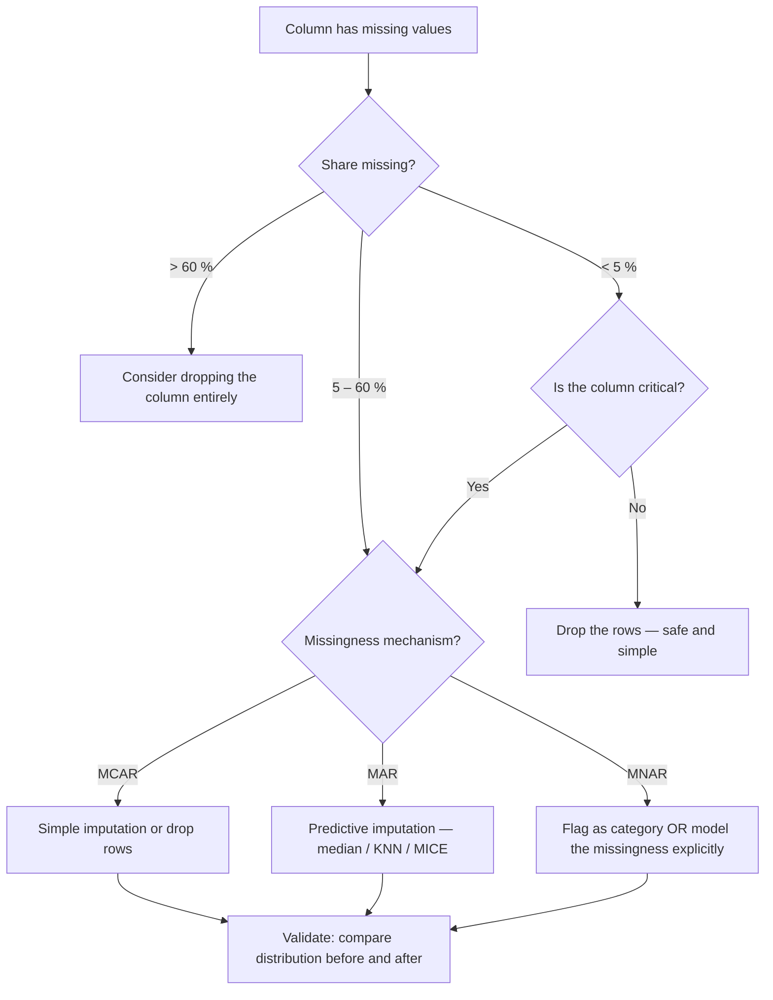
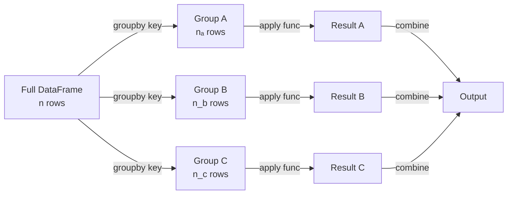
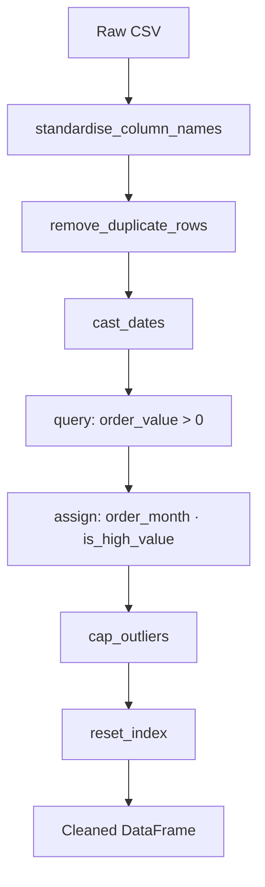
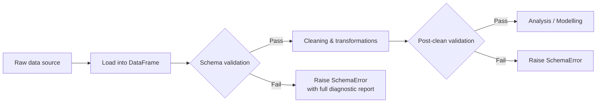

# M6 — Instructor Guide: Data Analysis with Python
> 90-minute lesson | Datasets: `titanic_clean.csv`, `ecommerce_orders.csv` | Developer depth
> **Oral checkpoint at end of this module**

---

## Learning Objectives

By end of session, students can:
1. Handle missing data with deliberate, justified strategies (not just `dropna()`)
2. Use `groupby()` with aggregate, transform, and filter — including within-group normalisation
3. Merge DataFrames safely and verify the result with row-count checks and `validate=`
4. Build a reusable `.pipe()` transformation chain
5. Reduce DataFrame memory footprint using dtype optimisation
6. Write a basic data validation schema with `pandera` (developer track)
7. Use a local LLM to generate realistic synthetic tabular data and validate it with pandera
8. Apply an AI pair-programming workflow to pandas transformations

---

## Lesson Outline

| Time | Activity | Notes |
|------|----------|-------|
| 0:00–0:10 | M5 debrief — who computed effect size alongside p-value? | Reinforce the habit |
| 0:10–0:25 | **L6.1** — Missing data: locate, quantify, decide, justify | Live: titanic_clean.csv |
| 0:25–0:40 | **L6.2** — groupby(): agg, transform, filter patterns | Live: ecommerce_orders.csv |
| 0:40–0:55 | **L6.3** — Merging: join types, validate=, row-count audit | Live: join titanic + orders scenario |
| 0:55–1:05 | **L6.6** — `.pipe()` for readable transformation chains | Students refactor their M2 cleaning code |
| 1:05–1:15 | **L6.5** — dtype optimisation: memory before and after | Show 10× memory reduction demo |
| 1:15–1:25 | **L6.7** — pandera schema validation (developer track) | Optional extension |
| 1:25–1:30 | Oral checkpoint prep + preview M7 | |
| NEW | **L6.6** — Synthetic data generation with Gemma 4n | Generate realistic datasets with a local model |
| NEW | **L6.7** — AI pair-programming for wrangling | AI-assisted transformation workflow |
| NEW | **L6.8** [AI-OFF] — Full wrangling pipeline ⊘ | Independent pipeline build |

---

## Key Concepts (with Lesson IDs)

### L6.1 — Missing data handling `[McKinney Ch7 p.215–230]`

#### How pandas represents the three missing-value sentinels

In pandas, three distinct sentinels can occupy the space where a value is absent, and they do not behave identically. `NaN` (IEEE 754 Not a Number) is a floating-point concept; it propagates silently through arithmetic and is the default fill for `float64` columns. `None` is Python's built-in null object; it appears most often in `object`-dtype columns and causes a `TypeError` rather than quiet propagation when you try arithmetic on it. `pd.NA` is a newer, dtype-aware sentinel introduced for the nullable integer (`Int64`), boolean (`boolean`), and string (`StringDtype`) extension types; it behaves more consistently across operations than either of its older siblings.

The differences matter in practice because equality comparisons on `NaN` silently fail. `NaN == NaN` returns `False` — a consequence of the IEEE 754 standard — so any filter written as `df[df['col'] == float('nan')]` returns an empty result. Both `pd.isna()` and `pd.isnull()` handle all three sentinels correctly and are the only reliable tools for detecting missingness across all dtype families.

A subtle side-effect of reading CSVs: pandas promotes integer columns to `float64` whenever any value is missing, because `NaN` is a float-only concept. A column of passenger IDs that had one gap will silently become floats. Using the nullable extension types (`pd.Int64Dtype()`, `pd.BooleanDtype()`) avoids this promotion while retaining integer semantics.

```python
import pandas as pd

# Demonstrate the three sentinels
s_float = pd.Series([1.0, float('nan'), 3.0])          # NaN in float64
s_obj   = pd.Series(['a', None, 'c'])                   # None in object
s_int   = pd.Series([1, pd.NA, 3], dtype='Int64')       # pd.NA in nullable int

for s in [s_float, s_obj, s_int]:
    print(f"dtype={s.dtype}  isna={s.isna().tolist()}")

# Arithmetic propagation comparison
print(float('nan') + 1)         # nan  — silent propagation
try:
    print(None + 1)             # TypeError
except TypeError as e:
    print(f"TypeError: {e}")
print(pd.NA + 1)                # <NA> — propagates, like nan but typed
```

#### Performing a structured missingness audit

Before deciding how to handle missing values, you need a complete picture: where are the gaps, how many are there, and do they cluster in any pattern? A structured audit gives you that picture in three steps: count, proportion, and visual pattern check.

```python
import pandas as pd
import missingno as msno
import matplotlib.pyplot as plt

df = pd.read_csv('data/titanic_clean.csv')

# --- Step 1: count and proportion per column ---
audit = pd.DataFrame({
    'missing_n':   df.isnull().sum(),
    'missing_pct': df.isnull().mean().mul(100).round(2),
    'dtype':       df.dtypes,
}).sort_values('missing_pct', ascending=False)

print(audit[audit['missing_n'] > 0])          # only show columns with gaps

# --- Step 2: visual matrix — see where gaps fall ---
msno.matrix(df, figsize=(10, 5), sparkline=False)
plt.tight_layout()
plt.savefig('output/missing_matrix.png', dpi=150)

# --- Step 3: heatmap — are any columns missing together? ---
msno.heatmap(df, figsize=(8, 5))
plt.tight_layout()
plt.savefig('output/missing_heatmap.png', dpi=150)
```

The `missingno` matrix is a white-and-black bar chart: each row is an observation, each column is a feature. White means present, black means missing. If rows with a missing `Age` also tend to have a missing `Cabin`, you will see horizontal stripes of black spanning both columns — a pattern suggesting that the two gaps share a common cause rather than occurring independently.

#### The three mechanisms of missingness — MCAR, MAR, MNAR

The mechanism that causes values to be absent is the most important factor in choosing a remediation strategy. Rubin's (1976) framework distinguishes three cases:

**MCAR — Missing Completely At Random.** The probability that a value is absent is unrelated to any variable in the dataset, observed or unobserved. A sensor that fails at random with probability $p = 0.02$ produces MCAR gaps. Dropping MCAR rows introduces no bias, though it wastes information.

**MAR — Missing At Random.** The probability of missingness depends on *observed* variables but not on the missing value itself. Age might be systematically missing more often in third-class passengers, but within each class, the gap is unrelated to the actual age. Once you condition on class, the mechanism is fully explainable. Imputation using those observed predictors is statistically valid under MAR.

**MNAR — Missing Not At Random.** The probability of a value being absent depends on the value itself. Respondents with very high incomes may refuse to report income; patients too ill to attend a follow-up have no follow-up record. Standard imputation will produce biased estimates for MNAR data because the absence encodes information that the imputed values do not capture.

$$
P(\text{missing}) =
\begin{cases}
\text{constant} & \text{MCAR} \\
f(\text{observed columns}) & \text{MAR} \\
f(\text{the missing value itself}) & \text{MNAR}
\end{cases}
$$

In practice, MCAR is testable (by comparing the observed distribution of other columns for missing vs. non-missing rows), MAR is assumed when a plausible observed predictor can explain the gap, and MNAR usually requires domain knowledge to identify.

#### A decision flow for choosing a handling strategy



Walking through this flowchart for every column in the audit forces deliberate decisions. The most important discipline is writing down the mechanism you believe applies and why — that note becomes part of your data documentation and is invaluable if the pipeline is questioned later.

#### Practical handling patterns in code

**Dropping rows** is justified when the missing fraction is small, the mechanism is plausibly MCAR, and the column is not analytically critical. Target only the columns that have gaps by specifying `subset=` — never call `df.dropna()` without it, because that silently drops any row with a single missing value anywhere.

**Median imputation** for numeric columns is the most defensible default because the median is robust to outliers and skew. The mean is pulled toward the tail and can produce imputed values that look implausibly high or low.

**Mode imputation** for categorical columns fills the gap with the most frequent label. When the missing category carries meaning — for example, `Cabin` is missing almost exclusively for third-class passengers in the Titanic data — creating an explicit `'Unknown'` label is more honest than imputing the most common cabin deck.

**Indicator columns** are a low-cost supplement: add a boolean column `was_missing_age` *before* you fill `Age`. That indicator preserves information about the missingness pattern and can become a feature in downstream modelling that captures whether absence itself is predictive.

```python
import pandas as pd

df = pd.read_csv('data/titanic_clean.csv')

# -- 1. Save a missingness indicator before filling --
df['age_was_missing'] = df['Age'].isnull().astype(int)   # 1 where gap existed

# -- 2. Median imputation for skewed numeric column --
df['Age'] = df['Age'].fillna(df['Age'].median())

# -- 3. Explicit 'Unknown' for a column where missingness carries meaning --
df['Cabin'] = df['Cabin'].fillna('Unknown')

# -- 4. Drop rows where only 2 values are missing and column is non-critical --
df = df.dropna(subset=['Embarked'])                       # only 2 rows affected

print(df.isnull().sum())                                  # confirm no remaining gaps
```

#### Verifying that imputation preserved the distribution

After imputation, always compare the pre- and post-imputation statistics. A large shift in the mean or a visible narrowing of the standard deviation is a warning sign that too many rows were imputed.

```python
import pandas as pd
import matplotlib.pyplot as plt

df_raw = pd.read_csv('data/titanic_clean.csv')

before = df_raw['Age'].describe()

df_filled = df_raw.copy()
df_filled['Age'] = df_filled['Age'].fillna(df_filled['Age'].median())
after = df_filled['Age'].describe()

print(pd.DataFrame({'before': before, 'after': after}).round(2))

# Histogram comparison
fig, axes = plt.subplots(1, 2, figsize=(10, 4), sharey=True)
df_raw['Age'].dropna().hist(ax=axes[0], bins=30, color='steelblue', edgecolor='white')
axes[0].set_title('Age — original (non-missing only)')
df_filled['Age'].hist(ax=axes[1], bins=30, color='darkorange', edgecolor='white')
axes[1].set_title('Age — after median imputation')
plt.tight_layout()
```

A spike at the median value in the post-imputation histogram reveals how many rows were imputed. If the spike is conspicuously tall, it means the column now looks artificially uniform around the fill value — an important caveat to note in any analysis report.

#### When to drop a column entirely

If more than roughly 60 % of a column is missing and you have no domain reason to believe MNAR applies, imputing it is largely an exercise in guessing. The resulting column will have very little real signal. Document the decision, check whether the column can be reconstructed from an external source, and drop it if it cannot.

```python
# Identify candidates for full-column removal
drop_candidates = audit[audit['missing_pct'] > 60].index.tolist()
print(f"Columns to consider dropping: {drop_candidates}")

df_reduced = df.drop(columns=drop_candidates)
print(f"Shape before: {df.shape}  →  after: {df_reduced.shape}")
```

#### Imputing with train/test discipline

A frequently overlooked mistake: if you compute the imputation value (median, mean, or KNN statistics) on the entire dataset before splitting it into train and test sets, the test set has leaked information into the training imputation. The correct workflow is to fit the imputer **only on training data** and then apply it to both sets.

```python
from sklearn.impute import SimpleImputer
from sklearn.model_selection import train_test_split
import pandas as pd

df = pd.read_csv('data/titanic_clean.csv')
X = df[['Age', 'Fare', 'SibSp']].values
y = df['Survived'].values

X_train, X_test, y_train, y_test = train_test_split(X, y, test_size=0.2, random_state=42)

imp = SimpleImputer(strategy='median')
X_train = imp.fit_transform(X_train)   # learn median from training set only
X_test  = imp.transform(X_test)        # apply train median — no fit() on test
print(f"Imputation statistics (train medians): {imp.statistics_}")
```

#### Common Mistakes

- **Calling `dropna()` without `subset=`**: This silently drops any row with even one missing value anywhere, which can remove a large fraction of the data even when most columns are complete.
- **Mean imputation on a skewed column**: A long right tail pulls the mean above the typical value, biasing every imputed row upward. Check the distribution before choosing a statistic.
- **Testing for `NaN` with `== float('nan')`**: `NaN == NaN` is `False` in Python. Always use `pd.isna()` or `.isnull()`.
- **Fitting the imputer on the full dataset before train/test split**: This leaks test-set statistics into training data, inflating evaluation metrics.
- **Treating MNAR data as MCAR**: Dropping or naively imputing MNAR data erases the signal carried by the absence. At minimum, add a missingness indicator column.
- **Not verifying the distribution after imputation**: A spike at the fill value in a post-imputation histogram is a warning sign that far more rows were imputed than expected.

#### Practice Questions

1. A column `annual_salary` is missing for 35 % of rows. Inspection shows that salaried employees have salary recorded but hourly workers do not. Which missingness mechanism is this — MCAR, MAR, or MNAR? Justify your answer and propose a handling strategy.
2. You run `df.isnull().sum()` and discover that `age` and `income` are *always* missing in the same rows. What does this pattern suggest, and how would you investigate its cause?
3. Write code to add a binary indicator column `price_was_missing` before imputing `price` with its median. Why might this indicator be valuable as a model feature?
4. A colleague argues: "If we drop all rows with any missing value, at least our analysis is on clean data." Explain two concrete ways this approach could bias a result.
5. A `Cabin` column is missing for 77 % of rows. The domain expert says that passengers without a cabin record were overwhelmingly third class. Describe two handling approaches and explain which preserves more information.

### L6.2 — `groupby()` mastery `[McKinney Ch10 p.290–325]`

#### The split-apply-combine mental model

`groupby()` implements the *split-apply-combine* pattern. The DataFrame is split into sub-tables, one per unique group key; a function is applied independently within each sub-table; and the results are combined back into a single output. Understanding these three stages separately makes it much easier to choose between `agg()`, `transform()`, `apply()`, and `filter()`, because each of those methods differs in the shape of the output it produces.

The split stage is cheap — pandas stores group indices internally without copying rows. The apply stage is where the real work happens. The combine stage assembles the output, whose shape depends on which method you used: `agg()` produces one row per group, `transform()` returns the original number of rows, and `filter()` returns a subset of the original rows.



#### Using `agg()` for concise named group summaries

`groupby().agg()` is the primary tool for group summary statistics. The **named aggregation** syntax — `result_col=(source_col, func)` — produces a flat column index from the start and avoids the awkward multi-level column headers that arise from the older dictionary-of-lists style. Each argument names the output column directly.

```python
import pandas as pd

df = pd.read_csv('data/ecommerce_orders.csv', parse_dates=['order_date'])

# Convert low-cardinality columns to category for faster groupby
df['category'] = df['category'].astype('category')
df['region']   = df['region'].astype('category')

# Named aggregation — result columns are named at definition time
summary = df.groupby('category').agg(
    total_revenue  = ('order_value', 'sum'),           # total sales per group
    mean_order     = ('order_value', 'mean'),           # average basket size
    std_order      = ('order_value', 'std'),            # spread
    n_orders       = ('order_id',    'count'),          # transaction volume
    n_unique_cust  = ('customer_id', 'nunique'),        # distinct customers
    first_order    = ('order_date',  'min'),            # earliest date
    latest_order   = ('order_date',  'max'),            # most recent date
).reset_index()

print(summary.sort_values('total_revenue', ascending=False).round(2))

# Multi-level groupby: category × region
pivot = df.groupby(['category', 'region']).agg(
    revenue = ('order_value', 'sum'),
    orders  = ('order_id',    'count'),
).reset_index()
```

Multiple grouping keys are straightforward — pass a list. The output index will have one level per key. Adding `.reset_index()` flattens it into regular columns, which makes downstream merges and filters cleaner.

#### Using `transform()` to add within-group statistics to each row

`transform()` is fundamentally different from `agg()`: it returns a Series with the *same index and length as the input*. That means the result can be assigned directly back to the DataFrame as a new column. The typical use case is adding a group-level summary alongside each individual row so you can compute relative or normalised values — within-group z-scores, percentages of group total, or cumulative sums.

```python
# Add group mean and within-group z-score as new columns
df['cat_mean']   = df.groupby('category')['order_value'].transform('mean')
df['cat_std']    = df.groupby('category')['order_value'].transform('std')

# Z-score normalisation within each category group
df['z_in_cat']   = (df['order_value'] - df['cat_mean']) / df['cat_std']

# Percentage of category mean
df['pct_of_mean'] = df['order_value'] / df['cat_mean'] * 100

# Cumulative revenue within each category, in date order
df = df.sort_values('order_date')
df['cumrev_in_cat'] = df.groupby('category')['order_value'].transform('cumsum')

print(df[['order_id', 'category', 'order_value', 'cat_mean', 'z_in_cat']].head(8).round(2))
```

The within-group z-score formula is:

$$z_i = \frac{x_i - \bar{x}_g}{\sigma_g}$$

where $\bar{x}_g$ is the group mean and $\sigma_g$ is the group standard deviation. Standardising within groups removes cross-group scale differences, which is important before feeding data into distance-sensitive models.

#### Filtering whole groups with `filter()`

`filter()` accepts a function that receives each group as a sub-DataFrame and should return `True` (keep) or `False` (discard). It operates at the group level — it either keeps or removes all rows of a group, never individual rows within a group. This makes it appropriate for questions like "keep only categories with at least 50 transactions" or "remove any region whose average order value is below a threshold."

```python
# Keep only categories with more than 50 orders
active_cats = df.groupby('category').filter(lambda g: len(g) > 50)
print(f"Rows kept: {len(active_cats):,} / {len(df):,}")

# Keep categories where mean order value exceeds £100
premium_cats = df.groupby('category').filter(lambda g: g['order_value'].mean() > 100)
```

A common point of confusion: `filter()` always returns the same columns as the input. It is not a column selector — it is a group-level row selector. For individual-row filtering, use `query()` or boolean indexing.

#### Named aggregation with custom functions

Sometimes a built-in aggregation string is not enough. You can pass any callable — including lambda functions or named functions — as the aggregation operation. Custom aggregations run slower than built-ins because pandas cannot dispatch them to its optimised Cython routines, but they are very flexible.

```python
def p90(x):
    return x.quantile(0.90)

def iqr(x):
    return x.quantile(0.75) - x.quantile(0.25)

custom_summary = df.groupby('category').agg(
    median_value = ('order_value', 'median'),
    p90_value    = ('order_value', p90),              # custom 90th percentile
    iqr_value    = ('order_value', iqr),              # interquartile range
    heavy_orders = ('order_value',                    # count of high-value orders
                    lambda x: (x > 200).sum()),
).reset_index()

print(custom_summary.round(2))
```

The performance gap between vectorised built-ins and custom lambdas grows sharply as the table grows. If you find a custom function on a large table is slow, consider whether a combination of `transform()` and boolean indexing could replace it.

#### Computing ranks and percentiles within groups

A common real-world request is "rank each order within its region by value." This combines `transform()` with pandas rank semantics.

```python
df['rank_in_region'] = (
    df.groupby('region')['order_value']
    .rank(method='dense', ascending=False)   # 1 = highest value in region
    .astype(int)
)

# Top 3 orders per region
top3 = (
    df[df['rank_in_region'] <= 3]
    .sort_values(['region', 'rank_in_region'])
    [['order_id', 'region', 'order_value', 'rank_in_region']]
)
print(top3.head(12))

# Percentile rank within group (0 to 1)
df['pct_rank_in_cat'] = (
    df.groupby('category')['order_value']
    .rank(pct=True)                           # fractional rank, 1.0 = maximum
)
```

#### Flattening multi-level column output

When you pass a dictionary of lists to `agg()` — such as `{'order_value': ['mean', 'std']}` — the output has a multi-level column index that is cumbersome to work with downstream. Named aggregation avoids this entirely, but it is worth knowing how to flatten multi-level columns if you encounter them in existing code.

```python
# Dictionary-of-lists syntax — produces a multi-level column index
messy = df.groupby('category').agg({'order_value': ['mean', 'std', 'count']})
print(messy.columns)      # MultiIndex: [('order_value', 'mean'), ...]

# Flatten by joining the levels with an underscore
messy.columns = ['_'.join(c).strip('_') for c in messy.columns]
print(messy.columns)      # ['order_value_mean', 'order_value_std', 'order_value_count']

# Named aggregation avoids the problem entirely
clean = df.groupby('category').agg(
    mean_value  = ('order_value', 'mean'),
    std_value   = ('order_value', 'std'),
    count_value = ('order_value', 'count'),
)
```

#### Performance tips for large groupby operations

For large DataFrames, four concrete optimisations improve `groupby()` performance:

1. **Convert grouping columns to `category` dtype** — integer codes hash faster than variable-length strings during the split stage.
2. **Use built-in string aggregations** (`'mean'`, `'sum'`, `'count'`, `'min'`, `'max'`, `'std'`) instead of lambda functions — pandas dispatches these to optimised Cython routines.
3. **Sort the DataFrame by the grouping key first** — this can improve cache locality for grouped operations on large tables.
4. **Avoid `apply()` where a vectorised alternative exists** — `apply()` is the most flexible but slowest groupby method; always check whether `agg()` or `transform()` can replace it.

```python
import timeit

df['category'] = df['category'].astype('category')        # convert once upfront

# Compare groupby speed: object vs category key
df_obj = df.copy(); df_obj['category'] = df_obj['category'].astype(str)
df_cat = df.copy()   # already category

t_obj = timeit.timeit(lambda: df_obj.groupby('category')['order_value'].mean(), number=500)
t_cat = timeit.timeit(lambda: df_cat.groupby('category')['order_value'].mean(), number=500)
print(f"object: {t_obj:.3f}s   category: {t_cat:.3f}s   speedup: {t_obj/t_cat:.1f}×")
```

#### Common Mistakes

- **Confusing `agg()` and `transform()`**: `agg()` produces one row per group; `transform()` produces the same number of rows as the input. Trying to assign `agg()` output back to the original DataFrame will raise a shape mismatch.
- **Applying a custom lambda when a built-in exists**: `lambda x: x.mean()` is significantly slower than the string `'mean'`; always prefer built-in aggregation strings for simple statistics.
- **Forgetting `reset_index()`**: After most `groupby().agg()` calls, the group key becomes the index. Downstream merges and boolean filters are cleaner with the index reset to integers.
- **Using `filter()` expecting per-row filtering**: `filter()` drops or keeps entire groups; `query()` or boolean indexing filters individual rows.
- **Not converting grouping keys to `category`**: On a table with millions of rows and a string grouping column, the hashing overhead is measurable. A category conversion takes a few milliseconds once and saves it on every subsequent groupby.

#### Practice Questions

1. Using the `ecommerce_orders.csv` dataset, compute the following per category in a single `agg()` call: total revenue, median order value, number of unique customers, and the date of the most recent order.
2. Add a column `above_cat_median` that is `True` for each row where the order value exceeds the median for its category. Write this as a single expression using `transform()`.
3. What is the difference between these two lines? `df.groupby('cat')['val'].agg('mean')` vs `df.groupby('cat')['val'].transform('mean')`. Describe the shape and index of each result.
4. Keep only the categories where the standard deviation of order value is greater than 50. Write the `filter()` call and confirm the row count.
5. Write a custom aggregation that computes the *percentage of orders above £150* in each category. Test it on `ecommerce_orders.csv` and compare execution time to an equivalent expression using only `transform()` and boolean arithmetic.

### L6.3 — Safe merging `[McKinney Ch8 p.255–275]`

#### Why merging is a correctness risk, not just syntax

A merge that runs without raising an exception is not necessarily a correct merge. The two most dangerous silent failure modes are: a **row explosion**, where keys appear multiple times in both tables and pandas performs a Cartesian product of those rows, inflating the output far beyond either input; and **silent data loss**, where an inner join quietly discards every row whose key does not appear in the other table. Both of these failures can propagate through an entire pipeline undetected.

The discipline of safe merging means always recording row counts before and after, always using `validate=` to make key-uniqueness assumptions explicit and machine-checked, and always using `indicator=True` to inspect match statistics. These steps are not optional extras — they are the difference between a pipeline that surfaces data quality problems immediately and one that hides them until a result is questioned.

#### The four join types with ASCII diagrams

```
LEFT JOIN                              RIGHT JOIN
┌────────────┐   ┌────────────┐        ┌────────────┐   ┌────────────┐
│ Left       │   │ Right      │        │ Left       │   │ Right      │
│ A ─────────┼───┼── A  ✓     │        │ A ─────────┼───┼── A  ✓     │
│ B ─────────┼   │   (none)   │        │   (none)   │   ├── B  ✓     │
│ C ─────────┼───┼── C  ✓     │        │ C ─────────┼───┼── C  ✓     │
└────────────┘   └────────────┘        └────────────┘   └────────────┘
  All left rows kept                     All right rows kept
  Right cols = NaN where unmatched       Left cols = NaN where unmatched

INNER JOIN                             OUTER (FULL) JOIN
┌────────────┐   ┌────────────┐        ┌────────────┐   ┌────────────┐
│ Left       │   │ Right      │        │ Left       │   │ Right      │
│ A ─────────┼───┼── A  ✓     │        │ A ─────────┼───┼── A  ✓     │
│ B (dropped)│   │            │        │ B ─────────┼   │   (none)   │
│ C ─────────┼───┼── C  ✓     │        │ C ─────────┼───┼── C  ✓     │
└────────────┘   └────────────┘        └────────────┘   ├── D  ✓     │
  Only matched rows kept                                 └────────────┘
                                         All rows from both sides
                                         NaN where unmatched
```

Choosing the wrong join type is a category of bug, not a style preference. Using `inner` when `left` was intended discards unmatched rows from the left table without any warning. Using `left` when `inner` was intended keeps rows with `NaN` in every right-table column, which will propagate errors through all downstream calculations that assume those columns are non-null.

#### The pre-merge checklist

Before running any merge, work through this checklist deliberately:

1. **Count rows in both inputs** and write them down.
2. **Inspect key columns for nulls** — `df['key'].isnull().sum()` in each table.
3. **Check key uniqueness** — `df['key'].duplicated().sum()` in each table.
4. **Identify shared column names** (other than the join key) that will need `suffixes=`.
5. **State which join type is semantically correct** and why.

```python
def merge_audit(left, right, key):
    """Print pre-merge diagnostics for two DataFrames."""
    print(f"Left  rows: {len(left):>8,}   key nulls: {left[key].isnull().sum()}")
    print(f"Right rows: {len(right):>8,}   key nulls: {right[key].isnull().sum()}")
    print(f"Left  key unique:  {left[key].nunique():,} / {len(left):,}")
    print(f"Right key unique: {right[key].nunique():,} / {len(right):,}")
    shared = set(left.columns) & set(right.columns) - {key}
    if shared:
        print(f"Shared non-key columns (need suffixes): {shared}")
```

#### Using `validate=` as a key-uniqueness guardrail

The `validate=` parameter makes key-uniqueness assumptions explicit and raises a `MergeError` immediately if they are violated. The four options are:

| `validate=` value | Meaning |
|-------------------|---------|
| `'one_to_one'` | Key must be unique in **both** tables |
| `'one_to_many'` | Key is unique in the **left** table only |
| `'many_to_one'` | Key is unique in the **right** table only |
| `'many_to_many'` | No uniqueness check (permits row explosion) |

Always set `validate=` to the strictest option your design intent allows. `many_to_many` is almost never the correct choice in a production pipeline; leaving it as the default is how row explosions happen silently.

```python
import pandas as pd

# Each passenger has exactly one ticket record — passenger_id is unique in df_tickets
merged = pd.merge(
    df_passengers,
    df_tickets,
    on='passenger_id',
    how='left',
    validate='many_to_one',    # will raise MergeError if passenger_id not unique in right
    indicator=True,
    suffixes=('_pax', '_tkt'),
)
# If df_tickets has duplicate passenger_id values, this raises immediately:
# MergeError: Merge keys are not unique in right dataset; not a many-to-one merge
```

#### Reading the `indicator=True` output

Adding `indicator=True` appends a `_merge` column with three possible values:

- `'both'` — key matched in both tables
- `'left_only'` — key appeared only in the left table
- `'right_only'` — key appeared only in the right table (only possible with `outer` or `right` joins)

```python
print(merged['_merge'].value_counts())
# both          712
# left_only      76
# right_only      0

# Investigate: why do 76 passengers have no ticket record?
unmatched = merged[merged['_merge'] == 'left_only'][['passenger_id', 'name', '_merge']]
print(unmatched.head(10))
```

A `left_only` count larger than expected is a data quality signal. Common causes: trailing whitespace in key values, different capitalisation conventions between sources, or records that genuinely exist in one table but not the other (which may be intentional or a processing error).

#### Row-count validation after the merge

After every merge, compare the actual row count to what you predicted given the join type and the key uniqueness you audited:

- **Left join with unique right key**: output rows == left input rows.
- **Inner join**: output rows ≤ min(left rows, right rows).
- **Unchecked many-to-many**: output rows can be $n_L \times n_R$ in the worst case.

$$n_{\text{output}} = \sum_k \text{matches}(k_{\text{left}}, k_{\text{right}})$$

```python
n_left  = len(df_passengers)
n_right = len(df_tickets)
n_out   = len(merged)

print(f"Left: {n_left:,}  Right: {n_right:,}  Output: {n_out:,}")

# For a left join with unique right key, output must equal left
assert n_out == n_left, (
    f"Row count unexpected: expected {n_left:,}, got {n_out:,}. "
    f"Check for duplicate keys in the right table."
)
```

#### Handling column name collisions with `suffixes=`

When both DataFrames have a non-key column with the same name, pandas appends `_x` and `_y` by default. That is acceptable in an exploratory notebook but confusing in production code because the provenance of each column is unclear. Always specify meaningful suffixes.

```python
# Both tables have 'age' and 'name' — use clear provenance suffixes
merged = pd.merge(
    df_passengers,
    df_crew,
    on='vessel_id',
    how='inner',
    suffixes=('_passenger', '_crew'),
)
print([c for c in merged.columns if c.endswith(('_passenger', '_crew'))])
# ['age_passenger', 'name_passenger', 'age_crew', 'name_crew']
```

A consistent naming convention such as `('_left', '_right')` or `('_src', '_tgt')` is fine as long as it is applied throughout the codebase and documented.

#### A reusable safe-merge function

Wrapping the pattern into a function ensures the discipline is applied every time a merge is needed, without relying on the developer remembering each step.

```python
import pandas as pd

def safe_merge(left, right, on, how='left', validate='many_to_one',
               suffixes=('_left', '_right'), expect_rows=None):
    """
    Perform a merge with pre- and post-merge diagnostics.

    Parameters
    ----------
    expect_rows : int or None
        If provided, assert the output has exactly this many rows.
    """
    n_left, n_right = len(left), len(right)
    print(f"[merge] {n_left:,} left × {n_right:,} right  on='{on}'  how='{how}'")

    result = pd.merge(
        left, right,
        on=on, how=how,
        validate=validate,
        indicator=True,
        suffixes=suffixes,
    )

    print(f"[merge] output: {len(result):,} rows")
    print(result['_merge'].value_counts().to_string())

    if expect_rows is not None:
        assert len(result) == expect_rows, (
            f"Expected {expect_rows:,} rows, got {len(result):,}"
        )

    return result.drop(columns=['_merge'])   # clean up indicator column

# Usage
df_merged = safe_merge(
    df_passengers, df_tickets,
    on='passenger_id', how='left',
    expect_rows=len(df_passengers),
)
```

**Multi-column join keys and cross-dataset key formatting issues.** Merging on multiple columns is common when a single key is not unique but a combination of columns is. Use `on=['col_a', 'col_b']` or separate `left_on=` / `right_on=` parameters when the key columns have different names across tables.

```python
# Merge on composite key: (order_date, customer_id)
merged = pd.merge(
    df_orders,
    df_promos,
    left_on  = ['order_date', 'customer_id'],
    right_on = ['promo_date', 'cust_id'],
    how='left',
    validate='many_to_one',
)

# Key formatting normalisation before merge
df_a['customer_id'] = df_a['customer_id'].str.strip().str.upper()
df_b['customer_id'] = df_b['customer_id'].str.strip().str.upper()
```

Formatting mismatches between sources are the most common cause of unexpected `left_only` rows in the `_merge` indicator. Always normalise key columns (strip whitespace, standardise case, cast types) before merging.

#### Common Mistakes

- **Not setting `validate=`**: The default many-to-many join permits row explosion without any warning. Any merge where you expect uniqueness on at least one side should set `validate=`.
- **Using the wrong join type**: Using `inner` when semantically you want `left` silently discards unmatched rows. State your join type explicitly and justify it in a comment.
- **Ignoring the `_merge` indicator**: Running the merge but not inspecting `_merge` value counts means you cannot know whether your keys actually matched as expected.
- **Not checking for null join keys**: A null key in either table will not match any non-null key. Those rows will appear as `left_only` or be dropped silently depending on join type.
- **Accepting `_x` / `_y` suffixes in production code**: Default suffixes make the column provenance ambiguous. Always specify meaningful `suffixes=`.

#### Practice Questions

1. You have `df_customers` (1,000 rows, `customer_id` unique) and `df_orders` (5,000 rows, many orders per customer). Write a safe left join that keeps all orders and assert the output has exactly 5,000 rows. What `validate=` argument is correct here?
2. After a merge you expected 800 rows but got 1,200. Walk through the diagnostic steps you would take using `_merge` value counts and pre-merge key inspection to find the cause.
3. Draw an ASCII diagram showing what happens when you do an inner join on `df_a` (keys: 1, 2, 3) with `df_b` (keys: 2, 3, 4). How many rows will the output have, and which keys are dropped?
4. Both `df_a` and `df_b` have a column called `created_at`. Write the merge call with appropriate `suffixes=` and explain your naming choice.
5. A left join of two tables produces more output rows than the left table had. Explain exactly when this can happen and how `validate=` would have prevented it.

### L6.6 — `.pipe()` for readable pipelines `[Expert]`

#### Why method chaining improves code quality

Every data cleaning script accumulates intermediate variables: `df1`, `df2`, `df_clean`, `df_clean_v2`. Intermediate variables are a symptom of a workflow that cannot yet express its intentions as a single coherent sequence. The problem is not merely cosmetic. Every intermediate assignment is an opportunity to accidentally reuse a stale variable, to skip a transformation step when re-running notebook cells out of order, or to forget which cleaning operations have already been applied.

Method chaining restructures the code so data flows through a sequence of transformations from top to bottom, with a single assignment at the end. Reading a well-constructed chain is like reading a recipe: ingredients go in at the top, and a finished result comes out at the bottom. Every stage is explicit and in order.

The fundamental guideline for chaining is that each step should do exactly one thing. A function that strips whitespace from column names should only strip whitespace from column names. A function that filters out non-positive prices should only filter out non-positive prices. When each step has a single responsibility, the chain is easy to read, test, and modify.

#### What `.pipe()` adds to a chain

pandas provides many chainable methods natively: `.assign()`, `.query()`, `.rename()`, `.drop()`, `.sort_values()`, `.reset_index()`. `.pipe()` is the bridge for custom functions that are not DataFrame methods. It calls `func(df, *args, **kwargs)` and returns the result, so any function that accepts a DataFrame and returns a DataFrame can be inserted into a method chain without breaking the flow.

```python
import pandas as pd

def clean_names(df: pd.DataFrame) -> pd.DataFrame:
    """Standardise column names to lowercase snake_case."""
    return df.rename(columns=lambda c: c.strip().lower().replace(' ', '_'))

def enforce_positive(df: pd.DataFrame, col: str) -> pd.DataFrame:
    """Remove rows where col is zero or negative."""
    return df[df[col] > 0].copy()

df_raw = pd.read_csv('data/ecommerce_orders.csv')

result = (
    df_raw
    .pipe(clean_names)                            # step 1: tidy column names
    .pipe(enforce_positive, col='order_value')    # step 2: remove bad rows
)
```

The design principle: each function passed to `.pipe()` must accept a DataFrame as its first argument and return a DataFrame. Functions that modify in place or return `None` will break the chain.

#### Building a reusable cleaning library

Once cleaning logic is expressed as `.pipe()`-compatible functions, those functions become a library that can be reused across datasets and tested in isolation. This transforms a notebook full of ad-hoc code into a set of composable, testable building blocks.

```python
import pandas as pd
import math

# --- Reusable cleaning functions ---

def standardise_column_names(df: pd.DataFrame) -> pd.DataFrame:
    """Strip whitespace and convert all headers to snake_case."""
    return df.rename(columns=lambda c: c.strip().lower().replace(' ', '_'))


def remove_duplicate_rows(df: pd.DataFrame, subset: list = None) -> pd.DataFrame:
    """Drop exact duplicate rows, optionally scoped to a subset of columns."""
    n_before = len(df)
    df = df.drop_duplicates(subset=subset, keep='first')
    print(f"  [dedup] removed {n_before - len(df):,} duplicate rows")
    return df


def cast_dates(df: pd.DataFrame, date_cols: list) -> pd.DataFrame:
    """Parse string date columns to datetime64; coerce unparseable values to NaT."""
    for col in date_cols:
        df = df.assign(**{col: pd.to_datetime(df[col], errors='coerce')})
    return df


def cap_outliers(df: pd.DataFrame, col: str,
                 lower_q: float = 0.01, upper_q: float = 0.99) -> pd.DataFrame:
    """Winsorise a numeric column at given quantile bounds."""
    lo = df[col].quantile(lower_q)
    hi = df[col].quantile(upper_q)
    return df.assign(**{col: df[col].clip(lower=lo, upper=hi)})


# --- Full cleaning pipeline ---
cleaned = (
    pd.read_csv('data/ecommerce_orders.csv')
    .pipe(standardise_column_names)
    .pipe(remove_duplicate_rows, subset=['order_id'])
    .pipe(cast_dates, date_cols=['order_date', 'ship_date'])
    .query("order_value > 0")                              # native chain method
    .assign(
        order_month   = lambda x: x['order_date'].dt.to_period('M'),
        is_high_value = lambda x: x['order_value'] > x['order_value'].quantile(0.9),
    )
    .pipe(cap_outliers, col='order_value', lower_q=0.01, upper_q=0.99)
    .reset_index(drop=True)
)

print(f"Cleaned shape: {cleaned.shape}")
print(cleaned.dtypes)
```

#### Using `.assign()` for column derivation within a chain

`.assign()` can create or overwrite multiple columns in a single call. When you pass a lambda, it receives the DataFrame *at that point in the chain*, so earlier assignments in the same call are visible. However, a column created in one `.assign()` call is not visible to other expressions *within the same call* — only to subsequent calls. When you need to derive column B from freshly derived column A, use two sequential `.assign()` calls.

```python
enriched = (
    cleaned
    .assign(
        # First derivation
        order_week = lambda x: x['order_date'].dt.isocalendar().week.astype(int),
    )
    .assign(
        # Second derivation references the column added in the first assign
        days_to_ship = lambda x: (x['ship_date'] - x['order_date']).dt.days,
        is_late      = lambda x: (x['ship_date'] - x['order_date']).dt.days > 5,
    )
)
```

#### Using `.query()` for readable row filters

`.query()` accepts a string expression that reads like natural language and avoids the syntactic noise of boolean indexing. It supports the `@variable` syntax to reference Python variables defined in the surrounding scope.

```python
min_value = 50
start_date = '2023-01-01'

# Without query — noisy boolean indexing
df_filtered = cleaned[
    (cleaned['order_value'] > min_value) &
    (cleaned['is_high_value'] == True)
]

# With query — clear and readable
df_filtered = (
    cleaned
    .query("order_value > @min_value")     # @ references the Python variable
    .query("is_high_value == True")
)
```

One limitation: column names with spaces or special characters must be backtick-quoted inside the query string (`\`my col\``). Standardising column names to snake_case with `standardise_column_names` eliminates this friction entirely.

#### Adding observability with a log_shape helper

Pipelines should not be silent black boxes. A lightweight logging helper that prints the current shape and returns the DataFrame unchanged makes each stage observable without breaking the chain.

```python
def log_shape(df: pd.DataFrame, label: str = '') -> pd.DataFrame:
    """Print shape at this point in the pipeline; return df unchanged."""
    dtype_counts = dict(df.dtypes.value_counts())
    print(f"  [{label}] shape={df.shape}  dtypes={dtype_counts}")
    return df

cleaned = (
    pd.read_csv('data/ecommerce_orders.csv')
    .pipe(log_shape, 'raw')
    .pipe(standardise_column_names)
    .pipe(log_shape, 'after rename')
    .pipe(remove_duplicate_rows, subset=['order_id'])
    .pipe(log_shape, 'after dedup')
    .query("order_value > 0")
    .pipe(log_shape, 'after value filter')
    .pipe(cap_outliers, col='order_value')
    .pipe(log_shape, 'after outlier cap')
)
```

In production, wrap the print statement behind a `verbose=True` parameter or a logging level check so the output can be suppressed without modifying the pipeline.

#### Mermaid diagram of the pipeline stages



Each box is a single responsibility. When a future requirement arrives — for example "also flag international orders" — it is added as a new `.assign()` or `.pipe()` step in the appropriate position without touching any existing step.

#### Refactoring existing code into a pipeline

The most common exercise is taking a block of sequential assignments and collapsing it into a chain. The rule is straightforward: every `df = df.something(...)` becomes a link in the chain, and every `df['new_col'] = ...` becomes `.assign(new_col=...)`.

```python
# Before refactoring — sequential assignments, easy to run out of order
df = pd.read_csv('data/ecommerce_orders.csv')
df.columns = df.columns.str.strip().str.lower().str.replace(' ', '_')
df = df.drop_duplicates(subset=['order_id'])
df = df[df['order_value'] > 0]
df['order_month'] = pd.to_datetime(df['order_date']).dt.to_period('M')
df['log_value'] = df['order_value'].apply(math.log)

# After refactoring — single chained expression
df = (
    pd.read_csv('data/ecommerce_orders.csv')
    .pipe(standardise_column_names)
    .pipe(remove_duplicate_rows, subset=['order_id'])
    .query("order_value > 0")
    .assign(
        order_month = lambda x: pd.to_datetime(x['order_date']).dt.to_period('M'),
        log_value   = lambda x: x['order_value'].apply(math.log),
    )
)
```

#### Common Mistakes

- **Writing side-effectful functions inside `.pipe()`**: Functions passed to `.pipe()` must return a new DataFrame. Modifying in place (`df['col'] = ...`) and also returning `df` creates a function that is hard to test and reason about in isolation.
- **Over-nesting lambda expressions inside `.assign()`**: If a derivation is more than a short expression, extract it into a named function and call it via `.pipe()` instead. Readability is the point.
- **Using `.query()` on column names with spaces**: Column names that contain spaces or special characters require backtick quoting inside `.query()`. Standardising names first removes this entirely.
- **Breaking the chain with intermediate assignments**: Writing `df = df.pipe(f)` inline defeats the purpose of the chain. Use the full chain expression or keep intermediate assignments visually separate and intentional.
- **Not testing pipe functions in isolation**: Each `.pipe()` function is independently testable with a small synthetic DataFrame. If you never test them alone, bugs are hard to localise when the full pipeline fails.

#### Practice Questions

1. Refactor the following three-step block into a single method chain using `.pipe()` and `.assign()`:
   ```python
   df = df.rename(columns=str.lower)
   df = df[df['price'] > 0]
   df['price_log'] = df['price'].apply(math.log)
   ```
2. Write a `log_shape` function and insert it between each step of a five-step chain. Describe what you would expect to see printed at each stage for a 10,000-row input.
3. A teammate suggests using `.apply(lambda row: row['qty'] * row['price'], axis=1)` inside `.assign()`. Propose a faster, vectorised alternative that produces the same result.
4. When should you use `.pipe()` versus `.assign()`? Give a concrete example where `.assign()` is the better choice and another where `.pipe()` is the better choice.
5. Your chain contains `.query("region == 'EMEA'")` but the filter returns zero rows unexpectedly. What diagnostic steps would you take, and how would you fix a trailing-whitespace issue in the pipeline?

### L6.5 — dtype memory optimisation `[Expert]`

#### Why memory matters for analytical workloads

A DataFrame that lives entirely in RAM is fast to query, join, and analyse. A DataFrame that forces the operating system to start swapping pages to disk can make interactive analysis unusably slow. Memory consumption also compounds during operations: joins, groupby, and sorting all allocate temporary copies of portions of the data. A 500 MB DataFrame may consume 1.5–2 GB of RAM during a complex pipeline.

The key insight is that pandas assigns dtypes automatically when reading data, and those defaults are not memory-optimal. Every column that holds small integers is stored as `int64` (8 bytes per value). Every string column is stored as `object`, which is a column of Python string objects carrying significant per-object overhead. Optimising dtypes is the fastest way to reduce memory usage because it requires no changes to the data — only to how it is stored.

#### Understanding default dtypes and their byte costs

| dtype | bytes / value | value range |
|-------|--------------|-------------|
| `float64` | 8 | ±1.8 × 10³⁰⁸, NaN support |
| `float32` | 4 | ±3.4 × 10³⁸, ~7 decimal digits |
| `int64` | 8 | −9.2 × 10¹⁸ to 9.2 × 10¹⁸ |
| `int32` | 4 | −2.1 × 10⁹ to 2.1 × 10⁹ |
| `int16` | 2 | −32,768 to 32,767 |
| `int8` | 1 | −128 to 127 |
| `bool` | 1 | True / False |
| `category` | varies | compact codes + labels lookup |

The gap between `float64` and `float32` is exactly 2×. For a 10-million-row floating-point column, that is 80 MB versus 40 MB for a single column. Across many columns the savings compound. The gap between `int64` and `int8` is 8×.

#### Performing a structured memory audit

Before optimising, measure the current footprint accurately. `df.memory_usage(deep=True)` shows the byte cost per column, including the actual contents of object-dtype columns. Without `deep=True`, the size of object columns is dramatically underestimated because only the reference pointers are counted, not the underlying Python string objects.

```python
import pandas as pd

df = pd.read_csv('data/titanic_clean.csv')

# Total memory in megabytes
total_mb = df.memory_usage(deep=True).sum() / 1e6
print(f"Total memory: {total_mb:.2f} MB")

# Per-column breakdown, sorted by cost
col_mem = (
    df.memory_usage(deep=True)
    .sort_values(ascending=False)
    .to_frame('bytes')
    .assign(mb=lambda x: x['bytes'] / 1e6)
)
print(col_mem)

# Which columns are object dtype? These are the candidates for category conversion
print("Object columns:", df.select_dtypes('object').columns.tolist())

# Value ranges help you decide whether a narrower integer type is safe
print(df.describe())
```

The value range information from `describe()` tells you which numeric columns have ranges small enough to fit in a narrower type. A column with values 1, 2, 3 fits in `int8`. A column with values 0–50,000 fits in `int32`.

#### Downcasting numeric columns safely

`pd.to_numeric(..., downcast='integer')` and `pd.to_numeric(..., downcast='float')` automatically select the smallest type that can represent the current column values without data loss.

```python
def optimise_numerics(df: pd.DataFrame) -> pd.DataFrame:
    """Downcast all integer and float columns to their smallest safe representation."""
    result = df.copy()
    for col in result.select_dtypes('integer').columns:
        result[col] = pd.to_numeric(result[col], downcast='integer')
    for col in result.select_dtypes('float').columns:
        result[col] = pd.to_numeric(result[col], downcast='float')
    return result

df_opt = optimise_numerics(df)
```

One important caveat: `float32` has only ~7 significant decimal digits compared to `float64`'s ~15. For most machine-learning features this is acceptable. For financial calculations where precision matters — monetary amounts, exchange rates, compound interest — stay with `float64` or use Python's `Decimal` type.

A second caveat: always guard against overflow. A column with maximum value 500,000 will silently corrupt if cast to `int16` (max 32,767). Check `df[col].max()` before downcasting.

```python
def safe_downcast_int(df: pd.DataFrame, col: str) -> pd.Series:
    """Downcast an integer column only if the value range fits safely."""
    col_max = df[col].max()
    col_min = df[col].min()
    if col_min >= -128 and col_max <= 127:
        return df[col].astype('int8')
    elif col_min >= -32768 and col_max <= 32767:
        return df[col].astype('int16')
    elif col_min >= -2_147_483_648 and col_max <= 2_147_483_647:
        return df[col].astype('int32')
    return df[col]   # already int64, no further reduction possible
```

#### Converting object columns to `category`

Object-dtype columns are the memory black holes of a DataFrame. Each Python string object carries a reference-counted header, a type pointer, and the actual string data — typically 50–100 bytes per object for short strings. A column of 100,000 repetitions of `'Electronics'` stores that string 100,000 times at full Python object cost.

Converting to `category` stores the string values once in a small lookup table and a compact integer code per row. The memory savings are dramatic when cardinality is low:

$$\text{memory ratio} \approx \frac{n_{\text{rows}} \cdot s_{\text{str}}}{n_{\text{unique}} \cdot s_{\text{str}} + n_{\text{rows}} \cdot s_{\text{code}}}$$

For a column with 1,000,000 rows, 5 unique values of average length 10 characters, and 1-byte integer codes, the ratio is roughly **200×** reduction.

```python
def categorise_low_cardinality(df: pd.DataFrame, threshold: float = 0.05) -> pd.DataFrame:
    """
    Convert object columns to category when unique-value ratio < threshold.
    threshold=0.05 means: convert if fewer than 5% of values are unique.
    """
    result = df.copy()
    for col in result.select_dtypes('object').columns:
        ratio = result[col].nunique() / len(result)
        if ratio < threshold:
            result[col] = result[col].astype('category')
            print(f"  [{col}] → category  "
                  f"(cardinality={result[col].nunique()}, ratio={ratio:.3f})")
    return result
```

#### Full optimisation pipeline with before/after measurement

```python
import pandas as pd

df = pd.read_csv('data/titanic_clean.csv')

before_mb = df.memory_usage(deep=True).sum() / 1e6
print(f"Before: {before_mb:.2f} MB")
print(df.dtypes)

df_opt = (
    df
    .pipe(optimise_numerics)
    .pipe(categorise_low_cardinality, threshold=0.05)
)

after_mb = df_opt.memory_usage(deep=True).sum() / 1e6
print(f"\nAfter:  {after_mb:.2f} MB")
print(df_opt.dtypes)
print(f"Reduction: {before_mb / after_mb:.1f}×  "
      f"({(1 - after_mb / before_mb) * 100:.0f}% smaller)")
```

#### The downstream benefits of smaller dtypes

Reduced memory is the headline benefit, but the second-order effects matter in equal measure:

- **Faster `groupby()`**: Integer codes hash more quickly than variable-length strings. Converting groupby columns to `category` directly speeds up group formation on large tables.
- **Better Parquet compression**: Parquet writes from optimised DataFrames compress more aggressively, often producing files 3–5× smaller, because narrower integer types have lower entropy and category encodings map directly to Parquet dictionary encoding.
- **Faster model training**: scikit-learn and XGBoost benefit from `float32` input arrays because less memory bandwidth is consumed when loading batches into processor caches.
- **Larger datasets in RAM**: With a 3–4× memory reduction, a dataset that formerly required disk paging can now be analysed entirely in RAM, making interactive exploration practical.

#### Common Mistakes

- **Downcasting without checking value ranges first**: Casting a column with max value 500,000 to `int16` (max 32,767) will silently overflow and corrupt the data. Always check `df[col].max()` before downcasting.
- **Converting high-cardinality columns to `category`**: If a column has nearly as many unique values as rows (IDs, names, emails), category conversion increases memory use rather than reducing it, because the overhead of the categories array dominates.
- **Using `float32` for monetary values**: The reduced precision of `float32` introduces rounding errors in financial arithmetic. Keep monetary values in `float64`.
- **Calling `memory_usage()` without `deep=True`**: Without `deep=True`, object-dtype columns are reported only by pointer size (8 bytes each), dramatically underestimating their true memory cost.
- **Not measuring the impact**: Optimising without a before/after measurement means you cannot know whether the change was worthwhile or whether it introduced unexpected precision loss.

#### Practice Questions

1. Load the Titanic CSV and run the full memory audit: total memory, per-column breakdown sorted by cost, and value ranges from `describe()`. Identify the two columns where dtype optimisation will have the largest percentage impact.
2. A column `product_category` has 20 unique values across 5 million rows. Estimate the approximate memory saving from converting it from `object` to `category` dtype. Show your working using the formula in this lesson.
3. Why is calling `pd.to_numeric(col, downcast='float')` potentially risky for a column storing prices accurate to two decimal places? What would you do instead?
4. Write an `optimise_numerics` function that guards against integer overflow by checking the column's actual maximum value before choosing the target dtype.
5. After dtype optimisation, a Parquet file written from the DataFrame is 60% smaller than before. Explain the two mechanisms — within-column value representation and Parquet dictionary encoding — that produce this improvement.

### L6.7 — Data validation with pandera `[Expert]` (developer track)

#### What data validation means in an analytical pipeline

Data validation is the practice of expressing expectations about your data in code and then asserting those expectations are met before analysis proceeds. It is the analytical equivalent of function signatures or type hints: a machine-checkable contract that catches the gap between what you assumed about the data and what is actually present.

Without explicit validation, that gap can go undetected for a long time. A pipeline might compute statistics on out-of-range values, train a model on negative ages, join on keys with unexpected nulls, or encounter a new category label that was never anticipated — all without raising any error, because pandas will perform arithmetic on whatever values are present. The bugs that result are subtle: the pipeline runs to completion, but the results are quietly wrong.

#### Why validate early rather than late

The cost of catching a data error increases dramatically the later it is found. An invalid value caught at ingestion costs one log message. The same error discovered after a model has been trained on corrupt data costs a full re-run, re-validation, and potentially stakeholder re-briefing. The "validate early" principle says: assert your data contracts at the boundary where data enters your system.



Validation is most valuable at two points: immediately after loading raw data (before any transformation runs on possibly corrupt input), and after cleaning (to confirm that the cleaning functions produced the expected output). Both points are boundary checks, not afterthoughts.

#### Introducing pandera

**pandera** is a Python library that provides a declarative, DataFrame-native schema validation API. You define a `DataFrameSchema` — a mapping of column names to `pa.Column` objects with type, nullability, uniqueness, and constraint rules. Calling `schema.validate(df)` checks every column against its specification and raises a `SchemaError` on the first failure, or (with `lazy=True`) collects all failures and reports them in a structured DataFrame.

```python
import pandera as pa
import pandas as pd

# Define expected schema for a student records table
schema = pa.DataFrameSchema(
    columns={
        'student_id':      pa.Column(int,   nullable=False, unique=True,
                                     checks=pa.Check.ge(1)),
        'score':           pa.Column(float, nullable=False,
                                     checks=pa.Check.between(0, 100)),
        'grade':           pa.Column(str,   nullable=False,
                                     checks=pa.Check.isin(['A', 'B', 'C', 'D', 'F'])),
        'attendance_rate': pa.Column(float, nullable=False,
                                     checks=pa.Check.between(0.0, 1.0)),
        'age':             pa.Column(int,   nullable=False,
                                     checks=pa.Check.ge(16) & pa.Check.le(100)),
        'email':           pa.Column(str,   nullable=True,
                                     checks=pa.Check.str_matches(r'.+@.+\..+')),
    },
    coerce=False,    # fail on type mismatch rather than silently converting
    strict=False,    # allow extra columns not listed in the schema
)
```

#### Commonly used pandera checks

pandera exposes a rich set of built-in checks on `pa.Check`:

| Check | Meaning |
|-------|---------|
| `pa.Check.between(lo, hi)` | $\text{lo} \le x \le \text{hi}$ |
| `pa.Check.ge(n)` | $x \ge n$ |
| `pa.Check.le(n)` | $x \le n$ |
| `pa.Check.isin([...])` | value must be in the set |
| `pa.Check.str_matches(r'...')` | string must match the regex |
| `pa.Check.str_length(min_val, max_val)` | string length must be in range |
| `pa.Check(lambda s: ...)` | arbitrary custom check on the Series |

Checks can be combined: `pa.Check.ge(0) & pa.Check.le(120)` means both conditions must hold. Custom checks are powerful but slower than built-ins because they cannot be vectorised by pandera.

```python
# Age: non-negative and at most 120
age_check = pa.Check.ge(0) & pa.Check.le(120)

# Status: from a controlled vocabulary
status_check = pa.Check.isin(['active', 'inactive', 'pending', 'suspended'])

# Custom check: price must have at most 2 decimal places
price_check = pa.Check(
    lambda s: ((s * 100).round(0) == s * 100).all(),
    error="Price must have at most 2 decimal places"
)
```

#### Lazy validation for complete error reports

By default, pandera stops at the first failure. In a pipeline processing a new data batch, you usually want to see *all* failures at once so you can address them together. `lazy=True` collects every failure and raises a single `SchemaErrors` exception whose `.failure_cases` attribute is a structured DataFrame.

```python
import pandera as pa
import pandas as pd

df_students = pd.read_csv('data/student_records.csv')

try:
    validated = schema.validate(df_students, lazy=True)
    print(f"Validation passed — {len(validated):,} rows")
except pa.errors.SchemaErrors as e:
    # failure_cases is a DataFrame: column, check, failure_case, index
    print(e.failure_cases[['column', 'check', 'failure_case']].to_string())
    raise   # re-raise to halt the pipeline
```

The `failure_cases` DataFrame is a complete diagnostic report. Each row names the column, the check that failed, the offending value, and the row index. This is far more actionable than a generic exception message and makes triage quick.

#### Writing a schema for the Titanic dataset

```python
import pandera as pa

titanic_schema = pa.DataFrameSchema(
    columns={
        'PassengerId': pa.Column(int,   nullable=False, unique=True,
                                 checks=pa.Check.ge(1)),
        'Survived':    pa.Column(int,   nullable=False,
                                 checks=pa.Check.isin([0, 1])),
        'Pclass':      pa.Column(int,   nullable=False,
                                 checks=pa.Check.isin([1, 2, 3])),
        'Name':        pa.Column(str,   nullable=False),
        'Sex':         pa.Column(str,   nullable=False,
                                 checks=pa.Check.isin(['male', 'female'])),
        'Age':         pa.Column(float, nullable=True,         # known gaps in data
                                 checks=pa.Check.between(0, 120)),
        'SibSp':       pa.Column(int,   nullable=False,
                                 checks=pa.Check.ge(0)),
        'Parch':       pa.Column(int,   nullable=False,
                                 checks=pa.Check.ge(0)),
        'Fare':        pa.Column(float, nullable=False,
                                 checks=pa.Check.ge(0)),
        'Embarked':    pa.Column(str,   nullable=True,
                                 checks=pa.Check.isin(['S', 'C', 'Q'])),
    },
    coerce=False,
    strict=False,
)

df_titanic = pd.read_csv('data/titanic_clean.csv')
validated  = titanic_schema.validate(df_titanic, lazy=True)
print(f"Validated {len(validated):,} rows — all checks passed.")
```

#### Integrating validation into a `.pipe()` pipeline

Validation is most powerful when it is woven into the transformation pipeline rather than run as a standalone step. Using `.pipe()` places schema checks at the boundaries between stages.

```python
def validate(df: pd.DataFrame, schema: pa.DataFrameSchema, label: str = '') -> pd.DataFrame:
    """Validate df against schema; print label on success, raise on failure."""
    result = schema.validate(df, lazy=True)
    print(f"  [validate:{label}] {len(result):,} rows — OK")
    return result

# Two schemas: one for raw input, one for post-clean output
raw_schema     = pa.DataFrameSchema({...})    # permissive — allows nullable fields
cleaned_schema = pa.DataFrameSchema({...})    # strict — all gaps must be filled

pipeline_result = (
    pd.read_csv('data/titanic_clean.csv')
    .pipe(validate, raw_schema, label='raw')
    .pipe(standardise_column_names)
    .pipe(remove_duplicate_rows)
    .pipe(validate, cleaned_schema, label='cleaned')
)
```

Running two validations — one before and one after cleaning — confirms that the cleaning functions themselves did not introduce new problems while fixing the original ones.

#### The schema as living documentation

A pandera schema is not only a runtime guardrail — it is also the most precise documentation you can write about a dataset. Instead of a comment saying "the age column should be between 0 and 120," the schema encodes that constraint as a testable assertion. Unlike a comment, it cannot fall out of sync with the code because it *is* the code.

When a new dataset version arrives with a changed value set, an additional nullable column, or a column renamed, the schema raises an error immediately. Schema failures are the schema telling you that an assumption you previously held has changed — a signal that triggers a deliberate review rather than a silent data drift.

Store schemas in a dedicated Python module (for example, `schemas/titanic.py`) so they can be imported and reused consistently across multiple scripts and notebooks rather than being defined inline in a notebook cell that might be edited or deleted.

#### Common Mistakes

- **Running validation after transformations**: The point of early validation is to catch bad data before transformation logic runs on it. Validating after transformations means errors in raw input can corrupt intermediate results undetected.
- **Not using `lazy=True` for batch validation**: Stopping at the first error means you must fix one issue, rerun, discover the next, and repeat. Lazy mode gives the complete picture in one pass.
- **Using `strict=True` prematurely**: With `strict=True`, any column not listed in the schema raises an error. This is appropriate for production contracts but frustrates exploratory work where extra columns are common.
- **Loosening the schema to match bad data**: If your data contains negative ages, resist the temptation to change `pa.Check.ge(0)` to `pa.Check.ge(-1)` to silence the failure. Fix the data in the cleaning step; the schema should describe what is *correct*.
- **Defining schemas inside notebook cells**: A schema defined in a notebook cell is fragile. Store schemas in versioned Python modules so they can be imported, tested, and reviewed independently.

#### Practice Questions

1. Write a pandera schema for an `ecommerce_orders` table with columns: `order_id` (int, unique, ≥ 1), `order_value` (float, ≥ 0), `status` (str, one of 'pending', 'shipped', 'delivered', 'cancelled'), `order_date` (datetime, not null). Run it with `lazy=True` and interpret the `failure_cases` output.
2. A `discount_pct` column contains values like `0.10`, `0.25`, and occasionally `1.5` (which represents 150% — clearly wrong). Write a `pa.Check` that flags values above 1.0 and describe how you would use the failure report to fix the data.
3. What is the difference between `coerce=True` and `coerce=False` in a `DataFrameSchema`? Give an example where silent coercion could mask a real data quality problem.
4. Explain the "schema as documentation" principle. How does a pandera schema provide more value than a code comment describing the expected column types?
5. You have a pipeline that runs daily on new data batches. Describe how you would integrate pandera validation so that (a) failed batches raise an alert, (b) the failure report is logged to a file, and (c) valid records are processed while invalid records are quarantined for manual review.

### L6.6 — Synthetic data generation with Gemma 4n `[M6 new]`

#### Why synthetic data changes the learning game
Synthetic data gives students a safe way to practise realistic wrangling without depending on sensitive or hard-to-share source tables. That matters for privacy because the workflow can feel authentic without exposing personal records, regulated attributes, or institution-specific business data. For a course that wants learners to build good habits early, that is a powerful unlock.

It also supports augmentation. A learner can generate a small batch of rows to test a cleaning function, a validation rule, or a plotting workflow before the real dataset is fully ready. That shortens the feedback loop because the student can test the pipeline structure immediately instead of waiting for the perfect CSV.

Most importantly, this is the first moment in the course where AI becomes an obviously productive tool rather than only a tutor. The model is not just explaining concepts; it is helping create useful raw material for analysis. That shift is pedagogically valuable because it shows students how AI can accelerate real analytical work while still requiring verification and judgment.

#### Schema-controlled generation
Synthetic generation works best when the prompt is structured like a contract. Instead of saying “make me some e-commerce data,” the student should specify the exact columns, data types, acceptable ranges, and any business constraints the rows must satisfy. That reduces ambiguity and makes it easier to parse the response directly into pandas.

The more explicit the schema, the easier the downstream validation. If the model is told to return a JSON array with `order_id`, `customer_age`, `product_category`, `order_value`, `days_to_delivery`, and `returned`, then both the human reviewer and the pandera schema know what to expect. Structured prompting does not remove hallucination risk, but it narrows the space in which hallucinations can occur.

#### Generating the data
```python
import requests, json, pandas as pd

def ask_gemma(prompt: str, model: str = "gemma4n") -> str:
    r = requests.post(
        "http://localhost:11434/api/chat",
        json={"model": model, "messages": [{"role": "user", "content": prompt}], "stream": False}
    )
    return r.json()["message"]["content"]

schema_prompt = """
Generate 20 rows of realistic e-commerce order data as a JSON array.
Each row: {"order_id": int, "customer_age": int, "product_category": str,
           "order_value": float, "days_to_delivery": int, "returned": bool}
Constraints: age 18-75, value 5.00-500.00, delivery 1-14 days.
Return ONLY the JSON array, no explanation.
"""

raw = ask_gemma(schema_prompt)
df = pd.DataFrame(json.loads(raw))
print(df.dtypes)
df.describe()
```

This pattern is intentionally compact: define the schema in the prompt, get the raw text back, parse it as JSON, and immediately inspect the resulting DataFrame. Students should notice that the model call is only the start of the workflow; the real analytical work begins when they inspect whether the returned data matches the contract.

#### Validating synthetic data (the [AI-VERIFY] step)
Synthetic data always carries hallucination risk. A model may ignore a range constraint, emit a string where a number was expected, produce duplicate identifiers, or subtly distort the balance of categories. That is why generation must always be followed by an [AI-VERIFY] step rather than being treated as trustworthy by default.

Pandera gives that verification step teeth because it turns expectations into code. The learner can assert that `customer_age` is between 18 and 75, `order_value` is non-negative, `days_to_delivery` stays within 1–14, and `order_id` is unique. If any row breaks the contract, the schema should fail loudly and push the student back to either fixing the prompt or rejecting the generated batch.

Validation should also include a light distribution check against real data when available. Passing a schema does not guarantee realism: the averages may be implausible, the spread may be too narrow, or the category mix may look suspiciously uniform. Synthetic data is useful for prototyping and testing, but its job is to simulate enough structure to exercise the pipeline, not to replace careful understanding of real-world distributions.

#### What synthetic data cannot replace
Synthetic data cannot fully reproduce correlational structure unless the generation process is explicitly designed to preserve it. Even when the rows look plausible one by one, the joint relationships among features may be simplified, flattened, or accidentally exaggerated. That matters because many analytical questions depend more on relationships than on individual columns.

It also struggles with rare events, temporal patterns, and regulatory requirements. A locally generated sample is excellent for testing joins, schema checks, and transformation code, but it should not be treated as evidence about the real world. Students should learn to see synthetic data as a scaffolding tool: powerful for iteration, limited for inference.

---

### L6.7 — AI pair-programming for wrangling `[M6 new]`

#### The AI pair-programming workflow
AI pair-programming works best when the human keeps ownership of the task definition and review loop. The learner describes the transformation goal, asks the model for a skeleton, and then decides what logic belongs in each blank. That keeps the student focused on reasoning while still benefiting from faster setup.

The key principle is that AI proposes structure, not authority. A good workflow is: define the task clearly, request a scaffold with blanks, complete the logic yourself, run the code, and review the output line by line. In other words, the human is still the engineer; the model is only a fast drafting partner.

#### When to use AI-pair vs AI-OFF
AI-pair is appropriate when the main challenge is boilerplate rather than conceptual understanding. Reusable function structure, argument names, docstring placement, and the rough shape of a pandas pipeline are all good candidates because they reduce setup friction without removing the learner's responsibility to supply the real logic.

AI-OFF is required when the task is intended to prove understanding without assistance. If the student must demonstrate they can reason through a merge contract, choose an aggregation strategy, or justify a cleaning decision on their own, then pair-programming would undermine the purpose of the exercise. The decision boundary is simple: use AI when scaffolding helps you practise, not when it helps you avoid practising.

#### Pair-programming a groupby transformation
A strong pair-programming prompt for wrangling asks for a skeleton with explicit blanks:

```text
AI-PAIR: I need to compute monthly revenue per product category, then add a category share-of-month column.
Dataset: ecommerce_orders.csv — columns: order_date, product_category, order_value
My level: Developer
Give me a skeleton with blank sections marked [YOUR CODE HERE] — do NOT fill in the logic.
```

The AI-produced scaffold might look like this:

```python
orders = pd.read_csv("ecommerce_orders.csv")
orders["order_month"] = [YOUR CODE HERE]

monthly = (
    orders
    .groupby(["order_month", "product_category"], as_index=False)
    .agg(monthly_revenue=("order_value", [YOUR CODE HERE]))
)

monthly["share_of_month"] = [YOUR CODE HERE]
monthly.head()
```

The human then fills the blanks, checks the grouping level, and verifies that the share column sums to 1.0 within each month. That last verification step is what turns pair-programming into learning rather than copy-paste.

#### Pair-programming a merge with validation
The same pattern helps with joins, where structure matters but the correctness check matters more:

```python
orders = pd.read_csv("ecommerce_orders.csv")
customers = pd.read_csv("customers.csv")

merged = orders.merge(
    customers,
    on="customer_id",
    how="left",
    validate="[YOUR CODE HERE]"
)

assert len(merged) == [YOUR CODE HERE]
merged.head()
```

Here the AI can provide the skeleton, but the human must decide the correct `validate=` mode and the right row-count assertion based on the intended join contract. That habit is exactly what we want to cultivate: AI may speed up the draft, but only the learner can justify the semantics.

#### Building the habit: always verify AI-generated code
AI-generated code should be treated like code from a hurried teammate: useful, often close, never exempt from review. Students should run it, read it, inspect intermediate outputs, and test obvious edge cases before trusting the final result. If they cannot explain what each line is doing, they are not done reviewing.

The healthiest mindset is to assume that every generated snippet needs human validation. That means checking row counts after merges, checking output shapes after `groupby()`, checking null behaviour after fills, and checking whether the code actually matches the stated task. Verification is not an optional cleanup step; it is the central discipline that makes AI pair-programming safe.

---

### L6.8 — Full wrangling pipeline `[AI-OFF]` `[M6 new]`

This lesson is [AI-OFF]. Do not mark anything else with AI-OFF in M6.

#### The AI-OFF challenge
This challenge comes after the AI pair-programming lesson on purpose. By this point, students have seen how AI can help with scaffolding and how validation protects them from blindly trusting generated code. The next step is to prove that the core wrangling workflow now lives in the learner's own hands.

The AI-OFF requirement creates a clean assessment moment. Students must make the decisions themselves, sequence the steps themselves, and defend the result themselves. That makes the final pipeline a more reliable signal of understanding than a polished notebook whose hardest parts may have been delegated.

#### Pipeline requirements
The pipeline must include four concrete elements: a justified missing-data strategy, at least one `groupby()` plus aggregation, a merge that uses `validate=` explicitly, and a pandera schema check on the final output. It should also use `.pipe()` to make the transformation chain readable rather than collapsing the whole workflow into one monolithic cell.

A strong submission will show not only that these components exist, but that they are connected coherently. Missingness handling should happen before downstream calculations depend on those values, merge validation should match the intended table relationship, and the schema should describe the cleaned result rather than the raw input.

#### Assessment criteria
The first question is whether the pipeline runs end-to-end from a clean kernel without manual patching. If it breaks halfway through, the student has not yet produced a reliable analytical artifact.

The second question is whether `.pipe()` is being used to express meaningful stages instead of wrapping everything in anonymous lambdas. Good `.pipe()` usage makes the workflow easier to read, test, and explain at the oral checkpoint.

The third question is whether the pandera checks are specific enough to catch real problems. A weak schema only restates column names and generic dtypes; a strong schema encodes ranges, nullability, uniqueness, and category constraints that reflect the actual logic of the cleaned dataset.

---

## New Lessons Integrated

| ID | Lesson | Type | Cell type |
|----|--------|------|-----------|
| L6.5 | dtype memory optimisation | Expert addition | AI allowed |
| L6.6 | `.pipe()` transformation chains | Expert addition | AI allowed |
| L6.7 | pandera schema validation | Expert addition | [Optional extension] |

---

## Oral Checkpoint — End of M6

1. "Walk me through your `.pipe()` chain. What does each function do, and why did you put them in that order?"
2. "Show me your missing data decision for the `Age` column. Why did you choose that strategy?"
3. "You ran a merge and your row count went from 800 to 1,400. What happened and how do you diagnose it?"
4. "How much memory did you save with dtype optimisation? What dtype change had the biggest impact?"

---

## Common Misconceptions to Flag

- **"`dropna()` is always safe"** → Dropping rows assumes MCAR; this is rarely true and biases analysis
- **"`groupby().mean()` and `groupby().transform(lambda x: x.mean())` are the same"** → They are not — transform returns a Series with the same index as the input, enabling row-level operations
- **"Merge validates itself"** → It does not without `validate=`; silent row explosion is a common production bug

---

## v2 New Lessons

### L6.8 — Categorical dtype for memory + speed `[McKinney Ch7 p.245–260]`

#### What the `Categorical` dtype stores internally

A pandas `Categorical` column is built from two components: an array of integer **codes** (one per row) and a **categories** array (one entry per unique label). Instead of storing the string `'Electronics'` 50,000 times in full, pandas stores the integer code `2` (or whatever index it occupies in the categories array) 50,000 times and the string `'Electronics'` just once.

This is structurally identical to database dictionary encoding or a programming language enum. The codes array is compact — typically `int8` for up to 127 unique categories, `int16` for up to 32,767. The categories array is tiny because it contains at most as many entries as there are distinct values.

```python
import pandas as pd

s = pd.Series(['Electronics', 'Books', 'Electronics', 'Clothing', 'Books'])
cat = s.astype('category')

print(cat.cat.categories)   # Index(['Books', 'Clothing', 'Electronics'], dtype='object')
print(cat.cat.codes.tolist())          # [2, 0, 2, 1, 0]  — integer storage
print(cat.cat.ordered)                 # False — unordered by default
```

The `.cat` accessor exposes the categorical metadata: `.cat.categories` lists the unique labels, `.cat.codes` reveals the underlying integer codes, and `.cat.ordered` indicates whether the categories have a defined ordering.

#### When `Categorical` is the right choice

Use `Categorical` when both of these conditions hold:

1. The column has **low cardinality** — the number of unique values is small relative to the total number of rows. A practical heuristic is fewer than 5 % of values are unique.
2. The column stores **meaningful labels**, not identifiers. Category names such as `'Small'`, `'Medium'`, `'Large'` make sense as a category set; a UUID does not.

High-cardinality columns — names, email addresses, transaction IDs — should stay as `object`. Converting them to `Categorical` creates a large categories array that provides no compression benefit and may actually *increase* memory use.

#### Memory impact: a worked calculation

Consider a `region` column with 5 unique string values across 2,000,000 rows:

```
object dtype:
  ~2,000,000 × (Python object header ~56 bytes + string data ~6 bytes)
  ≈ 124 MB

category dtype:
  ~2,000,000 × 1 byte  (int8 codes)
  +       5  × ~6 bytes (labels stored once)
  ≈ 2 MB

Reduction factor: ~62×
```

The general formula for the memory ratio is:

$$\text{memory ratio} = \frac{n_{\text{rows}} \cdot s_{\text{str}}}{n_{\text{unique}} \cdot s_{\text{str}} + n_{\text{rows}} \cdot s_{\text{code}}}$$

where $s_{\text{str}}$ is the average string size in bytes, $s_{\text{code}}$ is the code size (1 byte for `int8`), and $n_{\text{rows}}$ and $n_{\text{unique}}$ are the total rows and distinct values respectively.

```python
import pandas as pd

df = pd.read_csv('data/ecommerce_orders.csv')

before = df['region'].memory_usage(deep=True)
df['region'] = df['region'].astype('category')
after = df['region'].memory_usage(deep=True)

print(f"Before: {before / 1024:.0f} KB")
print(f"After:  {after  / 1024:.0f} KB")
print(f"Ratio:  {before / after:.1f}×")
```

#### Speed impact on `groupby()` and sorting

`groupby()` on a `Categorical` column is faster than on an `object` column for two reasons. First, integer codes hash more quickly than variable-length strings during the split stage. Second, pandas pre-allocates group storage using the known categories, avoiding repeated re-allocation as groups are discovered.

Sorting a `Categorical` column is also faster: code comparison is O(1) per element rather than O(k) for string comparison of length k.

```python
import timeit, pandas as pd

df = pd.read_csv('data/ecommerce_orders.csv')

df_obj = df.copy(); df_obj['category'] = df_obj['category'].astype(str)
df_cat = df.copy(); df_cat['category'] = df_cat['category'].astype('category')

t_obj = timeit.timeit(lambda: df_obj.groupby('category')['order_value'].mean(), number=500)
t_cat = timeit.timeit(lambda: df_cat.groupby('category')['order_value'].mean(), number=500)

print(f"object:   {t_obj:.3f} s")
print(f"category: {t_cat:.3f} s")
print(f"Speedup:  {t_obj / t_cat:.1f}×")
```

#### Ordered categoricals for semantically meaningful sorting

Some categories have a natural order that is not alphabetical: `XS < S < M < L < XL < XXL`, or `low < medium < high < critical`. An **ordered categorical** encodes that order so that sort operations, comparison operators, and `groupby()` respect the semantic order rather than falling back to alphabetical or insertion order.

```python
from pandas.api.types import CategoricalDtype

# Define the semantic ordering explicitly
size_type = CategoricalDtype(
    categories=['XS', 'S', 'M', 'L', 'XL', 'XXL'],
    ordered=True
)

df['shirt_size'] = df['shirt_size'].astype(size_type)

# Comparison operators now use the semantic order
print(df[df['shirt_size'] >= 'L']['shirt_size'].value_counts())

# sort_values respects semantic order (not alphabetical)
print(df.sort_values('shirt_size')['shirt_size'].head(8))
```

Without `ordered=True`, sorting `['XS', 'S', 'M', 'L', 'XL', 'XXL']` alphabetically produces `['L', 'M', 'S', 'XL', 'XS', 'XXL']` — a meaningless sequence that will confuse any reader of the output.

#### Working with the `.cat` accessor

The `.cat` accessor provides methods to manipulate the category structure without converting back to `object`:

```python
# Rename categories (standardise capitalisation)
df['status'] = df['status'].cat.rename_categories({'open': 'Open', 'closed': 'Closed'})

# Add a new category before inserting rows with that label
df['priority'] = df['priority'].cat.add_categories(['Critical'])

# Remove unused categories that accumulated after filtering
df_eu = df[df['region'] == 'EU'].copy()
print(df_eu['region'].cat.categories)        # still shows all original regions!
df_eu['region'] = df_eu['region'].cat.remove_unused_categories()
print(df_eu['region'].cat.categories)        # now only: Index(['EU'])
```

The `remove_unused_categories()` call is especially important after filtering, because leftover category labels with no matching rows inflate `value_counts()` with spurious zero-count entries and can mislead downstream analysis.

#### Categorical in pandas operations — edge cases

Most standard pandas operations work correctly on `Categorical` columns, but a few edge cases are worth knowing:

- `value_counts()` on an unordered categorical shows zero-count entries for all unused categories unless you call `remove_unused_categories()` first.
- `pd.get_dummies()` recognises `Categorical` columns and encodes them in a single call — no need to manually list the levels.
- Concatenating two DataFrames with `Categorical` columns that have *different* category sets will silently revert to `object` dtype unless you harmonise the category sets first.

```python
# get_dummies works naturally with categorical columns
dummies = pd.get_dummies(df[['region', 'category']], dtype=int)
print(dummies.head())

# Safe concatenation with mismatched category sets
from pandas.api.types import union_categoricals
combined = union_categoricals([df1['region'], df2['region']])
for d in [df1, df2]:
    d['region'] = pd.Categorical(d['region'], categories=combined.categories)
result = pd.concat([df1, df2])
print(result['region'].dtype)   # still category, not object
```

#### Building a comprehensive dtype-optimisation function

Combining numeric downcasting with categorical conversion into a single reusable function gives you a one-call memory optimiser:

```python
import pandas as pd

def optimise_dtypes(df: pd.DataFrame, cat_threshold: float = 0.05) -> pd.DataFrame:
    """
    Downcast numerics and convert low-cardinality object columns to category.

    Parameters
    ----------
    cat_threshold : float
        Convert object column to category if unique/total ratio < threshold.
    """
    result = df.copy()
    before = result.memory_usage(deep=True).sum()

    # Numeric downcasting
    for col in result.select_dtypes('integer').columns:
        result[col] = pd.to_numeric(result[col], downcast='integer')
    for col in result.select_dtypes('float').columns:
        result[col] = pd.to_numeric(result[col], downcast='float')

    # Categorical conversion for low-cardinality object columns
    for col in result.select_dtypes('object').columns:
        if result[col].nunique() / len(result) < cat_threshold:
            result[col] = result[col].astype('category')

    after = result.memory_usage(deep=True).sum()
    print(f"Memory: {before/1e6:.2f} MB → {after/1e6:.2f} MB  "
          f"({(1 - after/before)*100:.0f}% reduction)")
    return result
```

#### Common Mistakes

- **Converting high-cardinality columns to `category`**: If a column has nearly as many unique values as rows, the category labels array is large and the compression benefit is negative. Always check the cardinality ratio first.
- **Forgetting `remove_unused_categories()` after filtering**: Leftover categories inflate `value_counts()` with zero-count entries and can mislead downstream analysis or model one-hot encoding steps.
- **Expecting alphabetical sort order from an unordered categorical**: `sort_values()` on an unordered categorical produces alphabetical order, which is rarely meaningful for size, severity, or rank columns.
- **Assigning a new label not in the categories set**: `df['cat_col'].iloc[0] = 'NewLabel'` raises a `ValueError` if `'NewLabel'` is not in the category set. Call `cat.add_categories('NewLabel')` first.
- **Concatenating DataFrames with different category sets without harmonising**: The result silently reverts to `object` dtype, losing the memory benefit. Always use `union_categoricals()` or align category sets before concatenation.

#### Practice Questions

1. A `product_line` column has 8 unique values across 3,000,000 rows, with average string length 12 characters. Estimate the memory before and after converting to `category` dtype. Show your working using the formula in this lesson.
2. Write a function that converts all `object`-dtype columns in a DataFrame to `category` if they have fewer than 50 unique values. Make it a reusable function with a configurable threshold.
3. A severity column contains `['low', 'medium', 'high', 'critical']`. Create an ordered `CategoricalDtype`, assign it to the column, and write a one-line filter that keeps only rows where severity is at least `'high'`.
4. After filtering a 5,000-row DataFrame down to 200 rows where `region == 'EU'`, you notice `df['region'].value_counts()` still shows entries for `'US'`, `'APAC'`, etc. with zero counts. Explain why and fix it with one line of code.
5. What happens when you concatenate two DataFrames that share a `category` column but with different category sets? Write code that safely concatenates them while preserving the `category` dtype.

### L6.9 — Imputation strategies `[Géron Ch2 p.72–78]`

#### Why the imputation strategy choice matters

Imputation is not a neutral operation. Every strategy makes a modelling assumption: that the missing value is approximately equal to the column mean, or the median, or the value of similar rows, or the value predicted by a multivariate model. If that assumption is wrong, the imputed column is subtly biased in a way that is invisible unless you examine the distribution before and after.

The wrong imputation strategy can bias statistical estimates, shrink variance in ways that inflate model confidence, and produce predictions that are overconfident because the training data looked more regular than the underlying reality. This lesson surveys the full range of strategies — from the simplest constant-fill approaches to distributional methods — so you can choose the one whose assumptions best match your data.

#### Simple imputation: mean, median, mode, and constant

The simplest imputation fills every missing value in a column with a single fixed value computed from the non-missing rows. These strategies are fast, explainable, and easy to reproduce.

| Strategy | Best for | Risk |
|----------|----------|------|
| Mean | Symmetric numeric distributions | Sensitive to outliers; inflates apparent density near the mean |
| Median | Skewed numeric distributions | Ignores inter-column correlations |
| Mode | Categorical or bimodal numeric | Overrepresents the most frequent value |
| Constant (`0`, `-1`, `'Unknown'`) | MNAR; missing-as-signal | Adds a new implicit cluster at the fill value |

For a right-skewed income distribution, mean imputation pulls imputed values upward into the tail, making the filled column look more extreme than the typical case. Median imputation is almost always safer for skewed distributions.

```python
from sklearn.impute import SimpleImputer
import pandas as pd

df = pd.read_csv('data/titanic_clean.csv')
age_before = df['Age'].describe()   # save pre-imputation stats

# Median imputation for a skewed numeric column
imp = SimpleImputer(strategy='median')
df[['Age']] = imp.fit_transform(df[['Age']])

age_after = df['Age'].describe()
print(pd.DataFrame({'before': age_before, 'after': age_after}).round(2))
```

#### The effect of simple imputation on variance

A fundamental consequence of single-value imputation is that it *reduces variance* in the imputed column. When every missing value is replaced by the same constant $c$, all variation from those observations collapses to zero. The variance of the completed column is approximately:

$$\text{Var}(X_{\text{imputed}}) \approx \frac{n_{\text{obs}}}{n_{\text{total}}} \cdot \text{Var}(X_{\text{obs}})$$

when $c = \bar{X}_{\text{obs}}$ (mean imputation). The fraction $\frac{n_{\text{obs}}}{n_{\text{total}}}$ is the observed proportion, so if 40% of a column is missing and filled with the mean, the resulting column's variance is approximately 60% of what it was in the observed rows. This can significantly shrink apparent spread and distort downstream inference.

```python
import matplotlib.pyplot as plt

df_raw = pd.read_csv('data/titanic_clean.csv')

fig, axes = plt.subplots(1, 2, figsize=(10, 4), sharey=True)
df_raw['Age'].dropna().hist(ax=axes[0], bins=30, color='steelblue', edgecolor='white')
axes[0].set_title(f"Original (non-missing only)\nn={df_raw['Age'].notna().sum()}")

df_filled = df_raw.copy()
df_filled['Age'] = df_filled['Age'].fillna(df_filled['Age'].median())
df_filled['Age'].hist(ax=axes[1], bins=30, color='darkorange', edgecolor='white')
axes[1].set_title(f"After median imputation\nn={len(df_filled)}")
plt.tight_layout()
plt.savefig('output/imputation_variance.png', dpi=150)
```

The spike at the median value in the post-imputation histogram is a direct visual signal of how many rows were imputed and how much variance was removed.

#### KNN imputation: using similar rows

K-Nearest Neighbours imputation estimates a missing value by looking at the $k$ most similar rows (those with the closest values in the non-missing features) and computing a weighted average of their values in the missing column. The formula for the estimate of row $i$ in column $j$ is:

$$\hat{x}_{ij} = \frac{\sum_{k \in \mathcal{N}_k(i)} w_k \cdot x_{kj}}{\sum_{k \in \mathcal{N}_k(i)} w_k}$$

where $\mathcal{N}_k(i)$ is the set of $k$ nearest neighbours of row $i$ and $w_k = 1 / d(i, k)$ is the inverse-distance weight.

KNN imputation is more accurate than median imputation when the data has structure — for example, when age, fare, and class are correlated in the Titanic data. Its main cost is computational: finding nearest neighbours requires a distance computation across all rows with non-missing values in the relevant columns, which scales as $O(n^2)$ for large datasets.

```python
from sklearn.impute import KNNImputer
import pandas as pd

df = pd.read_csv('data/titanic_clean.csv')
num_cols = ['Age', 'Fare', 'SibSp', 'Parch']

knn_imp = KNNImputer(
    n_neighbors=5,             # use 5 most similar rows
    weights='distance',        # closer neighbours contribute more
    metric='nan_euclidean',    # handles remaining NaN in feature columns
)

df_knn = df.copy()
df_knn[num_cols] = knn_imp.fit_transform(df_knn[num_cols])

print(f"KNN-imputed Age: mean={df_knn['Age'].mean():.1f}, std={df_knn['Age'].std():.1f}")
```

#### Iterative imputation (MICE)

**Multiple Imputation by Chained Equations (MICE)**, exposed in scikit-learn as `IterativeImputer`, iteratively models each column with missing values as a function of all other columns. Each iteration trains a regression model to predict the missing column from the others, fills the gaps, then moves to the next incomplete column. This cycles until the imputations converge.

```
For each iteration (repeated max_iter times):
  For each column j with missing values:
    1. Train: x_j ~ f(all other columns, using current imputed values)
    2. Fill:  replace missing values in x_j with predictions from f
```

MICE preserves the joint distribution of the columns more accurately than univariate methods because each column's imputation uses the correlations with all other columns. The cost is computational complexity and a harder-to-explain result.

```python
from sklearn.experimental import enable_iterative_imputer   # noqa: F401
from sklearn.impute import IterativeImputer
from sklearn.linear_model import BayesianRidge
import pandas as pd

df = pd.read_csv('data/titanic_clean.csv')
num_cols = ['Age', 'Fare', 'SibSp', 'Parch']

mice_imp = IterativeImputer(
    estimator=BayesianRidge(),   # regularised regression for each column
    max_iter=10,                  # number of full passes through all columns
    random_state=42,
    verbose=1,
)

df_mice = df.copy()
df_mice[num_cols] = mice_imp.fit_transform(df_mice[num_cols])

print(f"MICE-imputed Age: mean={df_mice['Age'].mean():.1f}, std={df_mice['Age'].std():.1f}")
```

#### Comparing strategies side by side

A responsible analysis evaluates the sensitivity of the final result to the imputation choice. If median and KNN imputation produce significantly different model performance or different statistical conclusions, that sensitivity should be explicitly reported.

```python
from sklearn.experimental import enable_iterative_imputer   # noqa
from sklearn.impute import SimpleImputer, KNNImputer, IterativeImputer
import pandas as pd

df = pd.read_csv('data/titanic_clean.csv')
num_cols = ['Age', 'Fare', 'SibSp', 'Parch']

strategies = {
    'mean':   SimpleImputer(strategy='mean'),
    'median': SimpleImputer(strategy='median'),
    'knn5':   KNNImputer(n_neighbors=5),
    'mice':   IterativeImputer(max_iter=10, random_state=42),
}

results = {}
for name, imp in strategies.items():
    imputed = imp.fit_transform(df[num_cols])
    results[name] = pd.Series(imputed[:, 0])   # Age column

comparison = pd.DataFrame({
    name: s.describe() for name, s in results.items()
})
print(comparison.round(2))
```

#### When imputation is not the answer

Some scenarios call for a different approach entirely:

- **More than 40–50% missing**: The imputed column has more guesses than observations. Consider dropping the column or using it only as a binary indicator (`was_present`).
- **MNAR data with signal**: If the absence of a value is itself informative — a customer who has never logged in has no `last_login` date — retain the missingness as a separate boolean feature rather than imputing.
- **Time series data**: For sequential data, forward-fill (`df.ffill()`) or backward-fill (`df.bfill()`) are often more appropriate than cross-sectional imputation because they respect temporal order.
- **Very small datasets**: MICE on a dataset with 150 rows and 20 features can be computationally expensive and produces unreliable regression models. Simple imputation or indicator columns may be more defensible.

```python
# Time series: forward fill then backward fill as a fallback for leading NaN
df_ts = df_ts.sort_values('timestamp')
df_ts['sensor_reading'] = (
    df_ts['sensor_reading']
    .ffill()     # fill from the preceding observed value
    .bfill()     # fill any remaining leading NaN from the next observed value
)

# MNAR: preserve missingness as a feature, then drop the sparse column
df['logged_in_before'] = df['last_login'].notna().astype(int)
df = df.drop(columns=['last_login'])
```

#### Imputation in a train/test split workflow

The most common imputation mistake in machine learning is computing imputation statistics (the median, the mean, the nearest-neighbour distances) on the full dataset before splitting. This constitutes **data leakage**: test-set observations influence the imputation applied to training data, inflating evaluation metrics.

The correct workflow:
1. Split the raw data into training and test sets **before** any imputation.
2. Fit the imputer on the **training set only**.
3. Transform both sets using the fitted imputer (call `transform`, not `fit_transform`, on the test set).

```python
from sklearn.model_selection import train_test_split
from sklearn.impute import SimpleImputer
import pandas as pd

df = pd.read_csv('data/titanic_clean.csv')
X = df[['Age', 'Fare', 'SibSp']].values
y = df['Survived'].values

X_train, X_test, y_train, y_test = train_test_split(X, y, test_size=0.2, random_state=42)

imp = SimpleImputer(strategy='median')
X_train = imp.fit_transform(X_train)    # learn median from training data only
X_test  = imp.transform(X_test)         # apply train median to test — no fit()

print(f"Imputation statistics (train medians): {imp.statistics_}")
```

#### Common Mistakes

- **Fitting the imputer on the full dataset before train/test split**: This leaks test-set statistics into training data, producing inflated evaluation metrics. Always fit the imputer only on training data.
- **Mean imputation on a right-skewed column**: The mean is pulled up by the tail; imputed values will look implausibly high for typical observations. Always check the distribution before choosing a statistic.
- **Not checking the distribution after imputation**: A spike at the fill value in a post-imputation histogram reveals that a large fraction of the column is now artificial. Report this prominently.
- **Ignoring the signal in MNAR missingness**: Blindly filling MNAR gaps erases information. Add a missingness indicator column before imputing so downstream models can learn from the pattern.
- **Using MICE on very high-dimensional data without regularisation**: The regression model inside each MICE iteration needs a regularised estimator (such as `BayesianRidge`) when the number of features is large relative to the number of observations, otherwise the per-column regressions overfit.
- **Imputing a column that is mostly missing**: Imputing 60% of a column with any strategy produces a column that is largely synthetic. The imputed column will have low residual variance and may contribute noise rather than signal to a model.

#### Practice Questions

1. A dataset has a `household_income` column missing for 38% of rows. The distribution is strongly right-skewed. Which imputation strategy would you choose — mean, median, KNN, or MICE — and why? What diagnostic would you run afterwards to confirm the distribution was preserved?
2. Explain the data leakage problem in imputation. Write a concrete code snippet showing the *incorrect* workflow and the *correct* workflow side by side.
3. The `last_login_days_ago` column is missing for users who have never logged in. Is this MCAR, MAR, or MNAR? What handling strategy would you recommend, and why is median imputation inappropriate here?
4. Using the Titanic dataset, compare the standard deviation of the `Age` column before imputation (non-missing values only) and after median imputation. Use the variance formula from this lesson to estimate the expected ratio, then verify it empirically.
5. Write a function `compare_imputation_strategies(df, col, num_cols)` that applies mean, median, KNN (k=5), and MICE imputation to a given column and returns a summary DataFrame showing the mean, standard deviation, and 25th/75th percentiles of the imputed column under each strategy.
