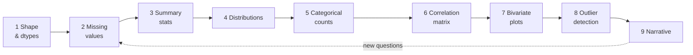
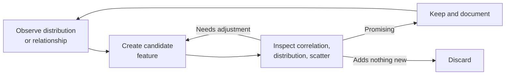
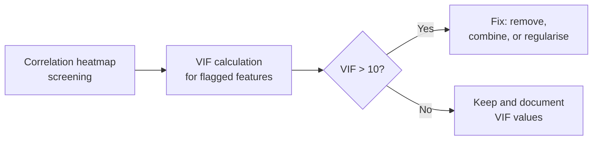

# M7 — Instructor Guide: Exploratory Data Analysis
> 90-minute lesson | Datasets: `titanic_clean.csv`, `housing_prices.csv` | All levels

---

## Learning Objectives

By end of session, students can:
1. Apply the structured EDA checklist (9 steps) to any new dataset
2. Distinguish Pearson from Spearman correlation and choose appropriately
3. Engineer new features during EDA — not as a separate step
4. Compute VIF to detect multicollinearity (developer track)
5. Write an EDA narrative — a prose data story, not a bullet dump

---

## Lesson Outline

| Time | Activity | Notes |
|------|----------|-------|
| 0:00–0:10 | M6 oral checkpoint debrief | Key patterns observed |
| 0:10–0:30 | **L7.4** — EDA checklist: 9-step protocol on `housing_prices.csv` | Live demo; students follow along |
| 0:30–0:45 | **L7.2** — Correlation: Pearson vs Spearman, heatmap, scatter | Show r=0 with nonlinear relationship |
| 0:45–1:00 | **L7.3** — Feature engineering during EDA (not after) | Create price_per_sqft, age_band, etc. |
| 1:00–1:10 | **L7.6** [AI-OFF] — VIF multicollinearity detection | Students compute and flag problem features |
| 1:10–1:25 | **L7.1** [AI-OFF] — EDA story: 200-word narrative (no code, no bullets) | Most challenging task in M7 |
| 1:25–1:30 | Preview M8 | |

---

## Key Concepts (with Lesson IDs)

### L7.4 — The 9-step EDA checklist `[Expert]`
#### Step 1 — Shape and dtypes: take a real inventory

Before running any analysis, spend two minutes on raw inventory. `df.shape` tells you the number of observations and columns. `df.dtypes` reveals what pandas inferred for each column — and that inference is frequently wrong in subtle ways. Zip codes stored as `int64` become meaningless averages; date strings typed as `object` break every time-series operation; boolean flags typed as `float64` because of one missing value silently propagate that float into downstream algebra.

The goal of this step is not just to list types but to *notice surprises*. A well-formed dataset almost never has perfectly matching dtypes on first read. Correcting them early prevents cascading bugs in every subsequent step. Write one sentence after this step: **"N dtype mismatches detected; columns X, Y, Z reassigned before proceeding."**

```python
import pandas as pd

df = pd.read_csv('housing_prices.csv')

# Shape: rows × columns
print('Shape:', df.shape)

# info() shows dtype + non-null count for every column simultaneously
df.info()

# Object-typed columns deserve extra scrutiny — they may be mistyped
# dates, hidden categories, or free-text fields that need parsing
object_cols = df.select_dtypes(include='object').columns.tolist()
print('\nObject-typed columns:', object_cols)

# Fix obvious dtype problems before any other analysis step
df['date']       = pd.to_datetime(df['date'])            # parse date string
df['waterfront'] = df['waterfront'].astype('category')   # encode as category
```

#### Step 2 — Missing values: measure, locate, and ask why

Missing data is not uniformly random. The *pattern* of missingness often carries its own information: renovation-related fields cluster together because some homes have never been renovated; fields requiring manual inspection are blank for records processed under time pressure; values vanish at a timestamp boundary because a data source changed its schema. Each of these is a different problem that requires a different fix.

The critical habit is to ask **why** a value is missing, not just **whether** it is. Blindly dropping missing rows can introduce systematic bias if missingness correlates with the outcome. A renovation year of NaN means *the house was never renovated* — it is not the same as a renovation year of 0, and it should not be imputed as one.

```python
import seaborn as sns
import matplotlib.pyplot as plt

# Column-level missing rate, sorted highest first
missing_rate = df.isna().mean().sort_values(ascending=False)
print('Missing value rates:')
print(missing_rate[missing_rate > 0].round(3))

# Per-row missingness: how many columns are absent per observation?
row_missing = df.isna().sum(axis=1)
print('\nRows with three or more missing columns:', (row_missing >= 3).sum())

# Visual missingness map: bright = missing, dark = present
plt.figure(figsize=(14, 5))
sns.heatmap(df.isna(), cbar=False, yticklabels=False, cmap='viridis')
plt.title('Missingness map — housing prices dataset')
plt.tight_layout()
```

Annotate your notebook after this step: *"yr_renovated is 80 % missing — this is structural; the home was simply not renovated. sqft_basement is 2 % missing — safe to impute with median."*

#### Step 3 — Descriptive statistics: mean, median, skew, and kurtosis

Summary statistics compress an entire distribution into a small set of numbers. They are most useful when they reveal *anomalies* rather than expected averages. A mean far above the median signals right skew or influential high outliers. A standard deviation larger than the mean on a non-negative variable implies extreme spread or multi-modal structure. Skewness above 1 or below −1 is almost always worth investigating before modelling begins.

Kurtosis measures tail heaviness relative to a normal distribution. High excess kurtosis means a larger-than-expected share of observations sit in the extremes. For practical EDA, the most actionable output from summary statistics is a list of *candidate columns for transformation* rather than the numbers themselves.

$$\text{skewness} = \frac{1}{n}\sum_{i=1}^{n}\left(\frac{x_i - \bar{x}}{\sigma}\right)^3 \qquad \text{excess kurtosis} = \frac{1}{n}\sum_{i=1}^{n}\left(\frac{x_i - \bar{x}}{\sigma}\right)^4 - 3$$

```python
numeric = df.select_dtypes(include='number')

# Aggregate key summary statistics in a single call
summary = numeric.agg(['mean', 'median', 'std', 'skew'])
summary.loc['kurt'] = numeric.kurt()   # excess kurtosis row

print('Numeric summary (transposed for readability):')
print(summary.T.round(3))

# Flag columns where |skew| > 1 — these are transformation candidates
high_skew = summary.T['skew'].abs()
print('\nHigh-skew columns (|skew| > 1):')
print(high_skew[high_skew > 1].sort_values(ascending=False))
```

Every high-skew column flagged here becomes a candidate for a log or square-root transform in the feature engineering step.

#### Step 4 — Distribution plots: histograms and density curves

Numbers alone hide shape. Anscombe's quartet famously demonstrates that four datasets with identical summary statistics can look completely different when plotted. Histograms make the full distributional shape visible and expose patterns that summary tables cannot reveal: long tails, heaping at round numbers, bimodal structure, and impossible values.

Common patterns to record:
- **Long right tail** — typical in prices, counts, and income; usually benefits from `log(x + 1)`.
- **Heaping** — suspicious clustering at round numbers (0, 5, 10, 100) suggests rounding artefacts or manual data entry.
- **Bimodal or multimodal shape** — the column may conflate two distinct subpopulations that deserve separate treatment.
- **Impossible values** — negative ages, prices of zero, room counts of 999.

```python
import matplotlib.pyplot as plt

numeric = df.select_dtypes(include='number')

# Draw all histograms in a single grid for a quick full overview
axes = numeric.hist(
    bins=40,
    figsize=(16, 10),
    edgecolor='white',
    color='steelblue'
)

# hist() puts column name in the title by default — move it to xlabel
for ax in axes.flatten():
    ax.set_xlabel(ax.get_title(), fontsize=9)
    ax.set_title('')

plt.suptitle('Univariate distributions — housing prices dataset', y=1.02)
plt.tight_layout()

# Zoom into a right-skewed column to clearly see the tail
plt.figure(figsize=(8, 4))
df['price'].hist(bins=60, edgecolor='white', color='steelblue')
plt.title('price distribution — note the long right tail')
plt.xlabel('price (USD)')
plt.tight_layout()
```

Write one sentence per histogram panel in a markdown cell below the grid. The act of writing forces active reading and turns passive scrolling into genuine observation.

#### Step 5 — Categorical value counts: labels, frequencies, and imbalances

Categorical columns conceal a surprising range of problems that numeric summaries never reveal. Value counts expose inconsistent spellings (*"downtown"* vs *"Downtown"*), rare categories that can undermine one-hot encoding by creating near-constant columns, and severe label imbalance where 95 % of rows share one value.

In classification settings, check whether label imbalance in the *target* requires stratified train/test splits, oversampling, or adjusted decision thresholds. In regression settings, check whether categorical predictors have enough observations per group to estimate group-level effects reliably. A category appearing in only three rows will produce an unstable and uninterpretable coefficient.

```python
cat_cols = df.select_dtypes(include=['object', 'category']).columns

for col in cat_cols:
    counts  = df[col].value_counts(dropna=False)
    top5    = counts.head(5)
    print(f'\n--- {col}  ({df[col].nunique()} unique, '
          f'{df[col].isna().sum()} missing) ---')
    print(top5.to_string())
    if len(counts) > 5:
        print(f'  … and {len(counts) - 5} more categories')
    # Flag when one category dominates the column
    top_pct = counts.iloc[0] / len(df)
    if top_pct > 0.90:
        print(f'  ⚠️  Dominant category ({top_pct:.0%} of rows) — very low signal')
```

Write an observation for any column where one category exceeds 90 % of rows, any column with spelling inconsistencies, and any column with fewer than 30 observations in the rarest category. These notes directly inform encoding choices in the modelling pipeline.

#### Step 6 — Correlation matrix: Pearson and Spearman heatmaps

A correlation matrix gives you a first map of pairwise numeric relationships. Computing both Pearson and Spearman simultaneously is best practice: where Pearson is low but Spearman is high, a monotonic but non-linear relationship is present; where both are high, the relationship is likely close to linear.

Read the matrix in two directions: *feature-to-target* correlations highlight modelling signals worth confirming with scatter plots; *feature-to-feature* correlations flag potential multicollinearity that the VIF step will quantify precisely. **Common mistake:** treating the matrix as a final verdict. A near-zero Pearson r does not rule out a strong non-linear pattern; a 0.70 r does not guarantee a simple relationship.

```python
import seaborn as sns
import matplotlib.pyplot as plt

numeric = df.select_dtypes(include='number')
corr_p  = numeric.corr(method='pearson')
corr_s  = numeric.corr(method='spearman')

fig, (ax1, ax2) = plt.subplots(1, 2, figsize=(20, 8))

for ax, corr, label in [(ax1, corr_p, 'Pearson'), (ax2, corr_s, 'Spearman')]:
    sns.heatmap(
        corr, ax=ax, annot=True, fmt='.2f',
        cmap='coolwarm', center=0,
        linewidths=0.4, linecolor='white', square=True
    )
    ax.set_title(f'{label} correlation matrix', fontsize=12)

plt.tight_layout()
```

Record the three strongest feature-to-target correlations and the top feature-to-feature pairs for VIF assessment: *"sqft_living has the strongest Pearson r with price (r ≈ 0.70). sqft_living and sqft_above show r ≈ 0.88 — VIF check warranted."*

#### Step 7 — Bivariate plots: scatter and grouped summaries

The correlation coefficient gives a number. A scatter plot gives *context*. After identifying high-correlation pairs in the heatmap, inspect each pair visually. The most important patterns to detect are: non-linearity (a curved relationship can show moderate Pearson r), heteroscedasticity (spread that fans out along the x-axis), and hidden subgroups (two distinct point clouds rather than one continuous trend).

Grouped box plots answer a complementary question: does the distribution of a continuous variable shift meaningfully across the levels of a categorical variable? They are ideal for questions like *"does waterfront status change the price distribution, or just the price mean?"* because they show medians, spread, quartile ranges, and individual outlier points simultaneously.

```python
import matplotlib.pyplot as plt
import seaborn as sns

# Scatter: three most-correlated numeric predictors vs target
fig, axes = plt.subplots(1, 3, figsize=(16, 5))
pairs = [('sqft_living', 'price'), ('grade', 'price'), ('bathrooms', 'price')]

for ax, (x_col, y_col) in zip(axes, pairs):
    ax.scatter(df[x_col], df[y_col], alpha=0.2, s=8, color='steelblue')
    ax.set_xlabel(x_col)
    ax.set_ylabel(y_col)
    ax.set_title(f'{y_col} vs {x_col}')

plt.tight_layout()

# Grouped box plot: does waterfront status shift the price distribution?
plt.figure(figsize=(7, 5))
sns.boxplot(data=df, x='waterfront', y='price', palette='Blues_d')
plt.title('Price distribution by waterfront status')
plt.tight_layout()
```

After examining scatter plots, record any heteroscedasticity observations: *"sqft_living vs price fans out at high values — log_price may linearise this relationship and reduce the fanning."*

#### Step 8 — Outlier detection: z-scores, IQR fences, and visual flags

Outliers are data points far from the typical pattern. They are not automatically wrong — a legitimately expensive mansion is a real data point that deserves to stay in the training set. But they always require *explanation* before you decide whether to keep, cap, or remove them. Silently deleting outliers is a dangerous habit because it can bias a model toward a restricted and unrepresentative range of inputs.

Two detection rules complement each other and together cover skewed and symmetric distributions:
- **Z-score rule** ($|z| > 3$): flags values more than three standard deviations from the mean. Best on roughly symmetric distributions; skewed distributions will over-flag legitimate extreme values.
- **IQR fence rule**: flags values below $Q_1 - 1.5 \cdot \text{IQR}$ or above $Q_3 + 1.5 \cdot \text{IQR}$. More robust to skew — this is exactly what a box plot whisker visualises.

$$z_i = \frac{x_i - \bar{x}}{\sigma} \qquad \text{IQR} = Q_3 - Q_1$$

```python
import numpy as np
import matplotlib.pyplot as plt

numeric = df.select_dtypes(include='number')

# --- Z-score method ---
z       = (numeric - numeric.mean()) / numeric.std()
z_flags = (z.abs() > 3)
print('Outliers by z-score (|z| > 3):')
print(z_flags.sum().sort_values(ascending=False).head(8))

# --- IQR fence method ---
Q1        = numeric.quantile(0.25)
Q3        = numeric.quantile(0.75)
IQR       = Q3 - Q1
iqr_flags = (numeric < Q1 - 1.5 * IQR) | (numeric > Q3 + 1.5 * IQR)
print('\nOutliers by IQR fence:')
print(iqr_flags.sum().sort_values(ascending=False).head(8))

# Box plots for the columns with the most IQR-flagged observations
top_cols = iqr_flags.sum().nlargest(4).index.tolist()
fig, axes = plt.subplots(1, 4, figsize=(16, 5))
for ax, col in zip(axes, top_cols):
    ax.boxplot(df[col].dropna(), patch_artist=True,
               boxprops=dict(facecolor='steelblue', alpha=0.5))
    ax.set_title(col, fontsize=9)
plt.suptitle('Box plots — highest-outlier columns')
plt.tight_layout()
```

Write a decision record for each flagged column: *"price: 37 outliers above the IQR fence — consistent with luxury properties; retained. bedrooms: 11 values at 33 — likely data entry errors; will cap at 10."*

#### Step 9 — Write the narrative: record every finding in prose

Every previous step generated isolated observations. Step 9 turns those fragments into a coherent, readable story. This is the hardest step in EDA and the most frequently skipped. It is also the step with the longest payoff: a written narrative prevents you from rediscovering the same patterns three weeks later when modelling begins.

A strong EDA narrative includes all of the following in prose:
- **Distribution summary** — describe the target's shape, typical value, and spread.
- **Data quality notes** — flag every anomaly found in steps 1–5 with a proposed handling strategy.
- **Relationship highlights** — identify the three to five strongest predictors and note any surprising results.
- **Open questions** — list ambiguities that need domain input or additional analysis.
- **Feature engineering candidates** — name specific transforms and interaction terms motivated by what you saw.

The narrative lives in a markdown cell at the end of your EDA notebook, not in a separate document. It is the handover from exploration to feature engineering and modelling. Future collaborators will evaluate your understanding of the dataset from this cell alone.

#### Common Mistakes, Practice Questions, and the spiral habit

The nine steps described above are not a strict waterfall. In practice, a surprise discovered at step 7 sends you back to step 2 to audit missingness in the same column. A bimodal distribution spotted at step 4 often motivates a new categorical feature that only makes sense after step 5. Think of EDA as a spiral: each complete pass deepens understanding and generates new questions that drive the next pass.



A thorough first pass through all nine steps on a new dataset typically takes 60–90 minutes. Speed is not the goal. The value of EDA is proportional to the quality of the questions you ask, and those questions take time to form.

**Common mistakes:** stopping after the summary table without plotting; treating missing values as a cleaning chore rather than a source of information; reading a heatmap without following up with actual bivariate plots; deleting outliers before deciding whether they are genuine rare cases; and skipping the final written narrative because the plots "already speak for themselves."

**Practice questions:** (1) Which of the nine steps would surface a variable stored with the wrong dtype, and what downstream bug would that prevent? (2) After step 4 you discover a heavy right tail in `price`; which later steps should that observation influence, and how? (3) If step 6 shows `sqft_living` and `sqft_above` are highly correlated, what action should you plan before modelling? (4) Why is the written narrative in step 9 not optional even if every chart has already been produced? (5) Describe one realistic way the EDA process would loop back from step 7 to step 2.

### L7.2 — Correlation: Pearson vs Spearman `[McKinney Ch5 p.175–180]`
#### The Pearson formula: what is actually being computed

Pearson correlation measures the strength and direction of a *linear* relationship between two continuous variables. The formula normalises each variable by subtracting its mean and dividing by its standard deviation — converting both to standardised units — then averages the product of those standardised values across all observations.

$$r_{XY} = \frac{\displaystyle\sum_{i=1}^{n}(x_i - \bar{x})(y_i - \bar{y})}{\sqrt{\displaystyle\sum_{i=1}^{n}(x_i - \bar{x})^2 \cdot \sum_{i=1}^{n}(y_i - \bar{y})^2}}$$

When $x$ is above its mean at the same time as $y$ is above its mean, their product is positive and contributes positively to $r$. When they move in opposite directions, the product is negative. The denominator scales the result to the $[-1,\, +1]$ range.

Understanding the formula matters in practice because it highlights Pearson's assumptions: both variables should be approximately continuous, the relationship should be approximately linear, and neither should be dominated by extreme outliers that can distort the mean and standard deviation used throughout.

#### Interpreting the Pearson coefficient

The Pearson coefficient $r$ gives a single number in the range $[-1, +1]$:
- $r = +1$: perfect positive linear relationship — every point falls exactly on an upward-sloping line.
- $r = -1$: perfect negative linear relationship — every point falls on a downward-sloping line.
- $r = 0$: **no linear relationship** — but read carefully, this does not mean no relationship at all.
- $r \approx 0.70$: a strong positive correlation commonly found in housing data (sqft_living vs price).
- $r \approx 0.30$: a weak-to-moderate correlation — useful signal but not the whole story.

In practice, the threshold for "strong" depends heavily on the domain. A Pearson r of 0.50 is considered very strong in social science but weak in physics. Always consider domain context before attaching a label to a coefficient.

#### r = 0 does not mean "no relationship"

This is the single most important conceptual warning in the lesson. A Pearson correlation of zero means *no linear relationship* — it says nothing about non-linear structure. A perfect U-shaped parabola has Pearson r = 0 even though every value of $y$ is completely determined by $x$.

Common real-world examples where $r \approx 0$ but strong structure is present:
- A threshold effect: the variable is nearly constant at low values, then shoots upward abruptly.
- A quadratic relationship: moderate $x$ → low $y$; extreme $x$ (in either direction) → high $y$.
- Opposite local trends that cancel globally: two subgroups with opposite relationships whose signals subtract out.

Always follow a low Pearson r with a scatter plot. You cannot conclude from the coefficient alone that nothing interesting is happening.

#### Spearman rank correlation: converting values to ranks

Spearman correlation applies the Pearson formula, but on *ranks* rather than original values. Every observation in each variable is replaced by its rank from lowest to highest before the correlation is computed.

Converting to ranks has two important consequences. First, it removes sensitivity to the exact distances between values — only the ordering matters. Second, it eliminates the outsized influence of a single extreme observation that could distort Pearson. An outlier at the 99th percentile simply becomes rank $n$; it does not pull the formula with its raw magnitude.

$$r_s = r_{\text{Pearson}}\bigl(\operatorname{rank}(X),\; \operatorname{rank}(Y)\bigr)$$

A Spearman coefficient close to $+1$ means that as $x$ increases, $y$ *consistently* increases — the ordering is preserved — but the relationship need not be linear. The values could follow a square-root, logarithmic, or any arbitrary monotonically increasing curve.

#### When to prefer Spearman over Pearson

Use Spearman when one or more of these conditions apply:
- The data is **heavily right-skewed** (prices, incomes, page views) and you have not yet applied a log transform.
- The relationship looks **curved but consistently increasing or decreasing** — Spearman detects this; Pearson may understate it.
- The variables are **ordinal** (e.g., a 1–5 rating scale) rather than truly continuous.
- A **few large outliers** are present that you do not want influencing the correlation before you have decided whether to remove them.

Use Pearson when both variables are roughly normally distributed and you specifically care about the *linear* component of their relationship — for example, when planning a linear regression and you want to gauge the strength of the linear signal before fitting.

#### A direct comparison on the same dataset

Computing both metrics on the same features and comparing them is one of the most informative single steps in EDA. Three patterns emerge from the comparison:
1. **Both high** → the relationship is probably linear and strong; Pearson and Spearman agree.
2. **Spearman high, Pearson moderate** → likely a monotonic but non-linear relationship; a log transform of one variable will often bring Pearson into agreement with Spearman.
3. **Both low** → either genuinely weak association, or a non-monotonic pattern (like a U-shape) that neither metric captures; a scatter plot is essential.

```python
import pandas as pd

numeric = df.select_dtypes(include='number')
target  = 'price'

# Compute both correlations with the target in one pass
pearson_r  = numeric.corrwith(df[target], method='pearson')
spearman_r = numeric.corrwith(df[target], method='spearman')

comparison = pd.DataFrame({
    'Pearson r':  pearson_r,
    'Spearman ρ': spearman_r,
}).drop(index=target).sort_values('Pearson r', ascending=False)

# Large gap → non-linear but monotonic; a log transform is worth trying
comparison['gap'] = (comparison['Spearman ρ'] - comparison['Pearson r']).abs()
print(comparison.round(3))
```

#### Building and reading a correlation heatmap

A heatmap visualises the entire pairwise correlation matrix at once, using colour intensity to encode sign and magnitude. Red cells indicate positive correlation; blue cells indicate negative correlation; near-white cells are near zero. With `annot=True`, exact values are printed in each cell — valuable in teaching contexts where students need to read specific numbers while still seeing the colour gradient.

The visual power of a heatmap lies in *clusters*. A block of dark red cells along the diagonal of a feature group reveals redundancy: those features are all telling the model roughly the same thing, which is a multicollinearity warning before you even run VIF.

```python
import seaborn as sns
import matplotlib.pyplot as plt

numeric       = df.select_dtypes(include='number')
corr_pearson  = numeric.corr(method='pearson')
corr_spearman = numeric.corr(method='spearman')

fig, axes = plt.subplots(1, 2, figsize=(20, 8))

for ax, corr, title in [
    (axes[0], corr_pearson,  'Pearson (linear)'),
    (axes[1], corr_spearman, 'Spearman (monotonic)')
]:
    sns.heatmap(
        corr, ax=ax, annot=True, fmt='.2f',
        cmap='coolwarm', center=0,
        linewidths=0.4, linecolor='white', square=True
    )
    ax.set_title(title, fontsize=12)

plt.tight_layout()
```

#### Confirming correlations with scatter plots

A scatter plot is the essential complement to the heatmap. After identifying high-correlation pairs, plot them to check for non-linearity, heteroscedasticity, and clusters that a single number cannot describe.

The classic classroom demonstration is to show a U-shaped scatter plot alongside its Pearson r ≈ 0. Students immediately grasp why a zero coefficient can coexist with a completely structured, predictable relationship.

```python
import numpy as np
import matplotlib.pyplot as plt

# Simulate r ≈ 0 with a clearly structured non-linear relationship
rng = np.random.default_rng(42)
x   = rng.uniform(-3, 3, 400)
y   = x ** 2 + rng.normal(0, 0.5, 400)   # perfect U-shape plus noise

r_pearson = np.corrcoef(x, y)[0, 1]

fig, (ax1, ax2) = plt.subplots(1, 2, figsize=(12, 5))

ax1.scatter(x, y, alpha=0.4, s=15, color='steelblue')
ax1.set_title(f'U-shape: Pearson r = {r_pearson:.3f}  ← r≈0 but fully structured')
ax1.set_xlabel('x')
ax1.set_ylabel('y = x² + noise')

# Real housing scatter for contrast
ax2.scatter(df['sqft_living'], df['price'], alpha=0.2, s=8, color='coral')
ax2.set_title('sqft_living vs price — linear-ish with fanning (heteroscedasticity)')
ax2.set_xlabel('sqft_living')
ax2.set_ylabel('price')

plt.tight_layout()
```

#### Common Mistakes

1. Treating $r = 0$ as evidence of no relationship — always follow up with a scatter plot.
2. Using Pearson on heavily skewed or ordinal data without checking whether Spearman would be more appropriate.
3. Reading the heatmap as a modelling shortcut — high feature-to-target correlation does not guarantee that a feature will be useful after controlling for other features.
4. Forgetting that correlation is symmetric — $r(X, Y) = r(Y, X)$ — and reading causation into a direction.
5. Interpreting a moderate $r$ (e.g., 0.40) as weak without considering the domain; context always matters.

#### Practice Questions

1. sqft_living has Pearson r ≈ 0.70 with price. What would a Spearman ρ significantly higher than 0.70 tell you about the shape of the relationship?
2. A feature has Pearson r ≈ 0.05 with price. Can you conclude it has no predictive value? What would you do next?
3. Two features show r = 0.92 with each other. What problem might this cause, and what would you do about it?

### L7.3 — Feature engineering during EDA `[Géron Ch2 p.65–72]`
#### Why feature engineering belongs inside EDA, not after it

Feature engineering is most commonly described as a preprocessing step that happens before modelling. This framing is misleading. The right moment to engineer features is *during* exploration, because EDA is precisely when you can see which columns are skewed, which pairs show non-linear relationships, and which domain combinations make conceptual sense. Waiting until after EDA means engineering features blind — without the visual and statistical context to motivate them.

The connection is direct: when you see a right-skewed histogram in step 4 of the checklist, you already know that column is a log-transform candidate. When step 7 shows that price grows with sqft_living but the slope changes sharply across waterfront status, you already have the intuition for a waterfront × sqft interaction term. EDA turns raw observations into *feature hypotheses* in real time.

The golden rule is simple: engineer features because they make **conceptual sense**, not because you want to inflate the feature count. Every new variable should answer, *what real-world idea does this represent that the raw columns do not?*

#### The create–inspect–revise loop

Feature engineering during EDA follows a cycle rather than a linear sequence. First, **create** a new feature based on a distributional observation, a relationship pattern, or domain intuition. Second, **inspect** it — check its distribution, correlation with the target, and relationship to the original inputs. Third, **revise** based on what you see — transform further, combine differently, or discard if the new feature adds no new information.

This loop runs many times within a single EDA session. A ratio feature may look promising until you notice it produces infinity for zero denominators. A log transform may not help if the variable is already roughly symmetric. The loop is not a sign that the first attempt was wrong; it is how thoughtful feature engineering actually works.



#### Logarithmic and power transforms: taming skewed distributions

A right-skewed column — one with a long tail of high values — is problematic for linear models because it violates approximate normality assumptions and gives extreme values disproportionate influence over the fit. The remedy is a variance-stabilising transformation.

**`log(x + 1)`** (written as `np.log1p` in Python, which handles $x = 0$ safely) is the standard choice for right-skewed non-negative values such as prices, incomes, and counts. **`sqrt(x)`** is a gentler alternative for mild skew. Both transformations compress high values toward the centre while expanding low values, making the distribution more symmetric.

$$x_{\text{log}} = \ln(x + 1) \qquad x_{\text{sqrt}} = \sqrt{x}$$

```python
import numpy as np
import matplotlib.pyplot as plt

fig, axes = plt.subplots(1, 3, figsize=(15, 4))

# Original — right-skewed
axes[0].hist(df['price'], bins=50, edgecolor='white', color='steelblue')
axes[0].set_title('price — original (skewed)')

# Log transform
axes[1].hist(np.log1p(df['price']), bins=50, edgecolor='white', color='coral')
axes[1].set_title('log(price + 1) — more symmetric')

# Square root
axes[2].hist(np.sqrt(df['price']), bins=50, edgecolor='white', color='seagreen')
axes[2].set_title('sqrt(price) — intermediate')

plt.tight_layout()

# Add transformed columns to the dataframe
df['log_price']       = np.log1p(df['price'])
df['log_sqft_living'] = np.log1p(df['sqft_living'])
```

After transforming, verify that the result is actually more symmetric. If `df['log_price'].skew()` is close to 0, the transform worked. If skew is still above 1, consider a Box-Cox transformation.

#### Binning continuous variables into meaningful bands

Binning converts a continuous variable into an ordered categorical variable. This is not always a simplification — sometimes a step function captures the underlying reality better than a continuous scale. House age is a good example: the *category* "built in the last decade" may carry different meaning than the raw continuous year.

Use `pd.cut` for bins of equal width and `pd.qcut` for bins of equal frequency (quantiles). Equal-frequency bins are usually better for skewed variables because they guarantee that each category has enough observations to produce reliable group-level estimates.

```python
import pandas as pd

# Equal-width bins based on domain knowledge
df['age_band'] = pd.cut(
    df['house_age'],
    bins=[0, 10, 20, 40, 80, 200],
    labels=['< 10 yrs', '10–20 yrs', '20–40 yrs', '40–80 yrs', '80+ yrs'],
    right=True
)

# Equal-frequency bins (quartiles)
df['sqft_quartile'] = pd.qcut(
    df['sqft_living'],
    q=4,
    labels=['Q1 small', 'Q2 medium', 'Q3 large', 'Q4 very large']
)

# Always inspect the bin counts to confirm they are balanced
print(df['age_band'].value_counts().sort_index())
print(df['sqft_quartile'].value_counts().sort_index())
```

After binning, plot a grouped box plot of the target by the new categorical variable. If all bins have similar medians, the binning added noise rather than signal.

#### Ratio features: capturing relational structure between columns

A ratio feature represents a meaningful relationship between two raw columns. The key word is *meaningful*: not every possible ratio is useful. A good ratio answers a domain question that neither raw column can answer alone.

Common ratio features in housing data:
- `price_per_sqft = price / sqft_living` — separates location premium from size premium.
- `bathrooms_per_bedroom = bathrooms / bedrooms` — captures layout quality independent of house size.
- `above_fraction = sqft_above / sqft_living` — measures how much of the home is above ground.

The most important engineering discipline here is handling division by zero safely. Any column that could legitimately be zero needs a guard: `df[denom].replace(0, np.nan)` converts zeros to missing rather than producing infinities.

```python
import numpy as np

# Replace zeros in denominators before dividing
df['price_per_sqft']       = df['price']     / df['sqft_living'].replace(0, np.nan)
df['bathrooms_per_bedroom'] = df['bathrooms'] / df['bedrooms'].replace(0, np.nan)
df['above_fraction']        = df['sqft_above'] / df['sqft_living'].replace(0, np.nan)

# Check the distribution of each new ratio
print(df[['price_per_sqft', 'bathrooms_per_bedroom', 'above_fraction']].describe().round(2))
```

#### Interaction features: encoding joint effects

An interaction feature is the product (or another combination) of two existing features. It is useful when the effect of one predictor depends on the level of another — which is often true in housing data, where waterfront properties have a fundamentally different price-to-size relationship than inland properties.

Interaction features are worth creating when a scatter plot shows that the relationship between a feature and the target looks clearly different across subgroups. The interaction term gives a linear model a way to represent that subgroup-specific slope without requiring a fully separate model per group.

```python
# Numeric × numeric interaction
df['bed_bath_product'] = df['bedrooms'] * df['bathrooms']

# Binary × numeric interaction: only non-zero for waterfront properties
df['waterfront_sqft'] = df['waterfront'].astype(int) * df['sqft_living']

# Check whether the interaction adds new correlation with price
interaction_cols = ['bed_bath_product', 'waterfront_sqft']
base_cols        = ['bedrooms', 'bathrooms', 'waterfront', 'sqft_living']

target_corrs = (
    df[interaction_cols + base_cols + ['price']]
    .corr()['price']
    .drop('price')
    .sort_values(ascending=False)
)
print('Feature-to-target correlations:\n', target_corrs.round(3))
```

If an interaction feature shows higher correlation with the target than either constituent feature, it is worth retaining and inspecting with a scatter plot.

#### Domain knowledge as the guiding compass

The most powerful feature engineering ideas do not come from statistical methods — they come from asking *what do people who know this domain think matters?* In housing data, that means consulting what real estate professionals consider important: proximity to amenities, renovation recency, neighbourhood quality, and lot-to-house size ratios.

Without domain knowledge, automated feature generation can produce dozens of features with high in-sample correlation to the target that have no causal meaning and will degrade out-of-sample performance through overfitting. With domain knowledge, you can create a small number of features that are both statistically useful and conceptually defensible to stakeholders.

Practical approach: before creating any new feature, write one sentence explaining what it represents in the real world. If you cannot write that sentence, the feature may not be worth adding.

#### Evaluating engineered features with correlation and plots

After creating candidate features, evaluate them before committing to the modelling dataset. The key checks are:
1. **Correlation with the target** — is the new feature more correlated with the target than its parent columns?
2. **Redundancy** — does the new feature add information not already captured by existing columns?
3. **Distribution shape** — is the new feature well-behaved (not extremely skewed, not nearly constant)?
4. **Scatter plot** — does the relationship between the new feature and the target look cleaner and more linear than the original?

```python
import seaborn as sns
import matplotlib.pyplot as plt

candidate_features = [
    'log_price', 'log_sqft_living', 'price_per_sqft',
    'bathrooms_per_bedroom', 'above_fraction',
    'bed_bath_product', 'waterfront_sqft'
]

# Correlation of all numeric candidates with the target
feat_corr = (
    df[candidate_features + ['price']]
    .select_dtypes(include='number')
    .corr()['price']
    .drop('price')
    .sort_values(ascending=False)
)
print('Feature-to-target correlations:\n', feat_corr.round(3))

# Check for redundancy among the engineered features themselves
eng_corr = df[candidate_features].select_dtypes(include='number').corr()
plt.figure(figsize=(8, 6))
sns.heatmap(eng_corr, annot=True, fmt='.2f', cmap='coolwarm', center=0)
plt.title('Correlation among engineered features')
plt.tight_layout()
```

#### Common Mistakes in feature engineering during EDA

Feature engineering has its own failure modes worth knowing before you start:
1. **Engineering without inspecting** — adding columns without checking distributions, correlations, or scatter plots fills the dataset with noise.
2. **Data leakage** — using information about the target to construct a feature. Creating `price_per_sqft` and then using it to predict price is circular and produces deceptively optimistic in-sample metrics.
3. **Too many features** — creating ten transformations of the same column increases noise and requires careful regularisation to manage.
4. **Forgetting to document** — creating a feature without writing down *why* it was created. Three weeks later, the rationale is gone.
5. **Transforming without re-checking** — applying `log1p` without confirming that the result is actually more symmetric. Some distributions respond poorly to a simple transform.

#### Practice Questions

1. sqft_living has high right skew. Apply `log1p` and recompute skewness. By how much did it change?
2. Create a `rooms_per_floor` feature and check whether it has higher Pearson correlation with price than either `bedrooms` or `floors` individually.
3. Plot the distribution of `price_per_sqft`. Is it well-behaved, or does it need its own transformation? Justify your answer.
4. Identify a pair of engineered features that are themselves highly correlated with each other. Would you keep both, or drop one? Explain your reasoning.

### L7.6 — VIF multicollinearity `[Expert]` ⚠️ [AI-OFF]
#### What multicollinearity means intuitively

**Multicollinearity** describes a situation in which two or more predictor variables in a regression model are strongly correlated with each other — not with the target, but *with each other*. The name comes from the idea that some predictors lie nearly on a common linear surface, making them difficult to disentangle.

A concrete housing data example: `sqft_living`, `sqft_above`, and `bedrooms` all measure, from slightly different angles, how large a house is. When a house is large, all three tend to be large simultaneously. When it is small, all three are small. The information they carry about the target is heavily overlapping. Giving a regression model all three is like asking three people who always agree with each other to vote on a question — the outcome is dominated by one voice no matter how many votes are cast.

The problem is not that the predictors are uninformative in isolation. Each one might have a genuinely strong relationship with price on its own. The problem is that the model cannot determine which predictor *caused* a given change in price when they all move together.

#### Why multicollinearity destabilises regression coefficients

In ordinary least squares linear regression, each coefficient represents the expected change in the target for a one-unit increase in that predictor *while all other predictors are held constant*. This thought experiment — holding others constant — is the foundation of coefficient interpretation.

Multicollinearity makes that thought experiment incoherent. If `sqft_living` and `sqft_above` always move together, there is no sample evidence for what happens to price when `sqft_living` increases while `sqft_above` stays constant — that combination of values may barely exist in the data. The model responds by producing:
- **unstable coefficients** — small changes in the training sample cause large swings in coefficient values,
- **inflated standard errors** — the model is genuinely uncertain about individual contributions, and that uncertainty is correctly reflected in wide confidence intervals,
- **counterintuitive signs** — a coefficient may be negative even though the feature clearly has a positive marginal relationship with the target.

The model may still produce reasonably accurate *predictions* because the collinear features together still explain most of the variance. But individual coefficients cannot be interpreted as causal or even directional estimates.

#### Visual detection: the correlation heatmap as the first screen

The quickest first diagnostic for multicollinearity is a Pearson correlation heatmap of the predictor features. A cell showing $|r| > 0.80$ between two predictors is a clear warning. A cluster of four or five features all showing high mutual correlations is a more severe warning.

The heatmap has a critical limitation: it only detects *pairwise* collinearity. A predictor that is only weakly correlated with any single other predictor can still be nearly perfectly predictable from a *linear combination* of several others. The VIF formula detects this more general form of collinearity that pairwise inspection misses.



A practical rule: whenever a cell in the predictor heatmap shows $|r| > 0.80$, add both features to the VIF calculation regardless of whether their individual distributions look reasonable.

#### The VIF formula: a precise measurement of redundancy

The **Variance Inflation Factor** for predictor $j$ is defined as:

$$\text{VIF}_j = \frac{1}{1 - R_j^2}$$

where $R_j^2$ is the coefficient of determination obtained by regressing feature $j$ on all other features in the model. VIF measures how well the other predictors can predict feature $j$ *as if it were a target itself*.

If $R_j^2 = 0$, then predictor $j$ is completely orthogonal to all others — it carries unique information — and $\text{VIF}_j = 1$. If $R_j^2 = 0.90$, then 90 % of the variance in predictor $j$ is explained by the other features, meaning it adds very little unique information, and $\text{VIF}_j = 10$.

The formula makes the intuition precise: **VIF measures how much the variance of the estimated coefficient $\hat{\beta}_j$ is inflated compared to what it would be if all predictors were uncorrelated.** A VIF of 10 means the variance of that coefficient is 10 times larger than it would otherwise be — and the standard error is $\sqrt{10} \approx 3.16$ times larger.

#### Interpreting VIF values: rules of thumb

Three threshold ranges are widely used in practice:

| VIF range | Interpretation |
|-----------|----------------|
| $1.0$ to $4.9$ | Acceptable — some correlation but coefficient estimates are reasonably stable |
| $5.0$ to $9.9$ | Moderate — investigate and consider action |
| $\geq 10$ | Severe — the coefficient is likely uninterpretable as a standalone estimate |

These are rules of thumb, not sharp laws. In a dataset with 20,000 rows, a VIF of 12 may be tolerable because the coefficient is still estimated with reasonable precision due to large sample size. In a dataset with 200 rows, a VIF of 7 may already be causing meaningful instability.

VIF should be recalculated after removing or combining any features, because the VIF values of the remaining features change when the composition of the predictor set changes.

#### A worked example: VIF on housing predictors

Using the housing prices dataset with the full set of size-related features reveals why VIF is necessary beyond a correlation heatmap. `sqft_living` and `sqft_above` show $r = 0.88$ on the heatmap — an obvious pair. But `sqft_living` may also show VIF above 15 because it is predictable not just from `sqft_above` alone but from the *combination* of `sqft_above`, `bedrooms`, and `bathrooms` together. The heatmap cannot detect this multi-way redundancy.

A typical VIF table for housing predictors might look like:

| Feature | VIF |
|---------|-----|
| sqft_living | 17.4 |
| sqft_above | 12.8 |
| sqft_basement | 6.1 |
| bathrooms | 5.9 |
| bedrooms | 4.3 |
| floors | 2.1 |
| sqft_lot | 1.3 |

The interpretation is clear: `sqft_living` and `sqft_above` carry heavily overlapping information. Their coefficients in a linear model cannot be trusted individually. `sqft_lot` and `floors` are essentially orthogonal to the other features and are safe to interpret directly.

```python
from statsmodels.stats.outliers_influence import variance_inflation_factor
import pandas as pd

feature_cols = [
    'sqft_living', 'sqft_lot', 'bedrooms', 'bathrooms',
    'floors', 'sqft_above', 'sqft_basement'
]
X = df[feature_cols].dropna()

vif_df = pd.DataFrame({
    'feature': X.columns,
    'VIF':     [variance_inflation_factor(X.values, i) for i in range(X.shape[1])]
}).sort_values('VIF', ascending=False)

print(vif_df.round(2))
```

Treat VIF as a **diagnostic**, not as an automatic delete command. The decision of what to do with a high VIF value depends on your modelling goal.

#### Three standard fixes for high VIF

When VIF reveals severe multicollinearity, three responses are available, each with different trade-offs.

**1. Remove one feature from a redundant pair.** The simplest fix. If `sqft_living` already captures most of the information in `sqft_above`, keeping only `sqft_living` removes the redundancy. The coefficient for the remaining feature becomes more stable. The trade-off: you may lose a small amount of predictive power unique to the removed feature.

**2. Combine features into a single derived variable.** Instead of keeping `sqft_above` and `sqft_basement` separately, create `above_fraction = sqft_above / sqft_living`. This single feature captures the proportion of above-ground space, which is a meaningful concept on its own. PCA is a data-driven approach to the same idea: it combines multiple collinear features into orthogonal principal components.

**3. Apply regularisation.** Ridge regression adds a penalty term $\lambda \sum_j \beta_j^2$ that shrinks all coefficients toward zero. Because Ridge does not zero out coefficients completely, it keeps all features while reducing the instability caused by multicollinearity. Lasso adds $\lambda \sum_j |\beta_j|$, which can set some coefficients to exactly zero and effectively performs automatic feature selection.

The best fix depends on whether you need **interpretable individual coefficients** (prefer removal or combining) or primarily **good predictions** (regularisation may be sufficient).

**When multicollinearity does not matter.** Multicollinearity is only a problem when individual coefficient interpretation is the goal. If your objective is accurate *prediction* rather than understanding individual feature contributions, multicollinearity in the predictors may not degrade model performance at all.

Three situations where high VIF can be safely tolerated:
1. **Prediction-only models** — you care about $\hat{y}$, not about which specific feature drove it.
2. **Interaction terms** — a feature and its square are almost always correlated; centring the variable (subtracting the mean) reduces this specific form of collinearity.
3. **Polynomial features** — collinearity between $x$ and $x^2$ is expected and typically does not cause the same instability as collinearity between two distinct conceptual predictors.

#### Common Mistakes

1. Treating a high VIF as an automatic instruction to delete a feature without considering the modelling goal.
2. Assuming a low pairwise correlation guarantees low multicollinearity; VIF detects multi-feature redundancy that heatmaps miss.
3. Forgetting to recompute VIF after dropping a feature; the remaining VIF values change when the design matrix changes.
4. Interpreting coefficients causally when severe collinearity makes them unstable and sign-sensitive.

#### Practice Questions

1. If $R_j^2 = 0.95$ for a predictor, what is its VIF? What does this mean in practical terms for the standard error of its coefficient?
2. The correlation between `bedrooms` and `bathrooms` is $r = 0.52$. Without computing VIF, can you conclude that multicollinearity is not a problem? Explain why or why not.
3. A model predicts house prices accurately on a held-out test set even though two predictors have VIF = 15. Does this mean multicollinearity is absent, or merely not problematic for this use case? Explain the distinction.
4. If you remove `sqft_above` from a model because its VIF is 12, should you recompute VIF for the remaining features? Why?

### L7.1 — EDA narrative `[Géron Ch2 p.50–55]` ⚠️ [AI-OFF]
#### EDA is a mindset, not a procedure

The most important thing to understand about Exploratory Data Analysis is that it cannot be reduced to a sequence of commands. Tools and checklists are scaffolding — they ensure you do not skip a step. But the substance of EDA is the *thinking* that happens between steps, not the steps themselves. A student who executes every line of a nine-step checklist without pausing to ask a question has not done EDA. A student who asks three insightful questions using only `df.describe()` and a single scatter plot has.

The word *exploratory* is precise. Exploration means moving into territory you do not already understand, forming tentative hypotheses, and revising them as new evidence arrives. It is the opposite of confirming what you expect to find. The best exploratory analysts approach every new dataset with genuine curiosity — they assume they do not yet know what is interesting, and they resist the urge to reach for a model before they have read the data carefully.

#### The question-driven rhythm of exploration

EDA has a rhythm that is more like detective work than report-writing. A good detective does not write their conclusions before examining the evidence; they form a question, look for evidence that bears on it, find something unexpected, and form a new question. Data exploration follows the same cycle: every plot and every statistic should answer one question and raise another.

Useful questions to keep in mind as you work through a new dataset:
- *What did I expect to see here, and what is actually here?*
- *What would make this variable behave the way I am observing?*
- *Which of these observations, if wrong, would change my modelling strategy?*
- *What does this pattern mean in the real world — not just as a statistical fact?*

These questions cannot be automated. No library generates them for you. They come from genuinely engaging with the problem domain and remaining willing to be surprised by the data.

#### The three-part cycle: observation, interpretation, and action

Each step in a well-run EDA notebook follows a three-part structure: you observe something in the output, you interpret what it means in context, and you decide what action it motivates. This cycle repeats for every chart, every summary table, and every correlation coefficient.

The observation is easy — it is just reading the output. The interpretation is harder — it requires connecting the statistical fact to domain knowledge. The action is most valuable — it is the bridge from exploration to modelling. An observation without an interpretation is just a number. An interpretation without an action is just an opinion. Together, the three form a learning unit that moves the analysis forward.

Good notebook practice makes this explicit: a code cell produces the output, and the markdown cell immediately after it records the observation, the interpretation, and the next action — even if the next action is only *"investigate this further before deciding."*

#### Writing prose observations alongside code

The single most valuable habit in notebook-based EDA is writing short, complete sentences alongside code. Not bullet points. Not code comments. Actual sentences with a subject and a predicate that make a claim about what you found.

Compare two styles. The first writes: `# missing values`. The second writes: *"The yr_renovated column is 80 % missing. Because only renovated homes have a non-missing renovation year, this missingness is structural rather than random. The column should be converted to a binary flag indicating whether any renovation has occurred."*

The second version is slower to write and enormously more valuable to read. It will guide an engineer who inherits the notebook six months later. More importantly, writing the sentence forces you to form a clear thought rather than leaving a half-formed impression that fades within hours.

**The difference between looking and seeing.** A trained analyst and a novice can look at the same histogram and draw different conclusions. The novice sees a bar chart. The trained analyst sees a right-skewed distribution that suggests a log transform, identifies a suspicious heap of values at round numbers that may indicate rounding artefacts, and notices that the x-axis extends far past the bulk of observations — suggesting either a genuine long tail or a data entry error at the extreme.

The difference is not expertise in the sense of advanced mathematics. It is practice in asking the right questions of each visual. The trained analyst brings a prior: *what could cause a histogram to look like this?* The novice brings no such prior. The way to build this prior is to annotate every chart you produce with an explanation of what you see and why it might be happening — even when the explanation is tentative. Repetition over many datasets builds the intuition.

#### Why EDA must come before modelling

A common temptation, especially under time pressure, is to load the data and begin fitting models immediately. This is a reliable way to waste time. Models trained on raw, uninspected data routinely fail in predictable ways: they give impossible-to-interpret coefficients because of multicollinearity, they produce bad predictions because a key feature was log-skewed and the model learned a non-linear relationship by brute force, or they appear to perform well in validation but fail in production because a data leakage pathway was never noticed.

EDA prevents all of these failures, not by magic, but by ensuring that you understand the data before you make decisions about how to model it. The investment is rarely more than an hour or two on a modestly sized dataset. The cost of skipping it is often days of debugging a modelling pipeline that was built on faulty assumptions.

#### Géron's workflow: attributes, correlations, and combinations

Aurélien Géron's *Hands-On Machine Learning* describes an exploratory workflow in three phases that is worth internalising as a default starting sequence. First, **visualise each attribute individually** — understand the marginal distribution of every feature before any interaction is considered. Second, **check correlations** among numerically important variables and between each feature and the target. Third, **visualise promising combinations** — the attribute pairs and groupings that step two identified as structurally interesting.

This sequence is grounded in statistical principle. Individual distributions reveal the grammar of each feature. Correlations identify the candidate syntax — the relationships worth examining more carefully. Combinations reveal the semantics — the real structure that drives the target. Skipping the first phase to jump directly to combinations is like trying to read a sentence without knowing the meaning of individual words.

#### Exploratory versus confirmatory analysis

These two modes of analysis are often confused, but they serve fundamentally different purposes. **Exploratory analysis** is hypothesis-generating. You are scanning for patterns worth investigating, forming candidate explanations, and building intuition. It is appropriate to look at many things and tentatively notice patterns without requiring formal statistical evidence.

**Confirmatory analysis** is hypothesis-testing. You have a specific claim and you are looking for evidence strong enough to evaluate it according to a pre-specified criterion, such as a significance level or a confidence interval. It is inappropriate to use the same data for both phases without methodological adjustment — patterns discovered in exploration must be validated on held-out data before they can be treated as established findings.

The practical consequence for EDA is that the patterns you identify during exploration are *candidate* insights, not established facts. They motivate further analysis, feature engineering choices, and modelling strategies. But they are not validated findings until they survive out-of-sample evaluation.

#### What to document and why documentation matters

By the end of an EDA session, your notebook should contain a written record that answers five questions: *What is in the dataset? What quality problems did I find? What are the most important relationships? What am I still unsure about? What would I engineer or transform before modelling?*

This record is not administrative overhead. It is the primary output of the EDA phase. Every subsequent decision in the modelling pipeline — feature selection, imputation strategy, encoding choice, scaling method — should be traceable to a specific observation made and documented during EDA. When a model behaves unexpectedly in production, this written record is the first place to look.

Students who treat the narrative as optional — who think the real work is the code and the plots — are misunderstanding what data science actually requires. The code produces evidence. The narrative is the argument.

#### Common Mistakes

A frequent beginner mistake is turning EDA into output collection rather than reasoning. The notebook fills with histograms and correlation matrices, but no sentence explains what was surprising, why it mattered, or what should happen next. This creates the illusion of thoroughness without the substance of understanding.

Another mistake is writing conclusions too strongly during exploration. EDA should generate candidate explanations, not courtroom verdicts. Phrases such as *"this proves"* or *"this variable definitely causes"* are almost always too strong at the exploratory stage. Better language is *"this suggests"*, *"this pattern is consistent with"*, or *"this should be tested more formally later."*

#### Practice Questions

The following questions are designed to build exploratory intuition. Apply them to any new dataset:

1. What would you expect the distribution of the target variable to look like, given what you know about the domain? Does the actual distribution match your expectation? If not, what might explain the difference?
2. If you had to remove all but five features before modelling, which five would you keep, and on what basis? How does the EDA evidence support that choice?
3. Name one pattern you observed during EDA that genuinely surprised you. What did it imply for your modelling strategy?
4. What is one open question that the EDA raised but did not resolve? What additional data or domain knowledge would you need to resolve it?
5. Write a 200-word narrative for the housing prices dataset. It must include a distribution summary of the target, two data quality issues, two relationship findings, and one feature engineering candidate. Use complete sentences only — no bullet points, no code, no headers.

### L7.7 — Bivariate / multivariate visual EDA `[McKinney Ch9 p.310–335]`
#### The purpose of visual EDA beyond confirmation

Visual EDA is often described as a way to "confirm" what summary statistics already show. This undersells it. The real purpose of visual EDA is to reveal patterns, subgroups, and structures that numbers alone systematically hide. A correlation coefficient says nothing about the shape of a relationship. A mean says nothing about bimodality. A standard deviation says nothing about whether variance is evenly distributed across the range of $x$ or concentrated at one end.

The visual and numeric traditions of EDA are complementary, not redundant. Numbers compress distributions into scalars; plots preserve the shape. Good EDA practice uses both, treating numbers as hypotheses to investigate and plots as evidence that confirms, complicates, or overturns those hypotheses. A plot that produces no questions was probably not read carefully enough.

#### Scatter plots: the primary tool for two continuous variables

A scatter plot places every observation as a point in a two-dimensional space defined by two continuous variables. When both variables are numeric and continuous, the scatter plot should almost always be the first visual choice. No other single chart type reveals as much about the nature of a bivariate relationship.

The scatter plot answers questions that no correlation coefficient can: Does the relationship follow a straight line or a curve? Does the spread around the trend stay constant, or does it fan out? Are there two or more distinct clouds of points, suggesting a hidden categorical structure? Are there isolated points far from the main mass that deserve individual inspection?

A well-chosen transparency value (`alpha` between 0.1 and 0.3) is essential for large datasets where overplotting would otherwise hide the true density of the relationship.

#### Five things to look for in every scatter plot

When reading a scatter plot, train your attention on five distinct features, each of which drives a different analytical response:
1. **Direction** — does the cloud slope upward (positive association), downward (negative association), or show no clear slope?
2. **Linearity** — does the relationship follow approximately a straight line, or does it curve? A curved relationship calls for a non-linear model or a feature transform.
3. **Spread** — does the vertical spread around the trend stay constant (homoscedasticity), or does it widen as $x$ increases (heteroscedasticity)? A fanning shape suggests that a log transform of $y$ may stabilise variance.
4. **Clusters** — are there two or more distinct groups of points that appear separated? This is often the signature of an important omitted categorical variable.
5. **Outliers** — are there isolated points far from the main body? Each is a candidate for investigation: data entry error, legitimate extreme value, or special subpopulation.

Writing down which of these five features you see in each plot is the practice that builds lasting visual EDA skill.

#### Pair plots: the panoramic bivariate view

`seaborn.pairplot` places every pairwise scatter plot in a grid, with univariate distributions on the diagonal. It is the most efficient single call for getting a broad visual overview of all pairwise relationships among a set of numeric features.

Pair plots are most useful when the feature set is small enough to remain readable — roughly 4 to 12 features. Beyond that, the grid becomes too dense to read individual panels. Best practice is to pass `pairplot` a carefully selected subset of the most promising features identified by the correlation matrix, not the entire dataset.

Colouring points by a categorical variable with `hue=` dramatically increases the information density. Subgroup clusters that are invisible in the uncoloured version often become immediately obvious when colour encodes grade, waterfront status, or neighbourhood category.

```python
import seaborn as sns
import matplotlib.pyplot as plt

# Select a compact, high-signal subset — pair plots degrade with > 10 features
focus_cols = ['price', 'sqft_living', 'grade', 'bathrooms', 'waterfront']

# Basic pair plot with histograms on the diagonal
g = sns.pairplot(
    df[focus_cols].dropna(),
    diag_kind='hist',
    plot_kws={'alpha': 0.2, 's': 10}
)
g.fig.suptitle('Pair plot — selected housing features', y=1.02)
plt.show()

# With colour encoding by a categorical variable
g2 = sns.pairplot(
    df[focus_cols].dropna(),
    hue='waterfront',          # encode waterfront status by colour
    diag_kind='kde',
    plot_kws={'alpha': 0.3, 's': 12}
)
g2.fig.suptitle('Pair plot coloured by waterfront status', y=1.02)
plt.show()
```

After producing a pair plot, write one sentence per panel that shows anything surprising, and one overall sentence about what the grid suggests for modelling.

#### Box plots: distribution comparisons across categories

A box plot summarises the distribution of a continuous variable using five statistics: the minimum fence value, Q1, the median, Q3, and the maximum fence value. Points beyond the fences are plotted individually as potential outliers.

The grouped box plot is the standard tool for asking: *does the distribution of a numeric variable differ meaningfully across the levels of a categorical variable?* It answers questions that a simple group mean cannot: are the spreads also different? Are outliers concentrated in one group? Is the distribution skewed within one category but not another?

```python
import seaborn as sns
import matplotlib.pyplot as plt

fig, axes = plt.subplots(1, 2, figsize=(14, 5))

# Price distribution by waterfront status
sns.boxplot(data=df, x='waterfront', y='price', palette='Blues_d', ax=axes[0])
axes[0].set_title('Price by waterfront status')

# Price distribution by grade — preserve natural ordering
grade_order = sorted(df['grade'].dropna().unique())
sns.boxplot(data=df, x='grade', y='price', order=grade_order,
            palette='viridis', ax=axes[1])
axes[1].set_title('Price by grade')
axes[1].tick_params(axis='x', rotation=45)

plt.tight_layout()
```

A common observation from this type of plot: median prices increase monotonically with grade, but the spread (IQR) increases dramatically at the top grades — revealing that premium homes have high price variance even within the same grade tier.

#### Violin plots and strip plots as richer alternatives

A box plot compresses the distribution into five numbers plus outlier markers. A **violin plot** adds a kernel density estimate mirrored on both sides, showing the full distributional shape. This makes it possible to see bimodality within a group, which a box plot would miss entirely.

A **strip plot** (also called a jitter plot) shows every individual observation as a point, jittered horizontally to reduce overplotting. It is most useful for small-to-medium datasets (fewer than roughly 2,000 rows per group) where individual data points carry meaning and aggregate summaries can be misleading.

```python
import seaborn as sns
import matplotlib.pyplot as plt

fig, axes = plt.subplots(1, 2, figsize=(14, 5))

# Violin plot: full distributional shape per group
sns.violinplot(data=df, x='waterfront', y='price',
               palette='Blues', inner='quartile', ax=axes[0])
axes[0].set_title('Price by waterfront — violin (full shape)')

# Strip plot: individual observations, sampled for readability
sns.stripplot(
    data=df.sample(500, random_state=42),
    x='waterfront', y='price',
    palette='Blues', alpha=0.5, jitter=True, ax=axes[1]
)
axes[1].set_title('Price by waterfront — strip plot (n = 500 sample)')

plt.tight_layout()
```

#### Heatmaps as summary matrices

A heatmap is appropriate whenever data naturally forms a matrix: a correlation matrix of numeric features, a pivot table of average prices by two categorical variables, or a cross-tabulation of counts. The colour scale encodes cell values, making broad patterns immediately visible across the entire matrix.

For correlation heatmaps, the `coolwarm` palette with `center=0` is conventional: deep blue indicates strong negative correlation, deep red indicates strong positive correlation, and near-white indicates near-zero correlation. Two design choices improve readability in teaching contexts: `annot=True` prints exact values in each cell, and `square=True` ensures cells are square rather than rectangular.

```python
import seaborn as sns
import matplotlib.pyplot as plt

focus_cols = ['price', 'sqft_living', 'bedrooms', 'bathrooms', 'grade', 'sqft_lot']
corr       = df[focus_cols].corr(method='pearson')

plt.figure(figsize=(8, 6))
sns.heatmap(
    corr, annot=True, fmt='.2f',
    cmap='coolwarm', center=0,
    linewidths=0.4, linecolor='white', square=True
)
plt.title('Pearson correlation — selected housing features')
plt.tight_layout()
```

#### Adding a third dimension with colour and size

Scatter plots and pair plots can encode a third (and sometimes fourth) variable using point colour and point size. This is one of the most efficient ways to detect subgroup-driven patterns without producing many separate plots.

Colour is best for categorical variables (waterfront yes/no, grade tier, neighbourhood cluster). Size is better for a continuous variable when you want to show magnitude. Both should be used sparingly — adding too many encodings to a single plot makes it unreadable.

```python
import matplotlib.pyplot as plt
import matplotlib.cm as cm
import numpy as np

fig, axes = plt.subplots(1, 2, figsize=(14, 5))

# Colour encodes a third categorical variable
waterfront_colour = df['waterfront'].map({0: 'steelblue', 1: 'coral'})
axes[0].scatter(df['sqft_living'], df['price'],
                c=waterfront_colour, alpha=0.25, s=10)
axes[0].set_xlabel('sqft_living')
axes[0].set_ylabel('price')
axes[0].set_title('sqft_living vs price — colour = waterfront')

# Colour encodes a continuous third variable (grade)
grade_norm = (df['grade'] - df['grade'].min()) / (df['grade'].max() - df['grade'].min())
axes[1].scatter(df['sqft_living'], df['price'],
                c=grade_norm, cmap='viridis', alpha=0.25, s=10)
axes[1].set_xlabel('sqft_living')
axes[1].set_ylabel('price')
axes[1].set_title('sqft_living vs price — colour = grade')

plt.tight_layout()
```

**Combining visual and numeric EDA: a decision guide.** The plot choice depends on the variable types involved. The following reference summarises when to reach for each chart type:

| Scenario | Recommended plot |
|----------|-----------------|
| Two continuous variables | Scatter plot |
| Many numeric variables, broad overview | Pair plot |
| One categorical + one continuous | Grouped box plot or violin plot |
| Matrix of pairwise summaries | Heatmap |
| Small dataset — show every observation | Strip plot |
| Detect subgroups in continuous data | Scatter with colour encoding |

A mature visual EDA workflow moves fluidly between these chart families rather than defaulting to a single type. Start with the pair plot for orientation, follow specific cells with scatter plots, use box plots to compare distributions across categories, and use heatmaps to confirm broad correlation structure.

#### Common Mistakes

1. Choosing a pair plot for dozens of columns and producing an unreadable wall of tiny panels.
2. Reading a single scatter plot too quickly and missing heteroscedasticity, clustering, or outliers.
3. Using colour for too many categories at once, which makes subgroup structure harder rather than easier to read.
4. Treating a heatmap as sufficient evidence without checking the actual plots behind the summary cells.

#### Practice Questions

1. Draw a scatter plot of `sqft_living` vs `price`. Identify all five features (direction, linearity, spread, clusters, outliers) and write one sentence about each.
2. Produce a pair plot with `hue='waterfront'`. Write two observations about how waterfront status changes the apparent relationships in the grid.
3. Compare a box plot and a violin plot of `price` grouped by `grade`. What does the violin plot reveal that the box plot hides?
4. You notice that the scatter plot of `bathrooms` vs `price` shows two separate point clouds. What explanatory variable would you add as colour encoding to investigate the separation?
5. When would you choose a strip plot over a box plot? Name one scenario from the housing dataset where the individual-point view is more informative than the five-number summary.

---

## Local AI Integration

### How Gemma 4n supports M7
In EDA, the challenge is often knowing what to look for, not how to code it. Gemma 4n acts as an EDA hypothesis generator — learners describe their dataset and ask for hypotheses to test. This accelerates the exploration phase while keeping the actual analysis human-led.

The [AI-OFF] cells in M7 (VIF analysis and EDA narrative) are intentionally blocked because both require domain reasoning that AI cannot substitute.

### What to use AI for in M7 (🤖 ai-assisted)
- EDA-HYPOTHESIZE: describe your dataset, get 5 testable hypotheses
- EDA-SUGGEST: get recommendations for which distributions to check first
- Ask AI to explain what a high VIF value means in plain language (before the AI-OFF cell)
- Ask AI to review your feature engineering decisions

### What NOT to use AI for in M7 (⊘ ai-off)
- VIF analysis cell — must be reasoned about independently
- EDA narrative cell — the story must be written by the learner

### Approved prompt templates
See `prompts.md` for EDA-HYPOTHESIZE and EDA-SUGGEST templates.
