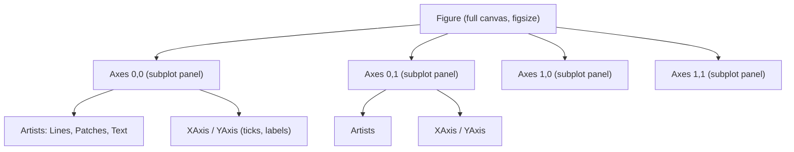
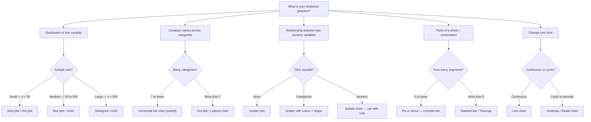

# M8 — Instructor Guide: Data Visualisation
> 90-minute lesson | Datasets: `air_quality_daily.csv`, `housing_prices.csv` | All levels

---

## Learning Objectives

By end of session, students can:
1. Use the Matplotlib figure/axes object model for multi-panel, publication-quality layouts
2. Select the correct chart type based on the analytical question (not personal preference)
3. Apply colour accessibility principles (CVD-safe palettes)
4. Reduce chart junk using the data-ink ratio principle
5. Build an interactive Plotly chart (developer track)

---

## Lesson Outline

| Time | Activity | Notes |
|------|----------|-------|
| 0:00–0:10 | M7 debrief — share your EDA narratives | 2 students present their prose story |
| 0:10–0:25 | **L8.1** — Matplotlib figure/axes model: subplots, saving | Live: air_quality distributions |
| 0:25–0:40 | **L8.4** — Chart selection: analytical question → chart type | Card sort activity |
| 0:40–0:55 | **L8.2** — Seaborn for statistical visualisation | housing_prices: scatter + regression |
| 0:55–1:05 | **L8.5** — Colour accessibility: CVD-safe palettes | Before/after demo |
| 1:05–1:15 | **L8.6** — Data-ink ratio: before/after chart cleaning | Live refactoring |
| 1:15–1:25 | **L8.7** — Plotly Express: interactive charts (developer track) | air_quality interactive timeline |
| 1:25–1:30 | Preview M9 | |

---

## Key Concepts

### L8.1 — Matplotlib figure/axes model `[McKinney Ch9 p.270–290]`
#### Two APIs: `pyplot` vs object-oriented plotting

Matplotlib offers two distinct programming interfaces, and every practitioner
eventually needs to know both because they appear interchangeably in
documentation, tutorials, and colleagues' code.  The **`pyplot`
state-machine interface** works through module-level functions —
`plt.plot()`, `plt.xlabel()`, `plt.title()` — that act on whichever figure
and axes Matplotlib currently considers "active."  This design lets you
produce a chart in very few lines and is convenient for quick experiments at
the top of an exploratory notebook.  The interpreter keeps track of the
current figure in a global registry, so you don't need to manage objects
explicitly.

The **object-oriented (OO) interface** flips that design: `fig, ax =
plt.subplots()` returns explicit Python objects representing the canvas and
the plot area, and every subsequent configuration call — `ax.set_xlabel()`,
`ax.set_title()`, `ax.legend()` — is made directly on those objects.  There
is no hidden state.  Any reader can look at the code and know unambiguously
which axes a command affects.  When a notebook or script grows beyond a
single panel, the OO style pays back its minor verbosity with dramatically
easier debugging and extension.

The most practical rule is: **use `pyplot` for one-off exploratory cells; use
the OO interface for any figure you intend to polish, reuse, or put in a
presentation.**  Many professional codebases mix them — a `plt.subplots()`
call to create the objects, then `ax.` calls for all configuration — which is
perfectly idiomatic.  What to avoid is using `plt.xlabel()` and similar
state-machine calls when multiple panels are on screen, because the result
depends on which panel happens to be "current," producing subtle, hard-to-spot
bugs.

#### Figure and Axes: the core object hierarchy

Every Matplotlib output lives in a strict hierarchy of objects.  At the top
sits the **Figure** — the entire rectangular canvas that will eventually be
saved as a file or rendered in a notebook cell.  Nested inside each Figure are
one or more **Axes** objects, each representing an independent plotting area
with its own coordinate system, axis lines, tick marks, and labels.  Inside
each Axes live the **Artists** — objects such as `Line2D`, `PathCollection`,
`Rectangle`, and `Text` that represent the actual data marks and annotations.



This hierarchy explains where to call methods.  Axis labels live on the
`Axes`, so you call `ax.set_xlabel()`.  The canvas size is a Figure attribute,
so you set `figsize` when creating the Figure.  The distinction matters whenever
something looks wrong: ask "which object owns this?" and call the method there
rather than reaching for a `plt.` shortcut that might affect the wrong panel.

#### Common Axes methods you will use constantly

The `Axes` object exposes dozens of methods, but a core reference set covers
nearly all practical work.  Commit these to muscle memory before the lesson:

| Method | What it does |
|--------|-------------|
| `ax.plot(x, y, **kwargs)` | Draw a line series |
| `ax.scatter(x, y, **kwargs)` | Draw a scatter plot |
| `ax.bar(x, height)` | Vertical bar chart |
| `ax.barh(y, width)` | Horizontal bar chart |
| `ax.hist(data, bins)` | Histogram |
| `ax.set_xlabel(label)` | Label the x-axis |
| `ax.set_ylabel(label)` | Label the y-axis |
| `ax.set_title(text)` | Title for this panel |
| `ax.set_xlim(lo, hi)` | Set x-axis range |
| `ax.set_ylim(lo, hi)` | Set y-axis range |
| `ax.legend()` | Show the legend |
| `ax.axhline(y)` / `ax.axvline(x)` | Reference lines |
| `ax.tick_params(**kwargs)` | Customise tick appearance |
| `ax.spines[side].set_visible(False)` | Hide a border spine |

The convenience form `ax.set(xlabel='...', ylabel='...', title='...')` lets
you set several properties at once, which is useful in tight inner loops of
multi-panel generation.  Return values from drawing calls — `line, =
ax.plot(...)` — are Artist objects you can later update or use in custom
legends.

#### Creating multi-panel layouts with `plt.subplots`

The core pattern for multi-panel figures is:

```python
fig, axes = plt.subplots(nrows, ncols, figsize=(width_in, height_in))
```

When both dimensions exceed 1, `axes` is a 2-D NumPy array of shape
`(nrows, ncols)`.  Use `axes[i, j]` to address a specific panel or
`axes.flat` to iterate all panels as a 1-D sequence.  When only one dimension
exceeds 1, `axes` is 1-D; when both equal 1, `axes` is a bare `Axes` object.
Pass `squeeze=False` to always get an array regardless of grid size.

Choosing `figsize` requires thought.  A common starting point for a grid is
`(4 * ncols, 3.5 * nrows)` inches, with fine-tuning for the specific content.
Aspect ratio shapes how readers perceive slopes and trends — wider panels
compress vertical variation; taller panels exaggerate it.  The choice is not
neutral.

Shared axes help viewers compare across panels without tracking separate tick
ranges:

```python
fig, axes = plt.subplots(1, 3, figsize=(12, 4),
                          sharey=True,           # all panels share y scale
                          constrained_layout=True)
```

`sharex=True` and `sharey=True` are independent; use whichever axis
comparison matters.

#### `constrained_layout` vs `tight_layout`: spacing made automatic

Overlapping axis labels and subplot titles are among the most common beginner
frustrations.  Two automatic spacing systems address this.

`tight_layout()` is called after all drawing is complete.  It re-calculates
subplot margins so labels no longer overlap, modifying the subplot parameters
in place:

```python
fig.tight_layout(pad=1.5)   # pad adds extra buffer in inches
```

`constrained_layout=True` is the newer, more capable approach.  It is set at
figure-creation time and continuously adjusts layout as you draw.  It handles
colorbars, legends outside axes, and complex shared-axis grids far more
reliably than `tight_layout`.  Prefer it in new code:

```python
fig, axes = plt.subplots(2, 3, figsize=(15, 8), constrained_layout=True)
```

Never mix both in the same figure; they conflict.

#### Saving figures with `fig.savefig`

A figure rendered in a notebook cell disappears when the kernel restarts.
Persist it with:

```python
fig.savefig('outputs/figure.png', dpi=150, bbox_inches='tight')
```

Key parameters you should always set explicitly:

- **`dpi`** — resolution in dots per inch.  Use 96–120 for web embeds, 150
  for slides, 300 for print.
- **`bbox_inches='tight'`** — crops excess whitespace and includes artists
  that extend outside the nominal bounding box (e.g., a legend placed outside
  the axes).
- **`format`** — inferred from the file extension.  Use `.pdf` or `.svg` for
  vector output that scales without pixelation; `.png` for raster output.

**Critical rule: always call `fig.savefig()` before `plt.show()`.**
`plt.show()` flushes and clears the figure buffer; any `savefig` call after it
writes an empty file.

#### Worked example: air quality distributions across six pollutants

The example below applies every concept from this lesson: OO interface,
`subplots` grid, `axes.flat` iteration, explicit axis configuration, median
annotation, and `savefig`.

```python
import matplotlib.pyplot as plt
import pandas as pd

df = pd.read_csv('data/air_quality_daily.csv', parse_dates=['date'])

pollutants  = ['PM2.5', 'PM10', 'NO2', 'O3', 'CO', 'SO2']
panel_color = '#2a6496'   # consistent blue across all panels

# Create a 2×3 grid; constrained_layout handles spacing automatically
fig, axes = plt.subplots(2, 3, figsize=(15, 8), constrained_layout=True)

for ax, col in zip(axes.flat, pollutants):
    data = df[col].dropna()

    # Histogram — no edge colour keeps bins visually clean
    ax.hist(data, bins=40, color=panel_color, edgecolor='none', alpha=0.8)

    # Vertical line at the median gives a quick summary statistic
    med = data.median()
    ax.axvline(med, color='#e63946', linestyle='--', linewidth=1.3,
               label=f'Median {med:.1f}')

    # All axis configuration via ax methods — no plt. state-machine calls
    ax.set_title(col, fontsize=11, fontweight='bold')
    ax.set_xlabel('μg/m³', fontsize=9)
    ax.set_ylabel('Count', fontsize=9)
    ax.legend(fontsize=8, frameon=False)

    # Remove distracting top and right borders
    ax.spines[['top', 'right']].set_visible(False)

# Figure-level super-title sits above all panels
fig.suptitle('Air-quality pollutant distributions', fontsize=14, fontweight='bold')

# Save before show — order matters
fig.savefig('outputs/air_quality_distributions.png', dpi=150, bbox_inches='tight')
plt.show()
```

Every axis configuration is inside the loop and references `ax` explicitly.
To customise one panel differently — say, a logarithmic scale for CO — simply
add an `if col == 'CO':` branch and call `ax.set_yscale('log')` there.

#### `pyplot` vs OO side-by-side: the same chart two ways

Seeing both interfaces produce identical output makes the trade-off concrete:

```python
import matplotlib.pyplot as plt
import numpy as np

x = np.linspace(0, 2 * np.pi, 300)

# ── pyplot (state-machine) ────────────────────────────────────
plt.figure(figsize=(8, 4))
plt.plot(x, np.sin(x), label='sin')
plt.plot(x, np.cos(x), label='cos')
plt.xlabel('Radians')
plt.ylabel('Amplitude')
plt.title('Trig functions — pyplot')
plt.legend()
plt.tight_layout()
plt.show()   # clears the figure — cannot save after this

# ── OO interface ─────────────────────────────────────────────
fig, ax = plt.subplots(figsize=(8, 4))
ax.plot(x, np.sin(x), label='sin')
ax.plot(x, np.cos(x), label='cos')
ax.set_xlabel('Radians')
ax.set_ylabel('Amplitude')
ax.set_title('Trig functions — OO')
ax.legend()
fig.savefig('outputs/trig_oo.png', dpi=120, bbox_inches='tight')
plt.show()
```

The OO version can be extended to a subplot grid by changing one line.  The
`pyplot` version would require significant restructuring.  This asymmetry is
why the OO style is the professional default.

#### Common Mistakes

- **Saving after `plt.show()`** — `show()` clears the figure buffer, so a
  subsequent `savefig` writes a blank file.  Always call `fig.savefig()` first.
- **Indexing a 2-D `axes` array as `axes[i]`** — for an `(m, n)` grid with
  both dimensions > 1, `axes[0]` returns a row of Axes, not a single panel.
  Use `axes[i, j]` or `axes.flat`.
- **Mixing `plt.` state-machine calls with explicit `ax.` calls** —
  `plt.xlabel()` silently targets whichever Axes happens to be current, which
  can modify the wrong panel in a multi-panel figure.
- **Setting `dpi` only for display, not for saved files** — the notebook
  display DPI does not affect saved files.  Always pass `dpi=` to `savefig`
  explicitly.
- **Not using `constrained_layout`** — skipping it typically results in
  subplot titles and axis labels overlapping each other; manual adjustment with
  `subplots_adjust` is tedious and fragile.
- **Assuming `axes.flat` works on a bare `Axes` object** — when
  `nrows=ncols=1`, `subplots` returns a bare `Axes`, not an array.  Use
  `squeeze=False` to always get an array.

#### Practice Questions

1. What is the difference between a Figure and an Axes in Matplotlib?  Sketch
   a diagram showing how they are related and which methods belong to each.
2. Create a 3×2 grid of subplots.  Fill each panel with a histogram of 500
   random values drawn from a different `np.random` distribution (e.g.,
   normal, uniform, exponential).  Give each panel a meaningful title.
3. Why does calling `plt.savefig()` after `plt.show()` produce a blank file?
   Rewrite the following code so the file is saved correctly:
   ```python
   plt.plot([1, 2, 3], [4, 5, 6])
   plt.show()
   plt.savefig('chart.png')
   ```
4. Rewrite the following `pyplot`-style code using the OO interface, then
   extend it to place two subplots side by side sharing the same y-axis:
   ```python
   plt.plot([1, 2, 3], [4, 5, 6])
   plt.title('My chart')
   plt.xlabel('x')
   plt.show()
   ```
5. Explain when you would prefer `constrained_layout=True` over calling
   `tight_layout()`.  What types of layouts does `constrained_layout` handle
   that `tight_layout` struggles with?

### L8.4 — Chart selection framework `[Expert]`
#### Start with the analytical question, not the chart type

The single most common chart-design mistake is choosing a visual form before
knowing what claim the visualisation needs to support.  Every chart is an
answer to a question, and the question comes first.  Before opening a plotting
library, articulate the goal in plain English: "How do average PM2.5 levels
vary by city?", "Is there a relationship between temperature and ozone?",
"How has pollution changed month-over-month?"  The phrasing of the question
nearly always contains the chart type as a hidden implication.

Five question categories cover the overwhelming majority of analytical charts:

- **Distribution** — what is the spread or shape of one variable?
- **Comparison** — how do values of one measure differ across categories?
- **Relationship** — is there a pattern between two or more numeric variables?
- **Composition** — what parts make up a whole, and in what proportions?
- **Change over time** — how does a measure evolve along a temporal axis?

Once you have identified the category, the chart family follows with a short
list of candidates rather than the entire taxonomy of possible charts.
The discipline is being able to justify your choice in one sentence — if you
cannot, the chart type is probably wrong.

#### Perceptual accuracy: why some chart types are objectively better

Cleveland and McGill's landmark 1984 research measured how accurately people
read different visual encodings.  The hierarchy they found, from most to least
accurate, is approximately:

$$\text{position} \succ \text{length} \succ \text{angle} \succ \text{area} \succ \text{volume} \succ \text{colour saturation}$$

This ranking has direct chart-design implications.  Bar charts use **position
and length**, which readers decode accurately.  Pie charts use **angle** and
**arc length**, which are harder to compare precisely.  Bubble charts use
**area**, which is harder still.  The ranking is not absolute — context,
labelling, and familiarity all modulate accuracy — but it is a reliable
starting heuristic: when in doubt, prefer the encoding higher in the hierarchy.

#### The chart selection decision tree

The following decision tree translates the five question categories into chart
families.  Use it as a pre-coding checklist:



This tree is a guide, not a rule.  Exceptions exist — a scatter-matrix, for
example, shows both distribution and pairwise relationships simultaneously.
The key discipline is being able to justify your choice before coding.

#### Distribution charts in depth

Distribution charts answer "what is the shape, spread, and centre of this
variable?"  The choice within the family depends on sample size and the number
of groups being compared.

For large samples, a **histogram** with 30–50 bins is a good starting point.
Overlaying a KDE curve adds a smoothed shape estimate that is less sensitive
to bin boundaries than the histogram alone.  For comparing distributions
across groups, **violin plots** combine a box plot's summary statistics with a
KDE on each side, giving richer shape information.  **Box plots** are
efficient when comparing many groups simultaneously — a 20-city comparison
using 20 box plots is more readable than 20 histograms or 20 violin plots.

```python
import seaborn as sns
import matplotlib.pyplot as plt

# Histogram with KDE overlay — large sample, single variable
fig, ax = plt.subplots(figsize=(7, 4))
sns.histplot(df['PM2.5'], kde=True, bins=45, ax=ax,
             color='steelblue', edgecolor='none')
ax.set_title('PM2.5 distribution with KDE overlay')
ax.set_xlabel('μg/m³')
ax.spines[['top', 'right']].set_visible(False)
plt.tight_layout()
plt.show()
```

#### Comparison charts in depth

Comparison charts answer "which group has a higher value, and by how much?"
The canonical choice is the **bar chart**.  Horizontal bars are generally
preferable to vertical bars when category labels are long because they read
naturally left-to-right without requiring rotated text.

Always **sort bars by value** rather than alphabetically unless the ordering
carries meaning (e.g., months, ordered categories).  An unsorted bar chart
forces readers to search for the largest and smallest values; a sorted chart
makes rank immediately visible.  For more than three or four groups, avoid
grouped bars — **faceted single-series charts** or **dot plots** are cleaner.

```python
# Horizontal bar chart sorted by value — comparison by city
city_means = (df.groupby('city')['PM2.5']
                .mean()
                .sort_values(ascending=True))

fig, ax = plt.subplots(figsize=(8, 6))
ax.barh(city_means.index, city_means.values,
        color='steelblue', edgecolor='none')
ax.set_xlabel('Mean PM2.5 (μg/m³)')
ax.set_title('Average PM2.5 by city (sorted)')
ax.spines[['top', 'right', 'left']].set_visible(False)
ax.xaxis.grid(True, alpha=0.3, linestyle='--')
ax.set_axisbelow(True)
plt.tight_layout()
plt.show()
```

#### Relationship charts in depth

Scatter plots are the workhorse for exploring relationships between two numeric
variables.  They reveal linear and non-linear associations, clusters, gaps,
outliers, and heteroscedasticity — patterns that summary statistics alone
cannot show.  Add a regression line with `sns.regplot` to quantify the trend,
but never present the line without first showing the scatter.

Encoding a third variable into colour or marker shape adds useful
dimensionality while keeping the chart readable.  Encoding a fourth variable
into bubble size is tempting but frequently backfires — area perception is
imprecise and bubble charts often mislead about magnitude.  Use bubble size
only when the size variable is the primary story, and label the largest and
smallest bubbles explicitly.

```python
# Scatter with colour encoding and regression line
fig, ax = plt.subplots(figsize=(8, 5))
sns.scatterplot(data=df, x='temperature', y='PM2.5',
                hue='season', alpha=0.5, s=20, ax=ax)
sns.regplot(data=df, x='temperature', y='PM2.5',
            scatter=False, color='black',
            line_kws={'linewidth': 1}, ax=ax)
ax.set_title('Temperature vs PM2.5 by season')
ax.set_xlabel('Temperature (°C)')
ax.set_ylabel('PM2.5 (μg/m³)')
ax.spines[['top', 'right']].set_visible(False)
plt.tight_layout()
plt.show()
```

#### Composition and time-series charts

Composition charts — showing parts of a whole — are overused and frequently
misused.  **Pie charts** work only when there are five or fewer segments, the
proportions differ substantially, and individual percentages are labelled
directly.  In almost every other case a **horizontal stacked bar** or a set
of small-multiple bar charts communicates composition more accurately because
it encodes values in length rather than angle.

Time-series charts use **line charts** when the variable changes continuously
and the x-axis represents ordered time.  Do not use line charts for unordered
categories — if observations are not connected in sequence, discrete bars are
more honest.  For cyclic or calendar data — hourly patterns, day-of-week
patterns — a **heatmap** with time as rows and sub-period as columns reveals
periodicity that a line chart would flatten.

```python
# Monthly average PM2.5 — time series with subtle fill
monthly = (df.set_index('date')['PM2.5']
             .resample('M').mean()
             .reset_index())

fig, ax = plt.subplots(figsize=(12, 4))
ax.plot(monthly['date'], monthly['PM2.5'],
        linewidth=1.8, color='#2a6496', marker='o', markersize=4)
ax.fill_between(monthly['date'], monthly['PM2.5'],
                alpha=0.12, color='#2a6496')
ax.set_title('Monthly average PM2.5')
ax.set_xlabel('Date')
ax.set_ylabel('μg/m³')
ax.spines[['top', 'right']].set_visible(False)
ax.yaxis.grid(True, alpha=0.3, linestyle='--')
ax.set_axisbelow(True)
plt.tight_layout()
plt.show()
```

#### Worked example: four charts answering four different questions

```python
import seaborn as sns
import matplotlib.pyplot as plt

# ── 1. Distribution — histogram of PM2.5 ─────────────────────
fig, ax = plt.subplots(figsize=(7, 4))
sns.histplot(df['PM2.5'].dropna(), bins=45, kde=True, ax=ax,
             color='steelblue', edgecolor='none')
ax.set(title='Distribution of PM2.5', xlabel='μg/m³', ylabel='Count')
ax.spines[['top', 'right']].set_visible(False)
plt.tight_layout(); plt.show()

# ── 2. Comparison — average NO2 by city ──────────────────────
city_no2 = df.groupby('city')['NO2'].mean().sort_values()
fig, ax = plt.subplots(figsize=(8, 5))
ax.barh(city_no2.index, city_no2.values, color='#e07b39', edgecolor='none')
ax.set(title='Average NO2 by city', xlabel='NO2 (μg/m³)')
ax.spines[['top', 'right', 'left']].set_visible(False)
ax.xaxis.grid(True, alpha=0.3); ax.set_axisbelow(True)
plt.tight_layout(); plt.show()

# ── 3. Relationship — temperature vs O3 ──────────────────────
fig, ax = plt.subplots(figsize=(7, 5))
sns.scatterplot(data=df, x='temperature', y='O3',
                hue='season', alpha=0.4, s=18, ax=ax)
ax.set(title='Temperature vs O3 by season',
       xlabel='Temperature (°C)', ylabel='O3 (μg/m³)')
ax.spines[['top', 'right']].set_visible(False)
plt.tight_layout(); plt.show()

# ── 4. Time series — monthly median PM10 ─────────────────────
monthly_pm10 = df.set_index('date')['PM10'].resample('M').median()
fig, ax = plt.subplots(figsize=(12, 4))
ax.plot(monthly_pm10.index, monthly_pm10.values,
        linewidth=1.8, color='#6a3d9a')
ax.set(title='Monthly median PM10', xlabel='Date', ylabel='μg/m³')
ax.spines[['top', 'right']].set_visible(False)
ax.yaxis.grid(True, alpha=0.3); ax.set_axisbelow(True)
plt.tight_layout(); plt.show()
```

Each chart answers a clearly different analytical question using the encoding
appropriate for that question type.

#### Common Mistakes

- **Choosing a pie chart for more than five categories** — angle comparison
  degrades rapidly beyond five slices; switch to a sorted horizontal bar chart.
- **Using a line chart for unordered categories** — connecting discrete,
  unordered groups with lines implies a trend that does not exist; use bars or
  dots instead.
- **Ignoring sample size when choosing a distribution chart** — a box plot
  hides whether you have 30 or 3000 observations; for small samples, strip
  plots or jitter plots are more informative.
- **Adding bubble size as a third encoding unnecessarily** — area perception
  is unreliable; use colour or faceting instead unless magnitude is the
  primary story.
- **Defaulting to the first chart that "works"** — plot two or three candidate
  charts before committing; the best choice often only becomes clear through
  comparison.
- **Stacking bars when absolute values matter** — stacked bars make it easy to
  read the bottom segment but hard to compare upper segments; use grouped or
  faceted bars when all segments need accurate comparison.

#### Practice Questions

1. For each analytical question below, name the most appropriate chart type
   and explain why in one sentence:
   a. How are housing prices distributed in this dataset?
   b. Which city has the highest average NO2 level?
   c. Is there a relationship between humidity and PM2.5?
   d. How has monthly mean CO changed over three years?
2. Redraw a pie chart with eight segments as a horizontal bar chart.  Which
   design communicates magnitude differences more clearly, and why?
3. Using the Cleveland–McGill perceptual hierarchy, explain why
   position-and-length encodings (bar charts) are more accurate than angle
   encodings (pie charts).
4. Extend the comparison chart in the worked example to show both PM2.5 and
   NO2 side-by-side for each city using a grouped bar chart.  What limitation
   does this chart have compared to faceted single-measure charts?
5. When would a heatmap be a better choice than a line chart for time-series
   data?  Give a specific example using calendar or cyclical data.

### L8.5 — Colour accessibility `[Expert]`
#### Why colour accessibility is a correctness issue, not a cosmetic one

A visualisation that cannot be read by part of the audience has failed its
fundamental purpose.  Colour vision deficiency (CVD) affects approximately
**8 % of males** and **0.5 % of females** in populations of European descent,
with somewhat different but still significant rates in other populations.  The
most common forms reduce or eliminate the ability to distinguish red from
green, making the default red–green contrasts that appear throughout basic
chart design essentially invisible to a meaningful fraction of viewers.

This is not an edge case.  In a classroom of 30 students there are likely 1–3
who experience some form of CVD, and in a professional audience of 100 the
number may be 6–8.  Beyond CVD, charts are frequently printed in grayscale,
displayed on low-quality projectors with compressed colour gamuts, or viewed
on screens with very different colour calibration from the one used during
design.  Accessibility principles therefore improve chart quality for
*everyone*, not only for viewers with CVD.

The good news is that accessible colour design requires only a small number of
disciplined choices.  Switching from a default palette to a CVD-safe
alternative, adding a redundant encoding, and running a quick simulation test
typically takes under five minutes and makes the chart reliable for the entire
audience.

#### Understanding the three main types of colour vision deficiency

CVD comes in several forms, each affecting different parts of the visible
spectrum:

- **Deuteranopia / Deuteranomaly** — reduced sensitivity to green; most
  common, affecting roughly 6 % of males.
- **Protanopia / Protanomaly** — reduced sensitivity to red; affects roughly
  2 % of males.
- **Tritanopia / Tritanomaly** — reduced sensitivity to blue; rare, roughly
  0.01 % of the population.
- **Achromatopsia** — complete colour blindness; very rare, roughly 0.003 %.

Deuteranopia and protanomaly together account for the vast majority of CVD
cases.  Both affect the red–green axis, which is precisely the axis that
default chart palettes most often exploit for contrast.  A "good" red and a
"good" green that look unmistakably different to the designer can appear as two
shades of muddy yellow-brown to a deuteranopic viewer.

#### CVD-safe palettes to prefer

Several palettes have been designed or validated for CVD safety:

**For categorical data (distinguishing discrete groups):**

- **Okabe–Ito** — developed specifically for scientific figures with CVD
  safety as the primary design criterion.  Eight colours distinguishable under
  all major CVD types: `#E69F00`, `#56B4E9`, `#009E73`, `#F0E442`, `#0072B2`,
  `#D55E00`, `#CC79A7`, `#000000`.
- **ColorBrewer qualitative** — `Set2`, `Paired`, and `Dark2` perform
  reasonably well.  Avoid `Set1` and `Accent`, which include problematic
  red–green contrasts.
- **`sns.color_palette('colorblind')`** — Seaborn's built-in CVD-safe set, a
  variant of Okabe–Ito.

**For sequential data (continuous range from low to high):**

- **`viridis`** — perceptually uniform, works in grayscale, CVD-safe.  The
  standard recommendation.
- **`plasma`** and **`cividis`** — similar properties to `viridis` with
  slightly different hue paths.
- Avoid **`jet`** and **`rainbow`** — both create false visual boundaries and
  are not CVD-safe.

**For diverging data (values around a meaningful centre):**

- **`RdBu`**, **`PuOr`**, **`BrBG`** from ColorBrewer — the blue–orange and
  brown–green axes are readable under deuteranopia.
- Avoid **`RdGr`** (red–green diverging) — maximally problematic for
  deuteranopic viewers.

#### The redundant encoding principle

Colour should rarely carry the entire visual message alone.  A robust design
uses **redundant encoding** — encoding the same variable in two or more visual
channels simultaneously.  This ensures the message survives loss of colour
information:

- **Scatter plots**: use both `color=` and `marker=` to encode a categorical
  grouping.  A deuteranopic viewer who cannot distinguish blue from orange dots
  can still read circles from triangles.
- **Line charts**: use both `color=` and `linestyle=` (solid, dashed, dotted).
  A grayscale printout of a solid blue line and a dashed orange line remains
  distinguishable.
- **Direct labels**: annotating series directly on the chart, rather than
  relying on a colour-keyed legend, removes the need to match colour to label
  under any colour perception conditions.

```python
import matplotlib.pyplot as plt

# Redundant encoding: both colour and linestyle distinguish the series
fig, ax = plt.subplots(figsize=(8, 4))
ax.plot(x, series_a, color='#0072B2', linestyle='-',  linewidth=2, label='Series A')
ax.plot(x, series_b, color='#E69F00', linestyle='--', linewidth=2, label='Series B')
ax.plot(x, series_c, color='#009E73', linestyle=':',  linewidth=2, label='Series C')
ax.legend(frameon=False)
ax.spines[['top', 'right']].set_visible(False)
```

The colours `#0072B2` (blue), `#E69F00` (orange), and `#009E73` (green) are
the first three colours of the Okabe–Ito palette, selected to be maximally
distinguishable under all CVD types.

#### The WCAG contrast ratio and lightness design

The Web Content Accessibility Guidelines define a contrast ratio formula that
applies equally to chart design:

$$CR = \frac{L_1 + 0.05}{L_2 + 0.05}$$

where $L_1$ is the relative luminance of the lighter element and $L_2$ is that
of the darker element.  WCAG AA requires a ratio of at least **4.5 : 1** for
normal text; for large graphical elements such as chart marks a ratio of
**3 : 1** is the minimum recommendation.

In chart design terms, this means ensuring that data marks have sufficient
lightness contrast from the background and from each other.  Pale colours on
white backgrounds frequently fail this test even when hue differences are
obvious to the designer.  Checking contrast ratios is especially important for
fills in bar charts, scatter markers, and choropleth map backgrounds.

#### Testing for colour accessibility

Do not rely solely on personal judgement.  Several tools simulate how a chart
appears under various CVD conditions:

- **Coblis** (online tool — upload an image) — simulates deuteranopia,
  protanopia, tritanopia, and achromatopsia.
- **`daltonize`** (Python package) — programmatically simulate and recolour
  images.
- **Chrome DevTools** — the "Emulate vision deficiencies" setting in the
  Rendering panel simulates CVD in the browser.
- **Grayscale print test** — convert the chart to grayscale and check whether
  all groups remain distinguishable through lightness alone.

The grayscale test is the quickest first check.  A chart that works in
grayscale almost certainly works for all CVD conditions, because grayscale
perception is intact in all forms of CVD.

#### Implementing accessible colour defaults in code

Setting safe defaults early in a notebook applies them to all subsequent charts
without per-chart configuration:

```python
import seaborn as sns
import matplotlib.pyplot as plt
import matplotlib as mpl

# ── Categorical palette (Okabe–Ito) ──────────────────────────────────────
okabe_ito = ['#E69F00', '#56B4E9', '#009E73', '#F0E442',
             '#0072B2', '#D55E00', '#CC79A7', '#000000']
sns.set_palette(okabe_ito)

# ── Sequential colormap (CVD-safe) ───────────────────────────────────────
mpl.rcParams['image.cmap'] = 'viridis'

# ── Verify: view the palette swatches ────────────────────────────────────
sns.palplot(sns.color_palette(okabe_ito))

# ── For a diverging heatmap, override locally ────────────────────────────
fig, ax = plt.subplots()
im = ax.imshow(matrix, cmap='RdBu_r', vmin=-3, vmax=3)
plt.colorbar(im, ax=ax, label='Z-score')
```

Setting defaults at the notebook level means all charts produced later share
the same accessible palette without individual configuration.

#### Before/after: making a chart accessible

```python
import seaborn as sns
import matplotlib.pyplot as plt

# ── BEFORE: default palette with red–green contrast ──────────────────────
fig, ax = plt.subplots(figsize=(7, 5))
sns.scatterplot(data=df, x='temperature', y='PM2.5',
                hue='season',    # uses default palette — red/green present
                alpha=0.5, ax=ax)
ax.set_title('BEFORE: default palette (red–green problematic)')

# ── AFTER: Okabe–Ito palette + shape as redundant encoding ───────────────
okabe_ito = ['#E69F00', '#56B4E9', '#009E73', '#F0E442']
markers   = ['o', 's', '^', 'D']   # circle, square, triangle, diamond

fig, ax = plt.subplots(figsize=(7, 5))
for (season, grp), color, marker in zip(
        df.groupby('season'), okabe_ito, markers):
    ax.scatter(grp['temperature'], grp['PM2.5'],
               label=season, color=color, marker=marker,
               alpha=0.5, s=25, edgecolors='none')
ax.legend(title='Season', frameon=False)
ax.set_xlabel('Temperature (°C)')
ax.set_ylabel('PM2.5 (μg/m³)')
ax.set_title('AFTER: Okabe–Ito palette + shape encoding')
ax.spines[['top', 'right']].set_visible(False)
plt.tight_layout()
plt.show()
```

The "after" version remains interpretable when printed in grayscale, displayed
on a projector with reduced colour accuracy, or viewed with deuteranopia.

#### Common Mistakes

- **Using the default Matplotlib colour cycle for categorical data** — the
  default cycle contains red and green adjacent in the list.  Switch to
  `sns.color_palette('colorblind')` or Okabe–Ito at the start of every
  notebook.
- **Relying on colour alone to encode a categorical variable** — if the only
  channel is hue, the chart fails for CVD viewers and in grayscale.  Always
  add a redundant encoding: marker shape, linestyle, or direct labels.
- **Using `jet` or `rainbow` for sequential data** — both palettes create
  false visual boundaries where the hue cycles, misleading viewers about where
  the data changes.  Use `viridis` or `plasma`.
- **Not testing the chart before publishing** — upload the saved figure to
  Coblis or convert to grayscale before sharing.  A quick test takes under a
  minute.
- **Choosing low-lightness-contrast colours** — pale yellow on white, or light
  grey on white, may look distinct when hue is present but become invisible in
  grayscale or low-contrast rendering environments.

#### Practice Questions

1. What percentage of males typically experience some form of red–green colour
   vision deficiency?  Explain why this matters for the default red–green
   colour schemes used in many plotting libraries.
2. Name three CVD-safe colour palettes appropriate for categorical data and
   three appropriate for sequential data.  For each, explain what makes it
   safe.
3. What is redundant encoding?  Give two concrete examples in chart design
   where redundant encoding preserves meaning when colour is unavailable.
4. Using the WCAG contrast ratio formula $CR = (L_1 + 0.05) / (L_2 + 0.05)$,
   explain why pale colours on white backgrounds may fail accessibility
   requirements even if they look distinct to a normally-sighted viewer.
5. Write code that sets the default Seaborn palette to Okabe–Ito at the start
   of a notebook and creates a scatter plot of PM2.5 vs temperature that uses
   both colour and marker shape to encode the season variable.

### L8.6 — Data-ink ratio `[Expert]`
#### The data-ink ratio: Tufte's core principle

Edward Tufte introduced the data-ink ratio in *The Visual Display of
Quantitative Information* (1983) as a guiding principle for evaluating the
efficiency of a graphic.  The principle states that every mark of ink — every
pixel rendered — should either directly represent data or be absolutely
necessary to interpret the data.  Any mark that does neither is **chartjunk**,
and its removal makes the chart better.

$$\text{data-ink ratio} = \frac{\text{ink used to represent data values}}{\text{total ink used in the graphic}}$$

The target is a ratio as close to 1.0 as possible.  In practice, a ratio
above roughly 0.85 characterises clean professional charts; ratios below 0.5
are typical of heavily decorated corporate slides.  Importantly, the goal is
not minimalism for its own sake but **maximum signal density**: the reader's
attention should be absorbed by the data, not by the frame around it.

Tufte's complementary concept is the **lie factor** — the ratio of the size of
the effect shown in the graphic to the size of the effect in the data:

$$\text{lie factor} = \frac{\text{size of effect shown in the graphic}}{\text{size of effect in the data}}$$

An ideal chart has data-ink ratio → 1 and lie factor → 1.  The lie factor
exceeds 1 when visual elements are not proportional to the data — truncated
y-axes that exaggerate differences, or 3-D bars with added depth that inflates
apparent size.

#### What chartjunk looks like in practice

Chartjunk appears in many forms across the chart-making tools most people
learn first:

- **3-D effects on 2-D data** — a 3-D bar chart where the depth dimension
  encodes nothing.  The perspective projection distorts bar heights, making the
  chart misleading and harder to read.
- **Dark or gradient chart backgrounds** — a coloured background competes with
  the data marks for attention and reduces effective lightness contrast.
- **Heavy or multiple gridlines** — bold black gridlines at every tick add ink
  that carries no data.  Faint dotted guidelines at sparse intervals are much
  less distracting.
- **Redundant tick marks** — tick marks that duplicate grid positions, or tick
  labels that add no precision beyond what the axis range communicates.
- **Decorative borders and shadow effects** — thick bounding boxes, rounded
  corners, and drop shadows add visual weight without improving readability.
- **Data labels on every bar when a scale axis is present** — if the axis
  tells the reader the approximate value, repeating the exact number on each
  bar is often redundant for exploratory charts.

The most productive question after drafting any chart is not "what should I
add?" but "what can I remove without losing information?"

#### The five worst offenders and how to fix them

**1. 3-D effects.** Never use them for 2-D data.  The perspective projection
distorts lengths.  Replace with a flat chart.

**2. Default gridlines.** Switch from solid dark gridlines to
`linestyle='--', alpha=0.3`.  Move them behind data with
`ax.set_axisbelow(True)`.

**3. All four spines.** Remove the top and right spines with
`ax.spines[['top', 'right']].set_visible(False)`.  A closed rectangle is
rarely necessary; the x- and y-axis lines are sufficient.

**4. Background colour.** Use `'white'` or `'none'` as the axes background.
The `'whitegrid'` Seaborn style uses a very light grey background that is
subtly less distracting than Matplotlib's default.

**5. Legend boxes.** A default Matplotlib legend has a solid border and a
white background that can obscure data.  Use `frameon=False` to remove the
box, or replace the legend entirely with direct labels on the lines.

#### Seaborn styles and `rcParams` for cleaner defaults

Seaborn provides five named styles that immediately improve the data-ink ratio
over Matplotlib's default:

| Style | Description | Recommended? |
|-------|-------------|-------------|
| `'darkgrid'` | Grey background, white gridlines | No — background is ink |
| `'whitegrid'` | White background, grey gridlines | Good default for reports |
| `'dark'` | Grey background, no gridlines | Rarely useful |
| `'white'` | White background, no gridlines | Cleanest; add grid if needed |
| `'ticks'` | White background, axis ticks only | Best data-ink ratio |

```python
import seaborn as sns

# Apply globally for the session
sns.set_theme(style='ticks', context='notebook')

# Or use a context manager for one figure only
with sns.axes_style('ticks'):
    fig, ax = plt.subplots(figsize=(8, 5))
    ax.plot(x, y)
```

For fine-grained control, `plt.rcParams` overrides any Matplotlib default
globally:

```python
import matplotlib as mpl

mpl.rcParams.update({
    'axes.spines.top':   False,
    'axes.spines.right': False,
    'axes.grid':         True,
    'grid.alpha':        0.3,
    'grid.linestyle':    '--',
    'legend.frameon':    False,
    'font.family':       'sans-serif',
})
```

#### Before/after: a systematic revision

The most effective teaching exercise is to produce a "before" version with
common defaults and then systematically remove and soften elements.

```python
import matplotlib.pyplot as plt

# ── BEFORE: typical first-draft clutter ──────────────────────────────────
fig, ax = plt.subplots(figsize=(10, 5))
ax.plot(df['date'], df['PM2.5'], linewidth=2)
ax.set_facecolor('#e8e8e8')                          # grey background
ax.grid(True, color='white', linewidth=1.2)          # heavy white gridlines
ax.set_title('PM2.5 over time', fontsize=14, fontweight='bold')
ax.set_xlabel('Date', fontsize=12)
ax.set_ylabel('μg/m³', fontsize=12)
plt.show()

# ── AFTER: higher data-ink ratio ─────────────────────────────────────────
fig, ax = plt.subplots(figsize=(12, 4))

# Smooth the series so the trend is the message, not the noise
rolling = df['PM2.5'].rolling(7, center=True).mean()
ax.plot(df['date'], rolling,
        linewidth=1.8, color='#2a6496')              # data is the ink
ax.fill_between(df['date'], rolling,
                alpha=0.10, color='#2a6496')         # subtle context band

ax.set_title('7-day rolling average PM2.5', fontsize=12, pad=10)
ax.set_ylabel('μg/m³', fontsize=10)

# ── Remove chartjunk ─────────────────────────────────────────────────────
ax.spines[['top', 'right', 'left']].set_visible(False)  # keep only x-spine
ax.yaxis.grid(True, alpha=0.25, linestyle='--')          # subtle grid
ax.set_axisbelow(True)                                   # grid behind data
ax.tick_params(length=3)                                 # shorten tick marks

plt.tight_layout()
fig.savefig('outputs/pm25_after.png', dpi=150, bbox_inches='tight')
plt.show()
```

The "after" version uses fewer visual elements but communicates the trend more
clearly.  The area fill adds context (magnitude) without adding a second data
series.

#### Worked example: a reusable cleanup helper

Applying the same improvements to every panel in a multi-panel figure is
tedious if done manually.  Encapsulate the revisions in a function:

```python
def clean_axes(ax, grid_axis='y'):
    """Apply standard data-ink ratio improvements to an Axes object.

    Parameters
    ----------
    ax : matplotlib.axes.Axes
    grid_axis : {'y', 'x', 'both', 'none'}
        Which axis to add a subtle grid to.
    """
    ax.spines[['top', 'right']].set_visible(False)
    if grid_axis in ('y', 'both'):
        ax.yaxis.grid(True, alpha=0.25, linestyle='--')
    if grid_axis in ('x', 'both'):
        ax.xaxis.grid(True, alpha=0.25, linestyle='--')
    ax.set_axisbelow(True)
    ax.tick_params(length=3)
    return ax


# Apply to a six-panel grid
fig, axes = plt.subplots(2, 3, figsize=(15, 8), constrained_layout=True)
for ax, col in zip(axes.flat, pollutants):
    ax.hist(df[col].dropna(), bins=40, color='steelblue', edgecolor='none')
    ax.set_title(col, fontsize=11)
    ax.set_xlabel('μg/m³')
    clean_axes(ax)   # one-line cleanup per panel
```

This helper can be imported at the top of any notebook and applied to every
`ax` object, making cleanliness a one-line operation per panel.

#### The revision habit: what to ask at every draft

Apply this checklist to any first-draft chart before sharing it:

1. **Remove the top and right spines.**
2. **Soften gridlines** to `alpha=0.25, linestyle='--'` and set
   `ax.set_axisbelow(True)`.
3. **Remove the legend box** — `ax.legend(frameon=False)`.
4. **Shorten tick marks** — `ax.tick_params(length=3)`.
5. **Check the title** — is it informative ("7-day rolling average PM2.5") or
   generic ("Chart 1")?
6. **Check axis labels** — do they include units?
7. **Check the colour** — does each colour encode information, or is it
   decoration?
8. **Print to grayscale** — does the chart still communicate the main point?

#### Common Mistakes

- **Assuming that more decoration signals more effort** — heavy borders, 3-D
  effects, and gradient backgrounds often signal a first draft, not a polished
  output.  Clients and reviewers interpret cleanliness as professionalism.
- **Softening gridlines too aggressively** — if gridlines become invisible,
  readers lose the reference frame needed to estimate values.  Target
  `alpha=0.2–0.35`, not `alpha=0.05`.
- **Removing the y-axis spine without adding grid support** — if you remove
  the top, right, and left spines, the viewer has no positional reference for
  the y-axis.  Either keep the left spine or ensure gridlines are present.
- **Applying Tufte principles rigidly to interactive charts** — interactive
  charts can afford somewhat higher visual density because interaction reveals
  detail on demand.  The data-ink ratio applies most strictly to static,
  print-intended outputs.
- **Confusing "minimal" with "incomplete"** — removing axis labels, units, or
  a title to reduce ink is always wrong.  Only decoration — marks that carry no
  information — should be removed.

#### Practice Questions

1. Tufte defines the data-ink ratio as the proportion of ink that represents
   data values.  What ratio would you expect in a chart with a gradient
   background, 3-D bars, and a large decorative border?  Estimate qualitatively
   and explain.
2. List five specific chartjunk elements that appear in typical default
   Matplotlib or Excel charts.  For each, describe the one code change that
   removes or reduces it.
3. Explain the difference between the data-ink ratio and the lie factor.  Can
   a chart have a high data-ink ratio and still have a lie factor significantly
   above 1?  Give an example.
4. Apply the revision checklist to the following code and rewrite it to achieve
   a higher data-ink ratio:
   ```python
   fig, ax = plt.subplots()
   ax.bar(cities, values)
   ax.set_facecolor('#d0d0d0')
   ax.grid(True, color='white', linewidth=2)
   plt.show()
   ```
5. Write a reusable `clean_axes(ax)` function that applies standard data-ink
   improvements.  Apply it to a six-panel subplot grid in a single loop.

### L8.7 — Plotly Express interactive charts `[Expert]` (developer track)
#### Why interactive charts change the exploration dynamic

Static charts present one carefully chosen view of the data.  Interactive
charts allow readers to ask follow-up questions directly inside the
visualisation — zooming into a dense region to see individual points, hovering
over an outlier to read its exact values, toggling series on and off to focus
on a specific group, or panning a time series to inspect a particular period.
This transforms the chart from a one-way transmission into a two-way
conversation with the data.

In teaching and exploratory data analysis, this interactivity is especially
valuable because the instructor can respond to student questions by
manipulating the chart in real time.  "Which city has the outliers?" — click
it.  "Is that trend consistent in winter?" — toggle the season groups.
Interactive charts reduce the need to pre-anticipate every question with a
separate static figure, compressing the exploration cycle.

The caveat is scope: interactivity adds value during exploration but can add
cognitive overhead in a formal report or a slide deck where one clear message
is the goal.  Knowing when to use and when to avoid interactive charts is as
important as knowing how to build them.

#### Plotly Express vs Plotly Graph Objects

Plotly has two levels of API.  **Plotly Graph Objects** (`plotly.graph_objects`)
is the low-level interface that gives full control over every trace, axis, and
layout property.  It is verbose and powerful, analogous to Matplotlib's OO
interface.

**Plotly Express** (`plotly.express`, typically imported as `px`) is a
high-level wrapper that generates the most common chart types from a DataFrame
with minimal code.  A scatter plot that would take fifteen lines in Graph
Objects takes three in Express.  For teaching and rapid prototyping, Plotly
Express is almost always the right starting point.

| Feature | Plotly Express | Graph Objects |
|---------|---------------|---------------|
| Code volume | Low | High |
| Learning curve | Shallow | Steep |
| Customisation | Limited but extensible | Complete |
| DataFrame integration | Direct | Manual |
| Good for | Teaching, EDA, dashboards | Fine-tuned production figures |

Plotly Express returns a `Figure` object that *is* a Graph Objects figure, so
you can always add Graph Objects traces or update layout properties on an
Express output when you need finer control.

#### Core chart types and parameter mapping

Every Plotly Express function accepts `data_frame`, `x`, and `y` as its first
arguments, followed by encoding parameters:

```python
import plotly.express as px

# Scatter plot with colour, shape, and tooltip encodings
fig = px.scatter(df, x='temperature', y='PM2.5',
                 color='season',       # categorical colour
                 symbol='season',      # redundant encoding via marker shape
                 hover_data=['city'],  # extra columns shown in tooltip
                 title='Temperature vs PM2.5 by season',
                 template='simple_white')
fig.show()

# Line chart — one series per city
fig = px.line(df_monthly, x='date', y='PM2.5',
              color='city',
              title='Monthly PM2.5 by city',
              labels={'PM2.5': 'PM2.5 (μg/m³)'},
              template='simple_white')
fig.show()

# Histogram with overlapping season groups
fig = px.histogram(df, x='NO2', nbins=50,
                   color='season',
                   barmode='overlay',
                   opacity=0.65,
                   title='NO2 distribution by season')
fig.show()

# Box plot
fig = px.box(df, x='season', y='PM2.5',
             color='season',
             points='outliers',
             title='PM2.5 by season')
fig.show()
```

The `template` parameter sets the overall visual theme.  `'simple_white'`
produces a clean white background with minimal chartjunk, analogous to
Seaborn's `'ticks'` style.

#### Extra encodings: size, hover data, and animation

Plotly Express supports four simultaneous encodings beyond x and y:

- `color=` — map a column to marker or line colour.
- `size=` — map a numeric column to marker size (bubble chart).  Use
  cautiously given area perception limitations.
- `hover_data=` — list of columns to add to the tooltip.  Tooltip data adds no
  visual clutter but adds exploratory value.
- `animation_frame=` — animate the chart across unique values of a column
  (e.g., `animation_frame='month'` steps through months).  This is the most
  compelling feature for temporal exploration that is hard to replicate in
  static charts.

```python
# Animated bubble chart: PM2.5 vs temperature animated by month
fig = px.scatter(
    df,
    x='temperature', y='PM2.5',
    color='city',
    size='humidity',           # bubble size encodes humidity
    animation_frame='month',   # animate across months
    animation_group='city',    # keep city identity across frames
    range_x=[df['temperature'].min() - 2, df['temperature'].max() + 2],
    range_y=[0, df['PM2.5'].max() * 1.1],   # fixed ranges for honest comparison
    title='Monthly PM2.5 vs temperature by city',
    labels={'PM2.5': 'PM2.5 (μg/m³)', 'temperature': 'Temp (°C)'},
    template='simple_white',
    size_max=25)
fig.show()
```

The fixed `range_x` and `range_y` parameters are critical when using
animation — without them, axes rescale between frames, making inter-frame
comparisons meaningless.

#### Faceting for small multiples

Plotly Express supports small-multiple layouts through `facet_row=` and
`facet_col=`, the interactive equivalent of Matplotlib's `subplots` grid:

```python
fig = px.scatter(
    df, x='temperature', y='PM2.5',
    facet_col='season',        # one panel per season
    color='city',
    trendline='ols',           # OLS regression line per panel
    title='Temperature vs PM2.5 faceted by season',
    template='simple_white')
fig.update_layout(height=450)
fig.show()
```

Each facet panel is independently interactive — zooming one panel does not
affect others unless axis matching is configured.

#### Exporting: HTML, static PNG, and PDF

Plotly figures are JavaScript-based HTML objects.  The primary export format
is a self-contained `.html` file:

```python
# Self-contained interactive file — no server required
fig.write_html('outputs/pm25_interactive.html')
```

For static output in reports or slides, use `.write_image()`, which requires
the `kaleido` package (`pip install kaleido`):

```python
# High-resolution PNG for slides
fig.write_image('outputs/pm25_static.png', width=900, height=500, scale=2)

# Vector PDF for reports
fig.write_image('outputs/pm25_static.pdf')
```

The `scale` parameter is analogous to `dpi` in Matplotlib: `scale=2` doubles
pixel density, producing sharper output on high-DPI displays.

#### When NOT to use interactive charts

Plotly is not always the right tool.  Avoid it when:

- **The output will be printed** — HTML interactivity does not exist on paper;
  use Matplotlib with `savefig` instead.
- **A single clear message is the goal** — interactive charts invite
  exploration, which can dilute a specific argument.  A carefully crafted
  static chart with annotations is more persuasive in a formal report.
- **The rendering environment cannot run JavaScript** — PDFs, some email
  clients, and many automated report pipelines do not render Plotly charts.
- **File size matters** — a Plotly HTML file with a large dataset can be
  several megabytes.  Aggregate data before plotting.
- **Very tight layout control is needed** — Plotly's layout engine is less
  flexible than Matplotlib's `subplot_mosaic` for asymmetric,
  publication-quality panels.

#### Worked example: PM2.5 interactive timeline with city toggle

```python
import plotly.express as px
import pandas as pd

df = pd.read_csv('data/air_quality_daily.csv', parse_dates=['date'])

# Aggregate to daily mean PM2.5 per city
df_agg = (df.groupby(['date', 'city'])['PM2.5']
            .mean()
            .reset_index()
            .rename(columns={'PM2.5': 'mean_pm25'}))

# Line chart — one series per city, legend toggles series on/off
fig = px.line(
    df_agg,
    x='date',
    y='mean_pm25',
    color='city',
    title='Daily mean PM2.5 by city (click legend to toggle cities)',
    labels={'mean_pm25': 'Mean PM2.5 (μg/m³)', 'date': 'Date'},
    template='simple_white',
    line_shape='spline'        # smooth lines
)

fig.update_traces(line_width=1.4, opacity=0.85)
fig.update_layout(
    hovermode='x unified',    # one tooltip showing all cities for a date
    legend_title_text='City',
    height=450,
    margin=dict(l=60, r=20, t=60, b=50)
)

fig.show()

# Save both interactive and static formats
fig.write_html('outputs/pm25_by_city_interactive.html')
fig.write_image('outputs/pm25_by_city_static.png',
                width=1100, height=450, scale=2)   # requires kaleido
```

The `hovermode='x unified'` layout option produces a single tooltip that
compares all city values for whatever date the cursor hovers over — far more
useful than one tooltip per series when the primary question is "how do cities
compare on any given day?"

#### Common Mistakes

- **Using `px.scatter` with too many points** — Plotly renders all data points
  as interactive DOM elements; beyond roughly 10,000 points, performance
  degrades significantly.  Aggregate or sample before plotting.
- **Forgetting fixed axis ranges in animated charts** — without `range_x` and
  `range_y`, axes rescale between frames, making inter-frame comparisons
  misleading.
- **Embedding Plotly HTML in a PDF report** — the interactivity is stripped in
  PDF conversion.  Always generate a static fallback with `write_image`.
- **Not installing `kaleido`** — `write_image` raises a cryptic error without
  this dependency.  Add it to the project requirements alongside `plotly`.
- **Choosing interactive charts for a presentation audience that cannot
  interact** — a live demo works; a screenshot of a Plotly chart in slides
  does not carry its interactive value.

#### Practice Questions

1. What is the difference between Plotly Express and Plotly Graph Objects?
   When would you choose each?
2. Write Plotly Express code to create a scatter plot of `temperature` vs `O3`
   from the air quality dataset, with `season` encoded in both colour and
   marker symbol, and `city` available in the tooltip.
3. Explain the purpose of the `hovermode='x unified'` layout setting in a
   multi-series line chart.  When is it more useful than the default per-series
   hover?
4. A colleague has built an interactive Plotly chart for inclusion in a
   quarterly PDF report.  What are the problems with this approach and how
   would you fix them?
5. Create an animated Plotly Express scatter plot showing `temperature` vs
   `PM2.5` animated across months, with fixed axis ranges, city colour
   encoding, and humidity encoded in marker size.

### L8.8 — Matplotlib advanced `[McKinney Ch9 p.290–310]`
#### Dual y-axes with `twinx`: power and pitfalls

`ax.twinx()` creates a second y-axis that shares the x-axis of an existing
Axes.  It is the tool for overlaying two series with fundamentally different
units or scales on the same time line — for example, daily temperature (°C)
and daily PM2.5 (μg/m³).  Without dual axes, the two series would be plotted
with the same numeric scale, making one or both visually meaningless.

The technique is genuinely useful but also frequently misused.  The central
danger is **implying correlation through proximity**: two series that merely
share a time axis can be made to look strongly correlated or anti-correlated
by adjusting the y-axis ranges independently.  Viewers routinely interpret
visual overlap as meaningful relationship.  Best practices:

- Use dual axes **only** when the shared x-axis is the genuine analytical
  point — "how do these two variables co-vary over this time range?"
- Keep the two series visually distinct with different line styles and
  colour-coded axis spines.
- If the question is comparison or ranking, prefer separate faceted panels
  instead.

```python
import matplotlib.pyplot as plt

fig, ax1 = plt.subplots(figsize=(12, 5))

# First y-axis (left): PM2.5
color_pm25 = '#2a6496'
ax1.plot(df['date'], df['PM2.5'].rolling(7).mean(),
         color=color_pm25, linewidth=1.8, label='PM2.5 (7-day avg)')
ax1.set_ylabel('PM2.5 (μg/m³)', color=color_pm25, fontsize=10)
ax1.tick_params(axis='y', labelcolor=color_pm25)

# Second y-axis (right): temperature
ax2 = ax1.twinx()
color_temp = '#e07b39'
ax2.plot(df['date'], df['temperature'].rolling(7).mean(),
         color=color_temp, linewidth=1.5, linestyle='--',
         label='Temperature (7-day avg)')
ax2.set_ylabel('Temperature (°C)', color=color_temp, fontsize=10)
ax2.tick_params(axis='y', labelcolor=color_temp)

# Merge legends from both axes into one
h1, l1 = ax1.get_legend_handles_labels()
h2, l2 = ax2.get_legend_handles_labels()
ax1.legend(h1 + h2, l1 + l2, loc='upper left', frameon=False)

ax1.set_title('PM2.5 and temperature — 7-day rolling averages')
ax1.spines['top'].set_visible(False)
ax2.spines['top'].set_visible(False)
fig.tight_layout()
fig.savefig('outputs/twinx_demo.png', dpi=150, bbox_inches='tight')
plt.show()
```

The combined legend uses the `get_legend_handles_labels` pattern to merge
handles from both axes into a single legend on `ax1`.

#### Annotations with `ax.annotate`

`ax.annotate()` places text at a specified point in the coordinate system and
optionally draws an arrow pointing to a different coordinate.  This is the
tool for marking regime changes, outlier events, policy dates, or any
contextual moment that the data alone does not explain.

The full call signature:

```python
ax.annotate(
    text,                          # annotation text
    xy=(x_data, y_data),          # point being annotated (arrow tip)
    xytext=(x_text, y_text),      # text position
    arrowprops=dict(
        arrowstyle='->',           # '->', '-|>', 'fancy', etc.
        color='black',
        lw=1.2
    ),
    fontsize=9,
    ha='left'                      # horizontal alignment of text
)
```

`xy` and `xytext` are in data coordinates by default, which means they move
with axis rescaling.  Use `xycoords='axes fraction'` to anchor text in the
panel's corner regardless of the data range — useful for labels like "(a)" or
source attributions.

```python
# Annotate a known pollution peak
peak_idx = df['PM2.5'].idxmax()
peak_date = df.loc[peak_idx, 'date']
peak_val  = df.loc[peak_idx, 'PM2.5']

ax.annotate(
    f'Peak: {peak_val:.0f} μg/m³',
    xy=(peak_date, peak_val),
    xytext=(peak_date - pd.Timedelta(days=20), peak_val + 30),
    arrowprops=dict(arrowstyle='->', color='#e63946', lw=1.2),
    color='#e63946', fontsize=9)
```

#### `rcParams`: configuring global defaults

`matplotlib.rcParams` is a dictionary-like object that controls every
Matplotlib default.  Changes persist for the duration of the session and
affect all figures created after the change:

```python
import matplotlib as mpl

mpl.rcParams.update({
    # Typography
    'font.family':       'sans-serif',
    'font.size':         10,
    'axes.titlesize':    12,
    'axes.labelsize':    10,
    'xtick.labelsize':   9,
    'ytick.labelsize':   9,
    # Spines and ticks
    'axes.spines.top':   False,
    'axes.spines.right': False,
    'xtick.direction':   'out',
    'ytick.direction':   'out',
    # Grid
    'axes.grid':         True,
    'grid.alpha':        0.3,
    'grid.linestyle':    '--',
    'axes.axisbelow':    True,
    # Output
    'figure.dpi':        100,
    'savefig.dpi':       150,
    'savefig.bbox':      'tight',
    # Legend
    'legend.frameon':    False,
    'legend.fontsize':   9,
})
```

Setting `rcParams` at the top of a notebook ensures every subsequent figure
shares the same clean defaults.  Reset to Matplotlib's built-in defaults with
`mpl.rcdefaults()`.

#### Temporary styles with `plt.style.context`

`plt.style.use()` applies a named style globally for the session.
`plt.style.context()` applies it temporarily inside a `with` block — the
preferred pattern when you want one figure to look different from the rest of
the notebook:

```python
# Apply the 'seaborn-v0_8-paper' style only for this figure
with plt.style.context('seaborn-v0_8-paper'):
    fig, ax = plt.subplots(figsize=(8, 5))
    ax.plot(x, y, linewidth=1.5)
    ax.set_title('Paper-quality style')
    fig.savefig('outputs/paper_style.pdf', bbox_inches='tight')
```

Available built-in styles include `'seaborn-v0_8'`, `'seaborn-v0_8-whitegrid'`,
`'seaborn-v0_8-paper'`, `'ggplot'`, `'bmh'`, `'fivethirtyeight'`, and
`'classic'`.  List all with `plt.style.available`.  Custom styles can be
defined in a `.mplstyle` file for a consistent house style across many
notebooks.

#### `subplot_mosaic` for asymmetric layouts

`plt.subplot_mosaic()` (Matplotlib ≥ 3.3) provides a far more flexible layout
syntax than the equal-grid `subplots`.  Describe the layout as a list of
strings where each string represents a row and each character represents a
panel.  Repeated labels span multiple columns or rows:

```python
# Layout: two small panels in row 0, one wide panel spanning row 1
mosaic = [['A', 'B'],
          ['C', 'C']]

fig = plt.figure(figsize=(10, 6), constrained_layout=True)
axes = fig.subplot_mosaic(mosaic)
# Access panels by label
axes['A'].set_title('Panel A')
axes['B'].set_title('Panel B')
axes['C'].set_title('Panel C — full width')
```

This produces three Axes: `axes['A']`, `axes['B']`, and `axes['C']`, where
`C` occupies the full second row.  The layout is computed exactly — no manual
`GridSpec` arithmetic needed.  Combined with `constrained_layout=True`,
spacing is handled automatically even when panels have colorbars or different
tick-label widths.

#### `savefig` quality settings for different output targets

```python
# Web embedding or Jupyter preview
fig.savefig('outputs/chart_web.png',    dpi=96,  bbox_inches='tight')

# Slides (PowerPoint, Google Slides)
fig.savefig('outputs/chart_slides.png', dpi=150, bbox_inches='tight')

# Print (journal, book)
fig.savefig('outputs/chart_print.pdf',  bbox_inches='tight')   # vector
fig.savefig('outputs/chart_print.png',  dpi=300, bbox_inches='tight')

# Transparent background for overlay on coloured slides
fig.savefig('outputs/chart_overlay.png', dpi=150,
            bbox_inches='tight', transparent=True)
```

Use `.pdf` or `.svg` for any output that may be resized or edited downstream.
Raster `.png` at high DPI is acceptable for most practical purposes but cannot
be scaled without degradation.

#### Worked example: composite dashboard with `subplot_mosaic`, `twinx`, and annotations

```python
import matplotlib.pyplot as plt
import matplotlib as mpl
import pandas as pd

df = pd.read_csv('data/air_quality_daily.csv', parse_dates=['date'])

# ── Global style ──────────────────────────────────────────────────────────
mpl.rcParams.update({
    'font.size': 9, 'axes.spines.top': False, 'axes.spines.right': False,
    'legend.frameon': False, 'axes.axisbelow': True,
    'grid.alpha': 0.25, 'grid.linestyle': '--',
})

# ── Asymmetric layout ─────────────────────────────────────────────────────
fig = plt.figure(figsize=(14, 8), constrained_layout=True)
axes = fig.subplot_mosaic(
    [['ts',   'ts'    ],   # row 0: time series spans both columns
     ['hist', 'scatter']]  # row 1: histogram left, scatter right
)

# ── Panel 'ts': dual-axis time series ────────────────────────────────────
ax_ts   = axes['ts']
ax_ts_r = ax_ts.twinx()

rolling_pm25 = df.set_index('date')['PM2.5'].rolling(14).mean()
rolling_temp = df.set_index('date')['temperature'].rolling(14).mean()

ax_ts.plot(rolling_pm25.index, rolling_pm25.values,
           color='#2a6496', linewidth=1.8, label='PM2.5 (14-day avg)')
ax_ts_r.plot(rolling_temp.index, rolling_temp.values,
             color='#e07b39', linewidth=1.4, linestyle='--',
             label='Temperature (14-day avg)')
ax_ts.set_ylabel('PM2.5 (μg/m³)', color='#2a6496')
ax_ts_r.set_ylabel('Temperature (°C)', color='#e07b39')
ax_ts.set_title('PM2.5 and temperature: 14-day rolling averages', pad=8)

h1, l1 = ax_ts.get_legend_handles_labels()
h2, l2 = ax_ts_r.get_legend_handles_labels()
ax_ts.legend(h1 + h2, l1 + l2, loc='upper left')

# Annotate the PM2.5 peak from computed data coordinates
peak_idx = rolling_pm25.idxmax()
peak_val = rolling_pm25.max()
ax_ts.annotate(
    f'Peak: {peak_val:.0f} μg/m³',
    xy=(peak_idx, peak_val),
    xytext=(peak_idx - pd.Timedelta(days=30), peak_val + 15),
    arrowprops=dict(arrowstyle='->', color='#e63946', lw=1.2),
    color='#e63946', fontsize=8)

# ── Panel 'hist': PM2.5 histogram ────────────────────────────────────────
axes['hist'].hist(df['PM2.5'].dropna(), bins=40,
                  color='steelblue', edgecolor='none', alpha=0.8)
axes['hist'].set(title='PM2.5 distribution', xlabel='μg/m³', ylabel='Count')
axes['hist'].yaxis.grid(True)

# ── Panel 'scatter': temperature vs PM2.5 ────────────────────────────────
axes['scatter'].scatter(df['temperature'], df['PM2.5'],
                        alpha=0.2, s=10, color='#6a3d9a', edgecolors='none')
axes['scatter'].set(title='Temperature vs PM2.5',
                    xlabel='Temperature (°C)', ylabel='PM2.5 (μg/m³)')
axes['scatter'].yaxis.grid(True)

fig.suptitle('Air Quality Dashboard', fontsize=13, fontweight='bold')
fig.savefig('outputs/dashboard.png', dpi=150, bbox_inches='tight')
plt.show()
```

This single figure demonstrates every advanced technique from L8.8:
`subplot_mosaic` for asymmetric layout, `twinx` for dual-axis time series,
`ax.annotate` for event marking with computed coordinates, `rcParams` for
global styling, and `savefig` for high-quality output.

#### Common Mistakes

- **Not colouring both the axis spine and tick labels with `twinx`** — set
  `ax2.set_ylabel(..., color=color)` and `ax2.tick_params(axis='y',
  labelcolor=color)` together, or the label and numbers appear in different
  colours.
- **Using `twinx` to imply correlation** — adjusting y-axis ranges can make
  any two series look strongly correlated.  If you are not explicitly testing
  co-variation, use separate panels.
- **Modifying `rcParams` without knowing how to reset** — `mpl.rcdefaults()`
  resets to built-in defaults; forgetting this in a shared notebook can change
  the appearance of all subsequent cells unexpectedly.
- **Using `plt.style.use()` when `plt.style.context()` is safer** — `use()`
  is permanent for the session; `context()` is temporary.  For one-off special
  figures, always use the context manager.
- **Hardcoding data coordinates in `ax.annotate`** — if the data changes,
  hardcoded coordinates place the annotation in the wrong position.  Compute
  coordinates from the data as shown in the worked example.
- **Saving raster figures for output that will be scaled** — always export to
  `.pdf` when the figure will be resized, cropped, or edited in a
  page-layout tool.

#### Practice Questions

1. Write code that creates a dual-axis chart showing daily mean PM2.5 on the
   left y-axis and daily mean wind speed on the right y-axis over the same
   date range.  Apply colour coding to both axes so the viewer can match each
   line to its scale.
2. Use `ax.annotate` to mark the single highest PM2.5 reading in the dataset
   on a time-series chart.  The annotation text should show the date and the
   value, and the arrow should point to the exact data point.
3. What is the purpose of `mpl.rcParams`?  Write a dictionary of five
   `rcParams` settings that would improve the data-ink ratio of all figures in
   a notebook.
4. Explain the difference between `plt.style.use()` and
   `plt.style.context()`.  When is it safer to use the context manager form?
5. Use `plt.subplot_mosaic` to create a figure with a wide panel on top
   spanning two columns and two equal-width panels below.  Populate each panel
   with a relevant chart from the air quality dataset and save the figure as a
   high-resolution PNG.

