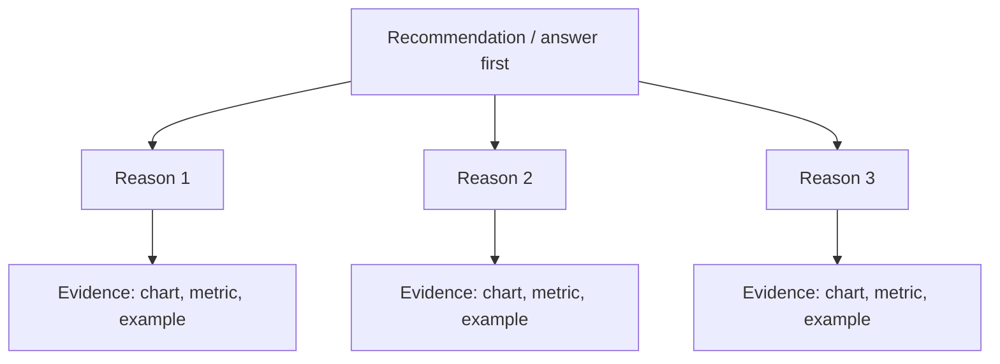

# M9 — Instructor Guide: Final Project & Oral Defense
> 90-minute launch session + independent project time | Dataset: student's choice
> **Major oral checkpoint — full defense**

---

## Learning Objectives

By end of session (launch), students can:
1. Frame a data science problem using the CRISP-DM structure with a written brief
2. Establish a baseline model before building anything sophisticated
3. Apply the Pyramid Principle to structure their final presentation
4. Write a genuine limitations section (not a formality)
5. Package their project as a reproducible, portfolio-ready GitHub artifact

---

## Session Structure

### Part A — Launch session (90 min)
| Time | Activity |
|------|----------|
| 0:00–0:15 | M8 debrief + project brief review: what makes a good question? |
| 0:15–0:35 | **L9.1** — Problem framing: CRISP-DM brief template walkthrough |
| 0:35–0:50 | **L9.2** — Baseline model: why you need one before anything else |
| 0:50–1:05 | **L9.5** — Pyramid Principle: presentation structure + slide template |
| 1:05–1:20 | **L9.8** — Portfolio structure: README, folder layout, git hygiene |
| 1:20–1:30 | Q&A + project selection sign-off (instructor approves dataset) |

### Part B — Independent work (scheduled over following days)
Students work independently. AI use follows `prompts.md` templates. All interactions logged in `AI_USE.md`.

### Part C — Oral defense (final session, 15 min per student)
Structured questions below.

---

## Key Concepts (with Lesson IDs)

### L9.1 — Problem framing before data `[Géron Ch2 p.40–55]`

#### Start with the decision, not the dataframe
Problem framing comes before data work because the real product of analysis is a better decision. A business team does not wake up wanting a confusion matrix; it wants to allocate budget, reduce risk, improve service, or choose between actions. If the decision is fuzzy, the modelling task will also be fuzzy.

Students often open the dataset too early because data feels concrete. Columns, missing values, and charts create the illusion of progress, but they can hide the fact that nobody has defined the question precisely enough to answer. The first disciplined move is to write down who will act on the result and what action they may take.

A useful test is to ask, “If this project succeeds, what will someone do differently on Monday?” If there is no specific action, the framing is not ready. In a capstone, that single question prevents weeks of exploratory wandering.

#### CRISP-DM Business Understanding sets the direction
In CRISP-DM, **Business Understanding** is the first phase because it determines whether the project should become classification, regression, forecasting, ranking, segmentation, or no model at all. The analyst starts by clarifying objectives, constraints, timelines, costs of errors, and what “useful” means to the stakeholder. This phase is strategy work, not paperwork.

A strong Business Understanding conversation usually covers four things: the decision to support, the audience for the output, the operational constraints, and the definition of success. For example, a hospital operations team may care more about missing a high-risk patient than about overall accuracy, while a finance team may care more about false positives that trigger costly reviews. Those differences change the modelling objective before any data cleaning begins.

For teaching, it helps to present Business Understanding as a translation exercise. Stakeholders speak in outcomes such as “reduce cancellations” or “prioritise outreach”; the analyst translates those goals into measurable targets and evaluation criteria. That translation is the bridge between a business question and a technically correct project.

#### Define the target, unit, and metric explicitly
Every framed problem needs three anchors: the **target**, the **unit of analysis**, and the **success metric**. The target is what you want to predict or estimate, the unit is the row that receives one prediction, and the metric is how you will judge success. If even one of these is vague, the project will drift.

Consider a churn project. The business question might be, “Which subscribers are likely to cancel next month?” A clear framing becomes: target = `churn_next_30_days`, unit = one subscriber-month, metric = recall at an operational threshold or a ranking metric if only the top-risk customers will be contacted. That version is far more actionable than the generic phrase “predict churn.”

An ASCII sketch can help students see the distinction:

```text
Business question:  Which subscribers need retention outreach?
Target:             churn_next_30_days (yes/no)
Unit:               one subscriber-month
Metric:             F1 or recall@k, depending on intervention capacity
```

#### Choose evaluation metrics before modelling
Evaluation belongs before modelling because metrics encode the trade-offs the project is allowed to make. Choosing the metric after seeing model results invites cherry-picking. A disciplined workflow names the score first, then trains models to optimise that score.

In classification, accuracy can be acceptable when classes are balanced and both error types are similarly costly, but many real projects need something else. If missed positives are expensive, recall may matter more; if precision and recall both matter, the inline expression `$F_1 = 2 \cdot \frac{\text{precision}\cdot\text{recall}}{\text{precision}+\text{recall}}$` is often more honest than raw accuracy. In regression, MAE is easier to explain in business units, while RMSE penalises large errors more heavily.

$$
\text{Accuracy} = \frac{TP + TN}{TP + TN + FP + FN}, \qquad
\text{MAE} = \frac{1}{n}\sum_{i=1}^{n}|y_i-\hat{y}_i|
$$

#### Ask five questions before opening the dataset
Before touching the data, students should answer five framing questions in writing. This short pause is one of the highest-value habits in applied data science because it catches ambiguity while the project is still cheap to change. It also creates a clean record of intent for the capstone.

The five questions are: **(1)** What decision will this analysis support? **(2)** Who is the stakeholder or end user? **(3)** What is the target and what counts as one unit? **(4)** Which metric will determine success, and why? **(5)** What action will be taken if the result is strong enough? If students cannot answer one of these, they are not ready to model.

These questions are not bureaucracy; they are scope control. They expose when a project is really descriptive rather than predictive, when the target is unavailable at decision time, or when a metric does not match the operational use case. Answering them first saves time precisely because it slows the project down at the right moment.

#### From business question to modelling objective
A useful teaching pattern is to show how a messy business question becomes a precise modelling objective through deliberate refinement. The analyst does not jump straight from “we have late deliveries” to a model; they pass through stakeholder language, operational decisions, target definition, and metric choice. This sequence turns curiosity into a valid analytical task.

```mermaid
flowchart LR
    A[Business question\n"How can we reduce late deliveries?"] --> B[Decision\nPrioritise orders for intervention]
    B --> C[Target\nlate_delivery_within_48h]
    C --> D[Unit\none order]
    D --> E[Metric\nRecall at chosen review capacity]
    E --> F[Modelling objective\nBinary classification + threshold policy]
```

Worked step by step, the refinement looks like this: first identify the action, such as manually reviewing risky orders; next define the time horizon, such as “late within 48 hours”; then define the unit, such as one order at dispatch time; finally choose the metric that matches review capacity. Sometimes the final answer is not a predictive model at all. A rules-based score or dashboard may be the correct outcome, and good framing makes that visible early.

#### Use a capstone problem statement template
The capstone should require a one-paragraph problem statement before any EDA appears. That paragraph forces the student to commit to scope, audience, and success criteria. It also gives instructors a fast way to assess whether the project is headed toward a coherent deliverable.

A practical template is:

```text
Problem statement template
We are helping [stakeholder] make the decision of [decision].
The analytical objective is to [predict / estimate / rank / describe] [target].
Each row represents [unit of analysis].
Success will be measured with [metric] because [business reason].
If the project succeeds, the stakeholder will use the result to [action].
Key constraints include [timing, fairness, cost, data availability].
```

A filled version might say that a city transit team wants to predict bus delays over 10 minutes for each route-stop-hour, measured with recall because dispatchers can only intervene on the highest-risk cases. That is already a far stronger project brief than “analyse public transport delays.” Once this paragraph is approved, the student has a contract for the rest of the capstone.

#### Common Mistakes
Problem framing usually fails in predictable ways. Students rarely fail because they cannot code; they fail because they start coding before the question is stable enough. Naming those traps explicitly helps them slow down before the expensive part of the project begins.

Common mistakes include:
- Starting with “what data do I have?” instead of “what decision matters?”
- Defining a target that would not be known at prediction time, causing leakage
- Choosing accuracy by habit without checking class balance or error costs
- Mixing units of analysis, such as using customer features with transaction-level labels
- Writing a problem statement with no stakeholder, no action, or no clear success metric

The repair strategy is simple: restate the decision, rewrite the target-unit-metric trio, and confirm the metric before modelling. Good framing is iterative, but the iteration should happen on the question first, not on increasingly elaborate notebooks.

#### Practice Questions
Students learn framing best when they rehearse it in plain language. Practice should therefore focus less on algorithms and more on translation: from stakeholder goals to analytical objectives. A good answer is short, specific, and operational.

Practice with prompts such as:
1. Turn “reduce employee attrition” into a target, unit, and metric.
2. Explain why a fraud team might prefer recall, precision, or both.
3. Rewrite a vague question like “study housing data” into a capstone-ready problem statement.
4. List the five questions you would answer before opening a retail dataset.
5. Give an example of a business question that should **not** become a predictive model.

When reviewing responses, look for whether the student identified a real stakeholder, a measurable target, and a metric tied to an action. If those three pieces are present, the project is usually ready to move into data understanding.
### L9.2 — Baseline model `[Géron Ch2 p.95–105]`

#### Why baselines are non-negotiable
A baseline is the minimum standard a project must beat to justify complexity. Without it, a student can present a model score that sounds respectable while hiding the fact that a trivial rule would do just as well. Baselines are therefore not optional polish; they are the control condition for the whole modelling story.

This matters even more in capstones because students often remember the final score but forget the context around that score. Saying “my classifier reached 0.84 accuracy” tells us very little on its own. If the majority class already occurs 84% of the time, the model may have added zero value.

The baseline also sharpens judgment. If a sophisticated pipeline barely improves on a dummy strategy, the correct conclusion may be “the problem is hard” or “the features are weak,” not “add more tuning.” That kind of restraint is a professional skill.

#### Classification baselines with `DummyClassifier`
For classification, `DummyClassifier` gives explicit trivial strategies that students can and should report. `strategy='most_frequent'` always predicts the majority class, `strategy='stratified'` samples classes according to the observed training distribution, and `strategy='uniform'` predicts classes at random with equal probability. Each tells a slightly different story about what “doing nothing smart” looks like.

The `most_frequent` strategy is usually the first benchmark because it reveals how deceptive imbalance can be. If 90% of cases belong to class 0, then a model can reach 90% accuracy while being useless for detecting class 1. In that setting, the expected baseline accuracy is simply `$\max_c P(Y=c)$`.

`stratified` and `uniform` are valuable when the chosen metric is not accuracy alone. They show whether a model is learning anything beyond class prevalence or random guessing. In multiclass settings, especially with uneven labels, those comparisons stop students from overstating weak performance.

#### Regression baselines with `DummyRegressor`
For regression, the two essential dummy strategies are `mean` and `median`. The mean baseline predicts the average target value for every row, while the median baseline predicts the median for every row. These are not arbitrary defaults: they align with common loss functions.

When the evaluation metric is squared error or RMSE, the mean is the natural benchmark because it minimises average squared loss. When the project is judged with absolute error or MAE, the median is often more appropriate because it is more robust to outliers. The baseline should match the metric instead of being chosen by habit.

$$
\hat{y}_{\text{mean}} = \frac{1}{n}\sum_{i=1}^{n} y_i,
\qquad
\hat{y}_{\text{median}} = \operatorname{median}(y_1,\dots,y_n)
$$

#### Full baseline comparison for classification
A proper classification report should compare a real model against at least one dummy model using the same cross-validation scheme and the same scoring metric. That makes the comparison fair. The code below assumes `X` and `y` are already prepared and focuses on the evaluation pattern students should reuse in capstones.

The important teaching point is that the baseline and the candidate model must share the same folds. Otherwise, differences in score may come from different splits rather than from the model itself. Using a common `StratifiedKFold` object keeps the benchmark honest.

```python
from sklearn.dummy import DummyClassifier
from sklearn.linear_model import LogisticRegression
from sklearn.model_selection import StratifiedKFold, cross_val_score
from sklearn.pipeline import Pipeline
from sklearn.preprocessing import StandardScaler
import pandas as pd

# Reuse the same CV splitter for every model so scores are comparable.
cv = StratifiedKFold(n_splits=5, shuffle=True, random_state=42)

baseline_models = {
    "dummy_most_frequent": DummyClassifier(strategy="most_frequent"),
    "dummy_stratified": DummyClassifier(strategy="stratified", random_state=42),
    "dummy_uniform": DummyClassifier(strategy="uniform", random_state=42),
    "logistic_regression": Pipeline(
        steps=[
            ("scale", StandardScaler()),          # Standardise numeric columns for LR stability.
            ("model", LogisticRegression(max_iter=1000, random_state=42)),
        ]
    ),
}

rows = []
for model_name, model in baseline_models.items():
    scores = cross_val_score(
        model,
        X,
        y,
        cv=cv,
        scoring="f1",                           # Match the score to the problem definition.
        n_jobs=None,
    )
    rows.append(
        {
            "model": model_name,
            "mean_f1": scores.mean(),          # Central tendency across folds.
            "std_f1": scores.std(ddof=1),      # Variation across folds matters for interpretation.
        }
    )

results = pd.DataFrame(rows).sort_values("mean_f1", ascending=False)
print(results)
```

If logistic regression scores `0.61` mean `$F_1$` and the best dummy reaches `0.42`, then the model has demonstrated real value. If the gap is tiny, the lesson is still useful: the student has discovered that their features or framing are not yet strong enough.

#### Full baseline comparison for regression
Regression deserves the same discipline. Students should compare their predictive model against both mean and median baselines when appropriate, especially if the target distribution is skewed. That comparison tells them whether the model is learning structure or merely reproducing the central tendency of the target.

Again, keep the folds fixed across models and report the same metric for each. The example below uses negative MAE because `cross_val_score` follows the “higher is better” convention for scorers, but the final report should convert it back into positive MAE for humans.

```python
from sklearn.dummy import DummyRegressor
from sklearn.ensemble import RandomForestRegressor
from sklearn.model_selection import KFold, cross_val_score
import pandas as pd

cv = KFold(n_splits=5, shuffle=True, random_state=42)

regression_models = {
    "dummy_mean": DummyRegressor(strategy="mean"),
    "dummy_median": DummyRegressor(strategy="median"),
    "random_forest": RandomForestRegressor(
        n_estimators=300,
        random_state=42,
        min_samples_leaf=2,
    ),
}

rows = []
for model_name, model in regression_models.items():
    scores = cross_val_score(
        model,
        X,
        y,
        cv=cv,
        scoring="neg_mean_absolute_error",      # scikit-learn returns negative values here.
        n_jobs=None,
    )
    mae_scores = -scores                         # Flip sign so lower MAE is easier to read.
    rows.append(
        {
            "model": model_name,
            "mean_mae": mae_scores.mean(),
            "std_mae": mae_scores.std(ddof=1),
        }
    )

results = pd.DataFrame(rows).sort_values("mean_mae", ascending=True)
print(results)
```

Suppose the median dummy gives an MAE of `12.4` and the random forest gives `8.9`. That is a meaningful improvement because the model reduces average error in the same units the stakeholder cares about. The dummy has done its job by making the win legible.

#### Report improvement over baseline clearly
Students should not stop at listing two scores. They should explicitly state the absolute gap and, when appropriate, the relative improvement over baseline. This makes the value of modelling visible to a non-technical audience.

For metrics where **higher is better**, such as `$F_1$`, precision, recall, or accuracy, use `$\Delta = s_{model} - s_{baseline}$`. For metrics where **lower is better**, such as MAE or RMSE, a common relative improvement is shown below.

$$
\text{Relative improvement} = \frac{s_{baseline} - s_{model}}{s_{baseline}} \times 100\%
$$

A strong sentence sounds like this: “Our final model achieved an MAE of 8.9 versus 12.4 for the median baseline, a 28.2% reduction in average absolute error.” That is much more informative than “the model performed well.” The baseline gives the claim a reference point.

#### Common Mistakes
Baseline errors are usually conceptual rather than syntactic. Students may know how to import the dummy estimator but still misuse it in ways that make the comparison misleading. The fix is to treat the baseline as part of the experimental design, not as an afterthought.

Common mistakes include:
- Reporting only the final model score with no dummy benchmark
- Comparing models with different cross-validation splits
- Using accuracy on a severely imbalanced problem and claiming success too early
- Forgetting that `neg_mean_absolute_error` must be sign-flipped before interpretation
- Declaring victory over the wrong baseline, such as comparing RMSE against a median baseline without explaining why

A good habit is to place baseline results in the first row of every score table. That formatting choice reminds both the student and the reader that all later claims are relative claims.

#### Practice Questions
The best practice questions force students to choose a baseline on purpose instead of by reflex. They should be able to justify both the dummy strategy and the evaluation metric in one or two sentences. If they cannot, the modelling plan is still weak.

Try these prompts:
1. When would `DummyClassifier(strategy="most_frequent")` look deceptively strong?
2. Why might `DummyClassifier(strategy="stratified")` be a better comparison than `uniform` in a multiclass setting?
3. For a house-price model evaluated with MAE, why is a median baseline worth reporting?
4. Given a baseline `$F_1$` of `0.37` and a model `$F_1$` of `0.55`, write one clear reporting sentence.
5. Explain why using different CV folds for the baseline and final model weakens the conclusion.

Strong answers will connect the baseline choice to the problem definition, not merely repeat library names. That connection is what turns a modelling exercise into a defensible analytical claim.
### L9.5 — Pyramid Principle for data storytelling `[Expert]`

#### What the Pyramid Principle asks you to do
The Pyramid Principle asks the communicator to lead with the answer, not the journey. Instead of walking an audience through every cleaning step and modelling decision, you begin with the main conclusion and then support it with grouped evidence. The audience should understand the headline before it sees the details.

This feels unnatural to many analysts because notebooks are built chronologically. We usually discover the answer at the end, so we are tempted to present the work in that same order. But presentation order and discovery order are not the same thing.

In practice, the pyramid gives decision-makers a fast route to meaning. They hear the answer, then the reasons, then the supporting facts. If they only remember the top of the pyramid, they still leave with the right message.

#### Why data science often gets the story backwards
Data science presentations frequently mirror the workflow: data collection, cleaning, feature engineering, model selection, evaluation, and finally conclusions. That sequence is faithful to the process, but it is often terrible for persuasion. By the time the audience reaches the point, their attention is already depleted.

This reversal happens because analysts want to prove rigor. They worry that leading with the conclusion will sound oversimplified, so they try to earn the right to state it by showing every intermediate step. The result is usually a presentation that is technically thorough and strategically weak.

A better approach is to separate **evidence order** from **thinking order**. You may have discovered the result last, but the audience needs it first so that everything else has a frame. That is why strong executive summaries feel shorter and clearer than long notebook tours.

#### Build the Minto pyramid deliberately
Barbara Minto's pyramid structure can be taught as three layers: the governing thought at the top, grouped reasons beneath it, and evidence beneath each reason. The top answer must be specific enough to act on. The middle layer should contain mutually distinct supporting ideas rather than a random list of observations.

Students often improve immediately when they force themselves to ask, “What is my one-sentence answer?” Once that sentence exists, the rest of the talk becomes an organising problem rather than a dumping problem. Each supporting branch must help the audience believe the main claim.

An ASCII sketch makes the shape visible:

```text
Main answer
├── Reason 1
│   └── Evidence
├── Reason 2
│   └── Evidence
└── Reason 3
    └── Evidence
```

#### Use SCR to create movement
A practical way to turn the pyramid into a spoken story is **Situation–Complication–Resolution (SCR)**. The situation tells the audience where things stand, the complication introduces the tension or problem, and the resolution delivers the answer. SCR gives the talk momentum instead of making it feel like a static report.

For example, imagine a capstone on subscription churn. The **situation** is that cancellations are rising in the first 60 days. The **complication** is that retention resources are limited and current outreach is poorly targeted. The **resolution** is that early inactivity and support delays identify a small segment where intervention is most valuable.

Teaching SCR helps students avoid dumping facts without narrative purpose. Every chart should serve one of those three jobs. If a slide does not clarify the situation, sharpen the complication, or support the resolution, it probably belongs in backup material.

#### A pyramid diagram for data storytelling
The power of the pyramid is that it visually forces hierarchy. Not every detail deserves equal space on the main path of the presentation. The diagram below shows how a capstone message should narrow toward one recommendation instead of spreading into ten unrelated findings.



A strong exercise is to take an existing notebook and map each chart to the pyramid. Students quickly notice that many slides are evidence without a governing thought. Once the hierarchy is visible, the story becomes easier to prune and much easier to remember.

#### Structure the capstone presentation around the audience
For the capstone, a reliable order is: headline finding, why it matters, supporting evidence, method summary, limitations, and next action. This sequence respects the audience's need for clarity while still showing analytical rigor. It also aligns naturally with the pyramid because the answer appears before the detail.

A worked example helps. Suppose the capstone found that repeat support tickets are concentrated in one product line and one response window. The opening slide should say exactly that; the next slides should show evidence, then briefly explain how the analysis was done, then acknowledge limitations, and finally state what the team should test next.

Students often fear that a short method section looks unserious. In reality, concision signals confidence. If the answer is clear and the evidence is well chosen, the audience will trust the rigor more than if the talk begins with twenty minutes of preprocessing.

#### Keep one slide to one idea
“One slide, one idea” is the operational rule that makes the pyramid visible on screen. A slide is not a storage bin for everything discovered in a notebook cell. It should communicate one takeaway that a reader can repeat after three seconds of attention.

This rule affects titles as much as visuals. A title like “Regional analysis” is merely a label, while a title like “Late deliveries cluster in the North and East regions” is a claim. The second title already tells the audience what to notice before they inspect the chart.

When students cut a crowded slide into two or three smaller claims, the presentation usually becomes stronger immediately. The audience stops decoding and starts understanding. In a capstone, clarity of sequence is often more persuasive than the number of charts.

#### Common Mistakes
Most storytelling problems come from over-attachment to the analysis process. Students try to be comprehensive, but the audience experiences that comprehensiveness as drift. Good storytelling is selective because the goal is understanding, not archival completeness.

Common mistakes include:
- Opening with methodology before stating the conclusion
- Using slide titles as topics instead of as takeaways
- Putting several unrelated insights on one slide
- Presenting charts in notebook order rather than narrative order
- Listing observations without grouping them into a small number of reasons

The fix is to rewrite the talk from the top down. Start with the answer, group supporting reasons, and demote everything else to appendix material unless it changes the decision.

#### Practice Questions
Students improve fastest when they practice restructuring weak stories into strong ones. The goal is not to decorate slides; it is to change the order of thinking that the audience experiences. That is why short rewriting exercises are more useful than generic presentation tips.

Try these prompts:
1. Convert a notebook-style agenda into a pyramid-style agenda.
2. Write an SCR story for a project on hospital readmissions.
3. Rewrite three vague slide titles so each states a takeaway.
4. Given five findings, group them into two or three supporting reasons under one main answer.
5. Explain why a detailed methods slide might belong later in the deck.

Look for answers that show hierarchy, not just summary. A student who can identify the governing thought and arrange evidence beneath it is ready to tell a capstone story that decision-makers will actually follow.
### L9.6 — Limitations section `[Expert]` ⚠️ [AI-OFF]

#### Why a limitations section is required
A limitations section is required because every analysis is bounded by what the data covers, what the method assumes, and what the project could reasonably test. Writing those bounds explicitly is part of responsible communication. It tells the reader where confidence is warranted and where caution should take over.

In capstone work, limitations also demonstrate maturity. Anyone can write as if their results are universal; stronger analysts show that they understand the edge of their own evidence. That honesty does not weaken the project. It makes the claims believable.

The key teaching point is that limitations are part of the result, not an apology added at the end. A model score without scope is incomplete. A conclusion with boundaries is more useful than a stronger-looking conclusion that hides uncertainty.

#### Limitations protect the quality of decisions
Decision-makers do not merely need a result; they need to know whether that result applies to their situation. A limitations section gives them the context needed to use the work safely. Without it, a reader may generalise beyond the sample, trust a model in the wrong population, or assume causal meaning where only association was shown.

This is why limitations are operational, not ceremonial. A project trained on one year of data during unusual market conditions may still be useful, but only if the reader understands that the environment was atypical. The limitation tells them how cautiously to extend the finding.

Even numerical precision does not remove the need for prose judgment. A narrow interval or a strong metric can still sit on top of biased coverage. More data can reduce noise because `$SE \propto 1/\sqrt{n}$`, but larger samples do not automatically fix missing populations, label problems, or measurement bias.

#### Know the main types of limitations
Students should learn to recognise several recurring categories of limitation. The most common are **data coverage**, **measurement quality**, **modelling assumptions**, **generalisation boundaries**, and **ethical or operational constraints**. These categories help turn vague unease into specific writing.

A data coverage limitation might note that the dataset includes only customers who already use the mobile app. A measurement limitation might explain that the target is a proxy rather than a direct measure of the outcome of interest. A modelling limitation might state that a linear model cannot represent important nonlinear effects without additional features.

A strong limitation names both the boundary and its consequence. Instead of writing “the data is limited,” write that rural clinics are absent, so performance in rural settings remains untested. That second version tells the reader exactly what should not be assumed.

#### A limitation is different from a failure
Students sometimes avoid writing limitations because they think doing so admits the project failed. That is a misunderstanding. A limitation says, “Here is where this evidence stops.” A failure says, “The work did not support a usable conclusion.” Those are not the same thing.

For example, a churn model trained on one telecom market may still be useful for prioritising outreach in that market. Its limitation is that transfer to another country or pricing regime is untested. The project has not failed; it has a defined scope.

This distinction matters because analysts should not be punished for honest boundaries. In fact, a project that claims too much is weaker than a project that claims the right amount. The right question is not “Did you remove every limitation?” but “Did you make the important ones visible?”

#### What not to write in a limitations section
Weak limitations are usually either empty or defensive. Empty statements sound like “more time would improve the project” or “the model is not perfect.” Defensive statements try to pre-excuse criticism without saying anything testable. Neither helps the reader.

Students should also avoid hiding future work inside vague language. Saying “future work could explore more features” tells us almost nothing. A limitation should be concrete enough that another analyst could design a next step from it.

Another common mistake is repeating generic truths that apply to every project. Of course all datasets contain some noise and all models can improve. The limitation section should focus on the specific boundaries that meaningfully affect interpretation in this project.

#### Before and after: vague versus specific writing
The difference between weak and strong limitations is usually specificity. A vague statement signals that the writer knows a limitations section is expected but has not thought through the implications. A specific statement shows that the writer understands both the evidence and the risk of over-claiming.

Before: “The model could be improved with more data.”

After: “The training data covers urban deliveries only, so the model's error rate for rural routes is unknown. Collecting rural-route observations is the highest-priority next step before operational deployment outside cities.”

The second version is better because it identifies the missing segment, the exact uncertainty it creates, and the action needed to reduce that uncertainty. That is the standard students should aim for in capstone writing.

#### Write limitations as boundary, consequence, next step
A dependable structure for the capstone limitations section is: **boundary → consequence → next step**. First name the limit, then explain what interpretation it restricts, then state the most relevant follow-up. This produces writing that is concise, specific, and useful.

For example, a fair limitation paragraph might say that labels were derived from support tickets, so unresolved complaints outside the ticket system are invisible. The consequence is that the target may undercount dissatisfaction among silent users. The next step is to join survey or cancellation data to test how large that blind spot is.

This structure also prevents limitations from becoming a random list. Each item earns its place because it changes what the reader should conclude. In a capstone, two or three sharp limitations are far stronger than a page of generic hedging.

#### Common Mistakes
Limitation writing goes wrong when students confuse honesty with self-sabotage or vagueness with caution. The section should be precise, proportionate, and tied to interpretation. Readers should finish it knowing exactly what the findings do and do not support.

Common mistakes include:
- Writing generic lines such as “the model is not perfect”
- Treating every challenge encountered during the project as a limitation worth reporting
- Confusing a bounded scope with total project failure
- Naming a limitation without explaining its consequence for interpretation
- Listing “future work” ideas that are unrelated to the most important risks

A useful revision trick is to underline every noun in the section. If the nouns are generic words like “data,” “model,” and “project” with no concrete qualifiers, the writing is probably still too vague.

#### Practice Questions
Students should practice turning fuzzy caveats into specific, reader-facing statements. The goal is to produce limitations that change how the work should be used, not just how it should be graded. That requires careful attention to scope, assumptions, and consequence.

Try these prompts:
1. Rewrite “the dataset is limited” into a specific limitation with consequence and next step.
2. Give one example of a data coverage limitation and one example of a modelling limitation.
3. Explain why “the project needs more time” is usually a weak limitation statement.
4. Distinguish a limitation from a failure using a forecasting example.
5. Write a three-sentence limitation paragraph for a project trained only on 2023 data.

Strong answers will identify the exact boundary, state what cannot be concluded, and suggest a realistic follow-up. That is the habit students need for honest capstone communication.
### L9.4 — Reproducibility as the final deliverable `[Expert]`

#### Reproducibility is the real submission standard
In a capstone, the final deliverable is not merely a notebook that looks polished on the author's laptop. The real standard is that another person can rerun the work and recover the same logic and materially the same results. If that cannot happen, the analysis is unfinished.

This idea changes how students should think about “done.” A project is not done when the last chart renders; it is done when the workflow survives a clean restart, a new machine, and a skeptical reader. Reproducibility is therefore a quality criterion, not an optional extra.

A compact way to express the expectation is that the same data, code, configuration, and seed should reproduce the same result: `$f(\text{data}, \text{code}, \text{env}, \text{seed}) \rightarrow \text{result}$`. When one of those ingredients is undocumented or hidden in notebook state, the chain breaks.

#### Use a reproducibility checklist, not memory
Students should work from a checklist because reproducibility failures are often boring details rather than dramatic bugs. Relative paths, pinned package versions, fixed random seeds, documented run order, and declared inputs sound mundane, but they are exactly what allows somebody else to trust the project. Professionals rely on standards because memory is not reliable enough.

A strong minimal checklist includes: project structure that is easy to navigate, a clear README, environment specification, fixed seeds, no hidden manual steps, and instructions for recreating derived files. It should also state what outputs are expected after a successful run so the grader or collaborator knows what “correct” looks like.

$$
\text{Same data} + \text{same code} + \text{same environment} + \text{same seed} \Rightarrow \text{same outcome}
$$

#### Add a reproducibility header to the notebook or script
One practical habit is to begin the main notebook with a reproducibility header cell. That cell records versions, fixes seeds, sets display options, and establishes relative paths from the repository root. It makes hidden assumptions visible before any analysis starts.

This header is useful not because it is fancy, but because it standardises the environment at the top of the workflow. Students who add it early catch path problems and seed drift before those problems infect the rest of the notebook.

```python
# Reproducibility header for the first notebook cell
from pathlib import Path
import os
import random
import numpy as np
import pandas as pd
import sklearn

SEED = 42
random.seed(SEED)                  # Python's built-in random module
np.random.seed(SEED)               # NumPy random state
os.environ["PYTHONHASHSEED"] = str(SEED)  # Stabilise hash-dependent ordering where possible

PROJECT_ROOT = Path.cwd()          # Assumes notebook is launched from the repo root
DATA_DIR = PROJECT_ROOT / "data"
OUTPUT_DIR = PROJECT_ROOT / "outputs"
OUTPUT_DIR.mkdir(exist_ok=True)    # Create outputs folder if it does not already exist

print({
    "python_hash_seed": os.environ["PYTHONHASHSEED"],
    "pandas": pd.__version__,
    "sklearn": sklearn.__version__,
    "project_root": str(PROJECT_ROOT),
    "data_dir_exists": DATA_DIR.exists(),
})
```

If a student cannot explain every line of this header, that is already a useful teaching moment. Reproducibility improves when setup is explicit rather than magical.

#### Validate that the notebook can be rerun from a clean kernel
A professional workflow does not assume rerunnability; it tests it. One straightforward validation step is to execute the notebook programmatically in a fresh kernel and fail loudly if any cell errors. This catches hidden state, missing imports, and broken file paths before submission.

The function below uses `nbformat` and `nbclient` to run a notebook from start to finish. It is intentionally simple so that students can adapt it to their own repository without needing a large testing framework.

```python
from pathlib import Path
import nbformat
from nbclient import NotebookClient
from nbclient.exceptions import CellExecutionError


def validate_notebook_rerun(notebook_path: str, timeout: int = 600) -> bool:
    """Execute a notebook in a fresh kernel and return True only if every cell succeeds."""
    nb_path = Path(notebook_path)
    with nb_path.open("r", encoding="utf-8") as fh:
        nb = nbformat.read(fh, as_version=4)

    client = NotebookClient(
        nb,
        timeout=timeout,
        kernel_name="python3",
    )

    try:
        client.execute()  # Run cells in order with no hidden state from a prior session.
    except CellExecutionError as exc:
        print(f"Notebook rerun failed: {exc}")
        return False

    print(f"Notebook rerun succeeded: {nb_path}")
    return True
```

This kind of check belongs near the end of the project, but it works best if students run it before they think they are finished. Reproducibility is much easier to maintain continuously than to reconstruct in a panic the night before submission.

#### Test the full deliverable, not just isolated cells
Reproducibility testing should be systematic. The cleanest sequence is: restart kernel, clear hidden state, run all cells, inspect regenerated outputs, and compare those outputs to the written claims in the README or slide deck. If the conclusions cannot be regenerated, the deliverable is not yet stable.

Students should also test the project from the perspective of a new collaborator. That means following the README exactly, without relying on memory, cached files, or manual cell order. Any step that “everyone just knows” is a step that will fail in handoff.

A helpful classroom standard is to require one final run-through after all edits are complete. Last-minute changes are a common source of broken notebooks because narrative text gets updated but the executable workflow does not. Final verification closes that gap.

#### Reproducibility is professionally relevant
Industry teams care about reproducibility because work moves between people, systems, and time periods. A project may be reviewed by a teammate, rerun during an incident, or adapted months later by someone who did not build it. Reproducibility lowers the cost of all of those situations.

It also protects credibility. If a stakeholder asks where a number came from, the team should be able to regenerate it instead of hoping the old notebook output is still lying around. That expectation is normal in serious analytical environments.

Seen this way, reproducibility is not just for grading. It supports collaboration, auditability, debugging, deployment, and trust. Students who practise it in capstones are learning a habit that scales directly into professional work.

#### Worked handoff example
Imagine a student predicts apartment rents and reports that location and square footage dominate the model. The project looks polished, but a teammate cannot rerun it because one CSV path points to a desktop folder and the notebook depends on cells being executed out of order. The analysis may still be insightful, yet the deliverable is not usable.

Now imagine the same project after a reproducibility pass. Paths are relative, the environment is pinned, the notebook starts with a setup cell, the README states the run order, and a rerun check passes. The insight has not changed, but the value of the project has increased dramatically because someone else can trust and extend it.

That contrast is worth making explicit in class. Reproducibility often feels invisible when it works, which is precisely why students underestimate it. The handoff example shows that it is the difference between personal work and shareable work.

#### Common Mistakes
Reproducibility breaks most often through hidden assumptions. Students know the workflow on their own machine so well that they stop seeing the undocumented steps. The result is a notebook that looks complete but behaves like a private script.

Common mistakes include:
- Using absolute local paths instead of repository-relative paths
- Forgetting to fix seeds for data splits or stochastic models
- Depending on notebook state created by running cells out of order
- Omitting environment details needed to recreate the package setup
- Updating conclusions after a local run without verifying a fresh rerun

The cure is routine, not heroics: use a checklist, test a clean execution, and read the project as if you had never seen it before. If a stranger can rerun it, the capstone is genuinely finished.

#### Practice Questions
Students should practise thinking about reproducibility as a user experience problem. The question is not only “Does my code run?” but also “Can another person run it without me in the room?” That shift in perspective is what turns technique into professional habit.

Try these prompts:
1. Why are relative paths safer than absolute paths in a shared repository?
2. What problem does a fixed random seed solve, and what problem does it **not** solve?
3. List five items you would include in a reproducibility checklist for a capstone.
4. Explain how you would test that a notebook can be rerun from a clean kernel.
5. Describe one way reproducibility affects trust in a workplace setting.

Strong answers will mention environment, paths, seeds, run order, and explicit validation. Those are the building blocks of a final deliverable that others can actually use.
### L9.8 — Portfolio mindset `[Expert]`

#### Treat the capstone as a portfolio asset
A capstone should be built as a portfolio asset, not as a disposable assignment. Once the course ends, the repository may still represent the student in job searches, networking conversations, and interviews. That means the work must make sense to someone who never saw the class instructions.

This shift in mindset changes priorities. A grade-focused project can survive on instructor context and informal explanations, but a portfolio project has to stand on its own. The problem, method, findings, and limitations must be visible to an outside reader within a few minutes.

Students do not need a perfect or world-changing project to benefit from this approach. They need a project that is coherent, finished, and easy to understand. Employers often respond more strongly to clarity and ownership than to inflated technical ambition.

#### Your GitHub profile functions like a CV
A GitHub profile acts like a living CV because it shows evidence instead of only claims. Recruiters and hiring managers can see whether repositories are organised, whether README files explain the work, whether commits look intentional, and whether the student can finish what they start. The profile communicates professionalism before any interview begins.

This does not mean every repository must be elaborate. It means the visible projects should be deliberate. A well-structured capstone with a clear narrative often says more than several half-finished experiments.

Students should therefore curate their public work with the same care they would apply to a written resume. Repository names, pinned projects, profile summaries, and documentation all contribute to the impression of readiness. GitHub is not just storage; it is presentation.

#### Know what makes a README excellent
A great README does four jobs quickly: it tells the reader what the project is about, why it matters, how the work was done, and how to run it. If any of those jobs are missing, the reader must guess. Guessing is costly because most portfolio readers give a project only a short first pass.

The README should foreground the problem statement and the key finding, not bury them after setup details. Technical readers can always scroll down to the implementation sections. What they need first is a reason to care.

Strong README writing is also concrete. Instead of “analysed a dataset using machine learning,” say what was predicted, on what unit, for what audience, and what result was achieved relative to a baseline. Specificity is memorable; generic competence claims are not.

#### Build a story arc from question to impact
Portfolio projects are easier to remember when they follow a clear story arc. A simple pattern is: problem, motivation, data, approach, result, limitation, next step. This arc helps the reader understand not only what was done but also why the work mattered.

Students often weaken their portfolio by presenting the project as a collection of techniques. Tools matter, but they are not the story. The story is the movement from a real question to a justified conclusion.

A helpful check is to ask whether someone could summarise the project in three sentences after reading the README. If they can explain the question, the main result, and the implication, the story arc is doing its job.

#### Choose a dataset you can defend and discuss
Dataset choice matters because interviews often become conversations about judgment. A student who chose the data only because it was conveniently clean may struggle to discuss motivation, limitations, and trade-offs. A student with genuine curiosity usually explains the project with more energy and more depth.

This does not mean the dataset must be exotic. It means the student should be able to explain why the question is interesting, why the data is suitable enough to begin, and what the main weaknesses are. Those explanations often matter more than squeezing out one extra point of model performance.

A practical rule is to prefer datasets that allow a full story: a meaningful question, interpretable variables, a workable unit of analysis, and an audience that could plausibly use the result. If the data is impossible to explain or obviously unrelated to the student's interests, it is harder to turn into a strong portfolio piece.

#### Use a README template that tells the story
Templates are useful because they prevent students from forgetting the reader's basic questions. A good template does not make projects sound generic; it creates space for the student to be specific in the right places. That is especially valuable when the capstone is being polished under time pressure.

The template below emphasises the same arc employers care about: context, analytical objective, method, results, reproducibility, and contact point. Students should adapt the wording to their project, but they should keep the reader-facing structure.

````markdown
# Project Title

## Overview
One paragraph explaining the real-world problem, the stakeholder, and why the project matters.

## Analytical Objective
- Target:
- Unit of analysis:
- Primary metric:
- Baseline used for comparison:

## Dataset
- Source:
- Time period:
- Number of rows / columns:
- Important caveats or exclusions:

## Method
1. Data cleaning and validation
2. Exploratory analysis
3. Feature engineering
4. Baseline model
5. Final model or analytical approach

## Key Findings
- Finding 1:
- Finding 2:
- Finding 3:

## Limitations
- Limitation 1:
- Limitation 2:
- Limitation 3:

## How to Reproduce
```bash
python -m venv .venv
source .venv/bin/activate
pip install -r requirements.txt
jupyter notebook
```

## Repository Structure
```text
README.md
notebooks/
src/
data/
outputs/
```
````

A template is only the starting point. The finished README should still sound like this specific project by naming the stakeholder, baseline, data caveats, and the main recommendation in plain language.

#### Polish the repository for fast reading
A portfolio repository should reward a quick skim. That means predictable folders, meaningful filenames, visible outputs, and a short path from landing on the repository to understanding the result. Readers should not have to reverse-engineer the project layout.

An ASCII tree can help students think about presentation:

```text
project-root/
├── README.md
├── data/
├── notebooks/
├── src/
├── outputs/
└── environment.yml
```

This structure works because it separates raw material, analysis, reusable code, and generated outputs. Even simple organisational choices like this make a project look more trustworthy and easier to navigate, which directly supports the portfolio goal.

#### Common Mistakes
Portfolio thinking breaks down when students design only for grading. The project may satisfy the rubric while still being hard for an outsider to understand. A good portfolio piece respects the reader's limited time and limited context.

Common mistakes include:
- Treating the repository like a submission folder instead of a public-facing project
- Writing a README that describes tools but not the problem or the result
- Choosing a dataset solely because it is easy, then struggling to discuss why it matters
- Leaving notebooks, outputs, and filenames in a confusing or inconsistent state
- Hiding the baseline, limitations, or reproducibility steps that make the work credible

The best fix is to review the repository as if you were a recruiter seeing it for the first time. If the value of the project is not obvious within a few minutes, more polishing is needed.

#### Practice Questions
Students should practise summarising the portfolio value of their work, not just the technical steps they performed. That habit makes project pages, interviews, and networking conversations much stronger. The goal is to communicate judgment, clarity, and ownership.

Try these prompts:
1. Write a two-sentence repository overview for a capstone you are proud of.
2. Explain why GitHub can function like a CV for technical roles.
3. List the five most important sections of a great README and why each matters.
4. Describe a dataset choice that would make a weak portfolio project and explain why.
5. Rewrite a tool-focused project description so that it follows a clear story arc.

Strong answers will connect presentation choices back to reader trust and career usefulness. That is the core of the portfolio mindset: build something that speaks for you when you are not in the room.
### Problem & data (3 min)
1. "State your question and your key finding in one sentence each."
2. "What is your baseline model performance, and does your analysis beat it?"

### Method (4 min)
3. "Walk me through your most important EDA finding. Show me the chart and tell me what it means."
4. "What was the most difficult cleaning decision you made? How did you justify it?"

### Critical thinking (5 min)
5. "What are the three main limitations of your analysis?"
6. "What would you do differently with 3 more months and twice the data?"
7. "If someone uses your findings to make a business decision, what are they risking?"

### AI use (3 min)
8. "Show me your `AI_USE.md`. Pick the most significant AI interaction and tell me: what did you ask, what did Gemma give you, and what did you change or reject?"
9. "Show me your [AI-OFF] cells. What do they contain, and why is it important that you wrote them yourself?"

---

## Common Misconceptions to Flag
- **"I'll add the limitations section last"** → Write it throughout the project as you discover constraints
- **"Reproducibility means adding a README"** → It means someone else can run your notebook cold and get the same results
- **"The oral defense is about showing you can code"** → It is about showing you understand what you did and why
