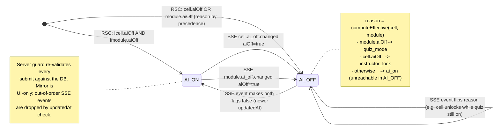

# ADR 005 — AI-OFF state machine: composition, races, and test matrix

**Status:** Accepted
**Date:** 2026-05-14
**Extends:** [ADR 003 — Server-authoritative AI-OFF state machine](003-ai-off-source-of-truth.md)

## Context

ADR 003 fixed the source of truth (two Postgres tables, SSE broadcast, server guard re-reads on every Gemma submit). It did not specify:

1. How **cell-level** AI-OFF composes with **module-level** AI-OFF (quiz mode).
2. What happens when an AI-OFF flip races an **in-flight Gemma stream**.
3. What happens when SSE delivers events **out of order** or the channel **disconnects**.
4. The **exhaustive branch set** that test coverage must hit (per working-agreement rule: "every new branch in the AI-OFF state machine must come with a test").

This ADR closes those gaps.

## Invariants protected

- **I1** — Server DB rows (`cell_state`, `module_state`) are the sole writers of AI-OFF state. (ADR 003.)
- **I2** — `server/guards/ai-off.ts` re-reads `cell_state` AND `module_state` on every Gemma submit. The cell-id stamped by the client is an *input*, not a *credential*.
- **I3** — Client mirror is read-only; updates arrive only via RSC hydration or SSE.
- **I4** — **Module supersedes cell.** If `module_state.aiOff = true`, every cell in that module is effectively AI-OFF regardless of its individual `cell_state.aiOff` value.
- **I5** — In-flight Gemma streams are gated per-chunk on the server. A flip to AI-OFF mid-stream **must** terminate the stream and **must** auto-write a `PromptRecord` with the interruption recorded (non-negotiable #2 — every Gemma response auto-writes).
- **I6** — Mirror updates are **monotonic in `updatedAt`**. An SSE event whose `updatedAt` is not strictly newer than the mirror's current value for that key is dropped.

## Decision

### Effective state (client mirror, derived; never persisted)

```ts
type EffectiveAIState =
  | { kind: 'ai_on' }
  | { kind: 'ai_off'; reason: AIOffReason };
```

`LOADING` from ADR 003 describes the *render pipeline before RSC hydration completes* — it is not an interactive client state. By the time any button is clickable, the mirror is populated from the RSC HTML snapshot. The client state machine therefore has two terminal states (`ai_on` / `ai_off`) and no `LOADING`. Mirror health is tracked orthogonally as `MirrorFreshness` (see types below).

### Reason precedence (when both flags are true)

Highest wins:

1. `quiz_mode` — `module_state.aiOff = true`
2. `instructor_lock` — `cell_state.aiOff = true` (only consulted when `module_state.aiOff = false`)
3. `circuit_breaker` — reserved for a system-level kill switch (out of scope for this ADR's transitions; the type space accommodates it for future use)

The precedence rule is captured in a single pure function (`computeEffective`, below) used by both the client reducer and the server guard, so the two cannot disagree on labelling.

### Mid-stream race policy (decision: option A)

When `module_state.aiOff` or `cell_state.aiOff` flips to `true` while a Gemma stream is open for that cell:

1. The streaming server endpoint closes the stream at the next chunk boundary.
2. A `PromptRecord` is auto-written with:
   - `decision: 'pending'` (per ADR 002 — auto-write at prompt time)
   - `interrupted: { kind: 'ai_off_mid_stream', reason, chunksReceived }`
   - `content` = the partial token stream received before termination
3. The student sees a banner explaining the cell was locked mid-response; the partial response remains visible in their prompt log (they cannot "forget" it — non-negotiable #2).

Rejected alternative (option B — drop the partial entirely): violates the spirit of "students cannot forget prompts; they only choose how to label them." Tokens reached the student's screen; pretending otherwise would corrupt the disclosure flow.

### Out-of-order SSE events

The mirror reducer compares incoming `updatedAt` against the value last applied for that `(cellId | moduleId)` key:

```
if (event.updatedAt <= mirror[key].updatedAt) drop event
```

This is necessary because SSE delivery order is per-connection, not per-key; a fast `true → false` flip can be observed reversed under reconnect. `updatedAt` is sourced from Postgres `now()` at write time, which is monotonic per row (single writer → no clock skew between competing flips for the same key).

### Mirror staleness (SSE disconnect)

Disconnect does **not** change `EffectiveAIState`. It transitions `MirrorFreshness: 'connected' → 'reconnecting'`. The UI surfaces a banner. **Submission is still allowed**, because:

- The server guard is always authoritative (I2). Allowing the submit and letting the guard 403 is correct.
- Blocking client-side on a disconnect would invent a client-authoritative gate — a violation of non-negotiable #1.

On reconnect, the client re-fetches the RSC snapshot endpoint for the module to resync (rather than trusting a possibly partial SSE replay).

## State diagram



## TypeScript contract

Belongs in `packages/types/src/ai-off.ts` when that package is scaffolded. The pure function `computeEffective` is duplicated nowhere — the server guard imports it from the same module.

```ts
export const AI_OFF_SCHEMA_VERSION = '1' as const;

export type CellId = string & { readonly __brand: 'CellId' };
export type ModuleId = string & { readonly __brand: 'ModuleId' };

export type AIOffReason =
  | 'quiz_mode'        // module_state.aiOff = true
  | 'instructor_lock'  // cell_state.aiOff = true (module not in quiz)
  | 'circuit_breaker'; // reserved for system-level kill switch

export interface CellState {
  readonly schemaVersion: typeof AI_OFF_SCHEMA_VERSION;
  readonly cellId: CellId;
  readonly moduleId: ModuleId;
  readonly aiOff: boolean;
  readonly locked: boolean;
  readonly updatedAt: string; // ISO-8601, monotonic per row
}

export interface ModuleState {
  readonly schemaVersion: typeof AI_OFF_SCHEMA_VERSION;
  readonly moduleId: ModuleId;
  readonly aiOff: boolean;
  readonly updatedAt: string;
}

export type EffectiveAIState =
  | { readonly kind: 'ai_on' }
  | { readonly kind: 'ai_off'; readonly reason: AIOffReason };

export type MirrorFreshness = 'connected' | 'reconnecting';

export type AIOffEvent =
  | {
      readonly type: 'cell.ai_off.changed';
      readonly cellId: CellId;
      readonly moduleId: ModuleId;
      readonly aiOff: boolean;
      readonly updatedAt: string;
    }
  | {
      readonly type: 'module.ai_off.changed';
      readonly moduleId: ModuleId;
      readonly aiOff: boolean;
      readonly updatedAt: string;
    };

export type GuardDecision =
  | { readonly allow: true }
  | {
      readonly allow: false;
      readonly status: 403;
      readonly reason: AIOffReason;
      readonly serverState: { readonly cellAiOff: boolean; readonly moduleAiOff: boolean };
    };

export type StreamInterruption =
  | { readonly kind: 'none' }
  | {
      readonly kind: 'ai_off_mid_stream';
      readonly reason: AIOffReason;
      readonly chunksReceived: number;
    };

// Single canonical reducer of (cell, module) -> effective state.
// Used by the client mirror and the server guard. Module supersedes cell (I4).
export function computeEffective(
  cell: Pick<CellState, 'aiOff'>,
  module: Pick<ModuleState, 'aiOff'>,
): EffectiveAIState {
  if (module.aiOff) return { kind: 'ai_off', reason: 'quiz_mode' };
  if (cell.aiOff) return { kind: 'ai_off', reason: 'instructor_lock' };
  return { kind: 'ai_on' };
}
```

## Test matrix (every branch must have a test)

| # | Trigger                                                                                  | Initial mirror              | Expected mirror             | Server guard on submit |
| - | ---------------------------------------------------------------------------------------- | --------------------------- | --------------------------- | ---------------------- |
| 1 | RSC hydration: `cell.aiOff=false, module.aiOff=false`                                    | —                           | `ai_on`                     | allow                  |
| 2 | RSC hydration: `cell.aiOff=true, module.aiOff=false`                                     | —                           | `ai_off{instructor_lock}`   | 403 instructor_lock    |
| 3 | RSC hydration: `cell.aiOff=false, module.aiOff=true`                                     | —                           | `ai_off{quiz_mode}`         | 403 quiz_mode          |
| 4 | RSC hydration: `cell.aiOff=true, module.aiOff=true` (precedence)                         | —                           | `ai_off{quiz_mode}`         | 403 quiz_mode          |
| 5 | SSE `cell.ai_off.changed aiOff=true`                                                     | `ai_on`                     | `ai_off{instructor_lock}`   | 403 instructor_lock    |
| 6 | SSE `module.ai_off.changed aiOff=true`                                                   | `ai_on`                     | `ai_off{quiz_mode}`         | 403 quiz_mode          |
| 7 | SSE `cell.ai_off.changed aiOff=false` while module still on                              | `ai_off{quiz_mode}`         | `ai_off{quiz_mode}` (no-op) | 403 quiz_mode          |
| 8 | SSE `module.ai_off.changed aiOff=false` while cell still locked                          | `ai_off{quiz_mode}`         | `ai_off{instructor_lock}`   | 403 instructor_lock    |
| 9 | SSE `module.ai_off.changed aiOff=false` and cell already off                             | `ai_off{quiz_mode}`         | `ai_on`                     | allow                  |
| 10 | Out-of-order SSE: event.`updatedAt` ≤ mirror.`updatedAt`                                | any                         | unchanged (event dropped)   | per DB                 |
| 11 | Submit with stale client-stamped cell id; DB row `aiOff=true`                            | (any client state)          | (irrelevant)                | 403 instructor_lock    |
| 12 | Submit while `module_state.aiOff=true`; cell flag don't-care                             | (any client state)          | (irrelevant)                | 403 quiz_mode          |
| 13 | Mid-stream flip: AI-OFF set during open Gemma stream                                     | `ai_on` → `ai_off{reason}`  | `ai_off{reason}`            | stream closed; PromptRecord auto-written with `interrupted: { kind: 'ai_off_mid_stream', reason, chunksReceived }` |
| 14 | SSE disconnect                                                                           | any                         | unchanged; `MirrorFreshness='reconnecting'` | unchanged (server still authoritative) |
| 15 | Reconnect: re-fetch RSC snapshot                                                         | any (possibly stale)        | reconciled to current DB    | per DB                 |

Tests 1–4 cover hydration. 5–9 cover SSE-driven transitions and precedence. 10 covers I6. 11–12 cover I2 (server is authoritative even when client mirror is wrong). 13 covers I5 (the load-bearing case). 14–15 cover staleness.

## Trade-offs

- **`circuit_breaker` is declared but unused.** Reserving the variant in `AIOffReason` now is cheaper than a future breaking change in `packages/types`. It is documented as out of scope for this ADR's transition rules.
- **Mid-stream auto-write may surface partial content the student feels they didn't author.** This is intentional — the platform's premise is that prompt history is recoverable, not deniable. The disclosure UI is where the student labels what happened; it never gates submission (non-negotiable #3).
- **Reconciling on reconnect by re-fetching the RSC snapshot** costs one HTTP round trip per reconnect. Acceptable because reconnects are rare relative to SSE events and the snapshot endpoint is cacheable per (module, version).
- **`computeEffective` is shared between client mirror and server guard.** This is deliberate — single source of derivation logic means a precedence-rule change cannot drift between layers. The cost is that `packages/types` must remain free of runtime dependencies (it already is).

## Out of scope (deferred)

- The `circuit_breaker` trigger surface (who can set it; how it propagates). Likely a P1 ADR.
- Long-poll SSE fallback (mentioned in ADR 003 as a P2 contingency).
- Instructor UI for cell locks — Sonnet 4.6 owns the UI; this ADR fixes the contract the UI consumes.
